# FinAI: Continuous Architecture Evolution

> **Note:** FinAI is a fictional, illustrative architecture. Provider behavior is
> identified where relevant; capacity and compliance assumptions require validation.

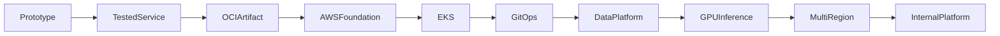

## Stage 1: Business and regulatory constraints

### New Requirement

Auditable fraud decisions, regional data residency and a recovery objective become release constraints.

### Existing Architecture

Before this decision, FinAI has a documented business hypothesis. It remains the rollback boundary until the new path proves its acceptance criteria.

### Architecture Change

FinAI adds workshop records become an ADR, data classification and initial SLO/RPO/RTO. This changes the previous stage by introducing the **DataClass** responsibility and its explicit owner.

### Updated Diagram

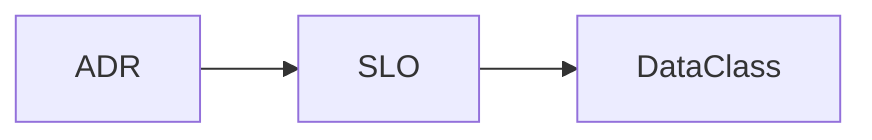

### What Remains Unchanged

Earlier artifact identity, review history and stated business SLO remain valid; this stage does not silently redefine upstream contracts.

### New Failure Mode Introduced

An unrecorded regulatory assumption can invalidate the design.

### Operational Signals

Track constraint review coverage and unresolved risks.

### Security Impact

Classify identities and decision records before customer data exists.

### Cost Impact

Fund compliance review before infrastructure.

### Migration and Rollback

Revert an assumption through adr review; no runtime migration yet. Promotion requires a recorded success criterion and named decision maker.

### Interview Takeaway

Explain why **Business and regulatory constraints** became necessary now, the new state/ownership boundary, and how its rollback differs from repairing external or durable state.

## Stage 2: Initial Python scoring API

### New Requirement

Analysts need a repeatable HTTP scoring interface.

### Existing Architecture

Before this decision, FinAI has workshop records become an ADR, data classification and initial SLO/RPO/RTO. It remains the rollback boundary until the new path proves its acceptance criteria.

### Architecture Change

FinAI adds a typed Python API wraps the scoring function with validation and health endpoints. This changes the previous stage by introducing the **ScoringModel** responsibility and its explicit owner.

### Updated Diagram

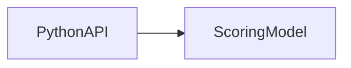

### What Remains Unchanged

Earlier artifact identity, review history and stated business SLO remain valid; this stage does not silently redefine upstream contracts.

### New Failure Mode Introduced

Process crash or incompatible request schema rejects decisions.

### Operational Signals

Track request rate, errors, latency and model decision count.

### Security Impact

Validate payloads and avoid logging regulated fields.

### Cost Impact

One small service instance establishes baseline cost.

### Migration and Rollback

Keep the notebook scorer callable while the api is validated. Promotion requires a recorded success criterion and named decision maker.

### Interview Takeaway

Explain why **Initial Python scoring API** became necessary now, the new state/ownership boundary, and how its rollback differs from repairing external or durable state.

## Stage 3: Git and review workflow

### New Requirement

Multiple engineers must change code with attribution.

### Existing Architecture

Before this decision, FinAI has a typed Python API wraps the scoring function with validation and health endpoints. It remains the rollback boundary until the new path proves its acceptance criteria.

### Architecture Change

FinAI adds Git protected branches, pull requests and CODEOWNERS become the source workflow. This changes the previous stage by introducing the **PythonAPI** responsibility and its explicit owner.

### Updated Diagram

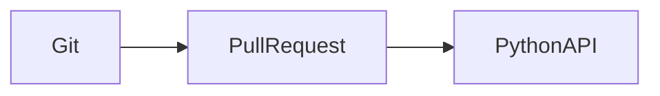

### What Remains Unchanged

Earlier artifact identity, review history and stated business SLO remain valid; this stage does not silently redefine upstream contracts.

### New Failure Mode Introduced

Review queue or bypass can ship an unapproved change.

### Operational Signals

Track review latency, bypass count and commit-to-ticket linkage.

### Security Impact

Signed identity and least repository administration.

### Cost Impact

Hosted git seats and review time.

### Migration and Rollback

Revert commits; retain the last tagged api revision. Promotion requires a recorded success criterion and named decision maker.

### Interview Takeaway

Explain why **Git and review workflow** became necessary now, the new state/ownership boundary, and how its rollback differs from repairing external or durable state.

## Stage 4: Unit, integration, and contract testing

### New Requirement

Callers require schema compatibility and changes need fast evidence.

### Existing Architecture

Before this decision, FinAI has Git protected branches, pull requests and CODEOWNERS become the source workflow. It remains the rollback boundary until the new path proves its acceptance criteria.

### Architecture Change

FinAI adds CI runs unit tests, integration tests against dependencies and consumer/provider contracts on every PR. This changes the previous stage by introducing the **PythonAPI** responsibility and its explicit owner.

### Updated Diagram

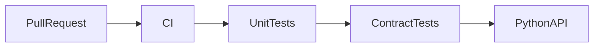

### What Remains Unchanged

Earlier artifact identity, review history and stated business SLO remain valid; this stage does not silently redefine upstream contracts.

### New Failure Mode Introduced

Flaky integration tests normalize bypasses.

### Operational Signals

Track test duration, flake rate and escaped defects.

### Security Impact

Fork prs receive no production secrets.

### Cost Impact

Parallel runners trade spend for feedback time.

### Migration and Rollback

Revert test/api change; quarantine only with owner and expiry. Promotion requires a recorded success criterion and named decision maker.

### Interview Takeaway

Explain why **Unit, integration, and contract testing** became necessary now, the new state/ownership boundary, and how its rollback differs from repairing external or durable state.

## Stage 5: Locked dependencies and SBOM

### New Requirement

The build must identify and reproduce third-party code.

### Existing Architecture

Before this decision, FinAI has CI runs unit tests, integration tests against dependencies and consumer/provider contracts on every PR. It remains the rollback boundary until the new path proves its acceptance criteria.

### Architecture Change

FinAI adds a lock file pins resolution and CI emits an SBOM alongside vulnerability results. This changes the previous stage by introducing the **SBOM** responsibility and its explicit owner.

### Updated Diagram

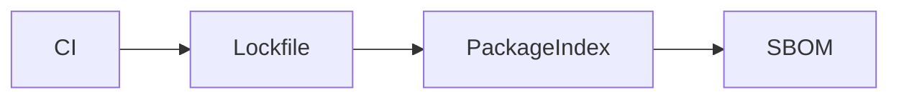

### What Remains Unchanged

Earlier artifact identity, review history and stated business SLO remain valid; this stage does not silently redefine upstream contracts.

### New Failure Mode Introduced

A compromised or unavailable package blocks build.

### Operational Signals

Track resolution drift, known critical findings and SBOM coverage.

### Security Impact

Private index authentication and dependency review.

### Cost Impact

Cache downloads but expire deliberately.

### Migration and Rollback

Revert lock change; do not silently unlock production builds. Promotion requires a recorded success criterion and named decision maker.

### Interview Takeaway

Explain why **Locked dependencies and SBOM** became necessary now, the new state/ownership boundary, and how its rollback differs from repairing external or durable state.

## Stage 6: Immutable OCI artifact

### New Requirement

Runtime bytes must equal tested bytes.

### Existing Architecture

Before this decision, FinAI has a lock file pins resolution and CI emits an SBOM alongside vulnerability results. It remains the rollback boundary until the new path proves its acceptance criteria.

### Architecture Change

FinAI adds a multi-stage build produces one non-root OCI image digest from the tested commit. This changes the previous stage by introducing the **RuntimeTest** responsibility and its explicit owner.

### Updated Diagram

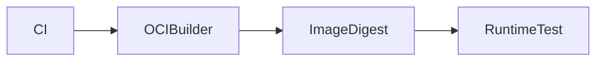

### What Remains Unchanged

Earlier artifact identity, review history and stated business SLO remain valid; this stage does not silently redefine upstream contracts.

### New Failure Mode Introduced

Architecture mismatch or missing runtime file prevents startup.

### Operational Signals

Track build duration, image size and startup test.

### Security Impact

Minimal base, read-only filesystem and dropped capabilities.

### Cost Impact

Layer caching reduces transfer and registry storage.

### Migration and Rollback

Promote prior digest; never rebuild it for rollback. Promotion requires a recorded success criterion and named decision maker.

### Interview Takeaway

Explain why **Immutable OCI artifact** became necessary now, the new state/ownership boundary, and how its rollback differs from repairing external or durable state.

## Stage 7: ECR and signing

### New Requirement

AWS environments need a controlled artifact trust boundary.

### Existing Architecture

Before this decision, FinAI has a multi-stage build produces one non-root OCI image digest from the tested commit. It remains the rollback boundary until the new path proves its acceptance criteria.

### Architecture Change

FinAI adds ECR stores immutable digests; CI signs provenance and admission can verify signer identity. This changes the previous stage by introducing the **Provenance** responsibility and its explicit owner.

### Updated Diagram

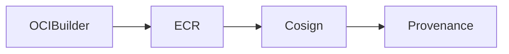

### What Remains Unchanged

Earlier artifact identity, review history and stated business SLO remain valid; this stage does not silently redefine upstream contracts.

### New Failure Mode Introduced

Signature policy or replication failure blocks promotion.

### Operational Signals

Track push latency, scan findings, signature verification failures.

### Security Impact

Oidc gives ci scoped ecr access; keys are short-lived.

### Cost Impact

Lifecycle policies retain rollback digests without unbounded storage.

### Migration and Rollback

Point deployment to prior signed digest; preserve rejected evidence. Promotion requires a recorded success criterion and named decision maker.

### Interview Takeaway

Explain why **ECR and signing** became necessary now, the new state/ownership boundary, and how its rollback differs from repairing external or durable state.

## Stage 8: Terraform account and VPC foundation

### New Requirement

Workloads need isolated, repeatable AWS networking.

### Existing Architecture

Before this decision, FinAI has ECR stores immutable digests; CI signs provenance and admission can verify signer identity. It remains the rollback boundary until the new path proves its acceptance criteria.

### Architecture Change

FinAI adds Terraform creates account roles, multi-AZ VPC, public/private subnets, endpoints and remote encrypted state. This changes the previous stage by introducing the **Subnets** responsibility and its explicit owner.

### Updated Diagram

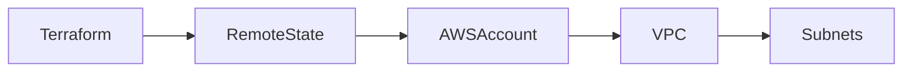

### What Remains Unchanged

Earlier artifact identity, review history and stated business SLO remain valid; this stage does not silently redefine upstream contracts.

### New Failure Mode Introduced

Partial apply or ip plan error leaves mismatched infrastructure.

### Operational Signals

Track plan drift, lock wait, free CIDRs and NAT traffic.

### Security Impact

Cross-account role assumption and state access are separated.

### Cost Impact

Nat and cross-az transfer become visible recurring costs.

### Migration and Rollback

Reconcile state/aws carefully; restoring state does not revert resources. Promotion requires a recorded success criterion and named decision maker.

### Interview Takeaway

Explain why **Terraform account and VPC foundation** became necessary now, the new state/ownership boundary, and how its rollback differs from repairing external or durable state.

## Stage 9: EKS platform

### New Requirement

The service needs managed orchestration, zonal capacity and workload isolation.

### Existing Architecture

Before this decision, FinAI has Terraform creates account roles, multi-AZ VPC, public/private subnets, endpoints and remote encrypted state. It remains the rollback boundary until the new path proves its acceptance criteria.

### Architecture Change

FinAI adds EKS adds a managed control plane, system/application node groups, CNI, CSI and scoped workload identity. This changes the previous stage by introducing the **CNI** responsibility and its explicit owner.

### Updated Diagram

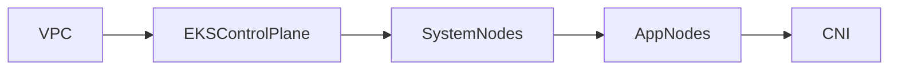

### What Remains Unchanged

Earlier artifact identity, review history and stated business SLO remain valid; this stage does not silently redefine upstream contracts.

### New Failure Mode Introduced

Subnet ip or quota exhaustion leaves pods pending.

### Operational Signals

Track API latency, pending Pods, node readiness and free subnet IPs.

### Security Impact

Private endpoint path, pod identity and restricted cluster access.

### Cost Impact

System headroom and multi-az nodes add reliability cost.

### Migration and Rollback

Retain the previous compute path until eks readiness and load tests pass. Promotion requires a recorded success criterion and named decision maker.

### Interview Takeaway

Explain why **EKS platform** became necessary now, the new state/ownership boundary, and how its rollback differs from repairing external or durable state.

## Stage 10: Helm packaging

### New Requirement

The Kubernetes objects need a versioned installation contract.

### Existing Architecture

Before this decision, FinAI has EKS adds a managed control plane, system/application node groups, CNI, CSI and scoped workload identity. It remains the rollback boundary until the new path proves its acceptance criteria.

### Architecture Change

FinAI adds a Helm chart packages Deployment, Service, PDB and values schema with deterministic rendering. This changes the previous stage by introducing the **PDB** responsibility and its explicit owner.

### Updated Diagram

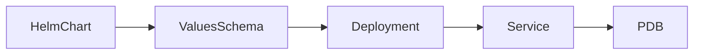

### What Remains Unchanged

Earlier artifact identity, review history and stated business SLO remain valid; this stage does not silently redefine upstream contracts.

### New Failure Mode Introduced

Bad values or immutable field breaks upgrade.

### Operational Signals

Track lint/render test outcome and Helm release status.

### Security Impact

Schema restricts unsafe settings and service account defaults.

### Cost Impact

Templating cost is negligible; ownership toil is not.

### Migration and Rollback

Helm rollback only restores manifests; keep app/data compatibility. Promotion requires a recorded success criterion and named decision maker.

### Interview Takeaway

Explain why **Helm packaging** became necessary now, the new state/ownership boundary, and how its rollback differs from repairing external or durable state.

## Stage 11: GitOps repository

### New Requirement

Environment promotion needs reviewed desired state distinct from source.

### Existing Architecture

Before this decision, FinAI has a Helm chart packages Deployment, Service, PDB and values schema with deterministic rendering. It remains the rollback boundary until the new path proves its acceptance criteria.

### Architecture Change

FinAI adds a GitOps repository pins chart and image digest per environment. This changes the previous stage by introducing the **ProdOverlay** responsibility and its explicit owner.

### Updated Diagram

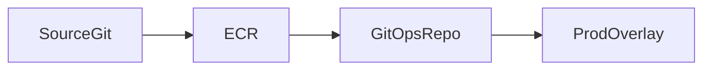

### What Remains Unchanged

Earlier artifact identity, review history and stated business SLO remain valid; this stage does not silently redefine upstream contracts.

### New Failure Mode Introduced

Configuration drift or wrong environment pr changes intent.

### Operational Signals

Track review latency, digest promotion age and drift detection.

### Security Impact

Branch protection separates application author from production approval.

### Cost Impact

Repository automation replaces manual deployment toil.

### Migration and Rollback

Revert git commit to the previously healthy digest/config. Promotion requires a recorded success criterion and named decision maker.

### Interview Takeaway

Explain why **GitOps repository** became necessary now, the new state/ownership boundary, and how its rollback differs from repairing external or durable state.

## Stage 12: Argo CD

### New Requirement

Clusters must continuously converge on reviewed Git intent.

### Existing Architecture

Before this decision, FinAI has a GitOps repository pins chart and image digest per environment. It remains the rollback boundary until the new path proves its acceptance criteria.

### Architecture Change

FinAI adds repo-server renders the overlay and application-controller diffs/syncs Kubernetes resources. This changes the previous stage by introducing the **KubernetesAPI** responsibility and its explicit owner.

### Updated Diagram

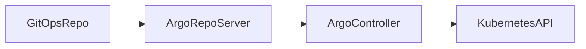

### What Remains Unchanged

Earlier artifact identity, review history and stated business SLO remain valid; this stage does not silently redefine upstream contracts.

### New Failure Mode Introduced

Bad prune or render failure blocks/erases desired objects.

### Operational Signals

Track sync status, health status, render time and reconciliation errors.

### Security Impact

Appprojects scope repositories, namespaces and cluster credentials.

### Cost Impact

Controller and repository scale add platform overhead.

### Migration and Rollback

Disable automation if necessary, revert git, then sync; argo does not infer app rollback. Promotion requires a recorded success criterion and named decision maker.

### Interview Takeaway

Explain why **Argo CD** became necessary now, the new state/ownership boundary, and how its rollback differs from repairing external or durable state.

## Stage 13: Secrets Manager and External Secrets

### New Requirement

Runtime credentials must rotate without entering Git.

### Existing Architecture

Before this decision, FinAI has repo-server renders the overlay and application-controller diffs/syncs Kubernetes resources. It remains the rollback boundary until the new path proves its acceptance criteria.

### Architecture Change

FinAI adds Secrets Manager is authoritative; External Secrets uses workload identity to materialize a Kubernetes Secret. This changes the previous stage by introducing the **PythonAPI** responsibility and its explicit owner.

### Updated Diagram

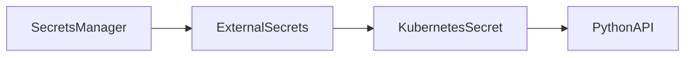

### What Remains Unchanged

Earlier artifact identity, review history and stated business SLO remain valid; this stage does not silently redefine upstream contracts.

### New Failure Mode Introduced

Provider/api failure prevents refresh and an expired credential breaks runtime.

### Operational Signals

Track refresh errors, secret age and application authentication failures.

### Security Impact

Scope each secretstore identity and encrypt both stores.

### Cost Impact

Api calls and secret replicas have modest cost but operational risk.

### Migration and Rollback

Retain overlapping credential versions; revert consumer before removing old secret. Promotion requires a recorded success criterion and named decision maker.

### Interview Takeaway

Explain why **Secrets Manager and External Secrets** became necessary now, the new state/ownership boundary, and how its rollback differs from repairing external or durable state.

## Stage 14: cert-manager and TLS

### New Requirement

Every public and internal boundary requires managed certificates.

### Existing Architecture

Before this decision, FinAI has Secrets Manager is authoritative; External Secrets uses workload identity to materialize a Kubernetes Secret. It remains the rollback boundary until the new path proves its acceptance criteria.

### Architecture Change

FinAI adds cert-manager reconciles Certificate through ACME DNS challenge into Gateway TLS Secret. This changes the previous stage by introducing the **TLSSecret** responsibility and its explicit owner.

### Updated Diagram

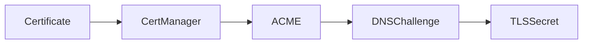

### What Remains Unchanged

Earlier artifact identity, review history and stated business SLO remain valid; this stage does not silently redefine upstream contracts.

### New Failure Mode Introduced

Challenge or issuer failure approaches expiry.

### Operational Signals

Track days to expiry, challenge failures and TLS probe results.

### Security Impact

Restrict secret reads and dns solver role; plan trust-root boundaries.

### Cost Impact

Public certificates and dns calls are cheap; mesh pki would add toil.

### Migration and Rollback

Keep prior valid secret and listener while correcting issuance. Promotion requires a recorded success criterion and named decision maker.

### Interview Takeaway

Explain why **cert-manager and TLS** became necessary now, the new state/ownership boundary, and how its rollback differs from repairing external or durable state.

## Stage 15: Route 53 and ALB or Gateway API

### New Requirement

Customers need a stable, health-checked entry point.

### Existing Architecture

Before this decision, FinAI has cert-manager reconciles Certificate through ACME DNS challenge into Gateway TLS Secret. It remains the rollback boundary until the new path proves its acceptance criteria.

### Architecture Change

FinAI adds Route 53 resolves to ALB; Gateway routes TLS traffic through Service to ready EndpointSlices. This changes the previous stage by introducing the **EndpointSlice** responsibility and its explicit owner.

### Updated Diagram

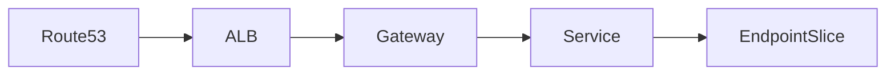

### What Remains Unchanged

Earlier artifact identity, review history and stated business SLO remain valid; this stage does not silently redefine upstream contracts.

### New Failure Mode Introduced

Healthy load balancer with empty endpoints returns errors.

### Operational Signals

Track DNS answer, target health, ready endpoints and edge p99.

### Security Impact

Waf/rate limits and tls terminate at declared boundaries.

### Cost Impact

Alb hours/lcus and cross-az bytes join the unit cost.

### Migration and Rollback

Shift weighted dns or restore previous gateway config and targets. Promotion requires a recorded success criterion and named decision maker.

### Interview Takeaway

Explain why **Route 53 and ALB or Gateway API** became necessary now, the new state/ownership boundary, and how its rollback differs from repairing external or durable state.

## Stage 16: PostgreSQL

### New Requirement

Fraud decisions require transactional durable records.

### Existing Architecture

Before this decision, FinAI has Route 53 resolves to ALB; Gateway routes TLS traffic through Service to ready EndpointSlices. It remains the rollback boundary until the new path proves its acceptance criteria.

### Architecture Change

FinAI adds RDS PostgreSQL adds pooled connections, multi-AZ standby, WAL backups and PITR. This changes the previous stage by introducing the **WALArchive** responsibility and its explicit owner.

### Updated Diagram

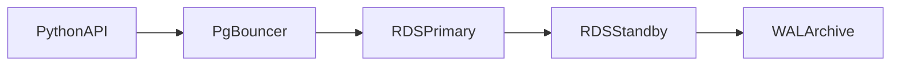

### What Remains Unchanged

Earlier artifact identity, review history and stated business SLO remain valid; this stage does not silently redefine upstream contracts.

### New Failure Mode Introduced

Connection exhaustion or lock chain stalls scoring writes.

### Operational Signals

Track pool wait, sessions, locks, WAL/archive lag and query latency.

### Security Impact

Database identity, encryption and row/data access auditing.

### Cost Impact

Instance, iops, backup retention and cross-az cost dominate.

### Migration and Rollback

Use backward-compatible schema; restore/pitr is separate from application rollback. Promotion requires a recorded success criterion and named decision maker.

### Interview Takeaway

Explain why **PostgreSQL** became necessary now, the new state/ownership boundary, and how its rollback differs from repairing external or durable state.

## Stage 17: Redis

### New Requirement

Repeated lookups need a low-latency cache without making it authoritative.

### Existing Architecture

Before this decision, FinAI has RDS PostgreSQL adds pooled connections, multi-AZ standby, WAL backups and PITR. It remains the rollback boundary until the new path proves its acceptance criteria.

### Architecture Change

FinAI adds Redis caches bounded, TTL-controlled results and the API falls back to PostgreSQL. This changes the previous stage by introducing the **RDSPrimary** responsibility and its explicit owner.

### Updated Diagram

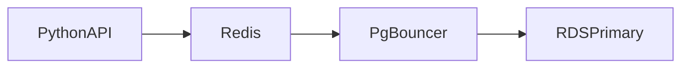

### What Remains Unchanged

Earlier artifact identity, review history and stated business SLO remain valid; this stage does not silently redefine upstream contracts.

### New Failure Mode Introduced

Hot key, eviction or stampede overloads both cache and database.

### Operational Signals

Track hit rate, evictions, memory, hot keys and origin load.

### Security Impact

Tls/auth and key design prevent tenant crossover.

### Cost Impact

Memory is premium; cache only data that avoids more expensive work.

### Migration and Rollback

Disable/bypass cache with origin admission limits; data can be rebuilt. Promotion requires a recorded success criterion and named decision maker.

### Interview Takeaway

Explain why **Redis** became necessary now, the new state/ownership boundary, and how its rollback differs from repairing external or durable state.

## Stage 18: Kafka events

### New Requirement

Downstream investigations require replayable decision events.

### Existing Architecture

Before this decision, FinAI has Redis caches bounded, TTL-controlled results and the API falls back to PostgreSQL. It remains the rollback boundary until the new path proves its acceptance criteria.

### Architecture Change

FinAI adds the API publishes schema-versioned events; Kafka partitions retain them and consumers checkpoint offsets. This changes the previous stage by introducing the **FraudConsumer** responsibility and its explicit owner.

### Updated Diagram

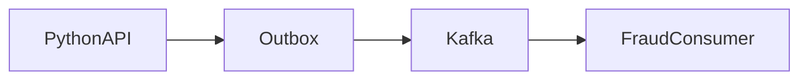

### What Remains Unchanged

Earlier artifact identity, review history and stated business SLO remain valid; this stage does not silently redefine upstream contracts.

### New Failure Mode Introduced

Poison event or consumer lag delays downstream detection.

### Operational Signals

Track produce errors, consumer lag, rebalance time and dead-letter count.

### Security Impact

Acls by topic and classified payload fields.

### Cost Impact

Broker storage, replication and cross-az traffic increase cost.

### Migration and Rollback

Dual-write/outbox migration; stop new consumer while retaining offsets. Promotion requires a recorded success criterion and named decision maker.

### Interview Takeaway

Explain why **Kafka events** became necessary now, the new state/ownership boundary, and how its rollback differs from repairing external or durable state.

## Stage 19: Model serving

### New Requirement

Model revisions need independent rollout and scalable inference runtime.

### Existing Architecture

Before this decision, FinAI has the API publishes schema-versioned events; Kafka partitions retain them and consumers checkpoint offsets. It remains the rollback boundary until the new path proves its acceptance criteria.

### Architecture Change

FinAI adds a model gateway selects a signed registry revision served by KServe/vLLM/Triton. This changes the previous stage by introducing the **ObjectStore** responsibility and its explicit owner.

### Updated Diagram

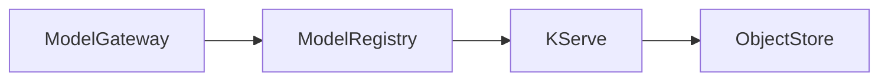

### What Remains Unchanged

Earlier artifact identity, review history and stated business SLO remain valid; this stage does not silently redefine upstream contracts.

### New Failure Mode Introduced

Cold model load or incompatible runtime misses latency slo.

### Operational Signals

Track model load time, TTFT, throughput and revision errors.

### Security Impact

Authorize tenant/model and govern prompt/response retention.

### Cost Impact

Gpu-ready serving is expensive even before dedicated gpu stages.

### Migration and Rollback

Route to prior model revision or approved simpler scoring path. Promotion requires a recorded success criterion and named decision maker.

### Interview Takeaway

Explain why **Model serving** became necessary now, the new state/ownership boundary, and how its rollback differs from repairing external or durable state.

## Stage 20: ModelService custom controller

### New Requirement

Teams need a safe declarative model-serving API.

### Existing Architecture

Before this decision, FinAI has a model gateway selects a signed registry revision served by KServe/vLLM/Triton. It remains the rollback boundary until the new path proves its acceptance criteria.

### Architecture Change

FinAI adds ModelService CRD and controller reconcile KServe/Deployment, Service and autoscaling with status conditions. This changes the previous stage by introducing the **KServe** responsibility and its explicit owner.

### Updated Diagram

```mermaid
flowchart LR
  ModelServiceCRD --> Informer
  Informer --> WorkQueue
  WorkQueue --> Reconciler
  Reconciler --> KServe
```

### What Remains Unchanged

Earlier artifact identity, review history and stated business SLO remain valid; this stage does not silently redefine upstream contracts.

### New Failure Mode Introduced

Stuck finalizer or retrying poison spec blocks lifecycle.

### Operational Signals

Track workqueue age, reconcile errors, observedGeneration and condition reasons.

### Security Impact

Controller rbac and model-store workload identity are narrowly scoped.

### Cost Impact

Controller is cheap; platform ownership and crd compatibility are not.

### Migration and Rollback

Roll back compatible controller; never remove finalizer before external cleanup. Promotion requires a recorded success criterion and named decision maker.

### Interview Takeaway

Explain why **ModelService custom controller** became necessary now, the new state/ownership boundary, and how its rollback differs from repairing external or durable state.

## Stage 21: GPU scheduling

### New Requirement

Large models require scarce heterogeneous accelerators.

### Existing Architecture

Before this decision, FinAI has ModelService CRD and controller reconcile KServe/Deployment, Service and autoscaling with status conditions. It remains the rollback boundary until the new path proves its acceptance criteria.

### Architecture Change

FinAI adds GPU node groups, device plugin, labels/taints and topology-aware scheduling place explicit extended-resource requests. This changes the previous stage by introducing the **GPUQuota** responsibility and its explicit owner.

### Updated Diagram

```mermaid
flowchart LR
  PendingModelPod --> Scheduler
  Scheduler --> DevicePlugin
  DevicePlugin --> GPUNodePool
  GPUNodePool --> GPUQuota
```

### What Remains Unchanged

Earlier artifact identity, review history and stated business SLO remain valid; this stage does not silently redefine upstream contracts.

### New Failure Mode Introduced

Fragmented memory or cloud gpu quota strands requests.

### Operational Signals

Track allocated GPU, memory, pending reason, node launch and quota.

### Security Impact

Isolate untrusted model code and restrict device/node access.

### Cost Impact

Gpu idle time becomes the largest cost driver.

### Migration and Rollback

Route supported model to cpu/smaller gpu or prior capacity pool. Promotion requires a recorded success criterion and named decision maker.

### Interview Takeaway

Explain why **GPU scheduling** became necessary now, the new state/ownership boundary, and how its rollback differs from repairing external or durable state.

## Stage 22: Autoscaling

### New Requirement

Demand varies faster than manual GPU provisioning.

### Existing Architecture

Before this decision, FinAI has GPU node groups, device plugin, labels/taints and topology-aware scheduling place explicit extended-resource requests. It remains the rollback boundary until the new path proves its acceptance criteria.

### Architecture Change

FinAI adds KEDA/HPA scales replicas on queue and latency signals while Karpenter adds suitable GPU nodes. This changes the previous stage by introducing the **GPUNodePool** responsibility and its explicit owner.

### Updated Diagram

```mermaid
flowchart LR
  RequestQueue --> KEDA
  KEDA --> ModelPods
  ModelPods --> Karpenter
  Karpenter --> GPUNodePool
```

### What Remains Unchanged

Earlier artifact identity, review history and stated business SLO remain valid; this stage does not silently redefine upstream contracts.

### New Failure Mode Introduced

Cold-start feedback loop scales too late or oscillates.

### Operational Signals

Track queue latency, desired/ready replicas, node launch and rejection rate.

### Security Impact

Tenant quota precedes autoscaling to prevent denial-of-wallet.

### Cost Impact

Warm capacity buys latency; aggressive scale-down reloads models.

### Migration and Rollback

Cap admission and restore known min replicas/scaling policy. Promotion requires a recorded success criterion and named decision maker.

### Interview Takeaway

Explain why **Autoscaling** became necessary now, the new state/ownership boundary, and how its rollback differs from repairing external or durable state.

## Stage 23: Unified observability

### New Requirement

Operators need correlation from customer request through model and dependencies.

### Existing Architecture

Before this decision, FinAI has KEDA/HPA scales replicas on queue and latency signals while Karpenter adds suitable GPU nodes. It remains the rollback boundary until the new path proves its acceptance criteria.

### Architecture Change

FinAI adds OpenTelemetry Collectors send traces to Tempo/logs to Loki; Prometheus scrapes metrics; Grafana correlates revision, trace, pod, node, cluster/account/region. This changes the previous stage by introducing the **Grafana** responsibility and its explicit owner.

### Updated Diagram

```mermaid
flowchart LR
  PythonAPI --> OTelCollector
  OTelCollector --> Prometheus
  Prometheus --> Loki
  Loki --> Tempo
  Tempo --> Grafana
```

### What Remains Unchanged

Earlier artifact identity, review history and stated business SLO remain valid; this stage does not silently redefine upstream contracts.

### New Failure Mode Introduced

Collector backpressure or label cardinality blinds responders.

### Operational Signals

Track export drops, scrape/remote-write lag, active streams, trace coverage and alert delivery.

### Security Impact

Redact regulated fields and isolate telemetry tenants.

### Cost Impact

Retention, log bytes and cardinality require explicit budgets.

### Migration and Rollback

Keep serving when telemetry degrades; reduce ingestion and preserve slo alerts. Promotion requires a recorded success criterion and named decision maker.

### Interview Takeaway

Explain why **Unified observability** became necessary now, the new state/ownership boundary, and how its rollback differs from repairing external or durable state.

## Stage 24: Canary rollout

### New Requirement

New code and model revisions need bounded exposure.

### Existing Architecture

Before this decision, FinAI has OpenTelemetry Collectors send traces to Tempo/logs to Loki; Prometheus scrapes metrics; Grafana correlates revision, trace, pod, node, cluster/account/region. It remains the rollback boundary until the new path proves its acceptance criteria.

### Architecture Change

FinAI adds Argo Rollouts shifts ALB/Gateway traffic by steps and queries SLO/quality analysis before promotion. This changes the previous stage by introducing the **AnalysisRun** responsibility and its explicit owner.

### Updated Diagram

```mermaid
flowchart LR
  GitOpsRepo --> ArgoRollouts
  ArgoRollouts --> StableRevision
  StableRevision --> CanaryRevision
  CanaryRevision --> AnalysisRun
```

### What Remains Unchanged

Earlier artifact identity, review history and stated business SLO remain valid; this stage does not silently redefine upstream contracts.

### New Failure Mode Introduced

Weak analysis passes a harmful semantic model change.

### Operational Signals

Track canary versus stable error, p99, rejection and quality guardrails.

### Security Impact

Ensure both revisions enforce identical policy and data handling.

### Cost Impact

Temporary surge and duplicate model cache increase gpu cost.

### Migration and Rollback

Abort traffic to stable and revert git digest; database compatibility remains required. Promotion requires a recorded success criterion and named decision maker.

### Interview Takeaway

Explain why **Canary rollout** became necessary now, the new state/ownership boundary, and how its rollback differs from repairing external or durable state.

## Stage 25: Production incident and rollback

### New Requirement

A canary raises false fraud declines and customer impact.

### Existing Architecture

Before this decision, FinAI has Argo Rollouts shifts ALB/Gateway traffic by steps and queries SLO/quality analysis before promotion. It remains the rollback boundary until the new path proves its acceptance criteria.

### Architecture Change

FinAI adds incident command pauses rollout, routes to stable, validates recovery and preserves model/input evidence. This changes the previous stage by introducing the **EvidenceStore** responsibility and its explicit owner.

### Updated Diagram

```mermaid
flowchart LR
  Alert --> IncidentCommander
  IncidentCommander --> ArgoRollouts
  ArgoRollouts --> StableRevision
  StableRevision --> EvidenceStore
```

### What Remains Unchanged

Earlier artifact identity, review history and stated business SLO remain valid; this stage does not silently redefine upstream contracts.

### New Failure Mode Introduced

Rollback restores latency but cached or persisted bad decisions remain.

### Operational Signals

Track decline SLI, support volume, revision split and recovery time.

### Security Impact

Break-glass is time-bound/audited; evidence access protects customer data.

### Cost Impact

Mitigation may hold surplus gpu and manual review cost.

### Migration and Rollback

Abort revision, revert git, invalidate only proven cache keys; repair data separately. Promotion requires a recorded success criterion and named decision maker.

### Interview Takeaway

Explain why **Production incident and rollback** became necessary now, the new state/ownership boundary, and how its rollback differs from repairing external or durable state.

## Stage 26: Multi-region deployment

### New Requirement

Regional outage must meet declared RPO and RTO.

### Existing Architecture

Before this decision, FinAI has incident command pauses rollout, routes to stable, validates recovery and preserves model/input evidence. It remains the rollback boundary until the new path proves its acceptance criteria.

### Architecture Change

FinAI adds a second independent EKS/data stack receives promoted digests; global traffic shifts only after health and data-authority checks. This changes the previous stage by introducing the **RegionB_DB** responsibility and its explicit owner.

### Updated Diagram

```mermaid
flowchart LR
  GlobalDNS --> RegionA_EKS
  RegionA_EKS --> RegionA_DB
  RegionA_DB --> RegionB_EKS
  RegionB_EKS --> RegionB_DB
```

### What Remains Unchanged

Earlier artifact identity, review history and stated business SLO remain valid; this stage does not silently redefine upstream contracts.

### New Failure Mode Introduced

Replication lag or split brain violates decision consistency.

### Operational Signals

Track regional SLO, health checks, replication lag, capacity and failover time.

### Security Impact

Regional keys/accounts and residency policy avoid one global privilege boundary.

### Cost Impact

Standby or active capacity plus replication roughly doubles baseline.

### Migration and Rollback

Fence writer, fail over, reconcile data, then plan failback as a migration. Promotion requires a recorded success criterion and named decision maker.

### Interview Takeaway

Explain why **Multi-region deployment** became necessary now, the new state/ownership boundary, and how its rollback differs from repairing external or durable state.

## Stage 27: Internal platform and golden path

### New Requirement

More teams need the proven path without copying bespoke YAML.

### Existing Architecture

Before this decision, FinAI has a second independent EKS/data stack receives promoted digests; global traffic shifts only after health and data-authority checks. It remains the rollback boundary until the new path proves its acceptance criteria.

### Architecture Change

FinAI adds a portal/API scaffolds service, chart, pipeline, GitOps and observability contracts with supported escape hatches. This changes the previous stage by introducing the **PlatformAPI** responsibility and its explicit owner.

### Updated Diagram

```mermaid
flowchart LR
  DeveloperPortal --> ServiceTemplate
  ServiceTemplate --> PipelineTemplate
  PipelineTemplate --> GitOpsTemplate
  GitOpsTemplate --> PlatformAPI
```

### What Remains Unchanged

Earlier artifact identity, review history and stated business SLO remain valid; this stage does not silently redefine upstream contracts.

### New Failure Mode Introduced

Golden path drift or forced abstraction drives teams around platform.

### Operational Signals

Track adoption, lead time, support demand, reliability and satisfaction.

### Security Impact

Secure defaults and policy evidence ship with the template.

### Cost Impact

Platform team cost is justified by reduced team toil and incidents.

### Migration and Rollback

Version contracts, migrate cohorts and retain documented escape hatch. Promotion requires a recorded success criterion and named decision maker.

### Interview Takeaway

Explain why **Internal platform and golden path** became necessary now, the new state/ownership boundary, and how its rollback differs from repairing external or durable state.

## Stage 28: Staff-level governance and ownership model

### New Requirement

The platform requires durable strategy beyond its original builders.

### Existing Architecture

Before this decision, FinAI has a portal/API scaffolds service, chart, pipeline, GitOps and observability contracts with supported escape hatches. It remains the rollback boundary until the new path proves its acceptance criteria.

### Architecture Change

FinAI adds service catalog, ADRs, SLOs, ownership, deprecation policy and funded roadmaps govern shared capabilities. This changes the previous stage by introducing the **Roadmap** responsibility and its explicit owner.

### Updated Diagram

```mermaid
flowchart LR
  Strategy --> ServiceCatalog
  ServiceCatalog --> ADRs
  ADRs --> Owners
  Owners --> Roadmap
```

### What Remains Unchanged

Earlier artifact identity, review history and stated business SLO remain valid; this stage does not silently redefine upstream contracts.

### New Failure Mode Introduced

Orphaned component or unclear decision rights lengthen incidents and migrations.

### Operational Signals

Track ownership coverage, action age, adoption outcomes, toil and deprecation progress.

### Security Impact

Risk acceptance and exceptions have accountable approvers and expiry.

### Cost Impact

Fund product operations, not only initial tooling delivery.

### Migration and Rollback

Stage governance changes through stakeholder agreement; reverse policies that harm measured outcomes. Promotion requires a recorded success criterion and named decision maker.

### Interview Takeaway

Explain why **Staff-level governance and ownership model** became necessary now, the new state/ownership boundary, and how its rollback differs from repairing external or durable state.

## Further Reading

* [Kubernetes documentation](https://kubernetes.io/docs/)
* [AWS Architecture Center](https://aws.amazon.com/architecture/)
* [Argo CD documentation](https://argo-cd.readthedocs.io/)
