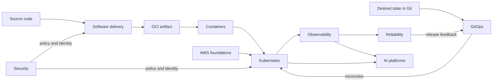
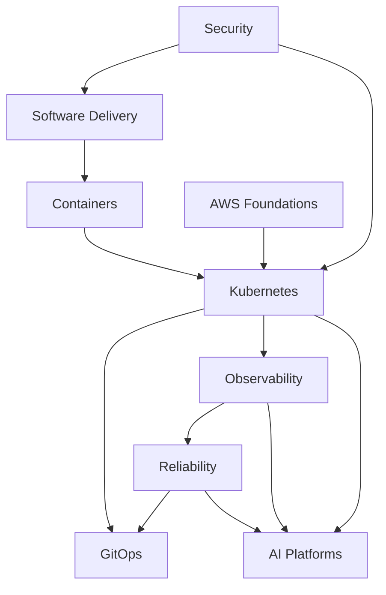

# Platform Engineering Knowledge Graph

This map connects the handbook's capabilities by **dependency**, **control**,
**evidence**, and **risk**. An arrow is a reason to cross a chapter boundary—not
merely a suggested reading order.

## Platform concept map

## Relationship vocabulary

| Relationship | Question it answers | Example |
|---|---|---|
| **requires** | What must already exist? | Kubernetes requires a container runtime and infrastructure. |
| **produces** | What crosses the boundary? | Delivery produces signed OCI artifacts and provenance. |
| **controls** | Who continuously drives desired state? | GitOps controllers reconcile Kubernetes resources. |
| **observes** | How is runtime truth exposed? | Telemetry observes workloads and control planes. |
| **constrains** | Which risk or policy changes the design? | Security constrains identity, admission, and supply chains. |
| **validates** | Which evidence supports a decision? | SLOs validate whether a rollout should continue. |

## Capability dependency graph

## Learning paths

### Application engineer

    1. [Software Delivery](../chapters/software-delivery.md)
    2. [Containers](../chapters/containers.md)
    3. [Kubernetes](../chapters/kubernetes.md)
    4. [GitOps](../chapters/gitops.md)
    5. [Observability](../chapters/observability.md)

### Platform engineer

    1. [AWS Foundations](../chapters/aws-foundations.md)
    2. [Containers](../chapters/containers.md)
    3. [Kubernetes](../chapters/kubernetes.md)
    4. [Security](../chapters/security.md)
    5. [GitOps](../chapters/gitops.md)
    6. [Reliability](../chapters/reliability.md)

### SRE

    1. [Observability](../chapters/observability.md)
    2. [Reliability](../chapters/reliability.md)
    3. [Kubernetes](../chapters/kubernetes.md)
    4. [Software Delivery](../chapters/software-delivery.md)
    5. [Security](../chapters/security.md)

### AI platform engineer

    1. [Containers](../chapters/containers.md)
    2. [Kubernetes](../chapters/kubernetes.md)
    3. [Observability](../chapters/observability.md)
    4. [Reliability](../chapters/reliability.md)
    5. [AI Platforms](../chapters/ai-platforms.md)

## Technology relationships

| Need | Foundation | Control plane | Evidence | Typical extension |
|---|---|---|---|---|
| Deploy an API | OCI container | Kubernetes Deployment | OpenTelemetry | GitOps rollout |
| Provision a database | AWS primitives | Terraform or Crossplane | Cloud metrics and audit logs | Policy as code |
| Manage cluster secrets | Cloud KMS | External Secrets | Audit events | Workload identity |
| Expose a service | VPC and DNS | Gateway API / service mesh | RED metrics and traces | cert-manager |
| Run model inference | GPU nodes and images | Kubernetes operator | Latency, saturation, quality | KEDA or Karpenter |

## Comparisons at decision points

| Decision | Option A | Option B | Decide primarily by |
|---|---|---|---|
| Push vs pull delivery | CI pushes directly | GitOps pulls desired state | Auditability, drift, and recovery model |
| VM vs container | Strong host boundary | Portable process boundary | Isolation, density, and operational contract |
| Terraform vs Crossplane | Plan/apply workflow | Continuous reconciliation | Ownership and lifecycle requirements |
| Metrics vs logs vs traces | Aggregated trends | Discrete events | Causal request paths | Question being answered—not tool preference |
| Argo CD vs Flux | Application-centric UI | Toolkit-style composition | Team workflow and integration needs |

> **Tip — How to traverse the graph:** When a concept is unclear, move backward
> through **requires** links. When a design is incomplete, move sideways through
> **security** and **observability**. When selecting what to learn next, move
> forward through **produces** and **controls** links.
