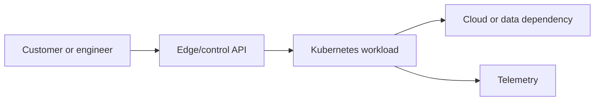

# Production Simulator

These are fictional FinAI exercises. Read only through **Recent Changes**, state hypotheses and the next discriminating query, then reveal the timeline and root cause.

# Scenario 1: Pending Pods in One Availability Zone

## Business Impact

Checkout scoring capacity is 40% below target; p95 queue time is rising.

## Architecture

## Initial Symptoms

An SLO signal changed after a recent operation. The service owner has declared an incident, assigned command and communications, and frozen unrelated changes. No root cause has been accepted.

## Available Evidence

### Metrics

`scheduler_pending_pods{reason="Unschedulable"}=18; node GPU allocatable is unchanged.`

### Logs

`0/12 nodes available: 3 untolerated taint, 9 did not match Pod node affinity.`

### Events

`FailedScheduling repeated after a node-group label migration.`

### Recent Changes

The change record and audit trail match the event evidence above; no other production change is in the window.

> Stop here. Rank at least two hypotheses and request one piece of evidence that distinguishes them.

## Investigation Timeline

1. **T+00:** Confirm user impact, affected dimensions, and SLO burn; appoint incident roles.
2. **T+05:** Preserve revision IDs, events, audit records, dashboards, and representative logs/traces.
3. **T+10:** Compare affected and healthy zones, nodes, versions, or request classes.
4. **T+15:** Test the highest-information hypothesis without destructive restarts.
5. **T+20:** Choose the smallest reversible mitigation and watch leading and user signals.

## Root Cause

Node group label changed from accelerator=a10 to gpu-class=a10g, while the Deployment retained the old required affinity.

## Immediate Mitigation

Revert the label/config mismatch or patch reviewed Git intent; pause rollout.

## Permanent Fix

Validate selectors against provisioner/node templates and canary node-group migrations. The fix is deployed progressively and verified under representative failure and load conditions.

## Prevention

Add pre-change validation for this coupling, retain break-glass audit evidence, clarify field/config ownership, and run the failure in a game day. Prevention is assigned to an owner and tracked independently from restoring service.

## SLO and Alert Improvements

Page on fast error-budget burn or imminent hard exhaustion, not a raw component threshold alone. Add the leading saturation or reconciliation signal from this incident, route it to the owning team, link a tested runbook, and remove symptoms that are not actionable.

## Interview Discussion

Explain why the first evidence does not prove causation. Separate mitigation from repair, show how you protected evidence, and state what would make rollback unsafe. Quantify impact and time only from the scenario.

## What Would a Staff Engineer Change?

Reduce the architectural failure domain, turn the hidden coupling into a versioned contract, negotiate ownership across platform and workload teams, and verify the prevention with an SLO or controlled experiment rather than closing on documentation alone.

# Scenario 2: Argo CD Drift from a Manual Change

## Business Impact

A fraud API remains available, but unreviewed replica and environment changes violate audit controls.

## Architecture

## Initial Symptoms

An SLO signal changed after a recent operation. The service owner has declared an incident, assigned command and communications, and frozen unrelated changes. No root cause has been accepted.

## Available Evidence

### Metrics

`Argo application reconciliation count rises; replicas oscillate between 6 and 10.`

### Logs

`Argo diff reports /spec/replicas and one environment value; audit log names an engineer.`

### Events

`A manual kubectl scale occurred during a traffic spike.`

### Recent Changes

The change record and audit trail match the event evidence above; no other production change is in the window.

> Stop here. Rank at least two hypotheses and request one piece of evidence that distinguishes them.

## Investigation Timeline

1. **T+00:** Confirm user impact, affected dimensions, and SLO burn; appoint incident roles.
2. **T+05:** Preserve revision IDs, events, audit records, dashboards, and representative logs/traces.
3. **T+10:** Compare affected and healthy zones, nodes, versions, or request classes.
4. **T+15:** Test the highest-information hypothesis without destructive restarts.
5. **T+20:** Choose the smallest reversible mitigation and watch leading and user signals.

## Root Cause

A manual emergency patch conflicted with automated sync and HPA ownership was not defined.

## Immediate Mitigation

Commit the intended emergency value or revert the manual patch; assign field ownership.

## Permanent Fix

Create an audited break-glass path and let HPA own replicas while Git owns bounds. The fix is deployed progressively and verified under representative failure and load conditions.

## Prevention

Add pre-change validation for this coupling, retain break-glass audit evidence, clarify field/config ownership, and run the failure in a game day. Prevention is assigned to an owner and tracked independently from restoring service.

## SLO and Alert Improvements

Page on fast error-budget burn or imminent hard exhaustion, not a raw component threshold alone. Add the leading saturation or reconciliation signal from this incident, route it to the owning team, link a tested runbook, and remove symptoms that are not actionable.

## Interview Discussion

Explain why the first evidence does not prove causation. Separate mitigation from repair, show how you protected evidence, and state what would make rollback unsafe. Quantify impact and time only from the scenario.

## What Would a Staff Engineer Change?

Reduce the architectural failure domain, turn the hidden coupling into a versioned contract, negotiate ownership across platform and workload teams, and verify the prevention with an SLO or controlled experiment rather than closing on documentation alone.

# Scenario 3: Bad Container Image in Production

## Business Impact

New Pods fail and available replicas approach the disruption floor.

## Architecture

## Initial Symptoms

An SLO signal changed after a recent operation. The service owner has declared an incident, assigned command and communications, and frozen unrelated changes. No root cause has been accepted.

## Available Evidence

### Metrics

`Image pull succeeds; readiness is 0 and restart count climbs.`

### Logs

`exec format error appears before application logging initializes.`

### Events

`Rollout references a new multi-architecture digest built on an ARM-only runner.`

### Recent Changes

The change record and audit trail match the event evidence above; no other production change is in the window.

> Stop here. Rank at least two hypotheses and request one piece of evidence that distinguishes them.

## Investigation Timeline

1. **T+00:** Confirm user impact, affected dimensions, and SLO burn; appoint incident roles.
2. **T+05:** Preserve revision IDs, events, audit records, dashboards, and representative logs/traces.
3. **T+10:** Compare affected and healthy zones, nodes, versions, or request classes.
4. **T+15:** Test the highest-information hypothesis without destructive restarts.
5. **T+20:** Choose the smallest reversible mitigation and watch leading and user signals.

## Root Cause

The manifest list omitted amd64 while policy checked signature but not required platform compatibility.

## Immediate Mitigation

Revert Git to the previous verified digest and stop progression.

## Permanent Fix

Build a multi-platform index, run target-architecture smoke tests, and attest platform metadata. The fix is deployed progressively and verified under representative failure and load conditions.

## Prevention

Add pre-change validation for this coupling, retain break-glass audit evidence, clarify field/config ownership, and run the failure in a game day. Prevention is assigned to an owner and tracked independently from restoring service.

## SLO and Alert Improvements

Page on fast error-budget burn or imminent hard exhaustion, not a raw component threshold alone. Add the leading saturation or reconciliation signal from this incident, route it to the owning team, link a tested runbook, and remove symptoms that are not actionable.

## Interview Discussion

Explain why the first evidence does not prove causation. Separate mitigation from repair, show how you protected evidence, and state what would make rollback unsafe. Quantify impact and time only from the scenario.

## What Would a Staff Engineer Change?

Reduce the architectural failure domain, turn the hidden coupling into a versioned contract, negotiate ownership across platform and workload teams, and verify the prevention with an SLO or controlled experiment rather than closing on documentation alone.

# Scenario 4: Terraform State Lock and Suspected Corruption

## Business Impact

A network security fix cannot be planned while teams fear concurrent mutation.

## Architecture

## Initial Symptoms

An SLO signal changed after a recent operation. The service owner has declared an incident, assigned command and communications, and frozen unrelated changes. No root cause has been accepted.

## Available Evidence

### Metrics

`Backend latency normal; no active CI jobs; lock age is 74 minutes.`

### Logs

`Terraform reports ConditionalCheckFailedException for the state lock identifier.`

### Events

`A CI runner was terminated during apply after changing two routes.`

### Recent Changes

The change record and audit trail match the event evidence above; no other production change is in the window.

> Stop here. Rank at least two hypotheses and request one piece of evidence that distinguishes them.

## Investigation Timeline

1. **T+00:** Confirm user impact, affected dimensions, and SLO burn; appoint incident roles.
2. **T+05:** Preserve revision IDs, events, audit records, dashboards, and representative logs/traces.
3. **T+10:** Compare affected and healthy zones, nodes, versions, or request classes.
4. **T+15:** Test the highest-information hypothesis without destructive restarts.
5. **T+20:** Choose the smallest reversible mitigation and watch leading and user signals.

## Root Cause

The terminated apply left a stale lock; remote infrastructure may be partially changed but state is not proven corrupt.

## Immediate Mitigation

Preserve state, confirm no writer, inspect lock owner, take a backend version, then force-unlock only that ID and run refresh-only plan.

## Permanent Fix

Use cancellation-safe runners, serialize per state, alert on lock age, version state, and rehearse recovery/import. The fix is deployed progressively and verified under representative failure and load conditions.

## Prevention

Add pre-change validation for this coupling, retain break-glass audit evidence, clarify field/config ownership, and run the failure in a game day. Prevention is assigned to an owner and tracked independently from restoring service.

## SLO and Alert Improvements

Page on fast error-budget burn or imminent hard exhaustion, not a raw component threshold alone. Add the leading saturation or reconciliation signal from this incident, route it to the owning team, link a tested runbook, and remove symptoms that are not actionable.

## Interview Discussion

Explain why the first evidence does not prove causation. Separate mitigation from repair, show how you protected evidence, and state what would make rollback unsafe. Quantify impact and time only from the scenario.

## What Would a Staff Engineer Change?

Reduce the architectural failure domain, turn the hidden coupling into a versioned contract, negotiate ownership across platform and workload teams, and verify the prevention with an SLO or controlled experiment rather than closing on documentation alone.

# Scenario 5: Certificate Renewal Failure

## Business Impact

Browsers will reject the customer API in 19 hours if renewal does not recover.

## Architecture

## Initial Symptoms

An SLO signal changed after a recent operation. The service owner has declared an incident, assigned command and communications, and frozen unrelated changes. No root cause has been accepted.

## Available Evidence

### Metrics

`cert-manager certificate_expiration_timestamp_seconds falls; renewal errors rise.`

### Logs

`ACME challenge reports propagation check failed for TXT record.`

### Events

`Events show DNS01 self-check timeout; no Certificate revision created.`

### Recent Changes

The change record and audit trail match the event evidence above; no other production change is in the window.

> Stop here. Rank at least two hypotheses and request one piece of evidence that distinguishes them.

## Investigation Timeline

1. **T+00:** Confirm user impact, affected dimensions, and SLO burn; appoint incident roles.
2. **T+05:** Preserve revision IDs, events, audit records, dashboards, and representative logs/traces.
3. **T+10:** Compare affected and healthy zones, nodes, versions, or request classes.
4. **T+15:** Test the highest-information hypothesis without destructive restarts.
5. **T+20:** Choose the smallest reversible mitigation and watch leading and user signals.

## Root Cause

DNS IAM policy rotation removed ChangeResourceRecordSets for the solver role.

## Immediate Mitigation

Restore least-privilege DNS permission, retry the challenge, and verify the served chain externally.

## Permanent Fix

Test issuer credentials continuously, alert on renewal failure and expiry windows, and stage IAM changes. The fix is deployed progressively and verified under representative failure and load conditions.

## Prevention

Add pre-change validation for this coupling, retain break-glass audit evidence, clarify field/config ownership, and run the failure in a game day. Prevention is assigned to an owner and tracked independently from restoring service.

## SLO and Alert Improvements

Page on fast error-budget burn or imminent hard exhaustion, not a raw component threshold alone. Add the leading saturation or reconciliation signal from this incident, route it to the owning team, link a tested runbook, and remove symptoms that are not actionable.

## Interview Discussion

Explain why the first evidence does not prove causation. Separate mitigation from repair, show how you protected evidence, and state what would make rollback unsafe. Quantify impact and time only from the scenario.

## What Would a Staff Engineer Change?

Reduce the architectural failure domain, turn the hidden coupling into a versioned contract, negotiate ownership across platform and workload teams, and verify the prevention with an SLO or controlled experiment rather than closing on documentation alone.

# Scenario 6: DNS and Load Balancer Outage

## Business Impact

A subset of regions cannot resolve or connect to the fraud API.

## Architecture

## Initial Symptoms

An SLO signal changed after a recent operation. The service owner has declared an incident, assigned command and communications, and frozen unrelated changes. No root cause has been accepted.

## Available Evidence

### Metrics

`ALB targets are healthy; Route 53 NXDOMAIN increases only through one resolver path.`

### Logs

`CoreDNS logs upstream i/o timeout; node conntrack and NAT ports are saturated.`

### Events

`Cluster egress shifted through a smaller NAT gateway during cost work.`

### Recent Changes

The change record and audit trail match the event evidence above; no other production change is in the window.

> Stop here. Rank at least two hypotheses and request one piece of evidence that distinguishes them.

## Investigation Timeline

1. **T+00:** Confirm user impact, affected dimensions, and SLO burn; appoint incident roles.
2. **T+05:** Preserve revision IDs, events, audit records, dashboards, and representative logs/traces.
3. **T+10:** Compare affected and healthy zones, nodes, versions, or request classes.
4. **T+15:** Test the highest-information hypothesis without destructive restarts.
5. **T+20:** Choose the smallest reversible mitigation and watch leading and user signals.

## Root Cause

Resolver traffic to upstream DNS shared an exhausted egress/conntrack path.

## Immediate Mitigation

Restore egress capacity and route DNS through resilient endpoints; avoid random Pod restarts.

## Permanent Fix

Separate DNS dependencies, cache safely, monitor resolver latency/rcode, and load-test egress changes. The fix is deployed progressively and verified under representative failure and load conditions.

## Prevention

Add pre-change validation for this coupling, retain break-glass audit evidence, clarify field/config ownership, and run the failure in a game day. Prevention is assigned to an owner and tracked independently from restoring service.

## SLO and Alert Improvements

Page on fast error-budget burn or imminent hard exhaustion, not a raw component threshold alone. Add the leading saturation or reconciliation signal from this incident, route it to the owning team, link a tested runbook, and remove symptoms that are not actionable.

## Interview Discussion

Explain why the first evidence does not prove causation. Separate mitigation from repair, show how you protected evidence, and state what would make rollback unsafe. Quantify impact and time only from the scenario.

## What Would a Staff Engineer Change?

Reduce the architectural failure domain, turn the hidden coupling into a versioned contract, negotiate ownership across platform and workload teams, and verify the prevention with an SLO or controlled experiment rather than closing on documentation alone.

# Scenario 7: Database Connection Exhaustion

## Business Impact

Fraud decisions time out although CPU and database query latency remain normal.

## Architecture

## Initial Symptoms

An SLO signal changed after a recent operation. The service owner has declared an incident, assigned command and communications, and frozen unrelated changes. No root cause has been accepted.

## Available Evidence

### Metrics

`RDS connections at maximum; each new Pod holds a full 40-connection pool.`

### Logs

`Applications log remaining connection slots are reserved; no slow-query spike.`

### Events

`HPA doubled replicas after a traffic burst.`

### Recent Changes

The change record and audit trail match the event evidence above; no other production change is in the window.

> Stop here. Rank at least two hypotheses and request one piece of evidence that distinguishes them.

## Investigation Timeline

1. **T+00:** Confirm user impact, affected dimensions, and SLO burn; appoint incident roles.
2. **T+05:** Preserve revision IDs, events, audit records, dashboards, and representative logs/traces.
3. **T+10:** Compare affected and healthy zones, nodes, versions, or request classes.
4. **T+15:** Test the highest-information hypothesis without destructive restarts.
5. **T+20:** Choose the smallest reversible mitigation and watch leading and user signals.

## Root Cause

Per-process pools multiplied past the database connection budget when replicas scaled.

## Immediate Mitigation

Cap rollout/replicas, reduce pools, recycle safely, and use a pooler if already validated.

## Permanent Fix

Budget connections across max replicas, alert on headroom, load-test autoscaling, and apply admission/config checks. The fix is deployed progressively and verified under representative failure and load conditions.

## Prevention

Add pre-change validation for this coupling, retain break-glass audit evidence, clarify field/config ownership, and run the failure in a game day. Prevention is assigned to an owner and tracked independently from restoring service.

## SLO and Alert Improvements

Page on fast error-budget burn or imminent hard exhaustion, not a raw component threshold alone. Add the leading saturation or reconciliation signal from this incident, route it to the owning team, link a tested runbook, and remove symptoms that are not actionable.

## Interview Discussion

Explain why the first evidence does not prove causation. Separate mitigation from repair, show how you protected evidence, and state what would make rollback unsafe. Quantify impact and time only from the scenario.

## What Would a Staff Engineer Change?

Reduce the architectural failure domain, turn the hidden coupling into a versioned contract, negotiate ownership across platform and workload teams, and verify the prevention with an SLO or controlled experiment rather than closing on documentation alone.

# Scenario 8: LLM Inference Latency and GPU Exhaustion

## Business Impact

Analyst explanations exceed the latency SLO and requests queue, but errors remain low.

## Architecture

## Initial Symptoms

An SLO signal changed after a recent operation. The service owner has declared an incident, assigned command and communications, and frozen unrelated changes. No root cause has been accepted.

## Available Evidence

### Metrics

`GPU memory is 99%; utilization 38%; time-to-first-token doubled and batch queue grows.`

### Logs

`vLLM reports KV-cache preemption and frequent recomputation.`

### Events

`A longer context limit and higher concurrency were enabled together.`

### Recent Changes

The change record and audit trail match the event evidence above; no other production change is in the window.

> Stop here. Rank at least two hypotheses and request one piece of evidence that distinguishes them.

## Investigation Timeline

1. **T+00:** Confirm user impact, affected dimensions, and SLO burn; appoint incident roles.
2. **T+05:** Preserve revision IDs, events, audit records, dashboards, and representative logs/traces.
3. **T+10:** Compare affected and healthy zones, nodes, versions, or request classes.
4. **T+15:** Test the highest-information hypothesis without destructive restarts.
5. **T+20:** Choose the smallest reversible mitigation and watch leading and user signals.

## Root Cause

KV-cache demand exceeded GPU memory; preemption/recomputation reduced useful compute despite low utilization.

## Immediate Mitigation

Revert context/concurrency, shed low-priority work, route to compatible spare capacity.

## Permanent Fix

Capacity-test token distributions, bound context/concurrency, expose cache metrics, and autoscale on queue/token demand. The fix is deployed progressively and verified under representative failure and load conditions.

## Prevention

Add pre-change validation for this coupling, retain break-glass audit evidence, clarify field/config ownership, and run the failure in a game day. Prevention is assigned to an owner and tracked independently from restoring service.

## SLO and Alert Improvements

Page on fast error-budget burn or imminent hard exhaustion, not a raw component threshold alone. Add the leading saturation or reconciliation signal from this incident, route it to the owning team, link a tested runbook, and remove symptoms that are not actionable.

## Interview Discussion

Explain why the first evidence does not prove causation. Separate mitigation from repair, show how you protected evidence, and state what would make rollback unsafe. Quantify impact and time only from the scenario.

## What Would a Staff Engineer Change?

Reduce the architectural failure domain, turn the hidden coupling into a versioned contract, negotiate ownership across platform and workload teams, and verify the prevention with an SLO or controlled experiment rather than closing on documentation alone.
