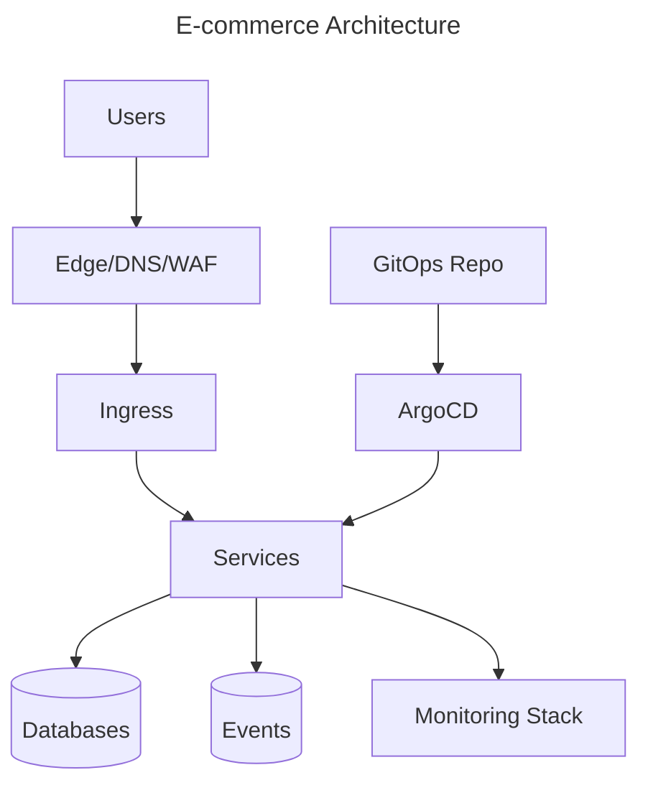
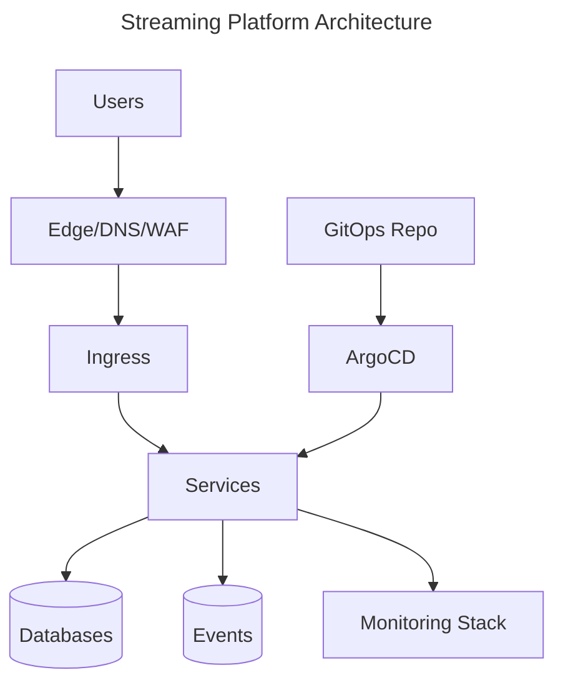

# Platform Engineer Production Simulator

## SaaS Platform

Company Background: A growing saas platform needs a reliable platform for rapid product delivery.

Business Requirements: high availability, auditability, self-service delivery, and cost control.

Constraints: compliance, limited operators, legacy workloads, and aggressive growth.

### Incident: Cluster Upgrade

Symptoms: latency, errors, alerts, or failed reconciliations indicate cluster upgrade.

How Engineers Notice: paging alerts, customer reports, dashboard anomalies, and failed deploy notifications.

Metrics: error rate, saturation, request duration, queue depth, and control-plane health.

Logs: correlate application, ingress, controller, audit, and cloud provider logs.

Root Cause: an unsafe change or hidden dependency exceeded the designed failure boundary.

Investigation Timeline: detect, declare, stabilize, inspect recent changes, mitigate, verify, and document.

Recovery: rollback, fail over, rotate credentials, repair state, or scale capacity as appropriate.

Postmortem: focus on contributing factors and durable improvements, not blame.

Long-term Improvements: better SLOs, game days, policy checks, runbooks, and automation.

Staff Engineer Discussion: balance speed, safety, ownership, and migration cost.

Architecture Tradeoffs: redundancy reduces risk but increases operational complexity.

Lessons Learned: design for debuggability before the incident.

### Incident: Production Outage

Symptoms: latency, errors, alerts, or failed reconciliations indicate production outage.

How Engineers Notice: paging alerts, customer reports, dashboard anomalies, and failed deploy notifications.

Metrics: error rate, saturation, request duration, queue depth, and control-plane health.

Logs: correlate application, ingress, controller, audit, and cloud provider logs.

Root Cause: an unsafe change or hidden dependency exceeded the designed failure boundary.

Investigation Timeline: detect, declare, stabilize, inspect recent changes, mitigate, verify, and document.

Recovery: rollback, fail over, rotate credentials, repair state, or scale capacity as appropriate.

Postmortem: focus on contributing factors and durable improvements, not blame.

Long-term Improvements: better SLOs, game days, policy checks, runbooks, and automation.

Staff Engineer Discussion: balance speed, safety, ownership, and migration cost.

Architecture Tradeoffs: redundancy reduces risk but increases operational complexity.

Lessons Learned: design for debuggability before the incident.

### Incident: Database Failure

Symptoms: latency, errors, alerts, or failed reconciliations indicate database failure.

How Engineers Notice: paging alerts, customer reports, dashboard anomalies, and failed deploy notifications.

Metrics: error rate, saturation, request duration, queue depth, and control-plane health.

Logs: correlate application, ingress, controller, audit, and cloud provider logs.

Root Cause: an unsafe change or hidden dependency exceeded the designed failure boundary.

Investigation Timeline: detect, declare, stabilize, inspect recent changes, mitigate, verify, and document.

Recovery: rollback, fail over, rotate credentials, repair state, or scale capacity as appropriate.

Postmortem: focus on contributing factors and durable improvements, not blame.

Long-term Improvements: better SLOs, game days, policy checks, runbooks, and automation.

Staff Engineer Discussion: balance speed, safety, ownership, and migration cost.

Architecture Tradeoffs: redundancy reduces risk but increases operational complexity.

Lessons Learned: design for debuggability before the incident.

### Incident: Certificate Expiration

Symptoms: latency, errors, alerts, or failed reconciliations indicate certificate expiration.

How Engineers Notice: paging alerts, customer reports, dashboard anomalies, and failed deploy notifications.

Metrics: error rate, saturation, request duration, queue depth, and control-plane health.

Logs: correlate application, ingress, controller, audit, and cloud provider logs.

Root Cause: an unsafe change or hidden dependency exceeded the designed failure boundary.

Investigation Timeline: detect, declare, stabilize, inspect recent changes, mitigate, verify, and document.

Recovery: rollback, fail over, rotate credentials, repair state, or scale capacity as appropriate.

Postmortem: focus on contributing factors and durable improvements, not blame.

Long-term Improvements: better SLOs, game days, policy checks, runbooks, and automation.

Staff Engineer Discussion: balance speed, safety, ownership, and migration cost.

Architecture Tradeoffs: redundancy reduces risk but increases operational complexity.

Lessons Learned: design for debuggability before the incident.

### Incident: DNS Failure

Symptoms: latency, errors, alerts, or failed reconciliations indicate dns failure.

How Engineers Notice: paging alerts, customer reports, dashboard anomalies, and failed deploy notifications.

Metrics: error rate, saturation, request duration, queue depth, and control-plane health.

Logs: correlate application, ingress, controller, audit, and cloud provider logs.

Root Cause: an unsafe change or hidden dependency exceeded the designed failure boundary.

Investigation Timeline: detect, declare, stabilize, inspect recent changes, mitigate, verify, and document.

Recovery: rollback, fail over, rotate credentials, repair state, or scale capacity as appropriate.

Postmortem: focus on contributing factors and durable improvements, not blame.

Long-term Improvements: better SLOs, game days, policy checks, runbooks, and automation.

Staff Engineer Discussion: balance speed, safety, ownership, and migration cost.

Architecture Tradeoffs: redundancy reduces risk but increases operational complexity.

Lessons Learned: design for debuggability before the incident.

### Incident: etcd Corruption

Symptoms: latency, errors, alerts, or failed reconciliations indicate etcd corruption.

How Engineers Notice: paging alerts, customer reports, dashboard anomalies, and failed deploy notifications.

Metrics: error rate, saturation, request duration, queue depth, and control-plane health.

Logs: correlate application, ingress, controller, audit, and cloud provider logs.

Root Cause: an unsafe change or hidden dependency exceeded the designed failure boundary.

Investigation Timeline: detect, declare, stabilize, inspect recent changes, mitigate, verify, and document.

Recovery: rollback, fail over, rotate credentials, repair state, or scale capacity as appropriate.

Postmortem: focus on contributing factors and durable improvements, not blame.

Long-term Improvements: better SLOs, game days, policy checks, runbooks, and automation.

Staff Engineer Discussion: balance speed, safety, ownership, and migration cost.

Architecture Tradeoffs: redundancy reduces risk but increases operational complexity.

Lessons Learned: design for debuggability before the incident.

### Incident: Node Failure

Symptoms: latency, errors, alerts, or failed reconciliations indicate node failure.

How Engineers Notice: paging alerts, customer reports, dashboard anomalies, and failed deploy notifications.

Metrics: error rate, saturation, request duration, queue depth, and control-plane health.

Logs: correlate application, ingress, controller, audit, and cloud provider logs.

Root Cause: an unsafe change or hidden dependency exceeded the designed failure boundary.

Investigation Timeline: detect, declare, stabilize, inspect recent changes, mitigate, verify, and document.

Recovery: rollback, fail over, rotate credentials, repair state, or scale capacity as appropriate.

Postmortem: focus on contributing factors and durable improvements, not blame.

Long-term Improvements: better SLOs, game days, policy checks, runbooks, and automation.

Staff Engineer Discussion: balance speed, safety, ownership, and migration cost.

Architecture Tradeoffs: redundancy reduces risk but increases operational complexity.

Lessons Learned: design for debuggability before the incident.

### Incident: Region Failure

Symptoms: latency, errors, alerts, or failed reconciliations indicate region failure.

How Engineers Notice: paging alerts, customer reports, dashboard anomalies, and failed deploy notifications.

Metrics: error rate, saturation, request duration, queue depth, and control-plane health.

Logs: correlate application, ingress, controller, audit, and cloud provider logs.

Root Cause: an unsafe change or hidden dependency exceeded the designed failure boundary.

Investigation Timeline: detect, declare, stabilize, inspect recent changes, mitigate, verify, and document.

Recovery: rollback, fail over, rotate credentials, repair state, or scale capacity as appropriate.

Postmortem: focus on contributing factors and durable improvements, not blame.

Long-term Improvements: better SLOs, game days, policy checks, runbooks, and automation.

Staff Engineer Discussion: balance speed, safety, ownership, and migration cost.

Architecture Tradeoffs: redundancy reduces risk but increases operational complexity.

Lessons Learned: design for debuggability before the incident.

### Incident: Secrets Leak

Symptoms: latency, errors, alerts, or failed reconciliations indicate secrets leak.

How Engineers Notice: paging alerts, customer reports, dashboard anomalies, and failed deploy notifications.

Metrics: error rate, saturation, request duration, queue depth, and control-plane health.

Logs: correlate application, ingress, controller, audit, and cloud provider logs.

Root Cause: an unsafe change or hidden dependency exceeded the designed failure boundary.

Investigation Timeline: detect, declare, stabilize, inspect recent changes, mitigate, verify, and document.

Recovery: rollback, fail over, rotate credentials, repair state, or scale capacity as appropriate.

Postmortem: focus on contributing factors and durable improvements, not blame.

Long-term Improvements: better SLOs, game days, policy checks, runbooks, and automation.

Staff Engineer Discussion: balance speed, safety, ownership, and migration cost.

Architecture Tradeoffs: redundancy reduces risk but increases operational complexity.

Lessons Learned: design for debuggability before the incident.

### Incident: Compromised Container

Symptoms: latency, errors, alerts, or failed reconciliations indicate compromised container.

How Engineers Notice: paging alerts, customer reports, dashboard anomalies, and failed deploy notifications.

Metrics: error rate, saturation, request duration, queue depth, and control-plane health.

Logs: correlate application, ingress, controller, audit, and cloud provider logs.

Root Cause: an unsafe change or hidden dependency exceeded the designed failure boundary.

Investigation Timeline: detect, declare, stabilize, inspect recent changes, mitigate, verify, and document.

Recovery: rollback, fail over, rotate credentials, repair state, or scale capacity as appropriate.

Postmortem: focus on contributing factors and durable improvements, not blame.

Long-term Improvements: better SLOs, game days, policy checks, runbooks, and automation.

Staff Engineer Discussion: balance speed, safety, ownership, and migration cost.

Architecture Tradeoffs: redundancy reduces risk but increases operational complexity.

Lessons Learned: design for debuggability before the incident.

### Incident: Kubernetes API Down

Symptoms: latency, errors, alerts, or failed reconciliations indicate kubernetes api down.

How Engineers Notice: paging alerts, customer reports, dashboard anomalies, and failed deploy notifications.

Metrics: error rate, saturation, request duration, queue depth, and control-plane health.

Logs: correlate application, ingress, controller, audit, and cloud provider logs.

Root Cause: an unsafe change or hidden dependency exceeded the designed failure boundary.

Investigation Timeline: detect, declare, stabilize, inspect recent changes, mitigate, verify, and document.

Recovery: rollback, fail over, rotate credentials, repair state, or scale capacity as appropriate.

Postmortem: focus on contributing factors and durable improvements, not blame.

Long-term Improvements: better SLOs, game days, policy checks, runbooks, and automation.

Staff Engineer Discussion: balance speed, safety, ownership, and migration cost.

Architecture Tradeoffs: redundancy reduces risk but increases operational complexity.

Lessons Learned: design for debuggability before the incident.

### Incident: ArgoCD Drift

Symptoms: latency, errors, alerts, or failed reconciliations indicate argocd drift.

How Engineers Notice: paging alerts, customer reports, dashboard anomalies, and failed deploy notifications.

Metrics: error rate, saturation, request duration, queue depth, and control-plane health.

Logs: correlate application, ingress, controller, audit, and cloud provider logs.

Root Cause: an unsafe change or hidden dependency exceeded the designed failure boundary.

Investigation Timeline: detect, declare, stabilize, inspect recent changes, mitigate, verify, and document.

Recovery: rollback, fail over, rotate credentials, repair state, or scale capacity as appropriate.

Postmortem: focus on contributing factors and durable improvements, not blame.

Long-term Improvements: better SLOs, game days, policy checks, runbooks, and automation.

Staff Engineer Discussion: balance speed, safety, ownership, and migration cost.

Architecture Tradeoffs: redundancy reduces risk but increases operational complexity.

Lessons Learned: design for debuggability before the incident.

### Incident: Terraform State Corruption

Symptoms: latency, errors, alerts, or failed reconciliations indicate terraform state corruption.

How Engineers Notice: paging alerts, customer reports, dashboard anomalies, and failed deploy notifications.

Metrics: error rate, saturation, request duration, queue depth, and control-plane health.

Logs: correlate application, ingress, controller, audit, and cloud provider logs.

Root Cause: an unsafe change or hidden dependency exceeded the designed failure boundary.

Investigation Timeline: detect, declare, stabilize, inspect recent changes, mitigate, verify, and document.

Recovery: rollback, fail over, rotate credentials, repair state, or scale capacity as appropriate.

Postmortem: focus on contributing factors and durable improvements, not blame.

Long-term Improvements: better SLOs, game days, policy checks, runbooks, and automation.

Staff Engineer Discussion: balance speed, safety, ownership, and migration cost.

Architecture Tradeoffs: redundancy reduces risk but increases operational complexity.

Lessons Learned: design for debuggability before the incident.

### Incident: GitOps Conflict

Symptoms: latency, errors, alerts, or failed reconciliations indicate gitops conflict.

How Engineers Notice: paging alerts, customer reports, dashboard anomalies, and failed deploy notifications.

Metrics: error rate, saturation, request duration, queue depth, and control-plane health.

Logs: correlate application, ingress, controller, audit, and cloud provider logs.

Root Cause: an unsafe change or hidden dependency exceeded the designed failure boundary.

Investigation Timeline: detect, declare, stabilize, inspect recent changes, mitigate, verify, and document.

Recovery: rollback, fail over, rotate credentials, repair state, or scale capacity as appropriate.

Postmortem: focus on contributing factors and durable improvements, not blame.

Long-term Improvements: better SLOs, game days, policy checks, runbooks, and automation.

Staff Engineer Discussion: balance speed, safety, ownership, and migration cost.

Architecture Tradeoffs: redundancy reduces risk but increases operational complexity.

Lessons Learned: design for debuggability before the incident.

### Incident: AI Model Rollout Failure

Symptoms: latency, errors, alerts, or failed reconciliations indicate ai model rollout failure.

How Engineers Notice: paging alerts, customer reports, dashboard anomalies, and failed deploy notifications.

Metrics: error rate, saturation, request duration, queue depth, and control-plane health.

Logs: correlate application, ingress, controller, audit, and cloud provider logs.

Root Cause: an unsafe change or hidden dependency exceeded the designed failure boundary.

Investigation Timeline: detect, declare, stabilize, inspect recent changes, mitigate, verify, and document.

Recovery: rollback, fail over, rotate credentials, repair state, or scale capacity as appropriate.

Postmortem: focus on contributing factors and durable improvements, not blame.

Long-term Improvements: better SLOs, game days, policy checks, runbooks, and automation.

Staff Engineer Discussion: balance speed, safety, ownership, and migration cost.

Architecture Tradeoffs: redundancy reduces risk but increases operational complexity.

Lessons Learned: design for debuggability before the incident.

## FinTech

Company Background: A growing fintech needs a reliable platform for rapid product delivery.

Business Requirements: high availability, auditability, self-service delivery, and cost control.

Constraints: compliance, limited operators, legacy workloads, and aggressive growth.

### Incident: Cluster Upgrade

Symptoms: latency, errors, alerts, or failed reconciliations indicate cluster upgrade.

How Engineers Notice: paging alerts, customer reports, dashboard anomalies, and failed deploy notifications.

Metrics: error rate, saturation, request duration, queue depth, and control-plane health.

Logs: correlate application, ingress, controller, audit, and cloud provider logs.

Root Cause: an unsafe change or hidden dependency exceeded the designed failure boundary.

Investigation Timeline: detect, declare, stabilize, inspect recent changes, mitigate, verify, and document.

Recovery: rollback, fail over, rotate credentials, repair state, or scale capacity as appropriate.

Postmortem: focus on contributing factors and durable improvements, not blame.

Long-term Improvements: better SLOs, game days, policy checks, runbooks, and automation.

Staff Engineer Discussion: balance speed, safety, ownership, and migration cost.

Architecture Tradeoffs: redundancy reduces risk but increases operational complexity.

Lessons Learned: design for debuggability before the incident.

### Incident: Production Outage

Symptoms: latency, errors, alerts, or failed reconciliations indicate production outage.

How Engineers Notice: paging alerts, customer reports, dashboard anomalies, and failed deploy notifications.

Metrics: error rate, saturation, request duration, queue depth, and control-plane health.

Logs: correlate application, ingress, controller, audit, and cloud provider logs.

Root Cause: an unsafe change or hidden dependency exceeded the designed failure boundary.

Investigation Timeline: detect, declare, stabilize, inspect recent changes, mitigate, verify, and document.

Recovery: rollback, fail over, rotate credentials, repair state, or scale capacity as appropriate.

Postmortem: focus on contributing factors and durable improvements, not blame.

Long-term Improvements: better SLOs, game days, policy checks, runbooks, and automation.

Staff Engineer Discussion: balance speed, safety, ownership, and migration cost.

Architecture Tradeoffs: redundancy reduces risk but increases operational complexity.

Lessons Learned: design for debuggability before the incident.

### Incident: Database Failure

Symptoms: latency, errors, alerts, or failed reconciliations indicate database failure.

How Engineers Notice: paging alerts, customer reports, dashboard anomalies, and failed deploy notifications.

Metrics: error rate, saturation, request duration, queue depth, and control-plane health.

Logs: correlate application, ingress, controller, audit, and cloud provider logs.

Root Cause: an unsafe change or hidden dependency exceeded the designed failure boundary.

Investigation Timeline: detect, declare, stabilize, inspect recent changes, mitigate, verify, and document.

Recovery: rollback, fail over, rotate credentials, repair state, or scale capacity as appropriate.

Postmortem: focus on contributing factors and durable improvements, not blame.

Long-term Improvements: better SLOs, game days, policy checks, runbooks, and automation.

Staff Engineer Discussion: balance speed, safety, ownership, and migration cost.

Architecture Tradeoffs: redundancy reduces risk but increases operational complexity.

Lessons Learned: design for debuggability before the incident.

### Incident: Certificate Expiration

Symptoms: latency, errors, alerts, or failed reconciliations indicate certificate expiration.

How Engineers Notice: paging alerts, customer reports, dashboard anomalies, and failed deploy notifications.

Metrics: error rate, saturation, request duration, queue depth, and control-plane health.

Logs: correlate application, ingress, controller, audit, and cloud provider logs.

Root Cause: an unsafe change or hidden dependency exceeded the designed failure boundary.

Investigation Timeline: detect, declare, stabilize, inspect recent changes, mitigate, verify, and document.

Recovery: rollback, fail over, rotate credentials, repair state, or scale capacity as appropriate.

Postmortem: focus on contributing factors and durable improvements, not blame.

Long-term Improvements: better SLOs, game days, policy checks, runbooks, and automation.

Staff Engineer Discussion: balance speed, safety, ownership, and migration cost.

Architecture Tradeoffs: redundancy reduces risk but increases operational complexity.

Lessons Learned: design for debuggability before the incident.

### Incident: DNS Failure

Symptoms: latency, errors, alerts, or failed reconciliations indicate dns failure.

How Engineers Notice: paging alerts, customer reports, dashboard anomalies, and failed deploy notifications.

Metrics: error rate, saturation, request duration, queue depth, and control-plane health.

Logs: correlate application, ingress, controller, audit, and cloud provider logs.

Root Cause: an unsafe change or hidden dependency exceeded the designed failure boundary.

Investigation Timeline: detect, declare, stabilize, inspect recent changes, mitigate, verify, and document.

Recovery: rollback, fail over, rotate credentials, repair state, or scale capacity as appropriate.

Postmortem: focus on contributing factors and durable improvements, not blame.

Long-term Improvements: better SLOs, game days, policy checks, runbooks, and automation.

Staff Engineer Discussion: balance speed, safety, ownership, and migration cost.

Architecture Tradeoffs: redundancy reduces risk but increases operational complexity.

Lessons Learned: design for debuggability before the incident.

### Incident: etcd Corruption

Symptoms: latency, errors, alerts, or failed reconciliations indicate etcd corruption.

How Engineers Notice: paging alerts, customer reports, dashboard anomalies, and failed deploy notifications.

Metrics: error rate, saturation, request duration, queue depth, and control-plane health.

Logs: correlate application, ingress, controller, audit, and cloud provider logs.

Root Cause: an unsafe change or hidden dependency exceeded the designed failure boundary.

Investigation Timeline: detect, declare, stabilize, inspect recent changes, mitigate, verify, and document.

Recovery: rollback, fail over, rotate credentials, repair state, or scale capacity as appropriate.

Postmortem: focus on contributing factors and durable improvements, not blame.

Long-term Improvements: better SLOs, game days, policy checks, runbooks, and automation.

Staff Engineer Discussion: balance speed, safety, ownership, and migration cost.

Architecture Tradeoffs: redundancy reduces risk but increases operational complexity.

Lessons Learned: design for debuggability before the incident.

### Incident: Node Failure

Symptoms: latency, errors, alerts, or failed reconciliations indicate node failure.

How Engineers Notice: paging alerts, customer reports, dashboard anomalies, and failed deploy notifications.

Metrics: error rate, saturation, request duration, queue depth, and control-plane health.

Logs: correlate application, ingress, controller, audit, and cloud provider logs.

Root Cause: an unsafe change or hidden dependency exceeded the designed failure boundary.

Investigation Timeline: detect, declare, stabilize, inspect recent changes, mitigate, verify, and document.

Recovery: rollback, fail over, rotate credentials, repair state, or scale capacity as appropriate.

Postmortem: focus on contributing factors and durable improvements, not blame.

Long-term Improvements: better SLOs, game days, policy checks, runbooks, and automation.

Staff Engineer Discussion: balance speed, safety, ownership, and migration cost.

Architecture Tradeoffs: redundancy reduces risk but increases operational complexity.

Lessons Learned: design for debuggability before the incident.

### Incident: Region Failure

Symptoms: latency, errors, alerts, or failed reconciliations indicate region failure.

How Engineers Notice: paging alerts, customer reports, dashboard anomalies, and failed deploy notifications.

Metrics: error rate, saturation, request duration, queue depth, and control-plane health.

Logs: correlate application, ingress, controller, audit, and cloud provider logs.

Root Cause: an unsafe change or hidden dependency exceeded the designed failure boundary.

Investigation Timeline: detect, declare, stabilize, inspect recent changes, mitigate, verify, and document.

Recovery: rollback, fail over, rotate credentials, repair state, or scale capacity as appropriate.

Postmortem: focus on contributing factors and durable improvements, not blame.

Long-term Improvements: better SLOs, game days, policy checks, runbooks, and automation.

Staff Engineer Discussion: balance speed, safety, ownership, and migration cost.

Architecture Tradeoffs: redundancy reduces risk but increases operational complexity.

Lessons Learned: design for debuggability before the incident.

### Incident: Secrets Leak

Symptoms: latency, errors, alerts, or failed reconciliations indicate secrets leak.

How Engineers Notice: paging alerts, customer reports, dashboard anomalies, and failed deploy notifications.

Metrics: error rate, saturation, request duration, queue depth, and control-plane health.

Logs: correlate application, ingress, controller, audit, and cloud provider logs.

Root Cause: an unsafe change or hidden dependency exceeded the designed failure boundary.

Investigation Timeline: detect, declare, stabilize, inspect recent changes, mitigate, verify, and document.

Recovery: rollback, fail over, rotate credentials, repair state, or scale capacity as appropriate.

Postmortem: focus on contributing factors and durable improvements, not blame.

Long-term Improvements: better SLOs, game days, policy checks, runbooks, and automation.

Staff Engineer Discussion: balance speed, safety, ownership, and migration cost.

Architecture Tradeoffs: redundancy reduces risk but increases operational complexity.

Lessons Learned: design for debuggability before the incident.

### Incident: Compromised Container

Symptoms: latency, errors, alerts, or failed reconciliations indicate compromised container.

How Engineers Notice: paging alerts, customer reports, dashboard anomalies, and failed deploy notifications.

Metrics: error rate, saturation, request duration, queue depth, and control-plane health.

Logs: correlate application, ingress, controller, audit, and cloud provider logs.

Root Cause: an unsafe change or hidden dependency exceeded the designed failure boundary.

Investigation Timeline: detect, declare, stabilize, inspect recent changes, mitigate, verify, and document.

Recovery: rollback, fail over, rotate credentials, repair state, or scale capacity as appropriate.

Postmortem: focus on contributing factors and durable improvements, not blame.

Long-term Improvements: better SLOs, game days, policy checks, runbooks, and automation.

Staff Engineer Discussion: balance speed, safety, ownership, and migration cost.

Architecture Tradeoffs: redundancy reduces risk but increases operational complexity.

Lessons Learned: design for debuggability before the incident.

### Incident: Kubernetes API Down

Symptoms: latency, errors, alerts, or failed reconciliations indicate kubernetes api down.

How Engineers Notice: paging alerts, customer reports, dashboard anomalies, and failed deploy notifications.

Metrics: error rate, saturation, request duration, queue depth, and control-plane health.

Logs: correlate application, ingress, controller, audit, and cloud provider logs.

Root Cause: an unsafe change or hidden dependency exceeded the designed failure boundary.

Investigation Timeline: detect, declare, stabilize, inspect recent changes, mitigate, verify, and document.

Recovery: rollback, fail over, rotate credentials, repair state, or scale capacity as appropriate.

Postmortem: focus on contributing factors and durable improvements, not blame.

Long-term Improvements: better SLOs, game days, policy checks, runbooks, and automation.

Staff Engineer Discussion: balance speed, safety, ownership, and migration cost.

Architecture Tradeoffs: redundancy reduces risk but increases operational complexity.

Lessons Learned: design for debuggability before the incident.

### Incident: ArgoCD Drift

Symptoms: latency, errors, alerts, or failed reconciliations indicate argocd drift.

How Engineers Notice: paging alerts, customer reports, dashboard anomalies, and failed deploy notifications.

Metrics: error rate, saturation, request duration, queue depth, and control-plane health.

Logs: correlate application, ingress, controller, audit, and cloud provider logs.

Root Cause: an unsafe change or hidden dependency exceeded the designed failure boundary.

Investigation Timeline: detect, declare, stabilize, inspect recent changes, mitigate, verify, and document.

Recovery: rollback, fail over, rotate credentials, repair state, or scale capacity as appropriate.

Postmortem: focus on contributing factors and durable improvements, not blame.

Long-term Improvements: better SLOs, game days, policy checks, runbooks, and automation.

Staff Engineer Discussion: balance speed, safety, ownership, and migration cost.

Architecture Tradeoffs: redundancy reduces risk but increases operational complexity.

Lessons Learned: design for debuggability before the incident.

### Incident: Terraform State Corruption

Symptoms: latency, errors, alerts, or failed reconciliations indicate terraform state corruption.

How Engineers Notice: paging alerts, customer reports, dashboard anomalies, and failed deploy notifications.

Metrics: error rate, saturation, request duration, queue depth, and control-plane health.

Logs: correlate application, ingress, controller, audit, and cloud provider logs.

Root Cause: an unsafe change or hidden dependency exceeded the designed failure boundary.

Investigation Timeline: detect, declare, stabilize, inspect recent changes, mitigate, verify, and document.

Recovery: rollback, fail over, rotate credentials, repair state, or scale capacity as appropriate.

Postmortem: focus on contributing factors and durable improvements, not blame.

Long-term Improvements: better SLOs, game days, policy checks, runbooks, and automation.

Staff Engineer Discussion: balance speed, safety, ownership, and migration cost.

Architecture Tradeoffs: redundancy reduces risk but increases operational complexity.

Lessons Learned: design for debuggability before the incident.

### Incident: GitOps Conflict

Symptoms: latency, errors, alerts, or failed reconciliations indicate gitops conflict.

How Engineers Notice: paging alerts, customer reports, dashboard anomalies, and failed deploy notifications.

Metrics: error rate, saturation, request duration, queue depth, and control-plane health.

Logs: correlate application, ingress, controller, audit, and cloud provider logs.

Root Cause: an unsafe change or hidden dependency exceeded the designed failure boundary.

Investigation Timeline: detect, declare, stabilize, inspect recent changes, mitigate, verify, and document.

Recovery: rollback, fail over, rotate credentials, repair state, or scale capacity as appropriate.

Postmortem: focus on contributing factors and durable improvements, not blame.

Long-term Improvements: better SLOs, game days, policy checks, runbooks, and automation.

Staff Engineer Discussion: balance speed, safety, ownership, and migration cost.

Architecture Tradeoffs: redundancy reduces risk but increases operational complexity.

Lessons Learned: design for debuggability before the incident.

### Incident: AI Model Rollout Failure

Symptoms: latency, errors, alerts, or failed reconciliations indicate ai model rollout failure.

How Engineers Notice: paging alerts, customer reports, dashboard anomalies, and failed deploy notifications.

Metrics: error rate, saturation, request duration, queue depth, and control-plane health.

Logs: correlate application, ingress, controller, audit, and cloud provider logs.

Root Cause: an unsafe change or hidden dependency exceeded the designed failure boundary.

Investigation Timeline: detect, declare, stabilize, inspect recent changes, mitigate, verify, and document.

Recovery: rollback, fail over, rotate credentials, repair state, or scale capacity as appropriate.

Postmortem: focus on contributing factors and durable improvements, not blame.

Long-term Improvements: better SLOs, game days, policy checks, runbooks, and automation.

Staff Engineer Discussion: balance speed, safety, ownership, and migration cost.

Architecture Tradeoffs: redundancy reduces risk but increases operational complexity.

Lessons Learned: design for debuggability before the incident.

## Healthcare

Company Background: A growing healthcare needs a reliable platform for rapid product delivery.

Business Requirements: high availability, auditability, self-service delivery, and cost control.

Constraints: compliance, limited operators, legacy workloads, and aggressive growth.

### Incident: Cluster Upgrade

Symptoms: latency, errors, alerts, or failed reconciliations indicate cluster upgrade.

How Engineers Notice: paging alerts, customer reports, dashboard anomalies, and failed deploy notifications.

Metrics: error rate, saturation, request duration, queue depth, and control-plane health.

Logs: correlate application, ingress, controller, audit, and cloud provider logs.

Root Cause: an unsafe change or hidden dependency exceeded the designed failure boundary.

Investigation Timeline: detect, declare, stabilize, inspect recent changes, mitigate, verify, and document.

Recovery: rollback, fail over, rotate credentials, repair state, or scale capacity as appropriate.

Postmortem: focus on contributing factors and durable improvements, not blame.

Long-term Improvements: better SLOs, game days, policy checks, runbooks, and automation.

Staff Engineer Discussion: balance speed, safety, ownership, and migration cost.

Architecture Tradeoffs: redundancy reduces risk but increases operational complexity.

Lessons Learned: design for debuggability before the incident.

### Incident: Production Outage

Symptoms: latency, errors, alerts, or failed reconciliations indicate production outage.

How Engineers Notice: paging alerts, customer reports, dashboard anomalies, and failed deploy notifications.

Metrics: error rate, saturation, request duration, queue depth, and control-plane health.

Logs: correlate application, ingress, controller, audit, and cloud provider logs.

Root Cause: an unsafe change or hidden dependency exceeded the designed failure boundary.

Investigation Timeline: detect, declare, stabilize, inspect recent changes, mitigate, verify, and document.

Recovery: rollback, fail over, rotate credentials, repair state, or scale capacity as appropriate.

Postmortem: focus on contributing factors and durable improvements, not blame.

Long-term Improvements: better SLOs, game days, policy checks, runbooks, and automation.

Staff Engineer Discussion: balance speed, safety, ownership, and migration cost.

Architecture Tradeoffs: redundancy reduces risk but increases operational complexity.

Lessons Learned: design for debuggability before the incident.

### Incident: Database Failure

Symptoms: latency, errors, alerts, or failed reconciliations indicate database failure.

How Engineers Notice: paging alerts, customer reports, dashboard anomalies, and failed deploy notifications.

Metrics: error rate, saturation, request duration, queue depth, and control-plane health.

Logs: correlate application, ingress, controller, audit, and cloud provider logs.

Root Cause: an unsafe change or hidden dependency exceeded the designed failure boundary.

Investigation Timeline: detect, declare, stabilize, inspect recent changes, mitigate, verify, and document.

Recovery: rollback, fail over, rotate credentials, repair state, or scale capacity as appropriate.

Postmortem: focus on contributing factors and durable improvements, not blame.

Long-term Improvements: better SLOs, game days, policy checks, runbooks, and automation.

Staff Engineer Discussion: balance speed, safety, ownership, and migration cost.

Architecture Tradeoffs: redundancy reduces risk but increases operational complexity.

Lessons Learned: design for debuggability before the incident.

### Incident: Certificate Expiration

Symptoms: latency, errors, alerts, or failed reconciliations indicate certificate expiration.

How Engineers Notice: paging alerts, customer reports, dashboard anomalies, and failed deploy notifications.

Metrics: error rate, saturation, request duration, queue depth, and control-plane health.

Logs: correlate application, ingress, controller, audit, and cloud provider logs.

Root Cause: an unsafe change or hidden dependency exceeded the designed failure boundary.

Investigation Timeline: detect, declare, stabilize, inspect recent changes, mitigate, verify, and document.

Recovery: rollback, fail over, rotate credentials, repair state, or scale capacity as appropriate.

Postmortem: focus on contributing factors and durable improvements, not blame.

Long-term Improvements: better SLOs, game days, policy checks, runbooks, and automation.

Staff Engineer Discussion: balance speed, safety, ownership, and migration cost.

Architecture Tradeoffs: redundancy reduces risk but increases operational complexity.

Lessons Learned: design for debuggability before the incident.

### Incident: DNS Failure

Symptoms: latency, errors, alerts, or failed reconciliations indicate dns failure.

How Engineers Notice: paging alerts, customer reports, dashboard anomalies, and failed deploy notifications.

Metrics: error rate, saturation, request duration, queue depth, and control-plane health.

Logs: correlate application, ingress, controller, audit, and cloud provider logs.

Root Cause: an unsafe change or hidden dependency exceeded the designed failure boundary.

Investigation Timeline: detect, declare, stabilize, inspect recent changes, mitigate, verify, and document.

Recovery: rollback, fail over, rotate credentials, repair state, or scale capacity as appropriate.

Postmortem: focus on contributing factors and durable improvements, not blame.

Long-term Improvements: better SLOs, game days, policy checks, runbooks, and automation.

Staff Engineer Discussion: balance speed, safety, ownership, and migration cost.

Architecture Tradeoffs: redundancy reduces risk but increases operational complexity.

Lessons Learned: design for debuggability before the incident.

### Incident: etcd Corruption

Symptoms: latency, errors, alerts, or failed reconciliations indicate etcd corruption.

How Engineers Notice: paging alerts, customer reports, dashboard anomalies, and failed deploy notifications.

Metrics: error rate, saturation, request duration, queue depth, and control-plane health.

Logs: correlate application, ingress, controller, audit, and cloud provider logs.

Root Cause: an unsafe change or hidden dependency exceeded the designed failure boundary.

Investigation Timeline: detect, declare, stabilize, inspect recent changes, mitigate, verify, and document.

Recovery: rollback, fail over, rotate credentials, repair state, or scale capacity as appropriate.

Postmortem: focus on contributing factors and durable improvements, not blame.

Long-term Improvements: better SLOs, game days, policy checks, runbooks, and automation.

Staff Engineer Discussion: balance speed, safety, ownership, and migration cost.

Architecture Tradeoffs: redundancy reduces risk but increases operational complexity.

Lessons Learned: design for debuggability before the incident.

### Incident: Node Failure

Symptoms: latency, errors, alerts, or failed reconciliations indicate node failure.

How Engineers Notice: paging alerts, customer reports, dashboard anomalies, and failed deploy notifications.

Metrics: error rate, saturation, request duration, queue depth, and control-plane health.

Logs: correlate application, ingress, controller, audit, and cloud provider logs.

Root Cause: an unsafe change or hidden dependency exceeded the designed failure boundary.

Investigation Timeline: detect, declare, stabilize, inspect recent changes, mitigate, verify, and document.

Recovery: rollback, fail over, rotate credentials, repair state, or scale capacity as appropriate.

Postmortem: focus on contributing factors and durable improvements, not blame.

Long-term Improvements: better SLOs, game days, policy checks, runbooks, and automation.

Staff Engineer Discussion: balance speed, safety, ownership, and migration cost.

Architecture Tradeoffs: redundancy reduces risk but increases operational complexity.

Lessons Learned: design for debuggability before the incident.

### Incident: Region Failure

Symptoms: latency, errors, alerts, or failed reconciliations indicate region failure.

How Engineers Notice: paging alerts, customer reports, dashboard anomalies, and failed deploy notifications.

Metrics: error rate, saturation, request duration, queue depth, and control-plane health.

Logs: correlate application, ingress, controller, audit, and cloud provider logs.

Root Cause: an unsafe change or hidden dependency exceeded the designed failure boundary.

Investigation Timeline: detect, declare, stabilize, inspect recent changes, mitigate, verify, and document.

Recovery: rollback, fail over, rotate credentials, repair state, or scale capacity as appropriate.

Postmortem: focus on contributing factors and durable improvements, not blame.

Long-term Improvements: better SLOs, game days, policy checks, runbooks, and automation.

Staff Engineer Discussion: balance speed, safety, ownership, and migration cost.

Architecture Tradeoffs: redundancy reduces risk but increases operational complexity.

Lessons Learned: design for debuggability before the incident.

### Incident: Secrets Leak

Symptoms: latency, errors, alerts, or failed reconciliations indicate secrets leak.

How Engineers Notice: paging alerts, customer reports, dashboard anomalies, and failed deploy notifications.

Metrics: error rate, saturation, request duration, queue depth, and control-plane health.

Logs: correlate application, ingress, controller, audit, and cloud provider logs.

Root Cause: an unsafe change or hidden dependency exceeded the designed failure boundary.

Investigation Timeline: detect, declare, stabilize, inspect recent changes, mitigate, verify, and document.

Recovery: rollback, fail over, rotate credentials, repair state, or scale capacity as appropriate.

Postmortem: focus on contributing factors and durable improvements, not blame.

Long-term Improvements: better SLOs, game days, policy checks, runbooks, and automation.

Staff Engineer Discussion: balance speed, safety, ownership, and migration cost.

Architecture Tradeoffs: redundancy reduces risk but increases operational complexity.

Lessons Learned: design for debuggability before the incident.

### Incident: Compromised Container

Symptoms: latency, errors, alerts, or failed reconciliations indicate compromised container.

How Engineers Notice: paging alerts, customer reports, dashboard anomalies, and failed deploy notifications.

Metrics: error rate, saturation, request duration, queue depth, and control-plane health.

Logs: correlate application, ingress, controller, audit, and cloud provider logs.

Root Cause: an unsafe change or hidden dependency exceeded the designed failure boundary.

Investigation Timeline: detect, declare, stabilize, inspect recent changes, mitigate, verify, and document.

Recovery: rollback, fail over, rotate credentials, repair state, or scale capacity as appropriate.

Postmortem: focus on contributing factors and durable improvements, not blame.

Long-term Improvements: better SLOs, game days, policy checks, runbooks, and automation.

Staff Engineer Discussion: balance speed, safety, ownership, and migration cost.

Architecture Tradeoffs: redundancy reduces risk but increases operational complexity.

Lessons Learned: design for debuggability before the incident.

### Incident: Kubernetes API Down

Symptoms: latency, errors, alerts, or failed reconciliations indicate kubernetes api down.

How Engineers Notice: paging alerts, customer reports, dashboard anomalies, and failed deploy notifications.

Metrics: error rate, saturation, request duration, queue depth, and control-plane health.

Logs: correlate application, ingress, controller, audit, and cloud provider logs.

Root Cause: an unsafe change or hidden dependency exceeded the designed failure boundary.

Investigation Timeline: detect, declare, stabilize, inspect recent changes, mitigate, verify, and document.

Recovery: rollback, fail over, rotate credentials, repair state, or scale capacity as appropriate.

Postmortem: focus on contributing factors and durable improvements, not blame.

Long-term Improvements: better SLOs, game days, policy checks, runbooks, and automation.

Staff Engineer Discussion: balance speed, safety, ownership, and migration cost.

Architecture Tradeoffs: redundancy reduces risk but increases operational complexity.

Lessons Learned: design for debuggability before the incident.

### Incident: ArgoCD Drift

Symptoms: latency, errors, alerts, or failed reconciliations indicate argocd drift.

How Engineers Notice: paging alerts, customer reports, dashboard anomalies, and failed deploy notifications.

Metrics: error rate, saturation, request duration, queue depth, and control-plane health.

Logs: correlate application, ingress, controller, audit, and cloud provider logs.

Root Cause: an unsafe change or hidden dependency exceeded the designed failure boundary.

Investigation Timeline: detect, declare, stabilize, inspect recent changes, mitigate, verify, and document.

Recovery: rollback, fail over, rotate credentials, repair state, or scale capacity as appropriate.

Postmortem: focus on contributing factors and durable improvements, not blame.

Long-term Improvements: better SLOs, game days, policy checks, runbooks, and automation.

Staff Engineer Discussion: balance speed, safety, ownership, and migration cost.

Architecture Tradeoffs: redundancy reduces risk but increases operational complexity.

Lessons Learned: design for debuggability before the incident.

### Incident: Terraform State Corruption

Symptoms: latency, errors, alerts, or failed reconciliations indicate terraform state corruption.

How Engineers Notice: paging alerts, customer reports, dashboard anomalies, and failed deploy notifications.

Metrics: error rate, saturation, request duration, queue depth, and control-plane health.

Logs: correlate application, ingress, controller, audit, and cloud provider logs.

Root Cause: an unsafe change or hidden dependency exceeded the designed failure boundary.

Investigation Timeline: detect, declare, stabilize, inspect recent changes, mitigate, verify, and document.

Recovery: rollback, fail over, rotate credentials, repair state, or scale capacity as appropriate.

Postmortem: focus on contributing factors and durable improvements, not blame.

Long-term Improvements: better SLOs, game days, policy checks, runbooks, and automation.

Staff Engineer Discussion: balance speed, safety, ownership, and migration cost.

Architecture Tradeoffs: redundancy reduces risk but increases operational complexity.

Lessons Learned: design for debuggability before the incident.

### Incident: GitOps Conflict

Symptoms: latency, errors, alerts, or failed reconciliations indicate gitops conflict.

How Engineers Notice: paging alerts, customer reports, dashboard anomalies, and failed deploy notifications.

Metrics: error rate, saturation, request duration, queue depth, and control-plane health.

Logs: correlate application, ingress, controller, audit, and cloud provider logs.

Root Cause: an unsafe change or hidden dependency exceeded the designed failure boundary.

Investigation Timeline: detect, declare, stabilize, inspect recent changes, mitigate, verify, and document.

Recovery: rollback, fail over, rotate credentials, repair state, or scale capacity as appropriate.

Postmortem: focus on contributing factors and durable improvements, not blame.

Long-term Improvements: better SLOs, game days, policy checks, runbooks, and automation.

Staff Engineer Discussion: balance speed, safety, ownership, and migration cost.

Architecture Tradeoffs: redundancy reduces risk but increases operational complexity.

Lessons Learned: design for debuggability before the incident.

### Incident: AI Model Rollout Failure

Symptoms: latency, errors, alerts, or failed reconciliations indicate ai model rollout failure.

How Engineers Notice: paging alerts, customer reports, dashboard anomalies, and failed deploy notifications.

Metrics: error rate, saturation, request duration, queue depth, and control-plane health.

Logs: correlate application, ingress, controller, audit, and cloud provider logs.

Root Cause: an unsafe change or hidden dependency exceeded the designed failure boundary.

Investigation Timeline: detect, declare, stabilize, inspect recent changes, mitigate, verify, and document.

Recovery: rollback, fail over, rotate credentials, repair state, or scale capacity as appropriate.

Postmortem: focus on contributing factors and durable improvements, not blame.

Long-term Improvements: better SLOs, game days, policy checks, runbooks, and automation.

Staff Engineer Discussion: balance speed, safety, ownership, and migration cost.

Architecture Tradeoffs: redundancy reduces risk but increases operational complexity.

Lessons Learned: design for debuggability before the incident.

## AI Startup

Company Background: A growing ai startup needs a reliable platform for rapid product delivery.

Business Requirements: high availability, auditability, self-service delivery, and cost control.

Constraints: compliance, limited operators, legacy workloads, and aggressive growth.

### Incident: Cluster Upgrade

Symptoms: latency, errors, alerts, or failed reconciliations indicate cluster upgrade.

How Engineers Notice: paging alerts, customer reports, dashboard anomalies, and failed deploy notifications.

Metrics: error rate, saturation, request duration, queue depth, and control-plane health.

Logs: correlate application, ingress, controller, audit, and cloud provider logs.

Root Cause: an unsafe change or hidden dependency exceeded the designed failure boundary.

Investigation Timeline: detect, declare, stabilize, inspect recent changes, mitigate, verify, and document.

Recovery: rollback, fail over, rotate credentials, repair state, or scale capacity as appropriate.

Postmortem: focus on contributing factors and durable improvements, not blame.

Long-term Improvements: better SLOs, game days, policy checks, runbooks, and automation.

Staff Engineer Discussion: balance speed, safety, ownership, and migration cost.

Architecture Tradeoffs: redundancy reduces risk but increases operational complexity.

Lessons Learned: design for debuggability before the incident.

### Incident: Production Outage

Symptoms: latency, errors, alerts, or failed reconciliations indicate production outage.

How Engineers Notice: paging alerts, customer reports, dashboard anomalies, and failed deploy notifications.

Metrics: error rate, saturation, request duration, queue depth, and control-plane health.

Logs: correlate application, ingress, controller, audit, and cloud provider logs.

Root Cause: an unsafe change or hidden dependency exceeded the designed failure boundary.

Investigation Timeline: detect, declare, stabilize, inspect recent changes, mitigate, verify, and document.

Recovery: rollback, fail over, rotate credentials, repair state, or scale capacity as appropriate.

Postmortem: focus on contributing factors and durable improvements, not blame.

Long-term Improvements: better SLOs, game days, policy checks, runbooks, and automation.

Staff Engineer Discussion: balance speed, safety, ownership, and migration cost.

Architecture Tradeoffs: redundancy reduces risk but increases operational complexity.

Lessons Learned: design for debuggability before the incident.

### Incident: Database Failure

Symptoms: latency, errors, alerts, or failed reconciliations indicate database failure.

How Engineers Notice: paging alerts, customer reports, dashboard anomalies, and failed deploy notifications.

Metrics: error rate, saturation, request duration, queue depth, and control-plane health.

Logs: correlate application, ingress, controller, audit, and cloud provider logs.

Root Cause: an unsafe change or hidden dependency exceeded the designed failure boundary.

Investigation Timeline: detect, declare, stabilize, inspect recent changes, mitigate, verify, and document.

Recovery: rollback, fail over, rotate credentials, repair state, or scale capacity as appropriate.

Postmortem: focus on contributing factors and durable improvements, not blame.

Long-term Improvements: better SLOs, game days, policy checks, runbooks, and automation.

Staff Engineer Discussion: balance speed, safety, ownership, and migration cost.

Architecture Tradeoffs: redundancy reduces risk but increases operational complexity.

Lessons Learned: design for debuggability before the incident.

### Incident: Certificate Expiration

Symptoms: latency, errors, alerts, or failed reconciliations indicate certificate expiration.

How Engineers Notice: paging alerts, customer reports, dashboard anomalies, and failed deploy notifications.

Metrics: error rate, saturation, request duration, queue depth, and control-plane health.

Logs: correlate application, ingress, controller, audit, and cloud provider logs.

Root Cause: an unsafe change or hidden dependency exceeded the designed failure boundary.

Investigation Timeline: detect, declare, stabilize, inspect recent changes, mitigate, verify, and document.

Recovery: rollback, fail over, rotate credentials, repair state, or scale capacity as appropriate.

Postmortem: focus on contributing factors and durable improvements, not blame.

Long-term Improvements: better SLOs, game days, policy checks, runbooks, and automation.

Staff Engineer Discussion: balance speed, safety, ownership, and migration cost.

Architecture Tradeoffs: redundancy reduces risk but increases operational complexity.

Lessons Learned: design for debuggability before the incident.

### Incident: DNS Failure

Symptoms: latency, errors, alerts, or failed reconciliations indicate dns failure.

How Engineers Notice: paging alerts, customer reports, dashboard anomalies, and failed deploy notifications.

Metrics: error rate, saturation, request duration, queue depth, and control-plane health.

Logs: correlate application, ingress, controller, audit, and cloud provider logs.

Root Cause: an unsafe change or hidden dependency exceeded the designed failure boundary.

Investigation Timeline: detect, declare, stabilize, inspect recent changes, mitigate, verify, and document.

Recovery: rollback, fail over, rotate credentials, repair state, or scale capacity as appropriate.

Postmortem: focus on contributing factors and durable improvements, not blame.

Long-term Improvements: better SLOs, game days, policy checks, runbooks, and automation.

Staff Engineer Discussion: balance speed, safety, ownership, and migration cost.

Architecture Tradeoffs: redundancy reduces risk but increases operational complexity.

Lessons Learned: design for debuggability before the incident.

### Incident: etcd Corruption

Symptoms: latency, errors, alerts, or failed reconciliations indicate etcd corruption.

How Engineers Notice: paging alerts, customer reports, dashboard anomalies, and failed deploy notifications.

Metrics: error rate, saturation, request duration, queue depth, and control-plane health.

Logs: correlate application, ingress, controller, audit, and cloud provider logs.

Root Cause: an unsafe change or hidden dependency exceeded the designed failure boundary.

Investigation Timeline: detect, declare, stabilize, inspect recent changes, mitigate, verify, and document.

Recovery: rollback, fail over, rotate credentials, repair state, or scale capacity as appropriate.

Postmortem: focus on contributing factors and durable improvements, not blame.

Long-term Improvements: better SLOs, game days, policy checks, runbooks, and automation.

Staff Engineer Discussion: balance speed, safety, ownership, and migration cost.

Architecture Tradeoffs: redundancy reduces risk but increases operational complexity.

Lessons Learned: design for debuggability before the incident.

### Incident: Node Failure

Symptoms: latency, errors, alerts, or failed reconciliations indicate node failure.

How Engineers Notice: paging alerts, customer reports, dashboard anomalies, and failed deploy notifications.

Metrics: error rate, saturation, request duration, queue depth, and control-plane health.

Logs: correlate application, ingress, controller, audit, and cloud provider logs.

Root Cause: an unsafe change or hidden dependency exceeded the designed failure boundary.

Investigation Timeline: detect, declare, stabilize, inspect recent changes, mitigate, verify, and document.

Recovery: rollback, fail over, rotate credentials, repair state, or scale capacity as appropriate.

Postmortem: focus on contributing factors and durable improvements, not blame.

Long-term Improvements: better SLOs, game days, policy checks, runbooks, and automation.

Staff Engineer Discussion: balance speed, safety, ownership, and migration cost.

Architecture Tradeoffs: redundancy reduces risk but increases operational complexity.

Lessons Learned: design for debuggability before the incident.

### Incident: Region Failure

Symptoms: latency, errors, alerts, or failed reconciliations indicate region failure.

How Engineers Notice: paging alerts, customer reports, dashboard anomalies, and failed deploy notifications.

Metrics: error rate, saturation, request duration, queue depth, and control-plane health.

Logs: correlate application, ingress, controller, audit, and cloud provider logs.

Root Cause: an unsafe change or hidden dependency exceeded the designed failure boundary.

Investigation Timeline: detect, declare, stabilize, inspect recent changes, mitigate, verify, and document.

Recovery: rollback, fail over, rotate credentials, repair state, or scale capacity as appropriate.

Postmortem: focus on contributing factors and durable improvements, not blame.

Long-term Improvements: better SLOs, game days, policy checks, runbooks, and automation.

Staff Engineer Discussion: balance speed, safety, ownership, and migration cost.

Architecture Tradeoffs: redundancy reduces risk but increases operational complexity.

Lessons Learned: design for debuggability before the incident.

### Incident: Secrets Leak

Symptoms: latency, errors, alerts, or failed reconciliations indicate secrets leak.

How Engineers Notice: paging alerts, customer reports, dashboard anomalies, and failed deploy notifications.

Metrics: error rate, saturation, request duration, queue depth, and control-plane health.

Logs: correlate application, ingress, controller, audit, and cloud provider logs.

Root Cause: an unsafe change or hidden dependency exceeded the designed failure boundary.

Investigation Timeline: detect, declare, stabilize, inspect recent changes, mitigate, verify, and document.

Recovery: rollback, fail over, rotate credentials, repair state, or scale capacity as appropriate.

Postmortem: focus on contributing factors and durable improvements, not blame.

Long-term Improvements: better SLOs, game days, policy checks, runbooks, and automation.

Staff Engineer Discussion: balance speed, safety, ownership, and migration cost.

Architecture Tradeoffs: redundancy reduces risk but increases operational complexity.

Lessons Learned: design for debuggability before the incident.

### Incident: Compromised Container

Symptoms: latency, errors, alerts, or failed reconciliations indicate compromised container.

How Engineers Notice: paging alerts, customer reports, dashboard anomalies, and failed deploy notifications.

Metrics: error rate, saturation, request duration, queue depth, and control-plane health.

Logs: correlate application, ingress, controller, audit, and cloud provider logs.

Root Cause: an unsafe change or hidden dependency exceeded the designed failure boundary.

Investigation Timeline: detect, declare, stabilize, inspect recent changes, mitigate, verify, and document.

Recovery: rollback, fail over, rotate credentials, repair state, or scale capacity as appropriate.

Postmortem: focus on contributing factors and durable improvements, not blame.

Long-term Improvements: better SLOs, game days, policy checks, runbooks, and automation.

Staff Engineer Discussion: balance speed, safety, ownership, and migration cost.

Architecture Tradeoffs: redundancy reduces risk but increases operational complexity.

Lessons Learned: design for debuggability before the incident.

### Incident: Kubernetes API Down

Symptoms: latency, errors, alerts, or failed reconciliations indicate kubernetes api down.

How Engineers Notice: paging alerts, customer reports, dashboard anomalies, and failed deploy notifications.

Metrics: error rate, saturation, request duration, queue depth, and control-plane health.

Logs: correlate application, ingress, controller, audit, and cloud provider logs.

Root Cause: an unsafe change or hidden dependency exceeded the designed failure boundary.

Investigation Timeline: detect, declare, stabilize, inspect recent changes, mitigate, verify, and document.

Recovery: rollback, fail over, rotate credentials, repair state, or scale capacity as appropriate.

Postmortem: focus on contributing factors and durable improvements, not blame.

Long-term Improvements: better SLOs, game days, policy checks, runbooks, and automation.

Staff Engineer Discussion: balance speed, safety, ownership, and migration cost.

Architecture Tradeoffs: redundancy reduces risk but increases operational complexity.

Lessons Learned: design for debuggability before the incident.

### Incident: ArgoCD Drift

Symptoms: latency, errors, alerts, or failed reconciliations indicate argocd drift.

How Engineers Notice: paging alerts, customer reports, dashboard anomalies, and failed deploy notifications.

Metrics: error rate, saturation, request duration, queue depth, and control-plane health.

Logs: correlate application, ingress, controller, audit, and cloud provider logs.

Root Cause: an unsafe change or hidden dependency exceeded the designed failure boundary.

Investigation Timeline: detect, declare, stabilize, inspect recent changes, mitigate, verify, and document.

Recovery: rollback, fail over, rotate credentials, repair state, or scale capacity as appropriate.

Postmortem: focus on contributing factors and durable improvements, not blame.

Long-term Improvements: better SLOs, game days, policy checks, runbooks, and automation.

Staff Engineer Discussion: balance speed, safety, ownership, and migration cost.

Architecture Tradeoffs: redundancy reduces risk but increases operational complexity.

Lessons Learned: design for debuggability before the incident.

### Incident: Terraform State Corruption

Symptoms: latency, errors, alerts, or failed reconciliations indicate terraform state corruption.

How Engineers Notice: paging alerts, customer reports, dashboard anomalies, and failed deploy notifications.

Metrics: error rate, saturation, request duration, queue depth, and control-plane health.

Logs: correlate application, ingress, controller, audit, and cloud provider logs.

Root Cause: an unsafe change or hidden dependency exceeded the designed failure boundary.

Investigation Timeline: detect, declare, stabilize, inspect recent changes, mitigate, verify, and document.

Recovery: rollback, fail over, rotate credentials, repair state, or scale capacity as appropriate.

Postmortem: focus on contributing factors and durable improvements, not blame.

Long-term Improvements: better SLOs, game days, policy checks, runbooks, and automation.

Staff Engineer Discussion: balance speed, safety, ownership, and migration cost.

Architecture Tradeoffs: redundancy reduces risk but increases operational complexity.

Lessons Learned: design for debuggability before the incident.

### Incident: GitOps Conflict

Symptoms: latency, errors, alerts, or failed reconciliations indicate gitops conflict.

How Engineers Notice: paging alerts, customer reports, dashboard anomalies, and failed deploy notifications.

Metrics: error rate, saturation, request duration, queue depth, and control-plane health.

Logs: correlate application, ingress, controller, audit, and cloud provider logs.

Root Cause: an unsafe change or hidden dependency exceeded the designed failure boundary.

Investigation Timeline: detect, declare, stabilize, inspect recent changes, mitigate, verify, and document.

Recovery: rollback, fail over, rotate credentials, repair state, or scale capacity as appropriate.

Postmortem: focus on contributing factors and durable improvements, not blame.

Long-term Improvements: better SLOs, game days, policy checks, runbooks, and automation.

Staff Engineer Discussion: balance speed, safety, ownership, and migration cost.

Architecture Tradeoffs: redundancy reduces risk but increases operational complexity.

Lessons Learned: design for debuggability before the incident.

### Incident: AI Model Rollout Failure

Symptoms: latency, errors, alerts, or failed reconciliations indicate ai model rollout failure.

How Engineers Notice: paging alerts, customer reports, dashboard anomalies, and failed deploy notifications.

Metrics: error rate, saturation, request duration, queue depth, and control-plane health.

Logs: correlate application, ingress, controller, audit, and cloud provider logs.

Root Cause: an unsafe change or hidden dependency exceeded the designed failure boundary.

Investigation Timeline: detect, declare, stabilize, inspect recent changes, mitigate, verify, and document.

Recovery: rollback, fail over, rotate credentials, repair state, or scale capacity as appropriate.

Postmortem: focus on contributing factors and durable improvements, not blame.

Long-term Improvements: better SLOs, game days, policy checks, runbooks, and automation.

Staff Engineer Discussion: balance speed, safety, ownership, and migration cost.

Architecture Tradeoffs: redundancy reduces risk but increases operational complexity.

Lessons Learned: design for debuggability before the incident.

## Telecom

Company Background: A growing telecom needs a reliable platform for rapid product delivery.

Business Requirements: high availability, auditability, self-service delivery, and cost control.

Constraints: compliance, limited operators, legacy workloads, and aggressive growth.

### Incident: Cluster Upgrade

Symptoms: latency, errors, alerts, or failed reconciliations indicate cluster upgrade.

How Engineers Notice: paging alerts, customer reports, dashboard anomalies, and failed deploy notifications.

Metrics: error rate, saturation, request duration, queue depth, and control-plane health.

Logs: correlate application, ingress, controller, audit, and cloud provider logs.

Root Cause: an unsafe change or hidden dependency exceeded the designed failure boundary.

Investigation Timeline: detect, declare, stabilize, inspect recent changes, mitigate, verify, and document.

Recovery: rollback, fail over, rotate credentials, repair state, or scale capacity as appropriate.

Postmortem: focus on contributing factors and durable improvements, not blame.

Long-term Improvements: better SLOs, game days, policy checks, runbooks, and automation.

Staff Engineer Discussion: balance speed, safety, ownership, and migration cost.

Architecture Tradeoffs: redundancy reduces risk but increases operational complexity.

Lessons Learned: design for debuggability before the incident.

### Incident: Production Outage

Symptoms: latency, errors, alerts, or failed reconciliations indicate production outage.

How Engineers Notice: paging alerts, customer reports, dashboard anomalies, and failed deploy notifications.

Metrics: error rate, saturation, request duration, queue depth, and control-plane health.

Logs: correlate application, ingress, controller, audit, and cloud provider logs.

Root Cause: an unsafe change or hidden dependency exceeded the designed failure boundary.

Investigation Timeline: detect, declare, stabilize, inspect recent changes, mitigate, verify, and document.

Recovery: rollback, fail over, rotate credentials, repair state, or scale capacity as appropriate.

Postmortem: focus on contributing factors and durable improvements, not blame.

Long-term Improvements: better SLOs, game days, policy checks, runbooks, and automation.

Staff Engineer Discussion: balance speed, safety, ownership, and migration cost.

Architecture Tradeoffs: redundancy reduces risk but increases operational complexity.

Lessons Learned: design for debuggability before the incident.

### Incident: Database Failure

Symptoms: latency, errors, alerts, or failed reconciliations indicate database failure.

How Engineers Notice: paging alerts, customer reports, dashboard anomalies, and failed deploy notifications.

Metrics: error rate, saturation, request duration, queue depth, and control-plane health.

Logs: correlate application, ingress, controller, audit, and cloud provider logs.

Root Cause: an unsafe change or hidden dependency exceeded the designed failure boundary.

Investigation Timeline: detect, declare, stabilize, inspect recent changes, mitigate, verify, and document.

Recovery: rollback, fail over, rotate credentials, repair state, or scale capacity as appropriate.

Postmortem: focus on contributing factors and durable improvements, not blame.

Long-term Improvements: better SLOs, game days, policy checks, runbooks, and automation.

Staff Engineer Discussion: balance speed, safety, ownership, and migration cost.

Architecture Tradeoffs: redundancy reduces risk but increases operational complexity.

Lessons Learned: design for debuggability before the incident.

### Incident: Certificate Expiration

Symptoms: latency, errors, alerts, or failed reconciliations indicate certificate expiration.

How Engineers Notice: paging alerts, customer reports, dashboard anomalies, and failed deploy notifications.

Metrics: error rate, saturation, request duration, queue depth, and control-plane health.

Logs: correlate application, ingress, controller, audit, and cloud provider logs.

Root Cause: an unsafe change or hidden dependency exceeded the designed failure boundary.

Investigation Timeline: detect, declare, stabilize, inspect recent changes, mitigate, verify, and document.

Recovery: rollback, fail over, rotate credentials, repair state, or scale capacity as appropriate.

Postmortem: focus on contributing factors and durable improvements, not blame.

Long-term Improvements: better SLOs, game days, policy checks, runbooks, and automation.

Staff Engineer Discussion: balance speed, safety, ownership, and migration cost.

Architecture Tradeoffs: redundancy reduces risk but increases operational complexity.

Lessons Learned: design for debuggability before the incident.

### Incident: DNS Failure

Symptoms: latency, errors, alerts, or failed reconciliations indicate dns failure.

How Engineers Notice: paging alerts, customer reports, dashboard anomalies, and failed deploy notifications.

Metrics: error rate, saturation, request duration, queue depth, and control-plane health.

Logs: correlate application, ingress, controller, audit, and cloud provider logs.

Root Cause: an unsafe change or hidden dependency exceeded the designed failure boundary.

Investigation Timeline: detect, declare, stabilize, inspect recent changes, mitigate, verify, and document.

Recovery: rollback, fail over, rotate credentials, repair state, or scale capacity as appropriate.

Postmortem: focus on contributing factors and durable improvements, not blame.

Long-term Improvements: better SLOs, game days, policy checks, runbooks, and automation.

Staff Engineer Discussion: balance speed, safety, ownership, and migration cost.

Architecture Tradeoffs: redundancy reduces risk but increases operational complexity.

Lessons Learned: design for debuggability before the incident.

### Incident: etcd Corruption

Symptoms: latency, errors, alerts, or failed reconciliations indicate etcd corruption.

How Engineers Notice: paging alerts, customer reports, dashboard anomalies, and failed deploy notifications.

Metrics: error rate, saturation, request duration, queue depth, and control-plane health.

Logs: correlate application, ingress, controller, audit, and cloud provider logs.

Root Cause: an unsafe change or hidden dependency exceeded the designed failure boundary.

Investigation Timeline: detect, declare, stabilize, inspect recent changes, mitigate, verify, and document.

Recovery: rollback, fail over, rotate credentials, repair state, or scale capacity as appropriate.

Postmortem: focus on contributing factors and durable improvements, not blame.

Long-term Improvements: better SLOs, game days, policy checks, runbooks, and automation.

Staff Engineer Discussion: balance speed, safety, ownership, and migration cost.

Architecture Tradeoffs: redundancy reduces risk but increases operational complexity.

Lessons Learned: design for debuggability before the incident.

### Incident: Node Failure

Symptoms: latency, errors, alerts, or failed reconciliations indicate node failure.

How Engineers Notice: paging alerts, customer reports, dashboard anomalies, and failed deploy notifications.

Metrics: error rate, saturation, request duration, queue depth, and control-plane health.

Logs: correlate application, ingress, controller, audit, and cloud provider logs.

Root Cause: an unsafe change or hidden dependency exceeded the designed failure boundary.

Investigation Timeline: detect, declare, stabilize, inspect recent changes, mitigate, verify, and document.

Recovery: rollback, fail over, rotate credentials, repair state, or scale capacity as appropriate.

Postmortem: focus on contributing factors and durable improvements, not blame.

Long-term Improvements: better SLOs, game days, policy checks, runbooks, and automation.

Staff Engineer Discussion: balance speed, safety, ownership, and migration cost.

Architecture Tradeoffs: redundancy reduces risk but increases operational complexity.

Lessons Learned: design for debuggability before the incident.

### Incident: Region Failure

Symptoms: latency, errors, alerts, or failed reconciliations indicate region failure.

How Engineers Notice: paging alerts, customer reports, dashboard anomalies, and failed deploy notifications.

Metrics: error rate, saturation, request duration, queue depth, and control-plane health.

Logs: correlate application, ingress, controller, audit, and cloud provider logs.

Root Cause: an unsafe change or hidden dependency exceeded the designed failure boundary.

Investigation Timeline: detect, declare, stabilize, inspect recent changes, mitigate, verify, and document.

Recovery: rollback, fail over, rotate credentials, repair state, or scale capacity as appropriate.

Postmortem: focus on contributing factors and durable improvements, not blame.

Long-term Improvements: better SLOs, game days, policy checks, runbooks, and automation.

Staff Engineer Discussion: balance speed, safety, ownership, and migration cost.

Architecture Tradeoffs: redundancy reduces risk but increases operational complexity.

Lessons Learned: design for debuggability before the incident.

### Incident: Secrets Leak

Symptoms: latency, errors, alerts, or failed reconciliations indicate secrets leak.

How Engineers Notice: paging alerts, customer reports, dashboard anomalies, and failed deploy notifications.

Metrics: error rate, saturation, request duration, queue depth, and control-plane health.

Logs: correlate application, ingress, controller, audit, and cloud provider logs.

Root Cause: an unsafe change or hidden dependency exceeded the designed failure boundary.

Investigation Timeline: detect, declare, stabilize, inspect recent changes, mitigate, verify, and document.

Recovery: rollback, fail over, rotate credentials, repair state, or scale capacity as appropriate.

Postmortem: focus on contributing factors and durable improvements, not blame.

Long-term Improvements: better SLOs, game days, policy checks, runbooks, and automation.

Staff Engineer Discussion: balance speed, safety, ownership, and migration cost.

Architecture Tradeoffs: redundancy reduces risk but increases operational complexity.

Lessons Learned: design for debuggability before the incident.

### Incident: Compromised Container

Symptoms: latency, errors, alerts, or failed reconciliations indicate compromised container.

How Engineers Notice: paging alerts, customer reports, dashboard anomalies, and failed deploy notifications.

Metrics: error rate, saturation, request duration, queue depth, and control-plane health.

Logs: correlate application, ingress, controller, audit, and cloud provider logs.

Root Cause: an unsafe change or hidden dependency exceeded the designed failure boundary.

Investigation Timeline: detect, declare, stabilize, inspect recent changes, mitigate, verify, and document.

Recovery: rollback, fail over, rotate credentials, repair state, or scale capacity as appropriate.

Postmortem: focus on contributing factors and durable improvements, not blame.

Long-term Improvements: better SLOs, game days, policy checks, runbooks, and automation.

Staff Engineer Discussion: balance speed, safety, ownership, and migration cost.

Architecture Tradeoffs: redundancy reduces risk but increases operational complexity.

Lessons Learned: design for debuggability before the incident.

### Incident: Kubernetes API Down

Symptoms: latency, errors, alerts, or failed reconciliations indicate kubernetes api down.

How Engineers Notice: paging alerts, customer reports, dashboard anomalies, and failed deploy notifications.

Metrics: error rate, saturation, request duration, queue depth, and control-plane health.

Logs: correlate application, ingress, controller, audit, and cloud provider logs.

Root Cause: an unsafe change or hidden dependency exceeded the designed failure boundary.

Investigation Timeline: detect, declare, stabilize, inspect recent changes, mitigate, verify, and document.

Recovery: rollback, fail over, rotate credentials, repair state, or scale capacity as appropriate.

Postmortem: focus on contributing factors and durable improvements, not blame.

Long-term Improvements: better SLOs, game days, policy checks, runbooks, and automation.

Staff Engineer Discussion: balance speed, safety, ownership, and migration cost.

Architecture Tradeoffs: redundancy reduces risk but increases operational complexity.

Lessons Learned: design for debuggability before the incident.

### Incident: ArgoCD Drift

Symptoms: latency, errors, alerts, or failed reconciliations indicate argocd drift.

How Engineers Notice: paging alerts, customer reports, dashboard anomalies, and failed deploy notifications.

Metrics: error rate, saturation, request duration, queue depth, and control-plane health.

Logs: correlate application, ingress, controller, audit, and cloud provider logs.

Root Cause: an unsafe change or hidden dependency exceeded the designed failure boundary.

Investigation Timeline: detect, declare, stabilize, inspect recent changes, mitigate, verify, and document.

Recovery: rollback, fail over, rotate credentials, repair state, or scale capacity as appropriate.

Postmortem: focus on contributing factors and durable improvements, not blame.

Long-term Improvements: better SLOs, game days, policy checks, runbooks, and automation.

Staff Engineer Discussion: balance speed, safety, ownership, and migration cost.

Architecture Tradeoffs: redundancy reduces risk but increases operational complexity.

Lessons Learned: design for debuggability before the incident.

### Incident: Terraform State Corruption

Symptoms: latency, errors, alerts, or failed reconciliations indicate terraform state corruption.

How Engineers Notice: paging alerts, customer reports, dashboard anomalies, and failed deploy notifications.

Metrics: error rate, saturation, request duration, queue depth, and control-plane health.

Logs: correlate application, ingress, controller, audit, and cloud provider logs.

Root Cause: an unsafe change or hidden dependency exceeded the designed failure boundary.

Investigation Timeline: detect, declare, stabilize, inspect recent changes, mitigate, verify, and document.

Recovery: rollback, fail over, rotate credentials, repair state, or scale capacity as appropriate.

Postmortem: focus on contributing factors and durable improvements, not blame.

Long-term Improvements: better SLOs, game days, policy checks, runbooks, and automation.

Staff Engineer Discussion: balance speed, safety, ownership, and migration cost.

Architecture Tradeoffs: redundancy reduces risk but increases operational complexity.

Lessons Learned: design for debuggability before the incident.

### Incident: GitOps Conflict

Symptoms: latency, errors, alerts, or failed reconciliations indicate gitops conflict.

How Engineers Notice: paging alerts, customer reports, dashboard anomalies, and failed deploy notifications.

Metrics: error rate, saturation, request duration, queue depth, and control-plane health.

Logs: correlate application, ingress, controller, audit, and cloud provider logs.

Root Cause: an unsafe change or hidden dependency exceeded the designed failure boundary.

Investigation Timeline: detect, declare, stabilize, inspect recent changes, mitigate, verify, and document.

Recovery: rollback, fail over, rotate credentials, repair state, or scale capacity as appropriate.

Postmortem: focus on contributing factors and durable improvements, not blame.

Long-term Improvements: better SLOs, game days, policy checks, runbooks, and automation.

Staff Engineer Discussion: balance speed, safety, ownership, and migration cost.

Architecture Tradeoffs: redundancy reduces risk but increases operational complexity.

Lessons Learned: design for debuggability before the incident.

### Incident: AI Model Rollout Failure

Symptoms: latency, errors, alerts, or failed reconciliations indicate ai model rollout failure.

How Engineers Notice: paging alerts, customer reports, dashboard anomalies, and failed deploy notifications.

Metrics: error rate, saturation, request duration, queue depth, and control-plane health.

Logs: correlate application, ingress, controller, audit, and cloud provider logs.

Root Cause: an unsafe change or hidden dependency exceeded the designed failure boundary.

Investigation Timeline: detect, declare, stabilize, inspect recent changes, mitigate, verify, and document.

Recovery: rollback, fail over, rotate credentials, repair state, or scale capacity as appropriate.

Postmortem: focus on contributing factors and durable improvements, not blame.

Long-term Improvements: better SLOs, game days, policy checks, runbooks, and automation.

Staff Engineer Discussion: balance speed, safety, ownership, and migration cost.

Architecture Tradeoffs: redundancy reduces risk but increases operational complexity.

Lessons Learned: design for debuggability before the incident.

## E-commerce

Company Background: A growing e-commerce needs a reliable platform for rapid product delivery.

Business Requirements: high availability, auditability, self-service delivery, and cost control.

Constraints: compliance, limited operators, legacy workloads, and aggressive growth.

### Incident: Cluster Upgrade

Symptoms: latency, errors, alerts, or failed reconciliations indicate cluster upgrade.

How Engineers Notice: paging alerts, customer reports, dashboard anomalies, and failed deploy notifications.

Metrics: error rate, saturation, request duration, queue depth, and control-plane health.

Logs: correlate application, ingress, controller, audit, and cloud provider logs.

Root Cause: an unsafe change or hidden dependency exceeded the designed failure boundary.

Investigation Timeline: detect, declare, stabilize, inspect recent changes, mitigate, verify, and document.

Recovery: rollback, fail over, rotate credentials, repair state, or scale capacity as appropriate.

Postmortem: focus on contributing factors and durable improvements, not blame.

Long-term Improvements: better SLOs, game days, policy checks, runbooks, and automation.

Staff Engineer Discussion: balance speed, safety, ownership, and migration cost.

Architecture Tradeoffs: redundancy reduces risk but increases operational complexity.

Lessons Learned: design for debuggability before the incident.

### Incident: Production Outage

Symptoms: latency, errors, alerts, or failed reconciliations indicate production outage.

How Engineers Notice: paging alerts, customer reports, dashboard anomalies, and failed deploy notifications.

Metrics: error rate, saturation, request duration, queue depth, and control-plane health.

Logs: correlate application, ingress, controller, audit, and cloud provider logs.

Root Cause: an unsafe change or hidden dependency exceeded the designed failure boundary.

Investigation Timeline: detect, declare, stabilize, inspect recent changes, mitigate, verify, and document.

Recovery: rollback, fail over, rotate credentials, repair state, or scale capacity as appropriate.

Postmortem: focus on contributing factors and durable improvements, not blame.

Long-term Improvements: better SLOs, game days, policy checks, runbooks, and automation.

Staff Engineer Discussion: balance speed, safety, ownership, and migration cost.

Architecture Tradeoffs: redundancy reduces risk but increases operational complexity.

Lessons Learned: design for debuggability before the incident.

### Incident: Database Failure

Symptoms: latency, errors, alerts, or failed reconciliations indicate database failure.

How Engineers Notice: paging alerts, customer reports, dashboard anomalies, and failed deploy notifications.

Metrics: error rate, saturation, request duration, queue depth, and control-plane health.

Logs: correlate application, ingress, controller, audit, and cloud provider logs.

Root Cause: an unsafe change or hidden dependency exceeded the designed failure boundary.

Investigation Timeline: detect, declare, stabilize, inspect recent changes, mitigate, verify, and document.

Recovery: rollback, fail over, rotate credentials, repair state, or scale capacity as appropriate.

Postmortem: focus on contributing factors and durable improvements, not blame.

Long-term Improvements: better SLOs, game days, policy checks, runbooks, and automation.

Staff Engineer Discussion: balance speed, safety, ownership, and migration cost.

Architecture Tradeoffs: redundancy reduces risk but increases operational complexity.

Lessons Learned: design for debuggability before the incident.

### Incident: Certificate Expiration

Symptoms: latency, errors, alerts, or failed reconciliations indicate certificate expiration.

How Engineers Notice: paging alerts, customer reports, dashboard anomalies, and failed deploy notifications.

Metrics: error rate, saturation, request duration, queue depth, and control-plane health.

Logs: correlate application, ingress, controller, audit, and cloud provider logs.

Root Cause: an unsafe change or hidden dependency exceeded the designed failure boundary.

Investigation Timeline: detect, declare, stabilize, inspect recent changes, mitigate, verify, and document.

Recovery: rollback, fail over, rotate credentials, repair state, or scale capacity as appropriate.

Postmortem: focus on contributing factors and durable improvements, not blame.

Long-term Improvements: better SLOs, game days, policy checks, runbooks, and automation.

Staff Engineer Discussion: balance speed, safety, ownership, and migration cost.

Architecture Tradeoffs: redundancy reduces risk but increases operational complexity.

Lessons Learned: design for debuggability before the incident.

### Incident: DNS Failure

Symptoms: latency, errors, alerts, or failed reconciliations indicate dns failure.

How Engineers Notice: paging alerts, customer reports, dashboard anomalies, and failed deploy notifications.

Metrics: error rate, saturation, request duration, queue depth, and control-plane health.

Logs: correlate application, ingress, controller, audit, and cloud provider logs.

Root Cause: an unsafe change or hidden dependency exceeded the designed failure boundary.

Investigation Timeline: detect, declare, stabilize, inspect recent changes, mitigate, verify, and document.

Recovery: rollback, fail over, rotate credentials, repair state, or scale capacity as appropriate.

Postmortem: focus on contributing factors and durable improvements, not blame.

Long-term Improvements: better SLOs, game days, policy checks, runbooks, and automation.

Staff Engineer Discussion: balance speed, safety, ownership, and migration cost.

Architecture Tradeoffs: redundancy reduces risk but increases operational complexity.

Lessons Learned: design for debuggability before the incident.

### Incident: etcd Corruption

Symptoms: latency, errors, alerts, or failed reconciliations indicate etcd corruption.

How Engineers Notice: paging alerts, customer reports, dashboard anomalies, and failed deploy notifications.

Metrics: error rate, saturation, request duration, queue depth, and control-plane health.

Logs: correlate application, ingress, controller, audit, and cloud provider logs.

Root Cause: an unsafe change or hidden dependency exceeded the designed failure boundary.

Investigation Timeline: detect, declare, stabilize, inspect recent changes, mitigate, verify, and document.

Recovery: rollback, fail over, rotate credentials, repair state, or scale capacity as appropriate.

Postmortem: focus on contributing factors and durable improvements, not blame.

Long-term Improvements: better SLOs, game days, policy checks, runbooks, and automation.

Staff Engineer Discussion: balance speed, safety, ownership, and migration cost.

Architecture Tradeoffs: redundancy reduces risk but increases operational complexity.

Lessons Learned: design for debuggability before the incident.

### Incident: Node Failure

Symptoms: latency, errors, alerts, or failed reconciliations indicate node failure.

How Engineers Notice: paging alerts, customer reports, dashboard anomalies, and failed deploy notifications.

Metrics: error rate, saturation, request duration, queue depth, and control-plane health.

Logs: correlate application, ingress, controller, audit, and cloud provider logs.

Root Cause: an unsafe change or hidden dependency exceeded the designed failure boundary.

Investigation Timeline: detect, declare, stabilize, inspect recent changes, mitigate, verify, and document.

Recovery: rollback, fail over, rotate credentials, repair state, or scale capacity as appropriate.

Postmortem: focus on contributing factors and durable improvements, not blame.

Long-term Improvements: better SLOs, game days, policy checks, runbooks, and automation.

Staff Engineer Discussion: balance speed, safety, ownership, and migration cost.

Architecture Tradeoffs: redundancy reduces risk but increases operational complexity.

Lessons Learned: design for debuggability before the incident.

### Incident: Region Failure

Symptoms: latency, errors, alerts, or failed reconciliations indicate region failure.

How Engineers Notice: paging alerts, customer reports, dashboard anomalies, and failed deploy notifications.

Metrics: error rate, saturation, request duration, queue depth, and control-plane health.

Logs: correlate application, ingress, controller, audit, and cloud provider logs.

Root Cause: an unsafe change or hidden dependency exceeded the designed failure boundary.

Investigation Timeline: detect, declare, stabilize, inspect recent changes, mitigate, verify, and document.

Recovery: rollback, fail over, rotate credentials, repair state, or scale capacity as appropriate.

Postmortem: focus on contributing factors and durable improvements, not blame.

Long-term Improvements: better SLOs, game days, policy checks, runbooks, and automation.

Staff Engineer Discussion: balance speed, safety, ownership, and migration cost.

Architecture Tradeoffs: redundancy reduces risk but increases operational complexity.

Lessons Learned: design for debuggability before the incident.

### Incident: Secrets Leak

Symptoms: latency, errors, alerts, or failed reconciliations indicate secrets leak.

How Engineers Notice: paging alerts, customer reports, dashboard anomalies, and failed deploy notifications.

Metrics: error rate, saturation, request duration, queue depth, and control-plane health.

Logs: correlate application, ingress, controller, audit, and cloud provider logs.

Root Cause: an unsafe change or hidden dependency exceeded the designed failure boundary.

Investigation Timeline: detect, declare, stabilize, inspect recent changes, mitigate, verify, and document.

Recovery: rollback, fail over, rotate credentials, repair state, or scale capacity as appropriate.

Postmortem: focus on contributing factors and durable improvements, not blame.

Long-term Improvements: better SLOs, game days, policy checks, runbooks, and automation.

Staff Engineer Discussion: balance speed, safety, ownership, and migration cost.

Architecture Tradeoffs: redundancy reduces risk but increases operational complexity.

Lessons Learned: design for debuggability before the incident.

### Incident: Compromised Container

Symptoms: latency, errors, alerts, or failed reconciliations indicate compromised container.

How Engineers Notice: paging alerts, customer reports, dashboard anomalies, and failed deploy notifications.

Metrics: error rate, saturation, request duration, queue depth, and control-plane health.

Logs: correlate application, ingress, controller, audit, and cloud provider logs.

Root Cause: an unsafe change or hidden dependency exceeded the designed failure boundary.

Investigation Timeline: detect, declare, stabilize, inspect recent changes, mitigate, verify, and document.

Recovery: rollback, fail over, rotate credentials, repair state, or scale capacity as appropriate.

Postmortem: focus on contributing factors and durable improvements, not blame.

Long-term Improvements: better SLOs, game days, policy checks, runbooks, and automation.

Staff Engineer Discussion: balance speed, safety, ownership, and migration cost.

Architecture Tradeoffs: redundancy reduces risk but increases operational complexity.

Lessons Learned: design for debuggability before the incident.

### Incident: Kubernetes API Down

Symptoms: latency, errors, alerts, or failed reconciliations indicate kubernetes api down.

How Engineers Notice: paging alerts, customer reports, dashboard anomalies, and failed deploy notifications.

Metrics: error rate, saturation, request duration, queue depth, and control-plane health.

Logs: correlate application, ingress, controller, audit, and cloud provider logs.

Root Cause: an unsafe change or hidden dependency exceeded the designed failure boundary.

Investigation Timeline: detect, declare, stabilize, inspect recent changes, mitigate, verify, and document.

Recovery: rollback, fail over, rotate credentials, repair state, or scale capacity as appropriate.

Postmortem: focus on contributing factors and durable improvements, not blame.

Long-term Improvements: better SLOs, game days, policy checks, runbooks, and automation.

Staff Engineer Discussion: balance speed, safety, ownership, and migration cost.

Architecture Tradeoffs: redundancy reduces risk but increases operational complexity.

Lessons Learned: design for debuggability before the incident.

### Incident: ArgoCD Drift

Symptoms: latency, errors, alerts, or failed reconciliations indicate argocd drift.

How Engineers Notice: paging alerts, customer reports, dashboard anomalies, and failed deploy notifications.

Metrics: error rate, saturation, request duration, queue depth, and control-plane health.

Logs: correlate application, ingress, controller, audit, and cloud provider logs.

Root Cause: an unsafe change or hidden dependency exceeded the designed failure boundary.

Investigation Timeline: detect, declare, stabilize, inspect recent changes, mitigate, verify, and document.

Recovery: rollback, fail over, rotate credentials, repair state, or scale capacity as appropriate.

Postmortem: focus on contributing factors and durable improvements, not blame.

Long-term Improvements: better SLOs, game days, policy checks, runbooks, and automation.

Staff Engineer Discussion: balance speed, safety, ownership, and migration cost.

Architecture Tradeoffs: redundancy reduces risk but increases operational complexity.

Lessons Learned: design for debuggability before the incident.

### Incident: Terraform State Corruption

Symptoms: latency, errors, alerts, or failed reconciliations indicate terraform state corruption.

How Engineers Notice: paging alerts, customer reports, dashboard anomalies, and failed deploy notifications.

Metrics: error rate, saturation, request duration, queue depth, and control-plane health.

Logs: correlate application, ingress, controller, audit, and cloud provider logs.

Root Cause: an unsafe change or hidden dependency exceeded the designed failure boundary.

Investigation Timeline: detect, declare, stabilize, inspect recent changes, mitigate, verify, and document.

Recovery: rollback, fail over, rotate credentials, repair state, or scale capacity as appropriate.

Postmortem: focus on contributing factors and durable improvements, not blame.

Long-term Improvements: better SLOs, game days, policy checks, runbooks, and automation.

Staff Engineer Discussion: balance speed, safety, ownership, and migration cost.

Architecture Tradeoffs: redundancy reduces risk but increases operational complexity.

Lessons Learned: design for debuggability before the incident.

### Incident: GitOps Conflict

Symptoms: latency, errors, alerts, or failed reconciliations indicate gitops conflict.

How Engineers Notice: paging alerts, customer reports, dashboard anomalies, and failed deploy notifications.

Metrics: error rate, saturation, request duration, queue depth, and control-plane health.

Logs: correlate application, ingress, controller, audit, and cloud provider logs.

Root Cause: an unsafe change or hidden dependency exceeded the designed failure boundary.

Investigation Timeline: detect, declare, stabilize, inspect recent changes, mitigate, verify, and document.

Recovery: rollback, fail over, rotate credentials, repair state, or scale capacity as appropriate.

Postmortem: focus on contributing factors and durable improvements, not blame.

Long-term Improvements: better SLOs, game days, policy checks, runbooks, and automation.

Staff Engineer Discussion: balance speed, safety, ownership, and migration cost.

Architecture Tradeoffs: redundancy reduces risk but increases operational complexity.

Lessons Learned: design for debuggability before the incident.

### Incident: AI Model Rollout Failure

Symptoms: latency, errors, alerts, or failed reconciliations indicate ai model rollout failure.

How Engineers Notice: paging alerts, customer reports, dashboard anomalies, and failed deploy notifications.

Metrics: error rate, saturation, request duration, queue depth, and control-plane health.

Logs: correlate application, ingress, controller, audit, and cloud provider logs.

Root Cause: an unsafe change or hidden dependency exceeded the designed failure boundary.

Investigation Timeline: detect, declare, stabilize, inspect recent changes, mitigate, verify, and document.

Recovery: rollback, fail over, rotate credentials, repair state, or scale capacity as appropriate.

Postmortem: focus on contributing factors and durable improvements, not blame.

Long-term Improvements: better SLOs, game days, policy checks, runbooks, and automation.

Staff Engineer Discussion: balance speed, safety, ownership, and migration cost.

Architecture Tradeoffs: redundancy reduces risk but increases operational complexity.

Lessons Learned: design for debuggability before the incident.

## Streaming Platform

Company Background: A growing streaming platform needs a reliable platform for rapid product delivery.

Business Requirements: high availability, auditability, self-service delivery, and cost control.

Constraints: compliance, limited operators, legacy workloads, and aggressive growth.

### Incident: Cluster Upgrade

Symptoms: latency, errors, alerts, or failed reconciliations indicate cluster upgrade.

How Engineers Notice: paging alerts, customer reports, dashboard anomalies, and failed deploy notifications.

Metrics: error rate, saturation, request duration, queue depth, and control-plane health.

Logs: correlate application, ingress, controller, audit, and cloud provider logs.

Root Cause: an unsafe change or hidden dependency exceeded the designed failure boundary.

Investigation Timeline: detect, declare, stabilize, inspect recent changes, mitigate, verify, and document.

Recovery: rollback, fail over, rotate credentials, repair state, or scale capacity as appropriate.

Postmortem: focus on contributing factors and durable improvements, not blame.

Long-term Improvements: better SLOs, game days, policy checks, runbooks, and automation.

Staff Engineer Discussion: balance speed, safety, ownership, and migration cost.

Architecture Tradeoffs: redundancy reduces risk but increases operational complexity.

Lessons Learned: design for debuggability before the incident.

### Incident: Production Outage

Symptoms: latency, errors, alerts, or failed reconciliations indicate production outage.

How Engineers Notice: paging alerts, customer reports, dashboard anomalies, and failed deploy notifications.

Metrics: error rate, saturation, request duration, queue depth, and control-plane health.

Logs: correlate application, ingress, controller, audit, and cloud provider logs.

Root Cause: an unsafe change or hidden dependency exceeded the designed failure boundary.

Investigation Timeline: detect, declare, stabilize, inspect recent changes, mitigate, verify, and document.

Recovery: rollback, fail over, rotate credentials, repair state, or scale capacity as appropriate.

Postmortem: focus on contributing factors and durable improvements, not blame.

Long-term Improvements: better SLOs, game days, policy checks, runbooks, and automation.

Staff Engineer Discussion: balance speed, safety, ownership, and migration cost.

Architecture Tradeoffs: redundancy reduces risk but increases operational complexity.

Lessons Learned: design for debuggability before the incident.

### Incident: Database Failure

Symptoms: latency, errors, alerts, or failed reconciliations indicate database failure.

How Engineers Notice: paging alerts, customer reports, dashboard anomalies, and failed deploy notifications.

Metrics: error rate, saturation, request duration, queue depth, and control-plane health.

Logs: correlate application, ingress, controller, audit, and cloud provider logs.

Root Cause: an unsafe change or hidden dependency exceeded the designed failure boundary.

Investigation Timeline: detect, declare, stabilize, inspect recent changes, mitigate, verify, and document.

Recovery: rollback, fail over, rotate credentials, repair state, or scale capacity as appropriate.

Postmortem: focus on contributing factors and durable improvements, not blame.

Long-term Improvements: better SLOs, game days, policy checks, runbooks, and automation.

Staff Engineer Discussion: balance speed, safety, ownership, and migration cost.

Architecture Tradeoffs: redundancy reduces risk but increases operational complexity.

Lessons Learned: design for debuggability before the incident.

### Incident: Certificate Expiration

Symptoms: latency, errors, alerts, or failed reconciliations indicate certificate expiration.

How Engineers Notice: paging alerts, customer reports, dashboard anomalies, and failed deploy notifications.

Metrics: error rate, saturation, request duration, queue depth, and control-plane health.

Logs: correlate application, ingress, controller, audit, and cloud provider logs.

Root Cause: an unsafe change or hidden dependency exceeded the designed failure boundary.

Investigation Timeline: detect, declare, stabilize, inspect recent changes, mitigate, verify, and document.

Recovery: rollback, fail over, rotate credentials, repair state, or scale capacity as appropriate.

Postmortem: focus on contributing factors and durable improvements, not blame.

Long-term Improvements: better SLOs, game days, policy checks, runbooks, and automation.

Staff Engineer Discussion: balance speed, safety, ownership, and migration cost.

Architecture Tradeoffs: redundancy reduces risk but increases operational complexity.

Lessons Learned: design for debuggability before the incident.

### Incident: DNS Failure

Symptoms: latency, errors, alerts, or failed reconciliations indicate dns failure.

How Engineers Notice: paging alerts, customer reports, dashboard anomalies, and failed deploy notifications.

Metrics: error rate, saturation, request duration, queue depth, and control-plane health.

Logs: correlate application, ingress, controller, audit, and cloud provider logs.

Root Cause: an unsafe change or hidden dependency exceeded the designed failure boundary.

Investigation Timeline: detect, declare, stabilize, inspect recent changes, mitigate, verify, and document.

Recovery: rollback, fail over, rotate credentials, repair state, or scale capacity as appropriate.

Postmortem: focus on contributing factors and durable improvements, not blame.

Long-term Improvements: better SLOs, game days, policy checks, runbooks, and automation.

Staff Engineer Discussion: balance speed, safety, ownership, and migration cost.

Architecture Tradeoffs: redundancy reduces risk but increases operational complexity.

Lessons Learned: design for debuggability before the incident.

### Incident: etcd Corruption

Symptoms: latency, errors, alerts, or failed reconciliations indicate etcd corruption.

How Engineers Notice: paging alerts, customer reports, dashboard anomalies, and failed deploy notifications.

Metrics: error rate, saturation, request duration, queue depth, and control-plane health.

Logs: correlate application, ingress, controller, audit, and cloud provider logs.

Root Cause: an unsafe change or hidden dependency exceeded the designed failure boundary.

Investigation Timeline: detect, declare, stabilize, inspect recent changes, mitigate, verify, and document.

Recovery: rollback, fail over, rotate credentials, repair state, or scale capacity as appropriate.

Postmortem: focus on contributing factors and durable improvements, not blame.

Long-term Improvements: better SLOs, game days, policy checks, runbooks, and automation.

Staff Engineer Discussion: balance speed, safety, ownership, and migration cost.

Architecture Tradeoffs: redundancy reduces risk but increases operational complexity.

Lessons Learned: design for debuggability before the incident.

### Incident: Node Failure

Symptoms: latency, errors, alerts, or failed reconciliations indicate node failure.

How Engineers Notice: paging alerts, customer reports, dashboard anomalies, and failed deploy notifications.

Metrics: error rate, saturation, request duration, queue depth, and control-plane health.

Logs: correlate application, ingress, controller, audit, and cloud provider logs.

Root Cause: an unsafe change or hidden dependency exceeded the designed failure boundary.

Investigation Timeline: detect, declare, stabilize, inspect recent changes, mitigate, verify, and document.

Recovery: rollback, fail over, rotate credentials, repair state, or scale capacity as appropriate.

Postmortem: focus on contributing factors and durable improvements, not blame.

Long-term Improvements: better SLOs, game days, policy checks, runbooks, and automation.

Staff Engineer Discussion: balance speed, safety, ownership, and migration cost.

Architecture Tradeoffs: redundancy reduces risk but increases operational complexity.

Lessons Learned: design for debuggability before the incident.

### Incident: Region Failure

Symptoms: latency, errors, alerts, or failed reconciliations indicate region failure.

How Engineers Notice: paging alerts, customer reports, dashboard anomalies, and failed deploy notifications.

Metrics: error rate, saturation, request duration, queue depth, and control-plane health.

Logs: correlate application, ingress, controller, audit, and cloud provider logs.

Root Cause: an unsafe change or hidden dependency exceeded the designed failure boundary.

Investigation Timeline: detect, declare, stabilize, inspect recent changes, mitigate, verify, and document.

Recovery: rollback, fail over, rotate credentials, repair state, or scale capacity as appropriate.

Postmortem: focus on contributing factors and durable improvements, not blame.

Long-term Improvements: better SLOs, game days, policy checks, runbooks, and automation.

Staff Engineer Discussion: balance speed, safety, ownership, and migration cost.

Architecture Tradeoffs: redundancy reduces risk but increases operational complexity.

Lessons Learned: design for debuggability before the incident.

### Incident: Secrets Leak

Symptoms: latency, errors, alerts, or failed reconciliations indicate secrets leak.

How Engineers Notice: paging alerts, customer reports, dashboard anomalies, and failed deploy notifications.

Metrics: error rate, saturation, request duration, queue depth, and control-plane health.

Logs: correlate application, ingress, controller, audit, and cloud provider logs.

Root Cause: an unsafe change or hidden dependency exceeded the designed failure boundary.

Investigation Timeline: detect, declare, stabilize, inspect recent changes, mitigate, verify, and document.

Recovery: rollback, fail over, rotate credentials, repair state, or scale capacity as appropriate.

Postmortem: focus on contributing factors and durable improvements, not blame.

Long-term Improvements: better SLOs, game days, policy checks, runbooks, and automation.

Staff Engineer Discussion: balance speed, safety, ownership, and migration cost.

Architecture Tradeoffs: redundancy reduces risk but increases operational complexity.

Lessons Learned: design for debuggability before the incident.

### Incident: Compromised Container

Symptoms: latency, errors, alerts, or failed reconciliations indicate compromised container.

How Engineers Notice: paging alerts, customer reports, dashboard anomalies, and failed deploy notifications.

Metrics: error rate, saturation, request duration, queue depth, and control-plane health.

Logs: correlate application, ingress, controller, audit, and cloud provider logs.

Root Cause: an unsafe change or hidden dependency exceeded the designed failure boundary.

Investigation Timeline: detect, declare, stabilize, inspect recent changes, mitigate, verify, and document.

Recovery: rollback, fail over, rotate credentials, repair state, or scale capacity as appropriate.

Postmortem: focus on contributing factors and durable improvements, not blame.

Long-term Improvements: better SLOs, game days, policy checks, runbooks, and automation.

Staff Engineer Discussion: balance speed, safety, ownership, and migration cost.

Architecture Tradeoffs: redundancy reduces risk but increases operational complexity.

Lessons Learned: design for debuggability before the incident.

### Incident: Kubernetes API Down

Symptoms: latency, errors, alerts, or failed reconciliations indicate kubernetes api down.

How Engineers Notice: paging alerts, customer reports, dashboard anomalies, and failed deploy notifications.

Metrics: error rate, saturation, request duration, queue depth, and control-plane health.

Logs: correlate application, ingress, controller, audit, and cloud provider logs.

Root Cause: an unsafe change or hidden dependency exceeded the designed failure boundary.

Investigation Timeline: detect, declare, stabilize, inspect recent changes, mitigate, verify, and document.

Recovery: rollback, fail over, rotate credentials, repair state, or scale capacity as appropriate.

Postmortem: focus on contributing factors and durable improvements, not blame.

Long-term Improvements: better SLOs, game days, policy checks, runbooks, and automation.

Staff Engineer Discussion: balance speed, safety, ownership, and migration cost.

Architecture Tradeoffs: redundancy reduces risk but increases operational complexity.

Lessons Learned: design for debuggability before the incident.

### Incident: ArgoCD Drift

Symptoms: latency, errors, alerts, or failed reconciliations indicate argocd drift.

How Engineers Notice: paging alerts, customer reports, dashboard anomalies, and failed deploy notifications.

Metrics: error rate, saturation, request duration, queue depth, and control-plane health.

Logs: correlate application, ingress, controller, audit, and cloud provider logs.

Root Cause: an unsafe change or hidden dependency exceeded the designed failure boundary.

Investigation Timeline: detect, declare, stabilize, inspect recent changes, mitigate, verify, and document.

Recovery: rollback, fail over, rotate credentials, repair state, or scale capacity as appropriate.

Postmortem: focus on contributing factors and durable improvements, not blame.

Long-term Improvements: better SLOs, game days, policy checks, runbooks, and automation.

Staff Engineer Discussion: balance speed, safety, ownership, and migration cost.

Architecture Tradeoffs: redundancy reduces risk but increases operational complexity.

Lessons Learned: design for debuggability before the incident.

### Incident: Terraform State Corruption

Symptoms: latency, errors, alerts, or failed reconciliations indicate terraform state corruption.

How Engineers Notice: paging alerts, customer reports, dashboard anomalies, and failed deploy notifications.

Metrics: error rate, saturation, request duration, queue depth, and control-plane health.

Logs: correlate application, ingress, controller, audit, and cloud provider logs.

Root Cause: an unsafe change or hidden dependency exceeded the designed failure boundary.

Investigation Timeline: detect, declare, stabilize, inspect recent changes, mitigate, verify, and document.

Recovery: rollback, fail over, rotate credentials, repair state, or scale capacity as appropriate.

Postmortem: focus on contributing factors and durable improvements, not blame.

Long-term Improvements: better SLOs, game days, policy checks, runbooks, and automation.

Staff Engineer Discussion: balance speed, safety, ownership, and migration cost.

Architecture Tradeoffs: redundancy reduces risk but increases operational complexity.

Lessons Learned: design for debuggability before the incident.

### Incident: GitOps Conflict

Symptoms: latency, errors, alerts, or failed reconciliations indicate gitops conflict.

How Engineers Notice: paging alerts, customer reports, dashboard anomalies, and failed deploy notifications.

Metrics: error rate, saturation, request duration, queue depth, and control-plane health.

Logs: correlate application, ingress, controller, audit, and cloud provider logs.

Root Cause: an unsafe change or hidden dependency exceeded the designed failure boundary.

Investigation Timeline: detect, declare, stabilize, inspect recent changes, mitigate, verify, and document.

Recovery: rollback, fail over, rotate credentials, repair state, or scale capacity as appropriate.

Postmortem: focus on contributing factors and durable improvements, not blame.

Long-term Improvements: better SLOs, game days, policy checks, runbooks, and automation.

Staff Engineer Discussion: balance speed, safety, ownership, and migration cost.

Architecture Tradeoffs: redundancy reduces risk but increases operational complexity.

Lessons Learned: design for debuggability before the incident.

### Incident: AI Model Rollout Failure

Symptoms: latency, errors, alerts, or failed reconciliations indicate ai model rollout failure.

How Engineers Notice: paging alerts, customer reports, dashboard anomalies, and failed deploy notifications.

Metrics: error rate, saturation, request duration, queue depth, and control-plane health.

Logs: correlate application, ingress, controller, audit, and cloud provider logs.

Root Cause: an unsafe change or hidden dependency exceeded the designed failure boundary.

Investigation Timeline: detect, declare, stabilize, inspect recent changes, mitigate, verify, and document.

Recovery: rollback, fail over, rotate credentials, repair state, or scale capacity as appropriate.

Postmortem: focus on contributing factors and durable improvements, not blame.

Long-term Improvements: better SLOs, game days, policy checks, runbooks, and automation.

Staff Engineer Discussion: balance speed, safety, ownership, and migration cost.

Architecture Tradeoffs: redundancy reduces risk but increases operational complexity.

Lessons Learned: design for debuggability before the incident.

