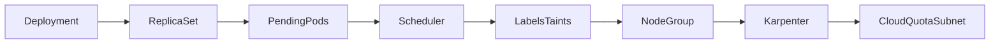
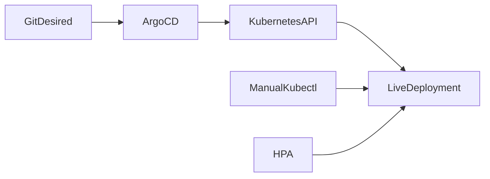
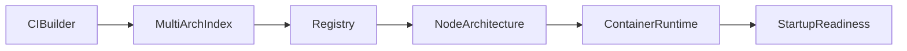
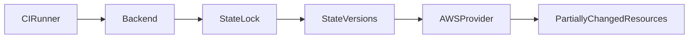
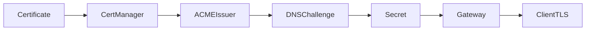
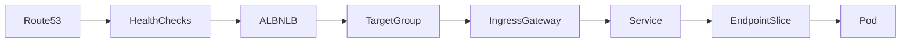
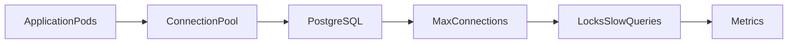
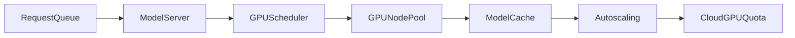

# Production Simulator

For each fictional exercise, stop after **Investigation Timeline**, write three ranked hypotheses and the next falsifying query, then reveal the answer. Architectures and evidence are illustrative.

# Scenario 1: Pending Pods in One Availability Zone

## Business Impact

Checkout capacity falls 35% in eu-west-1a; existing Pods serve but the rollout cannot replace replicas.

## Architecture

## Initial Symptoms

At 10:04 the deployment reports 6/12 available. Only new Pods requesting zone a and an application toleration remain Pending.

## Available Evidence

Events say 0/18 nodes available: required node affinity and untolerated dedicated taint; Karpenter logs InsufficientFreeAddressesInSubnet and EC2 quota is near limit.

## Investigation Timeline

10:06 describe one Pod; 10:09 compare schedulable nodes; 10:13 inspect affinity/taints; 10:17 check Karpenter NodeClaims; 10:21 confirm subnet IP and quota. Stop before the answer and rank these constraints.

### Stop here

> Rank hypotheses, name the next query, and state what evidence would falsify the leading hypothesis.

## Root Cause

A topology rule pinned Pods to a tainted group whose subnet lacked addresses; Karpenter could not satisfy the request.

## Immediate Mitigation

Pause rollout and relax the erroneous required affinity to another healthy AZ after confirming data locality.

## Permanent Fix

Expand/IP-plan worker subnets and encode feasible topology/taint tests in admission and pre-production scheduling.

## Prevention

Expand/IP-plan worker subnets and encode feasible topology/taint tests in admission and pre-production scheduling.

## SLO and Alert Improvements

Alert on unschedulable duration by reason and free subnet IPs; add rollout available-replica burn, not raw Pending count.

## Interview Discussion

Distinguish the reversible mitigation from repair and prevention. Explain which evidence narrowed the failure domain without destroying it.

## What Would a Staff Engineer Change?

Build a capacity dependency map joining scheduler reasons, autoscaler decisions, EC2 quotas and IPAM; assign one owner for the end-to-end capacity SLO.

# Scenario 2: Argo CD Drift from a Manual Change

## Business Impact

Payments are healthy, but Argo continually reports OutOfSync and replica count oscillates during peak traffic.

## Architecture

## Initial Symptoms

The desired Deployment says replicas: 4; live alternates between 4 and 18 every reconciliation interval.

## Available Evidence

Argo diff shows /spec/replicas; audit logs identify an emergency kubectl scale; managedFields shows HPA owns replicas while Git still declares it.

## Investigation Timeline

14:02 inspect diff; 14:05 inspect managedFields; 14:08 check HPA events; 14:11 query audit principal; 14:16 suspend auto-sync while ownership is agreed. Form a hypothesis before reading root cause.

### Stop here

> Rank hypotheses, name the next query, and state what evidence would falsify the leading hypothesis.

## Root Cause

Three actors claimed replicas: Git, HPA and a manual patch. Argo restored four after every HPA update.

## Immediate Mitigation

Remove replicas from Git-controlled manifest, restore HPA target, annotate/record the break-glass action, then re-enable sync.

## Permanent Fix

Define field ownership, ignore differences only for fields intentionally owned elsewhere, and expire break-glass access.

## Prevention

Define field ownership, ignore differences only for fields intentionally owned elsewhere, and expire break-glass access.

## SLO and Alert Improvements

Alert on repeated sync transitions and high apply frequency; exclude expected HPA diff from drift SLO after ownership is encoded.

## Interview Discussion

Distinguish the reversible mitigation from repair and prevention. Explain which evidence narrowed the failure domain without destroying it.

## What Would a Staff Engineer Change?

Create policy tests that reject Git manifests claiming autoscaled fields and dashboard managedFields conflicts by controller.

# Scenario 3: Bad Container Image in Production

## Business Impact

The canary never becomes ready on Graviton nodes while the same digest works on x86 nodes.

## Architecture

## Initial Symptoms

Pods on arm64 report exec format error; x86 Pods start. Registry tag looks correct and signature verification passes.

## Available Evidence

crane manifest shows the index points both platforms to an amd64 manifest; kubelet event and runtime log record image platform mismatch.

## Investigation Timeline

09:31 group failures by node architecture; 09:34 inspect image index; 09:38 compare child digests; 09:43 reproduce with an arm64 runner; 09:47 abort canary. State your hypothesis first.

### Stop here

> Rank hypotheses, name the next query, and state what evidence would falsify the leading hypothesis.

## Root Cause

The build job mislabeled an amd64 image as arm64; signing proved origin/integrity, not compatibility.

## Immediate Mitigation

Abort traffic and restore the prior multi-architecture index digest; quarantine the faulty digest.

## Permanent Fix

Run architecture-native startup tests, verify index platform metadata and sign attestations that include builder/platform evidence.

## Prevention

Run architecture-native startup tests, verify index platform metadata and sign attestations that include builder/platform evidence.

## SLO and Alert Improvements

Add readiness-by-architecture and image pull/start error alerts; rollout analysis must require success on every scheduled architecture.

## Interview Discussion

Distinguish the reversible mitigation from repair and prevention. Explain which evidence narrowed the failure domain without destroying it.

## What Would a Staff Engineer Change?

Make platform compatibility a promotion contract with test inventory tied to node classes, rather than trusting registry labels.

# Scenario 4: Terraform State Lock

## Business Impact

A production network fix cannot plan; Terraform reports a lock, and AWS shows half of yesterday’s route changes.

## Architecture

## Initial Symptoms

No active pipeline is visible, but the lock owner identifies yesterday’s cancelled runner and state serial advanced once.

## Available Evidence

Backend object history, CI termination timestamp, CloudTrail route calls and terraform state show which resources changed before cancellation.

## Investigation Timeline

11:02 verify no writer; 11:06 read lock metadata; 11:10 preserve state versions; 11:15 compare CloudTrail and state; 11:22 run refresh-only plan. Decide whether force-unlock is safe.

### Stop here

> Rank hypotheses, name the next query, and state what evidence would falsify the leading hypothesis.

## Root Cause

A cancelled apply left a stale lock after AWS accepted some calls; infrastructure and recorded mapping partially converged.

## Immediate Mitigation

After proving the writer is dead, force-unlock with peer approval, refresh-only plan, import/reconcile missing mappings, then plan the minimal route repair.

## Permanent Fix

Use non-cancellable apply sections, backend versioning, lock-owner telemetry and a documented partial-apply playbook.

## Prevention

Use non-cancellable apply sections, backend versioning, lock-owner telemetry and a documented partial-apply playbook.

## SLO and Alert Improvements

Alert on lock age beyond apply p99 and abandoned runners; track partial apply and state-version recovery exercises.

## Interview Discussion

Distinguish the reversible mitigation from repair and prevention. Explain which evidence narrowed the failure domain without destroying it.

## What Would a Staff Engineer Change?

Require incident tooling to join lock ID, CI job, state serial and CloudTrail calls; never present force-unlock as the default fix.

# Scenario 5: Certificate Renewal

## Business Impact

TLS expiry is four days away for one wildcard domain; existing clients still succeed and other domains renew normally.

## Architecture

## Initial Symptoms

Certificate Ready remains true from the old Secret, while RenewalTime passed and new CertificateRequest is pending.

## Available Evidence

Challenge reports DNS provider AccessDenied; audit shows solver role policy lost the hosted-zone ARN during account migration.

## Investigation Timeline

08:00 inspect Certificate conditions; 08:04 follow CertificateRequest/Order/Challenge; 08:09 query authoritative TXT; 08:13 inspect solver identity denial; 08:18 calculate expiry margin. Form a cause before root cause.

### Stop here

> Rank hypotheses, name the next query, and state what evidence would falsify the leading hypothesis.

## Root Cause

The DNS01 solver role no longer authorized the domain’s hosted zone, so ACME validation never observed its TXT record.

## Immediate Mitigation

Restore narrowly scoped zone permission, re-trigger challenge, confirm new Secret resourceVersion and test SNI from outside.

## Permanent Fix

Continuously run synthetic issuance per issuer/account, validate IAM in migration tests and alert well before the final renewal retry window.

## Prevention

Continuously run synthetic issuance per issuer/account, validate IAM in migration tests and alert well before the final renewal retry window.

## SLO and Alert Improvements

Use renewal-stuck duration and days-to-expiry per issuer; page at a threshold derived from retry/approval time, not at expiration.

## Interview Discussion

Distinguish the reversible mitigation from repair and prevention. Explain which evidence narrowed the failure domain without destroying it.

## What Would a Staff Engineer Change?

Own certificates as a chain—issuer, identity, DNS, Secret and listener—with a freeze-safe emergency issuance drill.

# Scenario 6: DNS or Load Balancer Failure

## Business Impact

One hostname returns intermittent 502s; direct Pod requests succeed and DNS answers differ by resolver region.

## Architecture

## Initial Symptoms

Corporate resolvers sometimes return the old ALB, while public resolvers return the new weighted target. The old target group has no healthy endpoints.

## Available Evidence

Route 53 has two weighted records with a long TTL and health evaluation disabled on the old record; ALB access logs correlate every 502 with that DNS answer.

## Investigation Timeline

16:41 capture client resolver/answer; 16:45 compare authoritative response; 16:50 map ALB names to target health; 16:55 trace Service/EndpointSlice; 17:01 inspect TTL and weighted policy. Pause and rank DNS versus backend causes.

### Stop here

> Rank hypotheses, name the next query, and state what evidence would falsify the leading hypothesis.

## Root Cause

Migration left an unhealthy old ALB eligible for 20% of answers, and caching extended exposure.

## Immediate Mitigation

Set old record weight to zero/delete after confirming new regional capacity; invalidate internal resolver cache only where controlled.

## Permanent Fix

Use evaluate-target-health, bounded migration TTL, pre-shift target validation and synthetic probes that record resolved target.

## Prevention

Use evaluate-target-health, bounded migration TTL, pre-shift target validation and synthetic probes that record resolved target.

## SLO and Alert Improvements

Alert on per-ALB 5xx and DNS answer distribution; define edge SLO from external resolution through a real request.

## Interview Discussion

Distinguish the reversible mitigation from repair and prevention. Explain which evidence narrowed the failure domain without destroying it.

## What Would a Staff Engineer Change?

Create automated traffic-shift gates that bind a DNS target to load-balancer and EndpointSlice health, plus explicit failback steps.

# Scenario 7: Database Connection Exhaustion

## Business Impact

API p99 rises to 12 seconds after scaling from 20 to 80 Pods; PostgreSQL CPU remains moderate but requests time out.

## Architecture

## Initial Symptoms

New Pods each open a pool of 20 connections. Database rejects connections and many accepted sessions wait on one migration lock.

## Available Evidence

pg_stat_activity reaches max_connections; pool wait grows; pg_locks identifies an AccessExclusiveLock held by a long transaction from migration job.

## Investigation Timeline

13:20 stop autoscaling; 13:23 inspect pool acquisition; 13:27 count sessions by application_name; 13:31 build lock tree; 13:36 identify transaction owner. Decide what can be safely cancelled.

### Stop here

> Rank hypotheses, name the next query, and state what evidence would falsify the leading hypothesis.

## Root Cause

Horizontal scaling multiplied pool limits beyond the database budget while a long migration reduced useful concurrency.

## Immediate Mitigation

Stop new replica growth, cancel the confirmed blocking migration with owner approval, lower pool caps and preserve admin connections.

## Permanent Fix

Allocate a global connection budget via PgBouncer, set transaction/lock timeouts and test migrations under production concurrency.

## Prevention

Allocate a global connection budget via PgBouncer, set transaction/lock timeouts and test migrations under production concurrency.

## SLO and Alert Improvements

Page on pool wait and connection utilization plus blocked-transaction age; latency SLO analysis should separate pool, lock and query time.

## Interview Discussion

Distinguish the reversible mitigation from repair and prevention. Explain which evidence narrowed the failure domain without destroying it.

## What Would a Staff Engineer Change?

Make connection capacity a platform contract linked to replica autoscaling and deploy admission, not an application-local default.

# Scenario 8: GPU Exhaustion

## Business Impact

LLM p99 doubles with flat request rate; queue depth climbs while GPU utilization averages only 45%.

## Architecture

## Initial Symptoms

Large-model requests reject with OOM; small models work. New replicas remain Pending despite autoscaler demand.

## Available Evidence

Per-process GPU memory shows fragmentation and duplicate model caches; scheduler requests a GPU class at account quota; node launch is denied.

## Investigation Timeline

19:04 split latency by model; 19:08 inspect queue/batch; 19:12 inspect GPU memory and processes; 19:17 describe Pending Pods; 19:21 inspect Karpenter and quota. Form hypotheses before root cause.

### Stop here

> Rank hypotheses, name the next query, and state what evidence would falsify the leading hypothesis.

## Root Cause

A model rollout duplicated caches, fragmented GPU memory and requested a GPU class whose quota had no headroom; utilization hid memory saturation.

## Immediate Mitigation

Abort the new model revision, drain its queue with rejection guidance, consolidate old workers and route eligible requests to the smaller model.

## Permanent Fix

Canary model memory profiles, quota/headroom checks, cache-aware placement and admission based on GPU memory/queue—not average compute utilization.

## Prevention

Canary model memory profiles, quota/headroom checks, cache-aware placement and admission based on GPU memory/queue—not average compute utilization.

## SLO and Alert Improvements

Alert on queue latency, rejection, GPU memory and Pending GPU reason; retain TTFT/p99 per model revision and batch size.

## Interview Discussion

Distinguish the reversible mitigation from repair and prevention. Explain which evidence narrowed the failure domain without destroying it.

## What Would a Staff Engineer Change?

Establish model capacity envelopes and a degradation policy jointly owned by ML, platform and product before accepting a revision.
