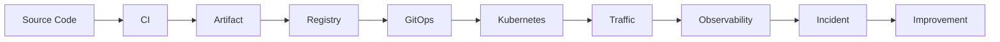

# Interview Dashboard

## Today’s Study Topic

Open [Kubernetes in One Page](kubernetes/01-kubernetes-in-one-page.md), explain its control loop aloud, then answer its recall check.

## Seven-Day Plan

Use the [complete seven-day plan](02-seven-day-study-plan.md): delivery, Kubernetes, AWS/IaC, reliability, AI, design, then rehearsal.

## Fast Links

[Kubernetes](kubernetes/index.md) · [CI/CD](cicd/index.md) · [IaC](iac/index.md) · [AWS](aws/index.md) · [Observability](observability/index.md) · [AI platform](ai-platform/index.md) · [Platform engineering](platform-engineering/index.md)

## 30 Minutes Available

1. Read one 30-second answer and redraw its diagram.
2. Diagnose one failure-mode row without looking.
3. Record a two-minute experience answer.

## 2 Hours Available

Read the [Core Path — End-to-End Platform](core-path/index.md), redraw its master diagram, and rehearse its 60-second explanation.

As an optional deeper exercise, read three linked notes, complete one [system-design question](interview/08-system-design-scenarios.md), and run one [production simulator](../simulator/index.md). End by writing the trade-off you would defend.

## Interview Questions by Topic

Use the [study question index](interview/index.md) or the [full companion](../interview/index.md). Focus on Kubernetes request flow, immutable promotion, Terraform state boundaries, EKS upgrades, SLOs, and GPU saturation.

## Production Scenarios

Start with Pending Pods, GitOps drift, bad images, state locks, certificates, DNS, database pools, or GPU exhaustion in the [simulator](../simulator/index.md).

## Personal Experience Prompts

* Which incident changed a platform default?
* When did you choose a simpler tool despite feature pressure?
* Which migration reduced blast radius, and how did you measure it?
