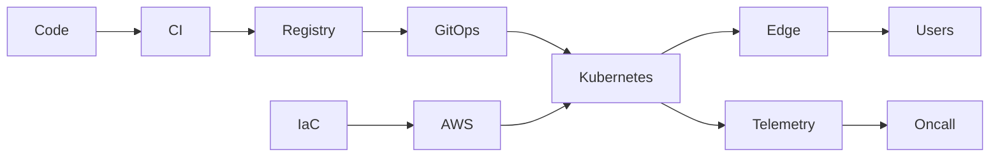

# Platform System Map

## 30-Second Answer
A production platform is a chain of independently observable contracts, not one deployment tool.

Follow each edge by asking who authenticates, where state persists, how retries work, and what proves user impact. See the [architecture library](../architecture/index.md) and [dashboard](00-interview-dashboard.md).
