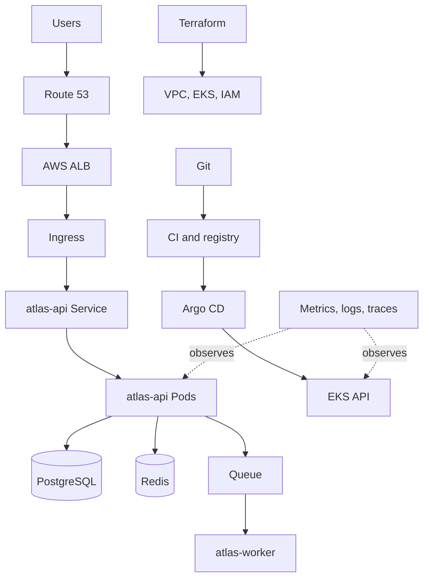
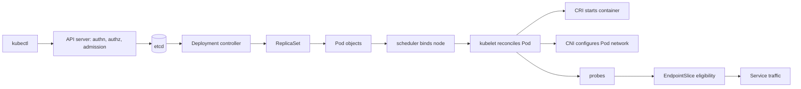
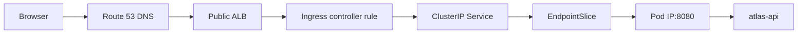
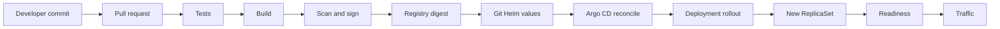
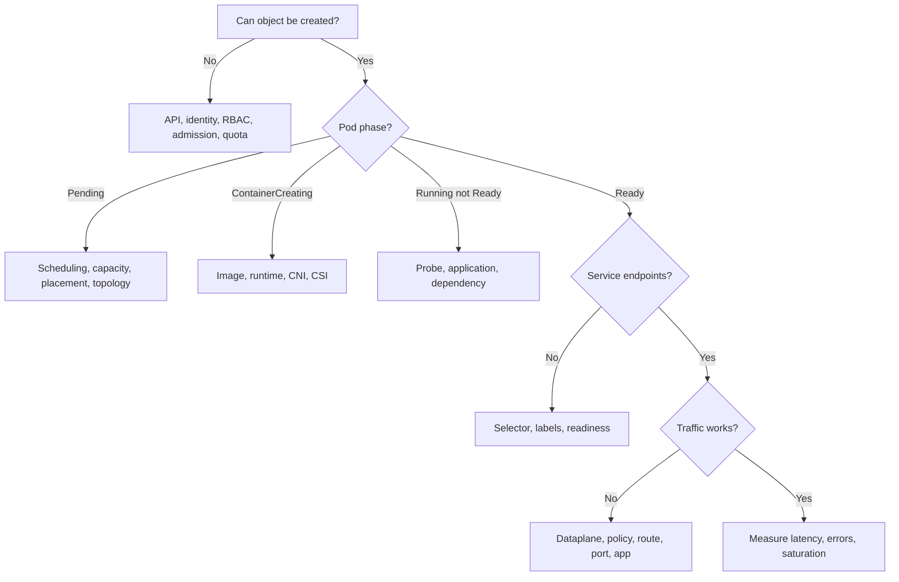

# Production Platform Interview Scenario

Atlas is one customer-facing API on AWS/EKS. This guide deliberately reuses it for every day: the goal is not another encyclopedia, but a production story you can redraw, diagnose, and explain aloud. Follow links only when a concept needs a deeper second pass.

## How to Use This Scenario

Read one day, close the page, draw the objects and arrows, then narrate a failure from evidence to mitigation. On every arrow ask:

```text
What object owns this?
Which component acts next?
Where is desired state stored?
Where does traffic flow?
What evidence would prove each stage?
What breaks if this component fails?
```



The fixed vocabulary is `atlas-prod`, `atlas-api`, `atlas-worker`, and node classes `general`, `compute`, and `gpu`. For the broader map, see the [Core Path](core-path/index.md); for Kubernetes detail, see the [Kubernetes refresh](kubernetes/00-kubernetes-interview-refresh.md).

# Day 1 — Kubernetes: Deploy Atlas

Atlas begins with three API replicas. Keep manifests concise enough to reconstruct, but realistic enough to reason about.

```yaml
apiVersion: v1
kind: Namespace
metadata:
  name: atlas-prod
  labels: {environment: production}
---
apiVersion: v1
kind: ConfigMap
metadata: {name: atlas-api-config, namespace: atlas-prod}
data:
  LOG_LEVEL: info
  CACHE_HOST: atlas-redis.atlas-prod.svc.cluster.local
---
apiVersion: v1
kind: ServiceAccount
metadata:
  name: atlas-api
  namespace: atlas-prod
  annotations:
    eks.amazonaws.com/role-arn: arn:aws:iam::123456789012:role/atlas-api-prod
```

The ConfigMap holds non-secret configuration. A separately managed Secret named `atlas-api-secrets` supplies `DATABASE_URL`; Git should not contain its plaintext value. The ServiceAccount is workload identity, not authorization by itself: Kubernetes RBAC controls API actions, while its mapped IAM role controls AWS actions.

```yaml
apiVersion: apps/v1
kind: Deployment
metadata: {name: atlas-api, namespace: atlas-prod}
spec:
  replicas: 3
  selector:
    matchLabels: {app: atlas-api}
  template:
    metadata:
      labels: {app: atlas-api, environment: production, tier: backend}
      annotations: {prometheus.io/scrape: "true"}
    spec:
      serviceAccountName: atlas-api
      containers:
        - name: api
          image: registry.example.net/atlas-api@sha256:8d3a...
          envFrom:
            - configMapRef: {name: atlas-api-config}
            - secretRef: {name: atlas-api-secrets}
          resources:
            requests: {cpu: 500m, memory: 512Mi}
            limits: {cpu: "1", memory: 1Gi}
          startupProbe:
            httpGet: {path: /startup, port: 8080}
            periodSeconds: 5
            failureThreshold: 12
          readinessProbe:
            httpGet: {path: /ready, port: 8080}
            periodSeconds: 5
          livenessProbe:
            httpGet: {path: /live, port: 8080}
            periodSeconds: 10
```

### What happens after apply

After `kubectl apply -f atlas-api.yaml`, `kubectl` sends authenticated credentials and the object to the API server. Authentication establishes identity; authorization (usually RBAC) permits the verb; mutating/validating admission and quota policy evaluate it. The API server persists accepted desired state in etcd.



The Deployment controller creates a ReplicaSet with an owner reference; that ReplicaSet owns Pod objects. The scheduler chooses feasible placement and records a binding—it does **not** start containers. The node's kubelet sees the assigned Pod, asks the runtime through CRI to pull/start it, invokes CNI integration for networking, and performs probes. Once Ready, the EndpointSlice controller records the eligible backend; the Service dataplane can forward traffic. Controllers continually compare observed state with API desired state.

### Labels and selectors

**Labels describe. Selectors choose.** `app` groups Atlas API objects, `environment` scopes policy/operations, and `tier` separates backend behavior. The immutable Deployment selector must match its Pod-template labels. The Service independently selects Pods:

```yaml
apiVersion: v1
kind: Service
metadata: {name: atlas-api, namespace: atlas-prod}
spec:
  selector: {app: atlas-api}
  ports: [{name: http, port: 80, targetPort: 8080}]
```

Intentional incident: the Service selector is `app: atlas`, but Pods say `app: atlas-api`. Pods remain Running; the Service has no backends because selection is empty.

> Why does the Service have no endpoints even though Pods are Running?

```bash
kubectl -n atlas-prod get pods --show-labels
kubectl -n atlas-prod get svc atlas-api -o yaml
kubectl -n atlas-prod get endpointslices -l kubernetes.io/service-name=atlas-api -o wide
```

Compare the actual labels to the selector, then confirm EndpointSlices after correcting it. Running describes process state; Ready controls normal Service traffic eligibility.

### Requests and limits

**Requests schedule. Limits constrain.** Atlas requests `500m/512Mi`; the scheduler accounts for requests, not momentary usage. Under a traffic spike, the 1-CPU limit can cause cgroup CPU throttling: latency rises while the container survives. If its cgroup exceeds 1 GiB, the kernel can kill a process and Kubernetes reports `OOMKilled`; the restart policy may restart it.

That differs from node pressure. Suppose image garbage and other workloads leave a general node short of memory or ephemeral storage. Kubelet may evict a Pod to protect the node, based partly on QoS and usage. Evidence for a container OOM includes `lastState.terminated.reason: OOMKilled`; eviction appears as Pod `reason: Evicted`, events, and node pressure conditions. An OOM is a container/cgroup boundary; an eviction is node-local resource management. Inspect `kubectl describe pod`, `kubectl get pod -o yaml`, metrics, and `kubectl describe node` before changing limits.

### Probes

Atlas takes 40 seconds to load configuration and warm Redis caches. **Startup protects initialization. Readiness controls traffic. Liveness controls restart.** The startup probe suppresses readiness and liveness until startup succeeds, avoiding premature restarts.

Scenario one: the process is Running, but its database pool is exhausted and `/ready` returns 503. The Pod is removed from eligible Service endpoints and receives no normal Service traffic; readiness failure alone does not restart it. Scenario two: an internal event loop deadlocks and `/live` repeatedly fails beyond its threshold; kubelet restarts that container.

Do not make liveness a direct PostgreSQL health check. A database outage would make every Atlas replica restart, discard local diagnostic state, add reconnection load, and create a restart storm although the API processes are healthy. Liveness should establish whether this process can recover only by restart; readiness may conservatively express whether it can serve.

### Taints, tolerations, and placement

Atlas workers run CPU-heavy report jobs. Compute nodes carry label `node-class=compute` and taint `workload=compute:NoSchedule`.

```yaml
spec:
  template:
    spec:
      nodeSelector: {node-class: compute}
      tolerations:
        - {key: workload, operator: Equal, value: compute, effect: NoSchedule}
```

**A toleration does not force a Pod onto a node.** It only permits passage through that repulsion. `nodeSelector` or required node affinity constrains placement; preferred affinity scores matching nodes without making them mandatory. Pod anti-affinity separates replicas relative to other Pods. Topology spread distributes a group across topology domains.

```text
label → describes; selector → requires matching description
taint → node repels; toleration → Pod is allowed through
affinity → attract; anti-affinity → separate
topology spread → distribute
```

For `atlas-api`, prefer `general` nodes and spread across `eu-west-1a`, `eu-west-1b`, and `eu-west-1c`:

```yaml
affinity:
  nodeAffinity:
    preferredDuringSchedulingIgnoredDuringExecution:
      - weight: 100
        preference:
          matchExpressions: [{key: node-class, operator: In, values: [general]}]
  podAntiAffinity:
    preferredDuringSchedulingIgnoredDuringExecution:
      - weight: 80
        podAffinityTerm:
          labelSelector: {matchLabels: {app: atlas-api}}
          topologyKey: kubernetes.io/hostname
topologySpreadConstraints:
  - maxSkew: 1
    topologyKey: topology.kubernetes.io/zone
    whenUnsatisfiable: DoNotSchedule
    labelSelector: {matchLabels: {app: atlas-api}}
```

### Pending Pod incident

Atlas desires four replicas; three run and one remains Pending. `kubectl describe pod` reports `0/6 nodes are available: 2 Insufficient cpu, 2 node(s) had untolerated taint {workload: compute}, 2 node(s) didn't match Pod's node affinity`. Now ask which constraint is intentional and whether any node is both feasible and capacious.

```bash
kubectl -n atlas-prod describe pod atlas-api-...
kubectl get nodes -L node-class,topology.kubernetes.io/zone
kubectl describe node ip-10-0-21-17.eu-west-1.compute.internal
kubectl -n atlas-prod get events --sort-by=.lastTimestamp
```

`FailedScheduling` can also identify an unavailable `nvidia.com/gpu`, a PV/node zone conflict, or insufficient resources. If node autoscaling creates no capacity, inspect the provisioner/Cluster Autoscaler logs and constraints: maximum group size, unsupported instance requirements, subnet IPs, quotas, or cloud capacity. Do not label every Pending Pod “a scheduler bug.”

ResourceQuota is separate: if creating the fourth Pod would exceed namespace quota, admission rejects the ReplicaSet controller's API request. No Pod object exists to receive a scheduler event. Inspect ReplicaSet events and quota usage. Deep dive: [scheduling and capacity](kubernetes/04-scheduling-and-capacity.md).

# Day 2 — Networking, Traffic and AWS/EKS

Atlas now serves `api.atlas.example`. The request path is:



Route 53 maps the hostname to the load balancer; it does not route packets inside Kubernetes. The ALB lives across public subnets with internet routing, while EKS nodes and PostgreSQL normally live in private subnets with controlled egress. At a high level, ALB is HTTP-aware and works well for host/path routing; NLB provides high-performance layer-4 forwarding. The installed AWS Load Balancer Controller interprets Ingress resources and configures AWS—not the inert Ingress object alone.

`ClusterIP` exposes a stable virtual address inside the cluster. `NodePort` exposes a port on nodes; `LoadBalancer` asks cloud integration for an external load balancer. Atlas uses Ingress plus a ClusterIP Service. CNI assigns/routs Pod addresses. CoreDNS answers Kubernetes service discovery and forwards external lookups. EndpointSlices describe backends; kube-proxy programming (iptables/IPVS) or an eBPF dataplane performs forwarding. The controller recording endpoints and the dataplane forwarding packets are distinct responsibilities.

NetworkPolicy is an allow-list only when the selected traffic direction is enforced by the installed CNI. Atlas permits ingress from the ingress controller and egress to DNS, PostgreSQL, Redis, and required AWS endpoints; test the actual plugin behavior rather than assuming the YAML is enforced.

### Ingress returns 503 while Pods are Running

Work outside-in, recording status and timestamps at every boundary:

1. Resolve `api.atlas.example`; confirm expected ALB name/address and no stale DNS.
2. `curl -vk` the public URL; distinguish TLS, timeout, routing, and backend 503.
3. Inspect ALB target health and controller events/logs. Is the target mode node or Pod IP, and can security groups reach it?
4. `kubectl -n atlas-prod describe ingress atlas-api` and verify host/path, class, controller, and backend port.
5. Inspect Service selector/port/targetPort and EndpointSlices. A Running-but-unready Pod may be absent or marked not ready.
6. From an allowed debug context, call the ClusterIP and then a Pod IP. Check NetworkPolicy, routes/dataplane, and application logs.

The first failing boundary narrows ownership. Avoid starting by restarting Pods; a bad Ingress port cannot be healed by process restarts.

### Internal DNS works; external database DNS fails

`atlas-api` resolves `kubernetes.default` but not `db.atlas.internal`. That proves the Pod can reach CoreDNS and CoreDNS serves cluster records, not that forwarding or the private hosted-zone association works.

```bash
kubectl -n atlas-prod exec deploy/atlas-api -- cat /etc/resolv.conf
kubectl -n atlas-prod exec deploy/atlas-api -- nslookup kubernetes.default.svc.cluster.local
kubectl -n atlas-prod exec deploy/atlas-api -- nslookup db.atlas.internal
kubectl -n kube-system logs deploy/coredns --since=10m
```

Check query name/search suffix, CoreDNS forwarding/configuration, DNS egress policy on UDP/TCP 53, VPC resolver reachability, and association of the Route 53 private hosted zone with the Atlas VPC. Compare from another namespace/node to set blast radius.

### Service resolves; connection times out

DNS success proves only name-to-address resolution. A timeout can follow from no route, security group/NACL, NetworkPolicy, stale dataplane state, wrong port, an application not listening, or silently dropped packets. Confirm `getent hosts`, then connection (`curl -v` or `nc -vz`), endpoints, listener, policies, and flow logs. A refusal suggests a reachable host with no listener; timeout usually suggests dropping or an unresponsive backend, though evidence decides. See [EKS networking](aws/04-eks-production-design.md) and [Kubernetes networking](kubernetes/05-networking-cni-services-ingress.md).

# Day 3 — Rollouts, CI/CD, Helm and GitOps

Atlas releases `v1.8.3 → v1.9.0` through an auditable chain:



CI tests source, builds once, scans the image/SBOM, and pushes immutable digest `sha256:...`. A reviewed Git change updates Atlas Helm values to that digest. Argo CD compares rendered Git intent with Kubernetes live state and applies the difference. The Deployment controller creates a new ReplicaSet because the Pod template changed.

```yaml
strategy:
  type: RollingUpdate
  rollingUpdate:
    maxUnavailable: 0
    maxSurge: 1
```

With three desired replicas, Atlas retains three available old Pods and creates at most one extra. As each new Pod becomes Ready, old replicas scale down until the new ReplicaSet owns all three. `maxUnavailable: 0` protects availability but demands surge capacity and can stall indefinitely on bad readiness.

```bash
kubectl -n atlas-prod rollout status deployment/atlas-api
kubectl -n atlas-prod rollout history deployment/atlas-api
kubectl -n atlas-prod rollout undo deployment/atlas-api
```

Suppose v1.9.0 starts, but `/ready` fails due to an incompatible configuration key. The new Pod is Running but gets no normal Service traffic; the rollout creates no further Pod because surge is exhausted and cannot remove an available old Pod. Deployment conditions/events, ReplicaSet counts, probe events, and application logs show why progress stopped.

A `rollout undo` restores a prior Pod template, not database state, external side effects, queues, or a backwards-incompatible migration. Use expand/contract database migrations and explicit data recovery. In GitOps, also revert Git; a manual cluster undo is drift and Argo CD may restore the broken desired version.

Rolling release is economical and gradual but mixes versions. Blue/green keeps two complete environments and switches traffic, enabling fast application reversal at higher capacity cost. Canary sends a measured fraction to v1.9.0 and evaluates SLO signals. Feature flags decouple deployment from feature exposure but require ownership and cleanup. Never use `latest`: it is mutable, makes rollbacks/audits ambiguous, and may not trigger a Pod-template change.

Helm templates define reusable structure; environment values define Atlas-specific inputs. Argo CD owns Git-to-cluster reconciliation and reports drift. Avoid putting secret plaintext in values: use an external secret manager plus a controller/CSI integration, encrypted secrets with controlled keys, or another reviewed boundary. Helm is rendering/package management, not automatically secret management or continuous delivery. See [GitOps delivery](cicd/05-gitops-continuous-delivery.md) and [Helm release safety](helm/03-chart-testing-and-release-safety.md).

# Day 4 — Scaling, Resilience and Storage

Campaign traffic drives Atlas from 3 to 12 Pods. An HPA might target CPU utilization, but requests must be credible because utilization is usage/request. For Atlas, requests per second or queue latency may better represent demand if an adapter exposes a stable metric.

```yaml
apiVersion: autoscaling/v2
kind: HorizontalPodAutoscaler
metadata: {name: atlas-api, namespace: atlas-prod}
spec:
  scaleTargetRef: {apiVersion: apps/v1, kind: Deployment, name: atlas-api}
  minReplicas: 3
  maxReplicas: 12
  metrics:
    - type: Resource
      resource:
        name: cpu
        target: {type: Utilization, averageUtilization: 65}
```

**HPA scales workloads. Node autoscaling supplies capacity.** HPA writes the Deployment scale target, creating demand for Pods. Cluster Autoscaler expands a compatible node group; Karpenter can select/provision suitable instances for unschedulable Pods. Neither makes an impossible constraint feasible.

Incident: HPA wants 12; 7 fit; 5 are Pending. Is HPA broken? No: verify the HPA metric/desired count, then describe Pending Pods. Check requests, taints/tolerations, affinities, topology, subnet IPs, node-group maximums, cloud quota/capacity, and provisioner logs. HPA did its layer's job; capacity has not satisfied the resulting scheduling demand.

### Drain and graceful termination

A PDB limits simultaneous **voluntary** disruption, not node crashes, OOMs, or every failure:

```yaml
apiVersion: policy/v1
kind: PodDisruptionBudget
metadata: {name: atlas-api, namespace: atlas-prod}
spec:
  minAvailable: 2
  selector: {matchLabels: {app: atlas-api}}
```

During `kubectl drain node`, the node is cordoned and eviction requests respect the PDB. Controllers create replacements elsewhere. On termination, kubelet begins graceful shutdown, runs `preStop` if configured, sends SIGTERM, and waits within `terminationGracePeriodSeconds` before SIGKILL. Atlas should fail readiness, stop accepting work, drain keep-alive/in-flight requests, close resources, and exit. Load-balancer deregistration and endpoint propagation are not instantaneous, so align application draining with infrastructure behavior. A too-strict PDB or no spare capacity can block drain; forcing it trades safety for progress.

### Storage with atlas-worker

`atlas-worker` creates large export files on a volume before uploading them. A PVC requests storage; a matching/provisioned PV represents it; a StorageClass selects the provisioner and parameters. With dynamic provisioning, the external CSI provisioner creates the cloud volume. Controller-side CSI components coordinate creation and, for attachable storage, attachment through an external-attacher and `VolumeAttachment`. On the selected node, the CSI node plugin stages/publishes (mounts) the device into the Pod.

```yaml
apiVersion: v1
kind: PersistentVolumeClaim
metadata: {name: atlas-worker-scratch, namespace: atlas-prod}
spec:
  accessModes: [ReadWriteOnce]
  storageClassName: gp3-wait
  resources: {requests: {storage: 100Gi}}
```

`WaitForFirstConsumer` lets scheduling choose a zone before provisioning. If a replacement lands in `eu-west-1b` but an EBS volume is in `eu-west-1a`, topology prevents attachment/scheduling. If the old node still owns a ReadWriteOnce attachment, the new Pod may show Multi-Attach; inspect Pod events, PVC/PV, `VolumeAttachment`, CSI controller logs, node plugin logs, and EC2 attachment state rather than repeatedly deleting the Pod.

A StatefulSet gives stable ordinal identity and stable PVC association. It does **not** create PostgreSQL replication, backups, leader election, failover correctness, or HA. Keep these separate:

```text
stable identity ≠ data replication ≠ backup ≠ high availability
```

Atlas uses a managed multi-AZ PostgreSQL design with tested backups; a StatefulSet would require an operator or equivalent database control plane and operational expertise. See [storage and CSI](kubernetes/06-storage-and-csi.md).

# Day 5 — Terraform, AWS Infrastructure and Security

Terraform manages the VPC, private/public subnets, EKS, IAM, and supporting AWS resources. Providers translate resource operations; modules package the Atlas network/cluster pattern; variables are inputs and outputs expose controlled attributes.

```hcl
module "eks" {
  source          = "./modules/eks"
  cluster_name    = "atlas-prod"
  private_subnets = module.vpc.private_subnet_ids
  general_min     = 3
  general_max     = 15
}

output "cluster_oidc_issuer" { value = module.eks.oidc_issuer }
```

To increase worker maximum capacity, change `general_max`, run `terraform plan`, review the dependency-aware proposal, then apply through controlled automation. Terraform builds a graph from references and explicit dependencies; it can parallelize safe operations. Lifecycle settings such as `create_before_destroy` can reduce interruption but may require duplicate names/capacity; `prevent_destroy` protects resources but can block intentional replacement; `ignore_changes` can hide meaningful drift and needs narrow justification.

State maps Terraform addresses to provider IDs and stored attributes. Use an encrypted, access-controlled remote backend and supported locking so two applies do not race. State can contain sensitive values. A refresh/plan detects managed-resource drift visible through providers, but state is not a discovery database for every real cloud or Kubernetes object. `import` adopts an existing resource into an address; configuration must still be written and the next plan reviewed.

```text
Terraform: infrastructure desired state
Argo CD: Git → Kubernetes reconciliation
Kubernetes controllers: workload/runtime desired state
```

Terraform knows the EKS node group and IAM role; it does not know that `atlas-api` needs twelve replicas unless intentionally made to manage that workload (which Atlas avoids). Kubernetes knows Pods and scheduling but cannot silently raise an AWS service quota. Argo CD reconciles Git manifests, not VPC routes. Clear ownership prevents competing reconcilers.

### Security boundaries

Atlas Pods run as non-root, drop capabilities, use a read-only root filesystem where possible, and avoid privilege escalation. RBAC grants the `atlas-api` ServiceAccount only required Kubernetes verbs. Workload identity maps its projected service-account identity to `atlas-api-prod`; that IAM role grants only named S3 actions on Atlas prefixes. Secrets originate in a secret manager, are synchronized/mounted under audited controls, and never become non-secret ConfigMap data. NetworkPolicy limits east-west paths. CI scans/signs immutable images; admission policy enforces trusted registries, signatures, required resources, and security context.

### S3 AccessDenied incident

Do not stop at “check IAM.” Follow the credential chain:

```text
Pod → ServiceAccount → projected identity token → workload identity configuration
→ IAM role trust policy → temporary credentials → role policy → S3 resource policy
```

First establish the exact S3 API, bucket/key, request time, and caller identity (`sts:GetCallerIdentity` from the workload without printing credentials). Confirm the Pod uses ServiceAccount `atlas-api`, the annotation/mapping points at the intended role, the token audience/issuer and IAM trust conditions match, and no stale static AWS credentials override the provider chain. Then evaluate role identity policies, permissions boundaries, session/SCP constraints, KMS permissions for encrypted objects, VPC endpoint policy, and bucket/resource policy including explicit denies. CloudTrail supplies the evaluated principal and action. Fix the narrow failing permission and verify the application operation, not merely STS. Deep dives: [IAM/workload identity](aws/03-iam-and-workload-identity.md) and [Terraform state](iac/02-terraform-state-and-backends.md).

# Day 6 — Observability, SRE and Production Incident

Atlas defines an SLI as the proportion of valid API requests that complete successfully under 500 ms, measured at the user-facing boundary. Its SLO is 99.9% over 30 days; the 0.1% error budget permits roughly one bad request per thousand under the exact indicator definition. An SLA is a contractual promise and consequence, often looser/differently measured.

**SLI measures. SLO targets. SLA promises.** A dashboard supports exploration; an alert should demand timely action. Burn-rate alerts detect unusually fast error-budget consumption across short and long windows rather than paging for every isolated 500.

Use RED for Atlas requests: rate, errors, duration. Golden signals add saturation. Use USE for resources: utilization, saturation, errors on CPU, memory, node network, disk, connection pools, and queue consumers. Metrics quantify patterns, logs explain discrete events, and traces connect latency across API, Redis, PostgreSQL, and queue boundaries. Join them with stable deployment revision, namespace, Pod, node, zone, and trace identifiers.

Avoid unbounded Prometheus labels such as customer ID, URL query, or trace ID; each label combination creates a time series and can exhaust monitoring resources. Put high-cardinality detail in logs/traces. Retain low-cardinality route templates and status classes in metrics.

### Integrated outage

```text
14:02 v1.9.0 rollout begins
14:05 p95 latency rises; PostgreSQL pool wait rises
14:07 new-Pod readiness failures increase
14:09 available replicas fall as one old Pod is manually removed
14:10 fast-burn 5xx alert fires
```

Do not reflexively rollback before understanding whether rollback is safe and causally relevant. Use this senior incident loop:

1. **Define symptom:** external 5xx and latency, exact SLI window and onset.
2. **Establish blast radius:** routes, customers, zones, versions, internal versus external callers.
3. **Check recent changes:** v1.9.0, config, database, traffic, infrastructure—not only deploys.
4. **Follow request path:** Route 53 → ALB → Ingress → Service → EndpointSlice → Pod → PostgreSQL.
5. **Locate failing boundary:** compare ALB/backend errors, per-version metrics, readiness, traces, and pool wait.
6. **Form a hypothesis:** v1.9.0 opens twice as many database connections during warm-up, exhausting PostgreSQL slots.
7. **Collect evidence:** rollout/ReplicaSet events, version-labelled RED metrics, readiness responses, application logs, traces, DB connections and saturation. Seek disconfirming evidence.
8. **Mitigate:** pause/revert Git rollout if backwards-compatible, preserve healthy v1.8.3 replicas, cap concurrency, or restore DB headroom. App rollback does not reverse data changes.
9. **Verify recovery:** SLI/error-budget burn, available endpoints, pool wait, queue depth, and all affected routes recover for a meaningful window.
10. **Prevent recurrence:** connection-budget load test, bounded pools, canary analysis, safer surge behavior, capacity alert, and runbook ownership.

Conceptual Prometheus evidence includes request rate and `5xx` ratio by low-cardinality route/revision; latency histograms; `kube_deployment_status_replicas_available`; readiness; container restarts/OOM; CPU throttling; working set; Pending Pods; node pressure; DB active/max connections; pool wait; and queue depth/age. Kubernetes events explain scheduling/probe transitions, logs explain application decisions, metrics establish time/blast radius, and traces locate distributed delay. Clock alignment and deployment annotations make correlation credible. See [SLOs and error budgets](observability/04-alerting-slos-and-error-budgets.md).

# Day 7 — System Design, Failure Domains and Senior-Level Reasoning

> Atlas must support 10× traffic and survive infrastructure failures. What changes?

Start with requirements and measurements rather than drawing products. Define peak/steady request mix, stateful dependencies, SLO, consistency, RTO/RPO, budget, and team capacity. Load-test representative behavior and size from bottlenecks with safety margin.

Across `eu-west-1a/b/c`, distribute stateless `atlas-api` replicas with topology spread and enough spare capacity to lose a zone. Run load balancing across healthy targets and confirm subnet/IP capacity. PostgreSQL needs cross-AZ synchronous/managed HA, connection pooling, failover rehearsals, backups, point-in-time recovery, and restore tests. HA reduces downtime; backups recover corruption/deletion. Redis requires an explicit choice: disposable cache with bounded stampede protection, or replicated persistent state with different recovery semantics.

Queues buffer bursts and decouple API latency from `atlas-worker`, but add backlog age, duplicate delivery, poison messages, and capacity questions. Consumers must be idempotent. Apply per-tenant/global rate limits and load shedding. Bound every timeout to the caller's deadline. Retry only transient/idempotent operations, with capped exponential backoff and jitter; retries without budgets amplify an outage. Circuit breakers stop repeatedly calling a failing dependency. Graceful degradation might serve cached catalog data while disabling exports.

Capacity planning connects forecast traffic × measured cost per request to Pod, node, DB connection, subnet IP, and quota requirements. Validate HPA reaction time, cold-start delay, zone loss, and queue drain rate. Record which resource saturates first and how much headroom remains.

RTO is the acceptable restoration duration; RPO is acceptable data loss measured in time. A second region can reduce regional-disaster RTO but adds data replication, consistency, traffic steering, secret/certificate, observability, testing, cost, and operator complexity. Active-active is not automatically better than warm standby. Choose regional DR only if business requirements justify it, define authority during failover/failback, and rehearse restoration. Untested backups and diagrams are not recovery capability.

### Optional GPU / AI extension

`atlas-inference` performs GPU-backed recommendations. GPU nodes carry `node-class=gpu`, taint `accelerator=nvidia:NoSchedule`, and the device plugin advertises `nvidia.com/gpu`. The Pod requests one extended resource, tolerates the taint, and requires GPU affinity; toleration alone does not place it. A GPU-aware provisioner must find supported instance types, quotas, subnet capacity, and drivers.

```yaml
resources:
  limits: {nvidia.com/gpu: 1, memory: 16Gi}
nodeSelector: {node-class: gpu}
tolerations:
  - {key: accelerator, operator: Equal, value: nvidia, effect: NoSchedule}
```

Model download/initialization can take minutes, so startup permits model load and readiness succeeds only after the selected model revision is resident and a test inference works. Liveness tests the server, not an external model store. Observe request/queue latency, queue depth/age, batch size, throughput, errors, model revision, GPU utilization and memory, throttling/temperature, and cold starts. CPU-based HPA misses GPU/queue saturation; scale from queue or concurrency while accounting for long provisioning and expensive idle capacity. Batching improves throughput but can harm tail latency. Keep a small warm floor only if its SLO value exceeds cost. See the [GPU scheduling deep dive](ai-platform/02-gpu-nodes-and-scheduling.md).

# End-to-end manifest reconstruction exercise

Rebuild this from memory: namespace/configuration/identity, workload/placement/health, stable discovery, scaling/disruption, edge, and network boundary. Secrets and the referenced TLS certificate are intentionally supplied by separate controlled systems.

```yaml
apiVersion: v1
kind: Namespace
metadata: {name: atlas-prod}
---
apiVersion: v1
kind: ConfigMap
metadata: {name: atlas-api-config, namespace: atlas-prod}
data: {LOG_LEVEL: info}
---
apiVersion: v1
kind: ServiceAccount
metadata:
  name: atlas-api
  namespace: atlas-prod
  annotations: {eks.amazonaws.com/role-arn: arn:aws:iam::123456789012:role/atlas-api-prod}
---
apiVersion: apps/v1
kind: Deployment
metadata: {name: atlas-api, namespace: atlas-prod, annotations: {owner: platform}}
spec:
  replicas: 3
  selector: {matchLabels: {app: atlas-api}}
  strategy: {rollingUpdate: {maxUnavailable: 0, maxSurge: 1}}
  template:
    metadata: {labels: {app: atlas-api, environment: production, tier: backend}}
    spec:
      serviceAccountName: atlas-api
      terminationGracePeriodSeconds: 45
      securityContext: {runAsNonRoot: true, seccompProfile: {type: RuntimeDefault}}
      containers:
        - name: api
          image: registry.example.net/atlas-api@sha256:8d3a...
          ports: [{name: http, containerPort: 8080}]
          envFrom: [{configMapRef: {name: atlas-api-config}}, {secretRef: {name: atlas-api-secrets}}]
          securityContext: {allowPrivilegeEscalation: false, readOnlyRootFilesystem: true, capabilities: {drop: [ALL]}}
          resources: {requests: {cpu: 500m, memory: 512Mi}, limits: {cpu: "1", memory: 1Gi}}
          startupProbe: {httpGet: {path: /startup, port: http}, periodSeconds: 5, failureThreshold: 12}
          readinessProbe: {httpGet: {path: /ready, port: http}, periodSeconds: 5}
          livenessProbe: {httpGet: {path: /live, port: http}, periodSeconds: 10}
      affinity:
        nodeAffinity:
          preferredDuringSchedulingIgnoredDuringExecution:
            - weight: 100
              preference: {matchExpressions: [{key: node-class, operator: In, values: [general]}]}
      tolerations: [{key: workload, operator: Equal, value: general, effect: NoSchedule}]
      topologySpreadConstraints:
        - {maxSkew: 1, topologyKey: topology.kubernetes.io/zone, whenUnsatisfiable: DoNotSchedule, labelSelector: {matchLabels: {app: atlas-api}}}
---
apiVersion: v1
kind: Service
metadata: {name: atlas-api, namespace: atlas-prod}
spec: {selector: {app: atlas-api}, ports: [{name: http, port: 80, targetPort: http}]}
---
apiVersion: autoscaling/v2
kind: HorizontalPodAutoscaler
metadata: {name: atlas-api, namespace: atlas-prod}
spec:
  scaleTargetRef: {apiVersion: apps/v1, kind: Deployment, name: atlas-api}
  minReplicas: 3
  maxReplicas: 12
  metrics: [{type: Resource, resource: {name: cpu, target: {type: Utilization, averageUtilization: 65}}}]
---
apiVersion: policy/v1
kind: PodDisruptionBudget
metadata: {name: atlas-api, namespace: atlas-prod}
spec: {minAvailable: 2, selector: {matchLabels: {app: atlas-api}}}
---
apiVersion: networking.k8s.io/v1
kind: Ingress
metadata: {name: atlas-api, namespace: atlas-prod}
spec:
  ingressClassName: alb
  rules: [{host: api.atlas.example, http: {paths: [{path: /, pathType: Prefix, backend: {service: {name: atlas-api, port: {name: http}}}}]}}]
---
apiVersion: networking.k8s.io/v1
kind: NetworkPolicy
metadata: {name: atlas-api, namespace: atlas-prod}
spec:
  podSelector: {matchLabels: {app: atlas-api}}
  policyTypes: [Ingress, Egress]
  ingress: [{from: [{namespaceSelector: {matchLabels: {kubernetes.io/metadata.name: ingress-system}}}], ports: [{port: 8080}]}]
  egress: [{to: [{namespaceSelector: {matchLabels: {kubernetes.io/metadata.name: atlas-prod}}}]}]
```

On a whiteboard, say which production details are abstracted: Secret delivery, DNS/TLS, exact ALB annotations, database egress, autoscaling behavior, and policy-controller requirements. A compact manifest is a reasoning aid, not a drop-in environment.

# Failure map

Use this before tool roulette. Name the phase, prove the boundary, then inspect the owner.

| Observed state | Likely boundary | First Atlas evidence |
|---|---|---|
| Object cannot be created | API reachability, authentication, RBAC authorization, admission, quota, policy | client error, API audit, controller event, `auth can-i`, quota |
| Pod exists but Pending | scheduler, placement, capacity, topology | Pod `FailedScheduling`, nodes, PVC, provisioner |
| Scheduled but ContainerCreating | image pull, CRI runtime, CNI, CSI | Pod events; kubelet/runtime/CNI/CSI logs |
| Pod Running but not Ready | readiness, application, dependency | probe event/response, app log, dependency saturation |
| Service has no endpoints | labels/selectors/readiness | Service selector, Pod labels, EndpointSlice conditions |
| Service has endpoints but traffic fails | dataplane, NetworkPolicy, route, target port, app | direct Service/Pod tests, policy, listener, dataplane |
| Ingress fails | controller, AWS LB/TLS/rule, Service/backend | DNS/curl, target health, Ingress/controller events |
| Application slow | limits, load, network, database/cache/queue | RED traces plus CPU throttling, pools, dependency USE |
| Node problem | kubelet, runtime, disk, memory, PID, network | node conditions/events and node-level daemon logs |



# Senior interview questions

Answer all 30 aloud. For the starred questions, practice both depths shown afterward.

1. What happens after you apply the Atlas Deployment? ★
2. Which component chooses a node, and which starts the container?
3. Why can an Atlas Pod be Running but unavailable to users? ★
4. How would you troubleshoot a Service with zero endpoints? ★
5. Why do the Deployment and Service use selectors independently?
6. How do you distinguish an OOM kill from node-pressure eviction? ★
7. Why can CPU limits increase Atlas latency without a restart?
8. What is the difference between a taint and node affinity?
9. Why does a toleration not guarantee placement? ★
10. Why might an HPA-created Pod remain Pending? ★
11. Why is ResourceQuota rejection not `FailedScheduling`?
12. What evidence separates DNS failure from network failure?
13. How do you investigate an Ingress 503 outside-in? ★
14. What does EndpointSlice record, and what forwards packets?
15. What evidence says the v1.9.0 rollout is unhealthy? ★
16. What can `rollout undo` not recover?
17. What should a canary monitor before automatic rollback? ★
18. What does Argo CD reconcile that Terraform does not? ★
19. Why are immutable image digests stronger than `latest`?
20. Is HPA broken when only seven of twelve replicas fit?
21. What happens when you drain an Atlas node? ★
22. What does a PDB protect, and what does it not protect?
23. Where does CSI attachment happen versus mounting? ★
24. Why does a StatefulSet not make PostgreSQL highly available?
25. How would you investigate S3 AccessDenied from an EKS Pod? ★
26. What are Atlas's SLI, SLO, SLA, and error budget? ★
27. Which metrics, logs, events, and traces test the outage hypothesis?
28. How would you design Atlas across three AZs? ★
29. How do retries make an outage worse, and how do you bound them?
30. When would regional DR be justified, and how would you prove it works?

### Layered answers for high-value questions

**1 — Apply lifecycle.** **30-second answer:** API server authenticates, authorizes, admits, and persists intent. Deployment creates a ReplicaSet, which creates Pods; scheduler binds nodes; kubelet uses CRI/CNI to start/network containers. Successful readiness makes Pods eligible in EndpointSlices and the Service dataplane forwards traffic. **2-minute expansion:** name owner references, reconciliation, failure evidence at each boundary, and emphasize that scheduler does not start containers.

**3/4 — Running but unavailable and zero endpoints.** **30-second answer:** Running means a process exists; readiness controls traffic. Compare Service selector with Pod labels and inspect EndpointSlice readiness. **2-minute expansion:** also check targetPort, probe events, controller health, publish-not-ready behavior, dataplane tests, and whether an Ingress error is merely downstream of empty backends.

**6 — OOM versus eviction.** **30-second answer:** `OOMKilled` in the container's last termination indicates memory-limit/cgroup killing; an Evicted Pod plus node pressure/events indicates kubelet protecting the node. **2-minute expansion:** correlate working set, limit, node conditions, QoS, restart count, exit code, and timestamps; mitigation differs between leak/limit sizing and node capacity/pressure.

**9/10 — Placement and scaling.** **30-second answer:** toleration permits a tainted node but does not attract; selectors/required affinity constrain and preferred affinity scores. HPA requests Pods, while node autoscaling supplies feasible capacity. **2-minute expansion:** read `FailedScheduling`, then test requests, taints, affinities, topology, volume zones, extended resources, subnet IPs, provisioner constraints, quotas, and cloud capacity.

**13 — Ingress 503.** **30-second answer:** follow DNS → LB target/rule → Ingress controller → Service → EndpointSlice → Pod readiness/application and stop at the first failing boundary. **2-minute expansion:** distinguish TLS/timeout/503, validate security groups and target mode, compare ClusterIP and Pod-IP tests, NetworkPolicy, targetPort, controller logs, and correlated backend logs.

**15/17 — Rollout safety.** **30-second answer:** unhealthy means the new ReplicaSet cannot become available or worsens user SLIs; use readiness, available replicas, per-revision RED metrics, errors, latency, saturation, and business checks. **2-minute expansion:** explain surge stall, canary sample size, burn rate, dependency load, pause criteria, Git revert, and why application rollback cannot reverse schema/data side effects.

**18 — Reconciler boundaries.** **30-second answer:** Terraform manages AWS infrastructure state; Argo CD compares Git Kubernetes intent to cluster state; Kubernetes controllers converge runtime objects. **2-minute expansion:** identify state stores and credentials, drift ownership, why overlapping management fights, and an example spanning node-group max, Deployment replicas, and Pods.

**21/23 — Node maintenance and CSI.** **30-second answer:** drain cordons and requests evictions subject to PDB; replacements schedule elsewhere and Pods receive graceful termination. CSI controller-side components arrange cloud attachment; the node plugin stages/publishes the volume. **2-minute expansion:** cover spare capacity, endpoint/LB draining, SIGTERM/grace period, zone affinity, `VolumeAttachment`, stale attachment, and Multi-Attach evidence.

**25 — S3 authorization.** **30-second answer:** prove caller/action/resource, then trace Pod → ServiceAccount → token/workload identity → role trust → role policy → resource policy and explicit denies. **2-minute expansion:** add issuer/audience, credential precedence, boundaries/SCP, endpoint policy, KMS, CloudTrail, and narrow verification.

**26 — Reliability target.** **30-second answer:** Atlas's SLI is successful valid requests under 500 ms; its 30-day SLO is 99.9%; its error budget is the remaining 0.1%; an SLA is a contractual promise/consequence. **2-minute expansion:** define exclusions and measurement point, discuss multi-window burn alerts, distinguish dashboard from page, and explain how budget changes release risk.

**28 — Three-AZ design.** **30-second answer:** distribute stateless replicas and spare compute, use cross-AZ load balancing and database HA, then test zone failure and restore. **2-minute expansion:** include subnet IPs, quorum/replication, Redis semantics, queue idempotency, PDB/capacity interactions, backup restore, dependency AZ behavior, RTO/RPO, cost, and measured recovery.

## Final recall anchors

```text
Labels describe. Selectors choose.
Taints repel. Tolerations permit. Affinity attracts.
Requests schedule. Limits constrain.
Startup protects initialization. Readiness controls traffic. Liveness controls restart.
HPA scales workloads. Node autoscaling supplies capacity.
Service selects. EndpointSlice records eligible backends. Dataplane forwards.
Terraform builds infrastructure. Argo CD reconciles Kubernetes intent.
Kubernetes controllers reconcile runtime state.
SLI measures. SLO targets. SLA promises.
```

Close this page. Draw Atlas in five minutes, explain the apply and traffic paths in two, then choose one failure-map row and prove every boundary aloud.
