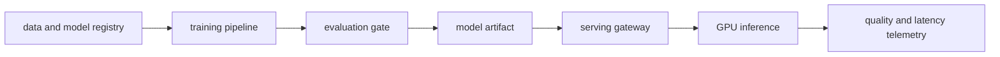

# AI Platform in One Page

## 30-Second Answer

AI Platform in One Page is the path from **data and model registry** to **quality and latency telemetry**. The essential handoffs are training pipeline, evaluation gate, model artifact, serving gateway, GPU inference. In production, I verify each handoff independently, keep its identity and state boundary visible, and operate it against availability, latency, security, and recovery objectives.

## Mental Model

Read this diagram as a concrete sequence, not a generic maturity loop: a failure after **GPU inference** has different evidence and ownership from a failure at **training pipeline**.

## Why It Exists

Without ai platform in one page, teams must manually coordinate data and model registry, model artifact, and quality and latency telemetry. The technology standardizes those interfaces so changes are repeatable, reviewable, and diagnosable. It is justified when the repeated operational risk exceeds the cost of owning the abstraction.

## How It Works

**data and model registry** owns stage 1; **training pipeline** owns stage 2; **evaluation gate** owns stage 3; **model artifact** owns stage 4; **serving gateway** owns stage 5; **GPU inference** owns stage 6; **quality and latency telemetry** owns stage 7. Follow resource IDs, revisions, events, and timestamps across these stages; an acknowledgement at one stage never proves completion at the next.

## Mechanisms

* **data and model registry:** Inspect its native state, events, latency, permissions, and capacity before moving to the next component.
* **training pipeline:** Inspect its native state, events, latency, permissions, and capacity before moving to the next component.
* **evaluation gate:** Inspect its native state, events, latency, permissions, and capacity before moving to the next component.
* **model artifact:** Inspect its native state, events, latency, permissions, and capacity before moving to the next component.
* **serving gateway:** Inspect its native state, events, latency, permissions, and capacity before moving to the next component.
* **GPU inference:** Inspect its native state, events, latency, permissions, and capacity before moving to the next component.
* **quality and latency telemetry:** Inspect its native state, events, latency, permissions, and capacity before moving to the next component.

## Production Architecture

Deploy data and model registry with least privilege and an auditable change path. Isolate model artifact by environment and failure domain, make quality and latency telemetry observable, and test loss of each dependency. Version the interface between stages so producers and consumers can roll independently.

## Failure Modes

| Failure | Evidence | Response |
|---|---|---|
| cold model loading causes queue and first-token latency | Compare stage latency and revision at training pipeline | Stop promotion and restore the last verified input |
| GPU memory or quota makes advertised capacity unusable | Inspect saturation, quotas, events, and pending work at model artifact | Add valid capacity or shed load; do not retry without a bound |
| model quality regresses while infrastructure metrics stay green | Compare the user result with quality and latency telemetry and upstream state | Mitigate first, preserve evidence, then repair the faulty contract |

## Trade-offs

More automation across data and model registry and quality and latency telemetry improves consistency but can propagate an error faster. Strong isolation narrows blast radius but increases cost and upgrades. Managed implementations reduce component toil; self-managed implementations offer control but require availability, backup, security patching, and on-call expertise.

## Lead-Level Follow-ups

* Which team owns **model artifact**, and what user-facing SLO proves it works?
* What remains available when **training pipeline** is down?
* Where is state durable, and how are restore and upgrade tested?

## My Experience Prompt

Describe a change to model artifact: state the constraint, the exact signal that selected the design, the rollback boundary, and the durable guardrail you added.

## Recall Check

1. What does **data and model registry** send to **training pipeline**?
2. Which component stores or reports authoritative state?
3. How does **GPU inference** affect **quality and latency telemetry**?
4. Which capacity limit fails first at production scale?
5. When is a simpler managed alternative preferable?

## Related Notes

* [Category index](index.md)
* [Interview dashboard](../00-interview-dashboard.md)
