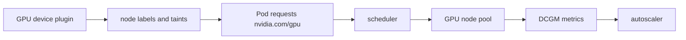

# GPU Nodes and Scheduling

## 30-Second Answer

GPU Nodes and Scheduling is the path from **GPU device plugin** to **autoscaler**. The essential handoffs are node labels and taints, Pod requests nvidia.com/gpu, scheduler, GPU node pool, DCGM metrics. In production, I verify each handoff independently, keep its identity and state boundary visible, and operate it against availability, latency, security, and recovery objectives.

## Mental Model

Read this diagram as a concrete sequence, not a generic maturity loop: a failure after **DCGM metrics** has different evidence and ownership from a failure at **node labels and taints**.

## Why It Exists

Without gpu nodes and scheduling, teams must manually coordinate gpu device plugin, scheduler, and autoscaler. The technology standardizes those interfaces so changes are repeatable, reviewable, and diagnosable. It is justified when the repeated operational risk exceeds the cost of owning the abstraction.

## How It Works

**GPU device plugin** owns stage 1; **node labels and taints** owns stage 2; **Pod requests nvidia.com/gpu** owns stage 3; **scheduler** owns stage 4; **GPU node pool** owns stage 5; **DCGM metrics** owns stage 6; **autoscaler** owns stage 7. Follow resource IDs, revisions, events, and timestamps across these stages; an acknowledgement at one stage never proves completion at the next.

## Mechanisms

* **GPU device plugin:** Inspect its native state, events, latency, permissions, and capacity before moving to the next component.
* **node labels and taints:** Inspect its native state, events, latency, permissions, and capacity before moving to the next component.
* **Pod requests nvidia.com/gpu:** Inspect its native state, events, latency, permissions, and capacity before moving to the next component.
* **scheduler:** Inspect its native state, events, latency, permissions, and capacity before moving to the next component.
* **GPU node pool:** Inspect its native state, events, latency, permissions, and capacity before moving to the next component.
* **DCGM metrics:** Inspect its native state, events, latency, permissions, and capacity before moving to the next component.
* **autoscaler:** Inspect its native state, events, latency, permissions, and capacity before moving to the next component.

## Production Architecture

Deploy gpu device plugin with least privilege and an auditable change path. Isolate scheduler by environment and failure domain, make autoscaler observable, and test loss of each dependency. Version the interface between stages so producers and consumers can roll independently.

## Failure Modes

| Failure | Evidence | Response |
|---|---|---|
| cold model loading causes queue and first-token latency | Compare stage latency and revision at node labels and taints | Stop promotion and restore the last verified input |
| GPU memory or quota makes advertised capacity unusable | Inspect saturation, quotas, events, and pending work at scheduler | Add valid capacity or shed load; do not retry without a bound |
| model quality regresses while infrastructure metrics stay green | Compare the user result with autoscaler and upstream state | Mitigate first, preserve evidence, then repair the faulty contract |

## Trade-offs

More automation across gpu device plugin and autoscaler improves consistency but can propagate an error faster. Strong isolation narrows blast radius but increases cost and upgrades. Managed implementations reduce component toil; self-managed implementations offer control but require availability, backup, security patching, and on-call expertise.

## Lead-Level Follow-ups

* Which team owns **scheduler**, and what user-facing SLO proves it works?
* What remains available when **node labels and taints** is down?
* Where is state durable, and how are restore and upgrade tested?

## My Experience Prompt

Describe a change to scheduler: state the constraint, the exact signal that selected the design, the rollback boundary, and the durable guardrail you added.

## Recall Check

1. What does **GPU device plugin** send to **node labels and taints**?
2. Which component stores or reports authoritative state?
3. How does **DCGM metrics** affect **autoscaler**?
4. Which capacity limit fails first at production scale?
5. When is a simpler managed alternative preferable?

## Related Notes

* [Category index](index.md)
* [Interview dashboard](../00-interview-dashboard.md)
