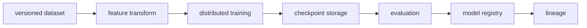

# Model Training and Data Pipelines

## 30-Second Answer

Model Training and Data Pipelines is the path from **versioned dataset** to **lineage**. The essential handoffs are feature transform, distributed training, checkpoint storage, evaluation, model registry. In production, I verify each handoff independently, keep its identity and state boundary visible, and operate it against availability, latency, security, and recovery objectives.

## Mental Model

Read this diagram as a concrete sequence, not a generic maturity loop: a failure after **model registry** has different evidence and ownership from a failure at **feature transform**.

## Why It Exists

Without model training and data pipelines, teams must manually coordinate versioned dataset, checkpoint storage, and lineage. The technology standardizes those interfaces so changes are repeatable, reviewable, and diagnosable. It is justified when the repeated operational risk exceeds the cost of owning the abstraction.

## How It Works

**versioned dataset** owns stage 1; **feature transform** owns stage 2; **distributed training** owns stage 3; **checkpoint storage** owns stage 4; **evaluation** owns stage 5; **model registry** owns stage 6; **lineage** owns stage 7. Follow resource IDs, revisions, events, and timestamps across these stages; an acknowledgement at one stage never proves completion at the next.

## Mechanisms

* **versioned dataset:** Inspect its native state, events, latency, permissions, and capacity before moving to the next component.
* **feature transform:** Inspect its native state, events, latency, permissions, and capacity before moving to the next component.
* **distributed training:** Inspect its native state, events, latency, permissions, and capacity before moving to the next component.
* **checkpoint storage:** Inspect its native state, events, latency, permissions, and capacity before moving to the next component.
* **evaluation:** Inspect its native state, events, latency, permissions, and capacity before moving to the next component.
* **model registry:** Inspect its native state, events, latency, permissions, and capacity before moving to the next component.
* **lineage:** Inspect its native state, events, latency, permissions, and capacity before moving to the next component.

## Production Architecture

Deploy versioned dataset with least privilege and an auditable change path. Isolate checkpoint storage by environment and failure domain, make lineage observable, and test loss of each dependency. Version the interface between stages so producers and consumers can roll independently.

## Failure Modes

| Failure | Evidence | Response |
|---|---|---|
| cold model loading causes queue and first-token latency | Compare stage latency and revision at feature transform | Stop promotion and restore the last verified input |
| GPU memory or quota makes advertised capacity unusable | Inspect saturation, quotas, events, and pending work at checkpoint storage | Add valid capacity or shed load; do not retry without a bound |
| model quality regresses while infrastructure metrics stay green | Compare the user result with lineage and upstream state | Mitigate first, preserve evidence, then repair the faulty contract |

## Trade-offs

More automation across versioned dataset and lineage improves consistency but can propagate an error faster. Strong isolation narrows blast radius but increases cost and upgrades. Managed implementations reduce component toil; self-managed implementations offer control but require availability, backup, security patching, and on-call expertise.

## Lead-Level Follow-ups

* Which team owns **checkpoint storage**, and what user-facing SLO proves it works?
* What remains available when **feature transform** is down?
* Where is state durable, and how are restore and upgrade tested?

## My Experience Prompt

Describe a change to checkpoint storage: state the constraint, the exact signal that selected the design, the rollback boundary, and the durable guardrail you added.

## Recall Check

1. What does **versioned dataset** send to **feature transform**?
2. Which component stores or reports authoritative state?
3. How does **model registry** affect **lineage**?
4. Which capacity limit fails first at production scale?
5. When is a simpler managed alternative preferable?

## Related Notes

* [Category index](index.md)
* [Interview dashboard](../00-interview-dashboard.md)
