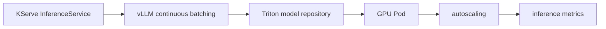

# Model Serving: KServe, vLLM, and Triton

## 30-Second Answer

Model Serving: KServe, vLLM, and Triton is the path from **KServe InferenceService** to **inference metrics**. The essential handoffs are vLLM continuous batching, Triton model repository, GPU Pod, autoscaling. In production, I verify each handoff independently, keep its identity and state boundary visible, and operate it against availability, latency, security, and recovery objectives.

## Mental Model

Read this diagram as a concrete sequence, not a generic maturity loop: a failure after **autoscaling** has different evidence and ownership from a failure at **vLLM continuous batching**.

## Why It Exists

Without model serving: kserve, vllm, and triton, teams must manually coordinate kserve inferenceservice, gpu pod, and inference metrics. The technology standardizes those interfaces so changes are repeatable, reviewable, and diagnosable. It is justified when the repeated operational risk exceeds the cost of owning the abstraction.

## How It Works

**KServe InferenceService** owns stage 1; **vLLM continuous batching** owns stage 2; **Triton model repository** owns stage 3; **GPU Pod** owns stage 4; **autoscaling** owns stage 5; **inference metrics** owns stage 6. Follow resource IDs, revisions, events, and timestamps across these stages; an acknowledgement at one stage never proves completion at the next.

## Mechanisms

* **KServe InferenceService:** Inspect its native state, events, latency, permissions, and capacity before moving to the next component.
* **vLLM continuous batching:** Inspect its native state, events, latency, permissions, and capacity before moving to the next component.
* **Triton model repository:** Inspect its native state, events, latency, permissions, and capacity before moving to the next component.
* **GPU Pod:** Inspect its native state, events, latency, permissions, and capacity before moving to the next component.
* **autoscaling:** Inspect its native state, events, latency, permissions, and capacity before moving to the next component.
* **inference metrics:** Inspect its native state, events, latency, permissions, and capacity before moving to the next component.

## Production Architecture

Deploy kserve inferenceservice with least privilege and an auditable change path. Isolate gpu pod by environment and failure domain, make inference metrics observable, and test loss of each dependency. Version the interface between stages so producers and consumers can roll independently.

## Failure Modes

| Failure | Evidence | Response |
|---|---|---|
| cold model loading causes queue and first-token latency | Compare stage latency and revision at vLLM continuous batching | Stop promotion and restore the last verified input |
| GPU memory or quota makes advertised capacity unusable | Inspect saturation, quotas, events, and pending work at GPU Pod | Add valid capacity or shed load; do not retry without a bound |
| model quality regresses while infrastructure metrics stay green | Compare the user result with inference metrics and upstream state | Mitigate first, preserve evidence, then repair the faulty contract |

## Trade-offs

More automation across kserve inferenceservice and inference metrics improves consistency but can propagate an error faster. Strong isolation narrows blast radius but increases cost and upgrades. Managed implementations reduce component toil; self-managed implementations offer control but require availability, backup, security patching, and on-call expertise.

## Lead-Level Follow-ups

* Which team owns **GPU Pod**, and what user-facing SLO proves it works?
* What remains available when **vLLM continuous batching** is down?
* Where is state durable, and how are restore and upgrade tested?

## My Experience Prompt

Describe a change to gpu pod: state the constraint, the exact signal that selected the design, the rollback boundary, and the durable guardrail you added.

## Recall Check

1. What does **KServe InferenceService** send to **vLLM continuous batching**?
2. Which component stores or reports authoritative state?
3. How does **autoscaling** affect **inference metrics**?
4. Which capacity limit fails first at production scale?
5. When is a simpler managed alternative preferable?

## Related Notes

* [Category index](index.md)
* [Interview dashboard](../00-interview-dashboard.md)
