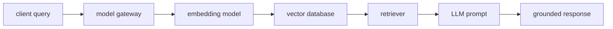

# RAG, Vector Databases, and Model Gateways

## 30-Second Answer

RAG, Vector Databases, and Model Gateways is the path from **client query** to **grounded response**. The essential handoffs are model gateway, embedding model, vector database, retriever, LLM prompt. In production, I verify each handoff independently, keep its identity and state boundary visible, and operate it against availability, latency, security, and recovery objectives.

## Mental Model

Read this diagram as a concrete sequence, not a generic maturity loop: a failure after **LLM prompt** has different evidence and ownership from a failure at **model gateway**.

## Why It Exists

Without rag, vector databases, and model gateways, teams must manually coordinate client query, vector database, and grounded response. The technology standardizes those interfaces so changes are repeatable, reviewable, and diagnosable. It is justified when the repeated operational risk exceeds the cost of owning the abstraction.

## How It Works

**client query** owns stage 1; **model gateway** owns stage 2; **embedding model** owns stage 3; **vector database** owns stage 4; **retriever** owns stage 5; **LLM prompt** owns stage 6; **grounded response** owns stage 7. Follow resource IDs, revisions, events, and timestamps across these stages; an acknowledgement at one stage never proves completion at the next.

## Mechanisms

* **client query:** Inspect its native state, events, latency, permissions, and capacity before moving to the next component.
* **model gateway:** Inspect its native state, events, latency, permissions, and capacity before moving to the next component.
* **embedding model:** Inspect its native state, events, latency, permissions, and capacity before moving to the next component.
* **vector database:** Inspect its native state, events, latency, permissions, and capacity before moving to the next component.
* **retriever:** Inspect its native state, events, latency, permissions, and capacity before moving to the next component.
* **LLM prompt:** Inspect its native state, events, latency, permissions, and capacity before moving to the next component.
* **grounded response:** Inspect its native state, events, latency, permissions, and capacity before moving to the next component.

## Production Architecture

Deploy client query with least privilege and an auditable change path. Isolate vector database by environment and failure domain, make grounded response observable, and test loss of each dependency. Version the interface between stages so producers and consumers can roll independently.

## Failure Modes

| Failure | Evidence | Response |
|---|---|---|
| cold model loading causes queue and first-token latency | Compare stage latency and revision at model gateway | Stop promotion and restore the last verified input |
| GPU memory or quota makes advertised capacity unusable | Inspect saturation, quotas, events, and pending work at vector database | Add valid capacity or shed load; do not retry without a bound |
| model quality regresses while infrastructure metrics stay green | Compare the user result with grounded response and upstream state | Mitigate first, preserve evidence, then repair the faulty contract |

## Trade-offs

More automation across client query and grounded response improves consistency but can propagate an error faster. Strong isolation narrows blast radius but increases cost and upgrades. Managed implementations reduce component toil; self-managed implementations offer control but require availability, backup, security patching, and on-call expertise.

## Lead-Level Follow-ups

* Which team owns **vector database**, and what user-facing SLO proves it works?
* What remains available when **model gateway** is down?
* Where is state durable, and how are restore and upgrade tested?

## My Experience Prompt

Describe a change to vector database: state the constraint, the exact signal that selected the design, the rollback boundary, and the durable guardrail you added.

## Recall Check

1. What does **client query** send to **model gateway**?
2. Which component stores or reports authoritative state?
3. How does **LLM prompt** affect **grounded response**?
4. Which capacity limit fails first at production scale?
5. When is a simpler managed alternative preferable?

## Related Notes

* [Category index](index.md)
* [Interview dashboard](../00-interview-dashboard.md)
