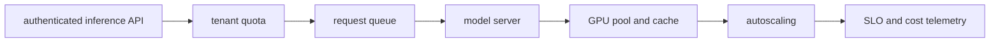

# Production AI Platform Scenario

## 30-Second Answer

Production AI Platform Scenario is the path from **authenticated inference API** to **SLO and cost telemetry**. The essential handoffs are tenant quota, request queue, model server, GPU pool and cache, autoscaling. In production, I verify each handoff independently, keep its identity and state boundary visible, and operate it against availability, latency, security, and recovery objectives.

## Mental Model

Read this diagram as a concrete sequence, not a generic maturity loop: a failure after **autoscaling** has different evidence and ownership from a failure at **tenant quota**.

## Why It Exists

Without production ai platform scenario, teams must manually coordinate authenticated inference api, model server, and slo and cost telemetry. The technology standardizes those interfaces so changes are repeatable, reviewable, and diagnosable. It is justified when the repeated operational risk exceeds the cost of owning the abstraction.

## How It Works

**authenticated inference API** owns stage 1; **tenant quota** owns stage 2; **request queue** owns stage 3; **model server** owns stage 4; **GPU pool and cache** owns stage 5; **autoscaling** owns stage 6; **SLO and cost telemetry** owns stage 7. Follow resource IDs, revisions, events, and timestamps across these stages; an acknowledgement at one stage never proves completion at the next.

## Mechanisms

* **authenticated inference API:** Inspect its native state, events, latency, permissions, and capacity before moving to the next component.
* **tenant quota:** Inspect its native state, events, latency, permissions, and capacity before moving to the next component.
* **request queue:** Inspect its native state, events, latency, permissions, and capacity before moving to the next component.
* **model server:** Inspect its native state, events, latency, permissions, and capacity before moving to the next component.
* **GPU pool and cache:** Inspect its native state, events, latency, permissions, and capacity before moving to the next component.
* **autoscaling:** Inspect its native state, events, latency, permissions, and capacity before moving to the next component.
* **SLO and cost telemetry:** Inspect its native state, events, latency, permissions, and capacity before moving to the next component.

## Production Architecture

Deploy authenticated inference api with least privilege and an auditable change path. Isolate model server by environment and failure domain, make slo and cost telemetry observable, and test loss of each dependency. Version the interface between stages so producers and consumers can roll independently.

## Failure Modes

| Failure | Evidence | Response |
|---|---|---|
| cold model loading causes queue and first-token latency | Compare stage latency and revision at tenant quota | Stop promotion and restore the last verified input |
| GPU memory or quota makes advertised capacity unusable | Inspect saturation, quotas, events, and pending work at model server | Add valid capacity or shed load; do not retry without a bound |
| model quality regresses while infrastructure metrics stay green | Compare the user result with SLO and cost telemetry and upstream state | Mitigate first, preserve evidence, then repair the faulty contract |

## Trade-offs

More automation across authenticated inference api and slo and cost telemetry improves consistency but can propagate an error faster. Strong isolation narrows blast radius but increases cost and upgrades. Managed implementations reduce component toil; self-managed implementations offer control but require availability, backup, security patching, and on-call expertise.

## Lead-Level Follow-ups

* Which team owns **model server**, and what user-facing SLO proves it works?
* What remains available when **tenant quota** is down?
* Where is state durable, and how are restore and upgrade tested?

## My Experience Prompt

Describe a change to model server: state the constraint, the exact signal that selected the design, the rollback boundary, and the durable guardrail you added.

## Recall Check

1. What does **authenticated inference API** send to **tenant quota**?
2. Which component stores or reports authoritative state?
3. How does **autoscaling** affect **SLO and cost telemetry**?
4. Which capacity limit fails first at production scale?
5. When is a simpler managed alternative preferable?

## Related Notes

* [Category index](index.md)
* [Interview dashboard](../00-interview-dashboard.md)
