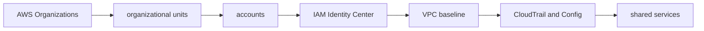

# AWS Platform Foundation

## 30-Second Answer

AWS Platform Foundation is the path from **AWS Organizations** to **shared services**. The essential handoffs are organizational units, accounts, IAM Identity Center, VPC baseline, CloudTrail and Config. In production, I verify each handoff independently, keep its identity and state boundary visible, and operate it against availability, latency, security, and recovery objectives.

## Mental Model

Read this diagram as a concrete sequence, not a generic maturity loop: a failure after **CloudTrail and Config** has different evidence and ownership from a failure at **organizational units**.

## Why It Exists

Without aws platform foundation, teams must manually coordinate aws organizations, iam identity center, and shared services. The technology standardizes those interfaces so changes are repeatable, reviewable, and diagnosable. It is justified when the repeated operational risk exceeds the cost of owning the abstraction.

## How It Works

**AWS Organizations** owns stage 1; **organizational units** owns stage 2; **accounts** owns stage 3; **IAM Identity Center** owns stage 4; **VPC baseline** owns stage 5; **CloudTrail and Config** owns stage 6; **shared services** owns stage 7. Follow resource IDs, revisions, events, and timestamps across these stages; an acknowledgement at one stage never proves completion at the next.

## Mechanisms

* **AWS Organizations:** Inspect its native state, events, latency, permissions, and capacity before moving to the next component.
* **organizational units:** Inspect its native state, events, latency, permissions, and capacity before moving to the next component.
* **accounts:** Inspect its native state, events, latency, permissions, and capacity before moving to the next component.
* **IAM Identity Center:** Inspect its native state, events, latency, permissions, and capacity before moving to the next component.
* **VPC baseline:** Inspect its native state, events, latency, permissions, and capacity before moving to the next component.
* **CloudTrail and Config:** Inspect its native state, events, latency, permissions, and capacity before moving to the next component.
* **shared services:** Inspect its native state, events, latency, permissions, and capacity before moving to the next component.

## Production Architecture

Deploy aws organizations with least privilege and an auditable change path. Isolate iam identity center by environment and failure domain, make shared services observable, and test loss of each dependency. Version the interface between stages so producers and consumers can roll independently.

## Failure Modes

| Failure | Evidence | Response |
|---|---|---|
| quota, IP, or zonal exhaustion defeats nominal capacity | Compare stage latency and revision at organizational units | Stop promotion and restore the last verified input |
| an IAM trust policy grants a wider principal than intended | Inspect saturation, quotas, events, and pending work at IAM Identity Center | Add valid capacity or shed load; do not retry without a bound |
| a shared account or network dependency widens blast radius | Compare the user result with shared services and upstream state | Mitigate first, preserve evidence, then repair the faulty contract |

## Trade-offs

More automation across aws organizations and shared services improves consistency but can propagate an error faster. Strong isolation narrows blast radius but increases cost and upgrades. Managed implementations reduce component toil; self-managed implementations offer control but require availability, backup, security patching, and on-call expertise.

## Lead-Level Follow-ups

* Which team owns **IAM Identity Center**, and what user-facing SLO proves it works?
* What remains available when **organizational units** is down?
* Where is state durable, and how are restore and upgrade tested?

## My Experience Prompt

Describe a change to iam identity center: state the constraint, the exact signal that selected the design, the rollback boundary, and the durable guardrail you added.

## Recall Check

1. What does **AWS Organizations** send to **organizational units**?
2. Which component stores or reports authoritative state?
3. How does **CloudTrail and Config** affect **shared services**?
4. Which capacity limit fails first at production scale?
5. When is a simpler managed alternative preferable?

## Related Notes

* [Category index](index.md)
* [Interview dashboard](../00-interview-dashboard.md)
