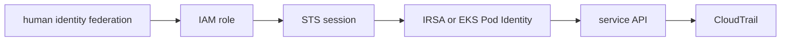

# IAM and Workload Identity

## 30-Second Answer

IAM and Workload Identity is the path from **human identity federation** to **CloudTrail**. The essential handoffs are IAM role, STS session, IRSA or EKS Pod Identity, service API. In production, I verify each handoff independently, keep its identity and state boundary visible, and operate it against availability, latency, security, and recovery objectives.

## Mental Model

Read this diagram as a concrete sequence, not a generic maturity loop: a failure after **service API** has different evidence and ownership from a failure at **IAM role**.

## Why It Exists

Without iam and workload identity, teams must manually coordinate human identity federation, irsa or eks pod identity, and cloudtrail. The technology standardizes those interfaces so changes are repeatable, reviewable, and diagnosable. It is justified when the repeated operational risk exceeds the cost of owning the abstraction.

## How It Works

**human identity federation** owns stage 1; **IAM role** owns stage 2; **STS session** owns stage 3; **IRSA or EKS Pod Identity** owns stage 4; **service API** owns stage 5; **CloudTrail** owns stage 6. Follow resource IDs, revisions, events, and timestamps across these stages; an acknowledgement at one stage never proves completion at the next.

## Mechanisms

* **human identity federation:** Inspect its native state, events, latency, permissions, and capacity before moving to the next component.
* **IAM role:** Inspect its native state, events, latency, permissions, and capacity before moving to the next component.
* **STS session:** Inspect its native state, events, latency, permissions, and capacity before moving to the next component.
* **IRSA or EKS Pod Identity:** Inspect its native state, events, latency, permissions, and capacity before moving to the next component.
* **service API:** Inspect its native state, events, latency, permissions, and capacity before moving to the next component.
* **CloudTrail:** Inspect its native state, events, latency, permissions, and capacity before moving to the next component.

## Production Architecture

Deploy human identity federation with least privilege and an auditable change path. Isolate irsa or eks pod identity by environment and failure domain, make cloudtrail observable, and test loss of each dependency. Version the interface between stages so producers and consumers can roll independently.

## Failure Modes

| Failure | Evidence | Response |
|---|---|---|
| quota, IP, or zonal exhaustion defeats nominal capacity | Compare stage latency and revision at IAM role | Stop promotion and restore the last verified input |
| an IAM trust policy grants a wider principal than intended | Inspect saturation, quotas, events, and pending work at IRSA or EKS Pod Identity | Add valid capacity or shed load; do not retry without a bound |
| a shared account or network dependency widens blast radius | Compare the user result with CloudTrail and upstream state | Mitigate first, preserve evidence, then repair the faulty contract |

## Trade-offs

More automation across human identity federation and cloudtrail improves consistency but can propagate an error faster. Strong isolation narrows blast radius but increases cost and upgrades. Managed implementations reduce component toil; self-managed implementations offer control but require availability, backup, security patching, and on-call expertise.

## Lead-Level Follow-ups

* Which team owns **IRSA or EKS Pod Identity**, and what user-facing SLO proves it works?
* What remains available when **IAM role** is down?
* Where is state durable, and how are restore and upgrade tested?

## My Experience Prompt

Describe a change to irsa or eks pod identity: state the constraint, the exact signal that selected the design, the rollback boundary, and the durable guardrail you added.

## Recall Check

1. What does **human identity federation** send to **IAM role**?
2. Which component stores or reports authoritative state?
3. How does **service API** affect **CloudTrail**?
4. Which capacity limit fails first at production scale?
5. When is a simpler managed alternative preferable?

## Related Notes

* [Category index](index.md)
* [Interview dashboard](../00-interview-dashboard.md)
