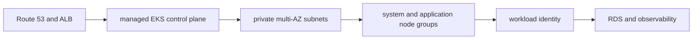

# EKS Production Design

## 30-Second Answer

EKS Production Design is the path from **Route 53 and ALB** to **RDS and observability**. The essential handoffs are managed EKS control plane, private multi-AZ subnets, system and application node groups, workload identity. In production, I verify each handoff independently, keep its identity and state boundary visible, and operate it against availability, latency, security, and recovery objectives.

## Mental Model

Read this diagram as a concrete sequence, not a generic maturity loop: a failure after **workload identity** has different evidence and ownership from a failure at **managed EKS control plane**.

## Why It Exists

Without eks production design, teams must manually coordinate route 53 and alb, system and application node groups, and rds and observability. The technology standardizes those interfaces so changes are repeatable, reviewable, and diagnosable. It is justified when the repeated operational risk exceeds the cost of owning the abstraction.

## How It Works

**Route 53 and ALB** owns stage 1; **managed EKS control plane** owns stage 2; **private multi-AZ subnets** owns stage 3; **system and application node groups** owns stage 4; **workload identity** owns stage 5; **RDS and observability** owns stage 6. Follow resource IDs, revisions, events, and timestamps across these stages; an acknowledgement at one stage never proves completion at the next.

## Mechanisms

* **Route 53 and ALB:** Inspect its native state, events, latency, permissions, and capacity before moving to the next component.
* **managed EKS control plane:** Inspect its native state, events, latency, permissions, and capacity before moving to the next component.
* **private multi-AZ subnets:** Inspect its native state, events, latency, permissions, and capacity before moving to the next component.
* **system and application node groups:** Inspect its native state, events, latency, permissions, and capacity before moving to the next component.
* **workload identity:** Inspect its native state, events, latency, permissions, and capacity before moving to the next component.
* **RDS and observability:** Inspect its native state, events, latency, permissions, and capacity before moving to the next component.

## Production Architecture

Deploy route 53 and alb with least privilege and an auditable change path. Isolate system and application node groups by environment and failure domain, make rds and observability observable, and test loss of each dependency. Version the interface between stages so producers and consumers can roll independently.

## Failure Modes

| Failure | Evidence | Response |
|---|---|---|
| quota, IP, or zonal exhaustion defeats nominal capacity | Compare stage latency and revision at managed EKS control plane | Stop promotion and restore the last verified input |
| an IAM trust policy grants a wider principal than intended | Inspect saturation, quotas, events, and pending work at system and application node groups | Add valid capacity or shed load; do not retry without a bound |
| a shared account or network dependency widens blast radius | Compare the user result with RDS and observability and upstream state | Mitigate first, preserve evidence, then repair the faulty contract |

## Trade-offs

More automation across route 53 and alb and rds and observability improves consistency but can propagate an error faster. Strong isolation narrows blast radius but increases cost and upgrades. Managed implementations reduce component toil; self-managed implementations offer control but require availability, backup, security patching, and on-call expertise.

## Lead-Level Follow-ups

* Which team owns **system and application node groups**, and what user-facing SLO proves it works?
* What remains available when **managed EKS control plane** is down?
* Where is state durable, and how are restore and upgrade tested?

## My Experience Prompt

Describe a change to system and application node groups: state the constraint, the exact signal that selected the design, the rollback boundary, and the durable guardrail you added.

## Recall Check

1. What does **Route 53 and ALB** send to **managed EKS control plane**?
2. Which component stores or reports authoritative state?
3. How does **workload identity** affect **RDS and observability**?
4. Which capacity limit fails first at production scale?
5. When is a simpler managed alternative preferable?

## Related Notes

* [Category index](index.md)
* [Interview dashboard](../00-interview-dashboard.md)
