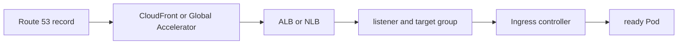

# Load Balancing, DNS, and Edge

## 30-Second Answer

Load Balancing, DNS, and Edge is the path from **Route 53 record** to **ready Pod**. The essential handoffs are CloudFront or Global Accelerator, ALB or NLB, listener and target group, Ingress controller. In production, I verify each handoff independently, keep its identity and state boundary visible, and operate it against availability, latency, security, and recovery objectives.

## Mental Model

Read this diagram as a concrete sequence, not a generic maturity loop: a failure after **Ingress controller** has different evidence and ownership from a failure at **CloudFront or Global Accelerator**.

## Why It Exists

Without load balancing, dns, and edge, teams must manually coordinate route 53 record, listener and target group, and ready pod. The technology standardizes those interfaces so changes are repeatable, reviewable, and diagnosable. It is justified when the repeated operational risk exceeds the cost of owning the abstraction.

## How It Works

**Route 53 record** owns stage 1; **CloudFront or Global Accelerator** owns stage 2; **ALB or NLB** owns stage 3; **listener and target group** owns stage 4; **Ingress controller** owns stage 5; **ready Pod** owns stage 6. Follow resource IDs, revisions, events, and timestamps across these stages; an acknowledgement at one stage never proves completion at the next.

## Mechanisms

* **Route 53 record:** Inspect its native state, events, latency, permissions, and capacity before moving to the next component.
* **CloudFront or Global Accelerator:** Inspect its native state, events, latency, permissions, and capacity before moving to the next component.
* **ALB or NLB:** Inspect its native state, events, latency, permissions, and capacity before moving to the next component.
* **listener and target group:** Inspect its native state, events, latency, permissions, and capacity before moving to the next component.
* **Ingress controller:** Inspect its native state, events, latency, permissions, and capacity before moving to the next component.
* **ready Pod:** Inspect its native state, events, latency, permissions, and capacity before moving to the next component.

## Production Architecture

Deploy route 53 record with least privilege and an auditable change path. Isolate listener and target group by environment and failure domain, make ready pod observable, and test loss of each dependency. Version the interface between stages so producers and consumers can roll independently.

## Failure Modes

| Failure | Evidence | Response |
|---|---|---|
| quota, IP, or zonal exhaustion defeats nominal capacity | Compare stage latency and revision at CloudFront or Global Accelerator | Stop promotion and restore the last verified input |
| an IAM trust policy grants a wider principal than intended | Inspect saturation, quotas, events, and pending work at listener and target group | Add valid capacity or shed load; do not retry without a bound |
| a shared account or network dependency widens blast radius | Compare the user result with ready Pod and upstream state | Mitigate first, preserve evidence, then repair the faulty contract |

## Trade-offs

More automation across route 53 record and ready pod improves consistency but can propagate an error faster. Strong isolation narrows blast radius but increases cost and upgrades. Managed implementations reduce component toil; self-managed implementations offer control but require availability, backup, security patching, and on-call expertise.

## Lead-Level Follow-ups

* Which team owns **listener and target group**, and what user-facing SLO proves it works?
* What remains available when **CloudFront or Global Accelerator** is down?
* Where is state durable, and how are restore and upgrade tested?

## My Experience Prompt

Describe a change to listener and target group: state the constraint, the exact signal that selected the design, the rollback boundary, and the durable guardrail you added.

## Recall Check

1. What does **Route 53 record** send to **CloudFront or Global Accelerator**?
2. Which component stores or reports authoritative state?
3. How does **Ingress controller** affect **ready Pod**?
4. Which capacity limit fails first at production scale?
5. When is a simpler managed alternative preferable?

## Related Notes

* [Category index](index.md)
* [Interview dashboard](../00-interview-dashboard.md)
