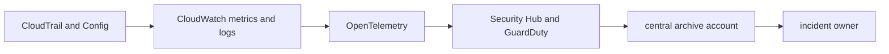

# Observability, Security, and Audit

## 30-Second Answer

Observability, Security, and Audit is the path from **CloudTrail and Config** to **incident owner**. The essential handoffs are CloudWatch metrics and logs, OpenTelemetry, Security Hub and GuardDuty, central archive account. In production, I verify each handoff independently, keep its identity and state boundary visible, and operate it against availability, latency, security, and recovery objectives.

## Mental Model

Read this diagram as a concrete sequence, not a generic maturity loop: a failure after **central archive account** has different evidence and ownership from a failure at **CloudWatch metrics and logs**.

## Why It Exists

Without observability, security, and audit, teams must manually coordinate cloudtrail and config, security hub and guardduty, and incident owner. The technology standardizes those interfaces so changes are repeatable, reviewable, and diagnosable. It is justified when the repeated operational risk exceeds the cost of owning the abstraction.

## How It Works

**CloudTrail and Config** owns stage 1; **CloudWatch metrics and logs** owns stage 2; **OpenTelemetry** owns stage 3; **Security Hub and GuardDuty** owns stage 4; **central archive account** owns stage 5; **incident owner** owns stage 6. Follow resource IDs, revisions, events, and timestamps across these stages; an acknowledgement at one stage never proves completion at the next.

## Mechanisms

* **CloudTrail and Config:** Inspect its native state, events, latency, permissions, and capacity before moving to the next component.
* **CloudWatch metrics and logs:** Inspect its native state, events, latency, permissions, and capacity before moving to the next component.
* **OpenTelemetry:** Inspect its native state, events, latency, permissions, and capacity before moving to the next component.
* **Security Hub and GuardDuty:** Inspect its native state, events, latency, permissions, and capacity before moving to the next component.
* **central archive account:** Inspect its native state, events, latency, permissions, and capacity before moving to the next component.
* **incident owner:** Inspect its native state, events, latency, permissions, and capacity before moving to the next component.

## Production Architecture

Deploy cloudtrail and config with least privilege and an auditable change path. Isolate security hub and guardduty by environment and failure domain, make incident owner observable, and test loss of each dependency. Version the interface between stages so producers and consumers can roll independently.

## Failure Modes

| Failure | Evidence | Response |
|---|---|---|
| quota, IP, or zonal exhaustion defeats nominal capacity | Compare stage latency and revision at CloudWatch metrics and logs | Stop promotion and restore the last verified input |
| an IAM trust policy grants a wider principal than intended | Inspect saturation, quotas, events, and pending work at Security Hub and GuardDuty | Add valid capacity or shed load; do not retry without a bound |
| a shared account or network dependency widens blast radius | Compare the user result with incident owner and upstream state | Mitigate first, preserve evidence, then repair the faulty contract |

## Trade-offs

More automation across cloudtrail and config and incident owner improves consistency but can propagate an error faster. Strong isolation narrows blast radius but increases cost and upgrades. Managed implementations reduce component toil; self-managed implementations offer control but require availability, backup, security patching, and on-call expertise.

## Lead-Level Follow-ups

* Which team owns **Security Hub and GuardDuty**, and what user-facing SLO proves it works?
* What remains available when **CloudWatch metrics and logs** is down?
* Where is state durable, and how are restore and upgrade tested?

## My Experience Prompt

Describe a change to security hub and guardduty: state the constraint, the exact signal that selected the design, the rollback boundary, and the durable guardrail you added.

## Recall Check

1. What does **CloudTrail and Config** send to **CloudWatch metrics and logs**?
2. Which component stores or reports authoritative state?
3. How does **central archive account** affect **incident owner**?
4. Which capacity limit fails first at production scale?
5. When is a simpler managed alternative preferable?

## Related Notes

* [Category index](index.md)
* [Interview dashboard](../00-interview-dashboard.md)
