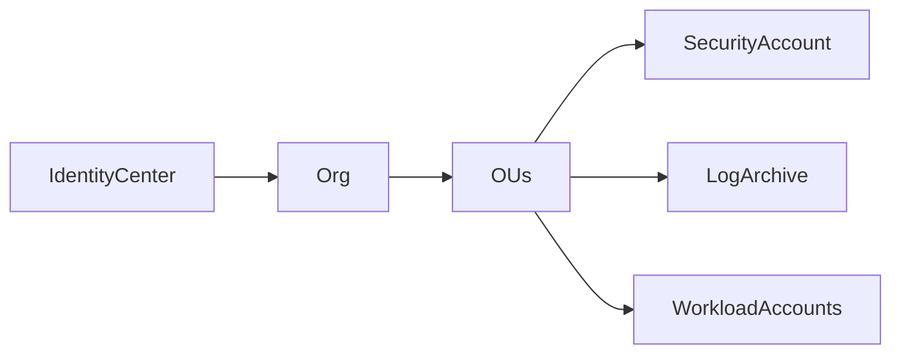

# Multi-Account and Landing Zones

## 30-Second Answer

Accounts are blast-radius, billing and policy boundaries. A landing zone supplies organization structure, identity, logging, security controls and network patterns without making every workload identical.

## Mental Model

Do not mistake acknowledgement for completion. Identify authoritative desired state, the actor that makes progress, derived status, and the user-visible serving signal. The diagram below shows the actual relationships for this topic rather than a universal pipeline.

## Architecture Diagram



## Core Components

The diagram names the authoritative intent, execution mechanism and external state. Their credentials, lifecycle and evidence must remain independently visible.

## How It Actually Works

Use SCPs as guardrails, not grants; centralize immutable audit evidence and delegate service administration carefully. Stage policies against representative accounts and retain break-glass independent of a failed SSO path.

Every asynchronous boundary can accept work and fail before convergence. Preserve object addresses, resource versions, artifact digests, account/region and timestamps so evidence from two components can be correlated. Status is useful only when its producer and freshness are known.

## Production Design

Design availability around the authoritative state and explicit failure domains shown above. Use reviewed, versioned configuration; test upgrade and recovery with representative scale; keep a known-good artifact/configuration; and define what the system does when its control plane or dependency is unavailable. Avoid allowing two reconcilers or automation systems to own the same field.

Operational readiness includes a user-oriented SLI, saturation/queue signals, an owner, a runbook and a tested rollback boundary. Capacity controls only solve genuine saturation: schema, permission, corruption, lock and compatibility failures require correction of that mechanism.

A production review should also document compatibility across one supported upgrade step, the maximum acceptable recovery window, and the evidence retained for audit. Practice failure injection at the boundary most likely to violate the user SLI, including a dependency timeout and a rejected configuration. Record the exact precondition for rollback, because rollback of configuration cannot reverse writes, external side effects, deleted data, or an incompatible schema migration. Finally, rehearse ownership transfer: the responder must know which team controls the failing component, which team owns customer communication, and which decision requires incident command.

## Failure Modes

| Failure | Discriminating evidence | Response |
|---|---|---|
| bad SCP | denied CloudTrail event | rollback policy |
| central dependency outage | cross-account errors | regional/account fallback |
| account vending drift | Config evidence | reconcile baseline |

## Troubleshooting Procedure

1. Record impact, start time, one failing example and the last known-good revision.
2. Compare a healthy cohort with the failure by node, zone, tenant, revision or dependency.
3. Query the native state at the first divergent boundary; do not restart before capturing events and previous logs.
4. Choose a reversible mitigation, change one variable and verify the user SLI.

```bash
curl --fail --max-time 5 https://service/health
```

## Security Considerations

Authenticate workload and operator identities separately, authorize the narrow verb/resource/account, encrypt transport and sensitive state, and retain an audit principal. Bound admission/plugin timeouts and document break-glass with short-lived elevation. Supply-chain controls verify immutable digests; they do not prove runtime correctness.

## Scaling and Cost

Track request/queue rate, reconciliation or processing latency, saturation and retained state. Partition by real blast radius rather than arbitrary team count. More replicas do not repair corrupt state, invalid schemas, incompatible versions or denied permissions. Include idle resilience, cross-zone transfer, managed-service charges and telemetry cardinality in the cost model.

## Trade-offs

Automation improves consistency but can propagate a wrong declaration quickly. Isolation reduces correlated failure at the cost of duplicated capacity and operational surface. Managed services transfer selected component toil, not application ownership. Prefer the simplest implementation whose recovery and security boundaries satisfy the stated SLO.

## Lead-Level Follow-ups

* Which state is authoritative and which status can be stale?
* What continues working when the control plane is unavailable?
* Which exact signal stops a rollout, and who can invoke break-glass?
* How are upgrade compatibility and recovery tested rather than assumed?

## My Experience Prompt

Describe a real **Multi-Account and Landing Zones** decision: quantify the constraint and impact, name the decisive evidence, explain the rejected alternative, and identify the durable guardrail and owner.

## Recall Check

1. Trace the state change without turning independent reconcilers into a linear chain.
2. Name one failure that capacity cannot solve.
3. Distinguish acknowledgement, observed status, readiness and user success.
4. State the rollback unit and what it cannot reverse.

## Related Notes

* [Category index](index.md)
* [Interview dashboard](../00-interview-dashboard.md)

## Further Reading

* [Kubernetes documentation](https://kubernetes.io/docs/)
* [AWS documentation](https://docs.aws.amazon.com/)
* [HashiCorp Terraform documentation](https://developer.hashicorp.com/terraform/docs)
* [CNCF project documentation](https://www.cncf.io/projects/)
