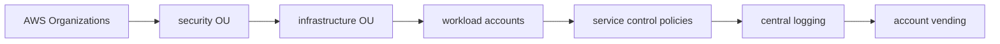

# Multi-Account and Landing Zones

## 30-Second Answer

Multi-Account and Landing Zones is the path from **AWS Organizations** to **account vending**. The essential handoffs are security OU, infrastructure OU, workload accounts, service control policies, central logging. In production, I verify each handoff independently, keep its identity and state boundary visible, and operate it against availability, latency, security, and recovery objectives.

## Mental Model

Read this diagram as a concrete sequence, not a generic maturity loop: a failure after **central logging** has different evidence and ownership from a failure at **security OU**.

## Why It Exists

Without multi-account and landing zones, teams must manually coordinate aws organizations, workload accounts, and account vending. The technology standardizes those interfaces so changes are repeatable, reviewable, and diagnosable. It is justified when the repeated operational risk exceeds the cost of owning the abstraction.

## How It Works

**AWS Organizations** owns stage 1; **security OU** owns stage 2; **infrastructure OU** owns stage 3; **workload accounts** owns stage 4; **service control policies** owns stage 5; **central logging** owns stage 6; **account vending** owns stage 7. Follow resource IDs, revisions, events, and timestamps across these stages; an acknowledgement at one stage never proves completion at the next.

## Mechanisms

* **AWS Organizations:** Inspect its native state, events, latency, permissions, and capacity before moving to the next component.
* **security OU:** Inspect its native state, events, latency, permissions, and capacity before moving to the next component.
* **infrastructure OU:** Inspect its native state, events, latency, permissions, and capacity before moving to the next component.
* **workload accounts:** Inspect its native state, events, latency, permissions, and capacity before moving to the next component.
* **service control policies:** Inspect its native state, events, latency, permissions, and capacity before moving to the next component.
* **central logging:** Inspect its native state, events, latency, permissions, and capacity before moving to the next component.
* **account vending:** Inspect its native state, events, latency, permissions, and capacity before moving to the next component.

## Production Architecture

Deploy aws organizations with least privilege and an auditable change path. Isolate workload accounts by environment and failure domain, make account vending observable, and test loss of each dependency. Version the interface between stages so producers and consumers can roll independently.

## Failure Modes

| Failure | Evidence | Response |
|---|---|---|
| quota, IP, or zonal exhaustion defeats nominal capacity | Compare stage latency and revision at security OU | Stop promotion and restore the last verified input |
| an IAM trust policy grants a wider principal than intended | Inspect saturation, quotas, events, and pending work at workload accounts | Add valid capacity or shed load; do not retry without a bound |
| a shared account or network dependency widens blast radius | Compare the user result with account vending and upstream state | Mitigate first, preserve evidence, then repair the faulty contract |

## Trade-offs

More automation across aws organizations and account vending improves consistency but can propagate an error faster. Strong isolation narrows blast radius but increases cost and upgrades. Managed implementations reduce component toil; self-managed implementations offer control but require availability, backup, security patching, and on-call expertise.

## Lead-Level Follow-ups

* Which team owns **workload accounts**, and what user-facing SLO proves it works?
* What remains available when **security OU** is down?
* Where is state durable, and how are restore and upgrade tested?

## My Experience Prompt

Describe a change to workload accounts: state the constraint, the exact signal that selected the design, the rollback boundary, and the durable guardrail you added.

## Recall Check

1. What does **AWS Organizations** send to **security OU**?
2. Which component stores or reports authoritative state?
3. How does **central logging** affect **account vending**?
4. Which capacity limit fails first at production scale?
5. When is a simpler managed alternative preferable?

## Related Notes

* [Category index](index.md)
* [Interview dashboard](../00-interview-dashboard.md)
