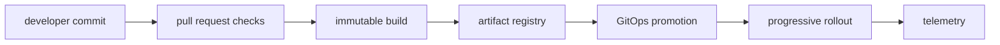

# Code to Production

## 30-Second Answer

Code to Production is the path from **developer commit** to **telemetry**. The essential handoffs are pull request checks, immutable build, artifact registry, GitOps promotion, progressive rollout. In production, I verify each handoff independently, keep its identity and state boundary visible, and operate it against availability, latency, security, and recovery objectives.

## Mental Model

Read this diagram as a concrete sequence, not a generic maturity loop: a failure after **progressive rollout** has different evidence and ownership from a failure at **pull request checks**.

## Why It Exists

Without code to production, teams must manually coordinate developer commit, artifact registry, and telemetry. The technology standardizes those interfaces so changes are repeatable, reviewable, and diagnosable. It is justified when the repeated operational risk exceeds the cost of owning the abstraction.

## How It Works

**developer commit** owns stage 1; **pull request checks** owns stage 2; **immutable build** owns stage 3; **artifact registry** owns stage 4; **GitOps promotion** owns stage 5; **progressive rollout** owns stage 6; **telemetry** owns stage 7. Follow resource IDs, revisions, events, and timestamps across these stages; an acknowledgement at one stage never proves completion at the next.

## Mechanisms

* **developer commit:** Inspect its native state, events, latency, permissions, and capacity before moving to the next component.
* **pull request checks:** Inspect its native state, events, latency, permissions, and capacity before moving to the next component.
* **immutable build:** Inspect its native state, events, latency, permissions, and capacity before moving to the next component.
* **artifact registry:** Inspect its native state, events, latency, permissions, and capacity before moving to the next component.
* **GitOps promotion:** Inspect its native state, events, latency, permissions, and capacity before moving to the next component.
* **progressive rollout:** Inspect its native state, events, latency, permissions, and capacity before moving to the next component.
* **telemetry:** Inspect its native state, events, latency, permissions, and capacity before moving to the next component.

## Production Architecture

Deploy developer commit with least privilege and an auditable change path. Isolate artifact registry by environment and failure domain, make telemetry observable, and test loss of each dependency. Version the interface between stages so producers and consumers can roll independently.

## Failure Modes

| Failure | Evidence | Response |
|---|---|---|
| a non-reproducible build changes bytes between environments | Compare stage latency and revision at pull request checks | Stop promotion and restore the last verified input |
| overprivileged pipeline credentials bypass review | Inspect saturation, quotas, events, and pending work at artifact registry | Add valid capacity or shed load; do not retry without a bound |
| a green pipeline ignores rollout health | Compare the user result with telemetry and upstream state | Mitigate first, preserve evidence, then repair the faulty contract |

## Trade-offs

More automation across developer commit and telemetry improves consistency but can propagate an error faster. Strong isolation narrows blast radius but increases cost and upgrades. Managed implementations reduce component toil; self-managed implementations offer control but require availability, backup, security patching, and on-call expertise.

## Lead-Level Follow-ups

* Which team owns **artifact registry**, and what user-facing SLO proves it works?
* What remains available when **pull request checks** is down?
* Where is state durable, and how are restore and upgrade tested?

## My Experience Prompt

Describe a change to artifact registry: state the constraint, the exact signal that selected the design, the rollback boundary, and the durable guardrail you added.

## Recall Check

1. What does **developer commit** send to **pull request checks**?
2. Which component stores or reports authoritative state?
3. How does **progressive rollout** affect **telemetry**?
4. Which capacity limit fails first at production scale?
5. When is a simpler managed alternative preferable?

## Related Notes

* [Category index](index.md)
* [Interview dashboard](../00-interview-dashboard.md)
