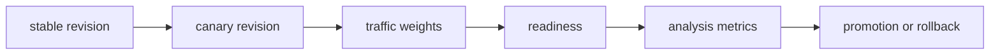

# Release and Deployment Strategies

## 30-Second Answer

Release and Deployment Strategies is the path from **stable revision** to **promotion or rollback**. The essential handoffs are canary revision, traffic weights, readiness, analysis metrics. In production, I verify each handoff independently, keep its identity and state boundary visible, and operate it against availability, latency, security, and recovery objectives.

## Mental Model

Read this diagram as a concrete sequence, not a generic maturity loop: a failure after **analysis metrics** has different evidence and ownership from a failure at **canary revision**.

## Why It Exists

Without release and deployment strategies, teams must manually coordinate stable revision, readiness, and promotion or rollback. The technology standardizes those interfaces so changes are repeatable, reviewable, and diagnosable. It is justified when the repeated operational risk exceeds the cost of owning the abstraction.

## How It Works

**stable revision** owns stage 1; **canary revision** owns stage 2; **traffic weights** owns stage 3; **readiness** owns stage 4; **analysis metrics** owns stage 5; **promotion or rollback** owns stage 6. Follow resource IDs, revisions, events, and timestamps across these stages; an acknowledgement at one stage never proves completion at the next.

## Mechanisms

* **stable revision:** Inspect its native state, events, latency, permissions, and capacity before moving to the next component.
* **canary revision:** Inspect its native state, events, latency, permissions, and capacity before moving to the next component.
* **traffic weights:** Inspect its native state, events, latency, permissions, and capacity before moving to the next component.
* **readiness:** Inspect its native state, events, latency, permissions, and capacity before moving to the next component.
* **analysis metrics:** Inspect its native state, events, latency, permissions, and capacity before moving to the next component.
* **promotion or rollback:** Inspect its native state, events, latency, permissions, and capacity before moving to the next component.

## Production Architecture

Deploy stable revision with least privilege and an auditable change path. Isolate readiness by environment and failure domain, make promotion or rollback observable, and test loss of each dependency. Version the interface between stages so producers and consumers can roll independently.

## Failure Modes

| Failure | Evidence | Response |
|---|---|---|
| a non-reproducible build changes bytes between environments | Compare stage latency and revision at canary revision | Stop promotion and restore the last verified input |
| overprivileged pipeline credentials bypass review | Inspect saturation, quotas, events, and pending work at readiness | Add valid capacity or shed load; do not retry without a bound |
| a green pipeline ignores rollout health | Compare the user result with promotion or rollback and upstream state | Mitigate first, preserve evidence, then repair the faulty contract |

## Trade-offs

More automation across stable revision and promotion or rollback improves consistency but can propagate an error faster. Strong isolation narrows blast radius but increases cost and upgrades. Managed implementations reduce component toil; self-managed implementations offer control but require availability, backup, security patching, and on-call expertise.

## Lead-Level Follow-ups

* Which team owns **readiness**, and what user-facing SLO proves it works?
* What remains available when **canary revision** is down?
* Where is state durable, and how are restore and upgrade tested?

## My Experience Prompt

Describe a change to readiness: state the constraint, the exact signal that selected the design, the rollback boundary, and the durable guardrail you added.

## Recall Check

1. What does **stable revision** send to **canary revision**?
2. Which component stores or reports authoritative state?
3. How does **analysis metrics** affect **promotion or rollback**?
4. Which capacity limit fails first at production scale?
5. When is a simpler managed alternative preferable?

## Related Notes

* [Category index](index.md)
* [Interview dashboard](../00-interview-dashboard.md)
