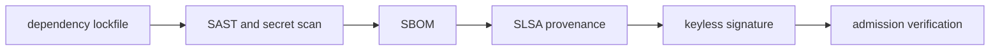

# Supply Chain Security

## 30-Second Answer

Supply Chain Security is the path from **dependency lockfile** to **admission verification**. The essential handoffs are SAST and secret scan, SBOM, SLSA provenance, keyless signature. In production, I verify each handoff independently, keep its identity and state boundary visible, and operate it against availability, latency, security, and recovery objectives.

## Mental Model

Read this diagram as a concrete sequence, not a generic maturity loop: a failure after **keyless signature** has different evidence and ownership from a failure at **SAST and secret scan**.

## Why It Exists

Without supply chain security, teams must manually coordinate dependency lockfile, slsa provenance, and admission verification. The technology standardizes those interfaces so changes are repeatable, reviewable, and diagnosable. It is justified when the repeated operational risk exceeds the cost of owning the abstraction.

## How It Works

**dependency lockfile** owns stage 1; **SAST and secret scan** owns stage 2; **SBOM** owns stage 3; **SLSA provenance** owns stage 4; **keyless signature** owns stage 5; **admission verification** owns stage 6. Follow resource IDs, revisions, events, and timestamps across these stages; an acknowledgement at one stage never proves completion at the next.

## Mechanisms

* **dependency lockfile:** Inspect its native state, events, latency, permissions, and capacity before moving to the next component.
* **SAST and secret scan:** Inspect its native state, events, latency, permissions, and capacity before moving to the next component.
* **SBOM:** Inspect its native state, events, latency, permissions, and capacity before moving to the next component.
* **SLSA provenance:** Inspect its native state, events, latency, permissions, and capacity before moving to the next component.
* **keyless signature:** Inspect its native state, events, latency, permissions, and capacity before moving to the next component.
* **admission verification:** Inspect its native state, events, latency, permissions, and capacity before moving to the next component.

## Production Architecture

Deploy dependency lockfile with least privilege and an auditable change path. Isolate slsa provenance by environment and failure domain, make admission verification observable, and test loss of each dependency. Version the interface between stages so producers and consumers can roll independently.

## Failure Modes

| Failure | Evidence | Response |
|---|---|---|
| a non-reproducible build changes bytes between environments | Compare stage latency and revision at SAST and secret scan | Stop promotion and restore the last verified input |
| overprivileged pipeline credentials bypass review | Inspect saturation, quotas, events, and pending work at SLSA provenance | Add valid capacity or shed load; do not retry without a bound |
| a green pipeline ignores rollout health | Compare the user result with admission verification and upstream state | Mitigate first, preserve evidence, then repair the faulty contract |

## Trade-offs

More automation across dependency lockfile and admission verification improves consistency but can propagate an error faster. Strong isolation narrows blast radius but increases cost and upgrades. Managed implementations reduce component toil; self-managed implementations offer control but require availability, backup, security patching, and on-call expertise.

## Lead-Level Follow-ups

* Which team owns **SLSA provenance**, and what user-facing SLO proves it works?
* What remains available when **SAST and secret scan** is down?
* Where is state durable, and how are restore and upgrade tested?

## My Experience Prompt

Describe a change to slsa provenance: state the constraint, the exact signal that selected the design, the rollback boundary, and the durable guardrail you added.

## Recall Check

1. What does **dependency lockfile** send to **SAST and secret scan**?
2. Which component stores or reports authoritative state?
3. How does **keyless signature** affect **admission verification**?
4. Which capacity limit fails first at production scale?
5. When is a simpler managed alternative preferable?

## Related Notes

* [Category index](index.md)
* [Interview dashboard](../00-interview-dashboard.md)
