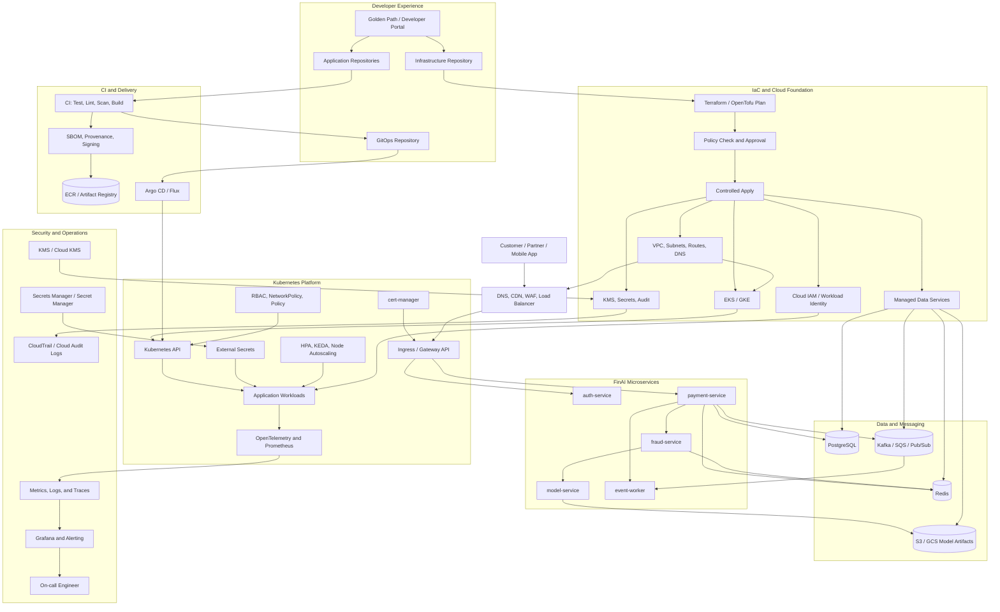

# Core Path — End-to-End Platform Scenario

## Why This Page Exists

A platform can feel like an unrelated list of Terraform, cloud, CI, Kubernetes, databases, security, and monitoring products. This page supplies one compressed mental model: follow a FinAI payment from the developer's change, through infrastructure and delivery, into a production request and an incident. Architectural responsibilities come first; AWS and GCP products are interchangeable implementations where their contracts are equivalent.

This is a map, not another handbook. Read it in one focused session, redraw the master diagram, and use the linked deep dives only where your explanation becomes weak. At every boundary ask: **what is the desired state, what actually runs, which identity is used, where is durable state, and what evidence proves success?**

## What You Will Understand

After this path, you should be able to explain:

* how reviewed infrastructure code creates a bounded cloud foundation;
* how one tested, signed image digest moves from CI to production through GitOps;
* how Kubernetes and shared platform services turn that intent into reachable workloads;
* how a payment uses microservices, PostgreSQL, Redis, messaging, and one model-serving service;
* how identity, secrets, certificates, and policies constrain every handoff;
* how telemetry connects a user SLO to a commit, model revision, Pod, node, and cloud quota;
* how ownership and control-plane boundaries guide investigation and recovery.

## The FinAI Scenario

FinAI operates a regulated payment and fraud-detection system on EKS or GKE. A customer, partner, or mobile application submits a payment. The platform authenticates the caller, authorizes the operation, validates the request, and records the transaction. It consults bounded cached or derived information, evaluates deterministic fraud rules, and calls a specialized model service for a fraud score. Policy combines those signals to accept, reject, or flag the transaction. It persists an auditable decision, publishes events for asynchronous work, and emits metrics, logs, traces, and alerts.

The model is deliberately an ordinary production dependency with unusual resource and latency characteristics. This path covers inference, not model training, RAG, feature stores, vector databases, or distributed training.

## Two-to-Three-Hour Study Plan

|        Time | Activity                                         |
| ----------: | ------------------------------------------------ |
|    0–20 min | Understand and redraw the master diagram         |
|   20–45 min | IaC and cloud foundation                         |
|   45–70 min | CI, artifacts, GitOps, and deployment            |
|  70–100 min | Kubernetes, platform services, and microservices |
| 100–125 min | Databases, messaging, and AI inference           |
| 125–150 min | Security and observability                       |
| 150–170 min | Incident investigation and recovery              |
| 170–180 min | Interview explanation and recall                 |

## The Complete Platform in One Diagram

This diagram inventories the connected platform capabilities. Follow it with [Golden Path: From Idea to Production](../05-golden-path-from-idea-to-production.md) for the specific developer journey that composes them into one supported service workflow.



Read downward in three paths. Developers create infrastructure and application intent. Reconcilers produce cloud and Kubernetes resources. User traffic crosses the edge and services while operational evidence flows to on-call. The registry contains deployable bytes, Git contains deployment intent, and PostgreSQL contains business truth; confusing these stores creates unsafe recovery plans.

## The Six Platform Layers

### 1. Infrastructure as Code

Terraform or OpenTofu declares the account or project foundation, VPC, private and public subnets, routes, IAM, EKS or GKE, managed PostgreSQL and Redis, messaging, object storage, DNS, KMS, secret stores, and audit logging. Separate environments or accounts/projects limit credentials and blast radius. Modules encode repeatable standards, while plans expose proposed changes for review and policy validation.

Remote Terraform state maps resource addresses to provider objects. It should be encrypted, access-controlled, versioned, and locked so two applies cannot write concurrently. Teams periodically plan against refreshed provider data to detect drift and either import, codify, or remove out-of-band changes. **Terraform state is not an application-data backup. Restoring state does not automatically revert infrastructure**; it changes Terraform's knowledge, while provider APIs and explicit configuration changes alter real resources. PostgreSQL backups and restore tests remain separate responsibilities.

### 2. CI and artifacts

The supply path is:

```text
commit → pull request → test → lint → dependency scan → build → image scan → SBOM → provenance → signing → immutable digest
```

CI isolates untrusted pull-request work, orders fast feedback before expensive builds, and records evidence. Build once and promote the same digest through environments; do not rebuild separately for production because the bytes would no longer be the tested artifact. An SBOM describes contents, provenance describes origin and build process, and a signature binds an approved identity to the digest. Tags may aid humans, but deployment pins the immutable digest.

CI may push an artifact and propose a GitOps change using narrowly scoped, short-lived credentials. It should not have unrestricted production-cluster credentials. This separates artifact production from deployment authorization and leaves reviewable evidence.

### 3. GitOps and CD

The delivery contract is:

```text
CI proposes GitOps update → review → Argo CD or Flux observes Git → Helm or Kustomize renders → Kubernetes is reconciled → readiness and rollout health are observed
```

Git stores deployment intent. Argo CD reconciles desired and live state, reporting sync and health; Helm or Kustomize renders reusable configuration. Argo CD does not prove business correctness. A Deployment can be Available while fraud decisions are wrong or latency violates its SLO, so progressive exposure must also inspect service telemetry.

An abort stops further exposure. Rollback normally means reverting Git or restoring a previous artifact digest in Git, letting reconciliation converge rather than issuing an undocumented imperative change. Emergency actions must be recorded and reconciled afterward to avoid permanent drift.

### 4. Kubernetes platform

A Deployment manages ReplicaSets and Pods. A Service gives stable discovery, and EndpointSlices enumerate ready backends. Ingress or Gateway API routes edge traffic. ConfigMaps hold non-secret configuration; Secrets are Kubernetes delivery objects, preferably populated from an external store. Requests drive scheduling and resource guarantees, while limits constrain use. Readiness removes an unready Pod from service endpoints; liveness restarts a stuck process and must not be an aggressive dependency check.

HPA scales replicas from workload signals, KEDA can scale event consumers from queue signals, and node autoscaling provisions nodes when Pods cannot fit. None substitutes for the others. Affinity, taints, GPU requests, and topology spread influence placement; a PodDisruptionBudget limits voluntary concurrent disruption but does not guarantee availability.

The platform team provides the gateway controller, cert-manager, External Secrets, admission policy, workload identity, autoscaling, telemetry, and reusable Helm or golden-path templates. Product teams consume these capabilities without each rebuilding cluster plumbing.

### 5. Runtime microservices and data

The synchronous route is:

```text
customer → edge → gateway → auth-service → payment-service → fraud-service → model-service
```

PostgreSQL owns durable transaction and audit state, including the decision and model/rule revisions used. Redis holds bounded cached or derived data such as short-lived risk counters; expiry and fallback behavior prevent cache loss from corrupting business truth. Messaging decouples notifications, settlement, and audit export from the request. Object storage holds immutable model artifacts, verified by version or digest when the model service loads them. The model service returns a score; deterministic policy, not the model alone, turns rules and score into accept, reject, or flag.

### 6. Security and operations

Cloud IAM constrains people and automation. Workload identity maps a Pod service account to scoped, short-lived cloud credentials, avoiding static node-wide keys. Kubernetes RBAC protects API actions; NetworkPolicy limits workload traffic. TLS protects connections, external stores protect secret source values, and KMS protects keys and encrypted resources. Image signatures and admission policy reject unapproved artifacts. Cloud, Kubernetes, and application audit logs preserve who changed or decided what.

Metrics quantify behavior, logs give event context, and traces connect request stages. Alerts should route actionable SLO or saturation risks to an explicit owner. Backups require restore testing, documented recovery objectives, and access that still works during an incident. Incident ownership is named before failure, not improvised during it.

## AWS and GCP Component Mapping

Start with responsibility—organizational isolation, networking, compute orchestration, durable storage, or identity—then select a provider implementation. Product names do not change the need for ownership, evidence, and recovery.

| Responsibility        | AWS                           | GCP                             |
| --------------------- | ----------------------------- | ------------------------------- |
| Organization boundary | Organizations / Control Tower | Organization / Resource Manager |
| Networking            | VPC                           | VPC                             |
| Kubernetes            | EKS                           | GKE                             |
| Registry              | ECR                           | Artifact Registry               |
| PostgreSQL            | RDS / Aurora PostgreSQL       | Cloud SQL / AlloyDB             |
| Redis                 | ElastiCache                   | Memorystore                     |
| Object storage        | S3                            | Cloud Storage                   |
| Messaging             | SQS, SNS, MSK                 | Pub/Sub                         |
| DNS                   | Route 53                      | Cloud DNS                       |
| Load balancing        | ALB / NLB                     | Cloud Load Balancing            |
| WAF                   | AWS WAF                       | Cloud Armor                     |
| Secrets               | Secrets Manager               | Secret Manager                  |
| Keys                  | KMS                           | Cloud KMS                       |
| Audit                 | CloudTrail                    | Cloud Audit Logs                |
| Workload identity     | EKS Pod Identity / IRSA       | Workload Identity Federation    |

## Flow 1 — Building the Cloud Foundation

```text
infrastructure pull request → Terraform plan → policy validation → approval → apply → network, IAM, cluster, and data services → outputs consumed by platform configuration
```

A pull request shows plan output without exposing secrets. Policy checks encryption, public exposure, tags, regions, and destructive changes; a separate controlled identity applies after approval. Remote state and locking serialize changes within a state boundary. Small states aligned to accounts, environments, and lifecycle reduce the blast radius of credentials, locks, and faulty plans.

Foundation outputs—cluster endpoint, workload identity issuer, subnets, DNS zones, secret identifiers, and data endpoints—are passed through controlled interfaces to platform configuration, not copied by hand. Account/project boundaries keep production distinct. Scheduled plans detect drift. Workload identity relationships are provisioned on both sides: cloud trust and Kubernetes service account. A plan is evidence of intent, not proof that the apply or service health succeeded.

## Flow 2 — Delivering a Change to Production

```text
application pull request → CI → immutable image digest → registry → GitOps update → Argo CD → Deployment rollout → readiness → progressive exposure → telemetry
```

CI tests and produces provenance, SBOM, scan results, signature, and one digest. Promotion changes the environment's Git reference to that same digest. Review establishes authorization; Argo CD renders and reconciles it. Kubernetes gradually creates Pods, readiness admits viable endpoints, and canary or staged routing exposes a limited share.

Rollout automation watches restart rate, errors, latency, and relevant business signals. A failed gate aborts exposure. Revert the GitOps commit to the prior digest for a durable rollback. Readiness proves only the configured local check at that moment; it does not prove payment correctness, peak-load batching, or the p95 SLO. Provenance answers “where did these bytes come from?” while telemetry answers “how do they behave?”

## Flow 3 — Serving a Payment Request

```text
user → DNS/CDN/WAF → load balancer → gateway → auth-service → payment-service → fraud-service → model-service → response
```

DNS directs the caller to the edge; CDN controls static or safe cacheable content, WAF blocks known malicious patterns, and the load balancer reaches the Kubernetes gateway. TLS terminates at an approved boundary. The gateway enforces coarse routing and limits. The auth service validates the token and identity. Payment service performs operation-level authorization again—authentication alone is insufficient—and validates schema, currency, limits, and an idempotency key.

Payment service records transaction intent in PostgreSQL and consults Redis for bounded counters or derived risk data. Fraud service evaluates deterministic rules and calls model service with a strict timeout. Model service loads a versioned artifact from object storage and returns a score. Payment policy combines the score and rules, records the auditable decision and revision identifiers in PostgreSQL, then returns accept, reject, or flag. It publishes an event using an outbox or equivalent reliable boundary so database commit and publication cannot silently diverge.

Trace context propagates across gateway and every service, database call, and message metadata. Timeouts shrink down the call chain. Retries are bounded, jittered, and used only where the operation is idempotent; retrying an overloaded model can amplify failure. Redis failure uses a documented safe fallback. Messaging remains off the critical response path unless regulation explicitly requires synchronous confirmation.

## Flow 4 — Processing Asynchronous Events

```text
payment-service → event → queue or stream → worker → downstream action
```

Each event carries a stable event ID and payment idempotency key. A partition or ordering key such as account ID preserves only the ordering the business requires, avoiding a global bottleneck. Workers acknowledge after their durable side effect. Because a crash can occur between the side effect and acknowledgement, practical processing is at least once: consumers deduplicate or make writes idempotent.

Transient failures use capped backoff and retry limits. A poison message that repeatedly fails moves to a dead-letter destination with reason, payload reference, and replay procedure rather than blocking a partition forever. Consumer lag, oldest-message age, retry volume, dead-letter count, and downstream latency expose health. KEDA may scale workers from lag, but bounded concurrency protects PostgreSQL and partners. Replays are authorized, observable, and safe against duplicate money movement.

## Flow 5 — Identity, Secrets, and Certificates

```text
cloud workload identity → Pod service account → secret-store authorization → External Secrets → Kubernetes Secret → application
```

The Pod receives a projected identity token tied to its service account. Cloud IAM validates that trust and grants only the named secret versions or APIs. External Secrets reads the external value and writes a namespace-scoped Kubernetes Secret; the application consumes it as a file or environment input and supports rotation. RBAC and namespace isolation limit Kubernetes access. **Secrets must not be committed directly to Git**, including encrypted-looking plaintext without an approved secret-management design.

```text
Certificate → cert-manager → issuer → DNS or HTTP challenge → TLS Secret → gateway
```

A Certificate resource declares names and renewal intent. cert-manager talks to an approved issuer, completes a DNS or HTTP ownership challenge, and stores the issued keypair in a TLS Secret used by the gateway. Monitor expiry and renewal errors. Workload identity should authorize only the necessary DNS zone or issuer operation; certificate automation is still privileged automation.

## Flow 6 — Observability and Incident Response

```text
application and platform telemetry → collectors and Prometheus → metrics, logs, and traces → dashboards and alerts → on-call → mitigation → recovery → postmortem
```

OpenTelemetry collectors receive traces and structured telemetry; Prometheus scrapes platform and application metrics. Backends retain searchable logs and traces, while dashboards join user SLIs to dependencies. Alerts page on symptoms or imminent exhaustion with an owner, runbook, and useful labels—not every low-level anomaly.

Correlate commit SHA, image digest, deployment revision, model revision, namespace, Pod, node, cluster, region, and trace ID. Start with user impact, then traverse dependency spans and saturation signals. On-call declares scope, assigns incident command and operations, mitigates safely, verifies recovery against the original SLI, and records a blameless postmortem with owned actions.

## Control Plane Versus Data Plane

| Concern | Control plane | Data plane |
| --- | --- | --- |
| Cloud foundation | Terraform and cloud APIs plan/reconcile | running VPC, nodes, databases, and queues |
| Delivery | Git and Argo CD express/reconcile intent | serving Pods and application traffic |
| Kubernetes | API server, scheduler, and controllers | kubelet, containers, Services, and network traffic |
| Policy | policy definitions and configuration | admission/runtime enforcement decisions |
| Model serving | model deployment controller and revision intent | live inference requests in model Pods |

A control-plane outage may prevent change while an existing healthy data plane continues serving. That is a useful diagnostic distinction, not a guarantee: token validation, DNS, certificate, managed control, or other dependencies can couple the planes. Ask which existing operations need the unavailable component rather than assuming either total safety or total outage.

## Component Ownership

| Team              | Owns                                 | Does not own                     | Primary evidence                    |
| ----------------- | ------------------------------------ | -------------------------------- | ----------------------------------- |
| Application team  | business service, tests, service SLO | shared cluster controls          | service SLI and traces              |
| Platform team     | cluster and shared add-ons           | application business correctness | platform SLOs                       |
| Cloud foundation  | accounts, networks, managed services | application rollout              | cloud health and audit              |
| Security          | policies and risk controls           | every operational remediation    | policy and audit evidence           |
| Data/ML           | model artifact and quality           | complete payment service         | model quality and inference metrics |
| SRE/service owner | incident process and reliability     | all implementation work          | user-impact SLI                     |

Interfaces require collaboration, but “everyone owns everything” means nobody has a clear pager, decision, or remediation obligation. Service catalogs, runbooks, repositories, dashboards, and escalation paths should reflect this table.

## Security Across the Whole System

Security is a chain of controls rather than a final scanner. Organizational boundaries and separate production roles reduce blast radius. Pull-request approval, protected branches, isolated CI, provenance, signatures, digest pinning, and admission policy establish which code may run. Cloud workload identity and Kubernetes RBAC establish who may call APIs; NetworkPolicy and gateway authorization constrain which paths are reachable. TLS protects traffic, while KMS-backed encryption and external secret stores protect sensitive material.

The payment path applies authentication at entry and authorization at the business operation. Input limits, idempotency, safe errors, and audit records defend integrity. PostgreSQL access is least privilege; Redis contains no unbounded source of truth. Egress to model artifacts and third parties is explicit. Audit logs capture administrative actions, and decision records capture rule/model versions. Retention, backup, restoration, rotation, revocation, vulnerability response, and incident exercises make controls operational rather than ceremonial.

## What the AI Component Changes

A model revision is immutable and independently identifiable from the container. Loading it from object storage may dominate startup, so readiness must wait for a usable model and warm-up must exercise realistic inference. CPU versus GPU placement, device requests, taints, affinity, drivers, and larger memory requirements complicate scheduling. Cold starts and time to first response affect rollout capacity.

Batching improves throughput but adds queue delay; request queues therefore need bounds and observability. GPU scarcity and quota make headroom valuable, while model quality and safety require version-specific evaluation alongside reliability. Rollback must restore the previous model digest and compatible serving configuration. Dashboards split queue, batch, latency, errors, GPU memory, and quality by model revision.

## What the AI Component Does Not Change

AI still requires IaC, CI, artifact integrity, GitOps, Kubernetes scheduling, identity, secrets, networking, observability, SLOs, rollback, and incident response. The model service obeys timeouts and authorization like any dependency and cannot own the complete payment decision. Specialized metrics add evidence; they do not replace user SLIs. The [GPU scheduling](../ai-platform/02-gpu-nodes-and-scheduling.md) and [model serving](../ai-platform/04-model-serving-kserve-vllm-triton.md) notes go deeper without expanding this scenario into training or a full MLOps platform.

## One End-to-End Production Incident

FinAI deploys model revision `fraud-v12`. Do not begin with a favored cause. The evidence arrives in this order:

| Evidence | Observation |
| --- | --- |
| User SLI | payment API p95 rises above its objective; flags and timeouts increase |
| GitOps revision | reviewed commit changes only the model artifact to `fraud-v12` |
| Argo CD / rollout | application is Synced and Healthy; rollout initially reports Available |
| Kubernetes events | later show model container restarts and unschedulable replacement Pods |
| Restart reason | previous containers report GPU out-of-memory termination |
| GPU metrics | device memory approaches capacity before each restart |
| Queue and model | inference queue depth and age rise; batch size/throughput fall; model latency rises |
| Caller | fraud-service timeout rate rises, followed by payment latency |
| Autoscaling | CPU-based HPA stays near target; GPU node group is at configured maximum |
| Provisioning | additional GPU Pods remain Pending and node provisioning cannot add capacity |
| Cloud audit/quota | provider reports the regional GPU quota would be exceeded |

Readiness passed because `fraud-v12` loaded and initially returned successful responses. Under production traffic it uses more GPU memory and batches less efficiently. Queue latency grows, memory pressure restarts model Pods, and fraud calls time out. CPU-based HPA cannot represent GPU memory or queue demand. The GPU node group has reached its maximum, and even a requested increase cannot provision nodes because cloud GPU quota is exhausted. This combined mechanism—not merely “Kubernetes is slow”—is the root cause.

## Investigation and Recovery Walkthrough

1. **Confirm user impact.** Check payment p95, success/decision rates, affected regions, and error-budget burn; declare incident severity from customer impact.
2. **Identify the affected revision.** Correlate alert onset with GitOps commit, image digest, deployment revision, and model revision `fraud-v12`.
3. **Compare healthy and unhealthy revisions.** Contrast `fraud-v11` and `fraud-v12` model latency, batch efficiency, GPU memory, queue age, and quality/error signals.
4. **Inspect rollout state.** Note that Argo CD sync and Deployment availability succeeded; neither proves production-load correctness.
5. **Inspect Pod restarts and events.** Use events, termination reasons, previous logs, and node placement to establish GPU out-of-memory restarts and Pending replacements.
6. **Inspect GPU memory and queue signals.** Align memory saturation, reduced batching, oldest-request age, model p95, and fraud timeout rate on one timeline.
7. **Confirm failed node scale-out.** Check HPA input, unschedulable reasons, node group maximum, and autoscaler decisions.
8. **Verify cloud quota.** Confirm the provider quota event and current regional GPU consumption; do not infer quota solely from Pending Pods.
9. **Pause or abort rollout.** Stop further exposure and changes, communicate the mitigation, and preserve evidence.
10. **Revert GitOps to the previous model digest.** Restore the reviewed `fraud-v11` artifact/configuration and let Argo CD reconcile; use an approved fallback policy if necessary.
11. **Verify queue and SLO recovery.** Watch restart cessation, queue drain, model/fraud latency, payment p95, and error-budget burn through a stable observation window.

Long-term work includes model-memory checks, production-like load tests, GPU-aware HPA/KEDA signals, canary rollout, bounded queues, model warm-up, proactive quota management, reserved headroom, an approved fallback policy, model-revision dashboards, and SLO-based abort criteria. Adding capacity alone is not sufficient: it does not repair inefficient batching, unsafe queue growth, missing canary gates, or a model that cannot fit reliably.

## Core Commands and Evidence

Use commands to test a hypothesis, not to collect an unbounded transcript:

```bash
terraform plan
terraform state list
argocd app get finai
argocd app diff finai
kubectl get deploy,rs,pods,svc,endpointslices -n finai
kubectl describe pod -n finai <pod>
kubectl get events -n finai --sort-by=.lastTimestamp
kubectl top pod -n finai
kubectl top node
kubectl get hpa -n finai
kubectl get nodes --show-labels
kubectl logs -n finai <pod> --previous
```

These twelve commands expose intent, inventory, rollout, placement, restarts, and basic resources. They do not show every decisive signal. Query Prometheus for payment and model latency histograms, fraud timeout rate, queue depth/age, GPU memory, restart rate, and SLO burn grouped by model revision. Search structured logs by trace ID, payment ID, digest, and previous container. Inspect traces for time spent queued versus executing. Use autoscaler status plus the provider's quota page, API event, and audit record to distinguish a node-group limit from cloud quota. Preserve timestamps and links in the incident timeline.

## Platform Trade-offs

* **Managed services versus control:** managed databases and queues reduce operational work but add provider limits and portability costs. Own the recovery contract either way.
* **Synchronous certainty versus resilience:** synchronous fraud scoring gives an immediate decision but puts model latency on the payment path. Strict timeouts and an approved fallback define the risk.
* **Batch throughput versus latency:** larger batches improve GPU efficiency but can increase queue delay. Optimize against the payment SLO, not raw utilization.
* **Isolation versus cost:** separate accounts, clusters, node pools, and state reduce blast radius but increase overhead. Isolate where risk and lifecycle justify it.
* **Fast rollout versus evidence:** readiness enables speed; canaries and SLO gates provide confidence. Neither should be confused with model quality approval.
* **Autoscaling versus headroom:** scaling saves idle cost but is bounded by startup time and quota. Scarce GPU workloads need reserved headroom.
* **Cache speed versus correctness:** Redis accelerates derived lookups, but PostgreSQL remains durable truth and degraded behavior must be explicit.
* **GitOps consistency versus emergency speed:** reconciliation prevents drift; break-glass mitigation may be necessary but must be audited and brought back into Git.

## 60-Second Interview Answer

I divide the system into foundation, delivery, platform, runtime data, and operations layers. Reviewed infrastructure as code creates isolated networking, identity, Kubernetes, and managed data services. CI tests once, scans and signs one immutable image digest, then proposes a reviewed GitOps change; the cluster reconciler deploys that same digest without broad CI access to production. Kubernetes supplies scheduling and service discovery, while the platform supplies gateways, certificates, external secrets, policy, autoscaling, and telemetry. A payment is authenticated and authorized, persisted in PostgreSQL, enriched with bounded Redis data, checked by deterministic fraud rules, and scored by a versioned model service. Events decouple downstream work with idempotent, at-least-once consumers. Workload identity, TLS, least privilege, signed artifacts, and audit logs secure each boundary. Metrics, logs, and traces correlate user SLOs with deployment and model revisions. During failure, we stop exposure, revert Git to the previous digest, verify queue and SLO recovery, then improve canary gates, capacity, quota, and tests.

## Five-Minute Architecture Walkthrough

1. **Business request:** a regulated payment must end as accept, reject, or flag with an auditable decision.
2. **Cloud foundation:** reviewed IaC creates bounded accounts/projects, network, identity, cluster, managed data, keys, DNS, and audit.
3. **Delivery:** CI produces evidence and immutable bytes; GitOps authorizes promotion; Argo CD reconciles.
4. **Kubernetes platform:** Deployments, Services, EndpointSlices, gateway, policy, secrets, certificates, and autoscalers supply the runtime contract.
5. **Runtime request:** edge controls precede authentication, operation authorization, validation, rules, and scoring with trace context and budgets.
6. **State and messaging:** PostgreSQL is durable truth, Redis is bounded derived state, and idempotent consumers process at-least-once events.
7. **AI inference:** a versioned artifact, GPU placement, warm-up, batching, bounded queues, and rollback make the model a specialized service.
8. **Security:** short-lived workload identity, RBAC, NetworkPolicy, TLS, external secrets, signatures, policy, and audit protect handoffs.
9. **Observability:** user SLIs connect to logs, traces, resource signals, revision metadata, alerts, and named owners.
10. **Recovery and trade-offs:** pause exposure, revert intent, verify recovery, then balance latency, throughput, isolation, headroom, cost, and fallback risk.

## Ten Memory Anchors

1. **Intent:** Git and Terraform describe desired state.
2. **Bytes:** build once; promote a digest.
3. **Reconcile:** controllers converge, then telemetry judges.
4. **Route:** edge, gateway, identity, business authorization.
5. **Truth:** PostgreSQL owns durable decisions.
6. **Speed:** Redis is bounded and disposable.
7. **Decouple:** messages are at least once; consumers are idempotent.
8. **Score:** the model informs deterministic policy.
9. **Prove:** correlate SLO, trace, revision, Pod, node, quota.
10. **Recover:** stop, revert, verify, learn.

## Recall Exercise

Answer from memory before following any deep-dive link:

1. Why are Terraform state, GitOps intent, registry artifacts, and PostgreSQL backups different stores?
2. What evidence makes one image digest promotable, and why not rebuild for production?
3. What can Argo CD health prove, and what can it not prove?
4. How do Service, EndpointSlice, readiness, HPA, and node autoscaling interact?
5. Where are authentication and authorization applied in the payment path?
6. How do an outbox, idempotency key, retry cap, and dead-letter destination work together?
7. Which identities let a Pod obtain a secret without a static cloud key?
8. Which labels connect payment p95 to a specific model Pod and node?
9. Why did CPU HPA miss the `fraud-v12` failure?
10. Why is more GPU capacity an incomplete corrective action?

After answering all ten from memory, compare your response with the [Core Path ideal answers](recall-answers.md).

**Blank diagram-redraw exercise:** on an empty page draw six boxes for developer/delivery, foundation, Kubernetes, services, data, and operations. Add the artifact path, IaC path, payment path, telemetry path, and identity/secret path. Then compare it with the master diagram.

**Incident-hypothesis exercise:** payment p95 and inference queue age rise immediately after a model change, but readiness and CPU remain healthy. Write three competing hypotheses, the discriminating evidence for each, and the safest reversible mitigation before reading the incident again.

**Two-minute verbal explanation:** explain the platform without naming AWS or GCP for the first minute. In the second minute map responsibilities to one provider and finish with rollback and proof of recovery.

## Existing Deep Dives

These pages supply detail; use this Core Path to keep their relationships visible.

| Subject | Existing note |
| --- | --- |
| Terraform state | [Terraform State and Backends](../iac/02-terraform-state-and-backends.md) |
| CI pipeline design | [CI Pipeline Design](../cicd/02-ci-pipeline-design.md) |
| Artifacts and registries | [Build Artifacts and Registries](../cicd/03-build-artifacts-and-registries.md) |
| GitOps | [GitOps Continuous Delivery](../cicd/05-gitops-continuous-delivery.md) |
| Kubernetes control plane | [Control Plane](../kubernetes/02-control-plane.md) |
| Scheduling | [Scheduling and Capacity](../kubernetes/04-scheduling-and-capacity.md) |
| Networking | [Networking, CNI, Services, and Ingress](../kubernetes/05-networking-cni-services-ingress.md) |
| EKS design | [EKS Production Design](../aws/04-eks-production-design.md) |
| IAM and workload identity | [IAM and Workload Identity](../aws/03-iam-and-workload-identity.md) |
| PostgreSQL | [PostgreSQL Production Operations](../databases/01-postgresql-production-operations.md) |
| Redis | [Redis Production Operations](../databases/04-redis-production-operations.md) |
| Observability | [Metrics, Logs, and Traces](../observability/01-metrics-logs-and-traces.md) |
| SLOs | [Alerting, SLOs, and Error Budgets](../observability/04-alerting-slos-and-error-budgets.md) |
| Container security | [Container Image Hardening](../container-security/01-image-hardening.md) |
| GPU scheduling | [GPU Nodes and Scheduling](../ai-platform/02-gpu-nodes-and-scheduling.md) |
| Model serving | [Model Serving](../ai-platform/04-model-serving-kserve-vllm-triton.md) |
| Incident leadership | [Incident Leadership](../leadership/04-incident-leadership.md) |

## Further Reading

Continue with the [system map](../01-system-map.md) for rapid recall, the [platform engineering overview](../platform-engineering/index.md) for product thinking, and the [production simulator](../../simulator/index.md) to practice evidence-first diagnosis. Revisit this page after each deep dive and update your mental diagram—not this canonical scenario—with the detail you can now explain.
