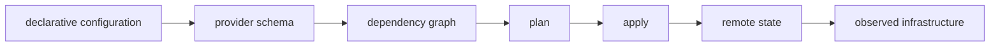

# IaC Mental Model

## 30-Second Answer

IaC Mental Model is the path from **declarative configuration** to **observed infrastructure**. The essential handoffs are provider schema, dependency graph, plan, apply, remote state. In production, I verify each handoff independently, keep its identity and state boundary visible, and operate it against availability, latency, security, and recovery objectives.

## Mental Model

Read this diagram as a concrete sequence, not a generic maturity loop: a failure after **remote state** has different evidence and ownership from a failure at **provider schema**.

## Why It Exists

Without iac mental model, teams must manually coordinate declarative configuration, plan, and observed infrastructure. The technology standardizes those interfaces so changes are repeatable, reviewable, and diagnosable. It is justified when the repeated operational risk exceeds the cost of owning the abstraction.

## How It Works

**declarative configuration** owns stage 1; **provider schema** owns stage 2; **dependency graph** owns stage 3; **plan** owns stage 4; **apply** owns stage 5; **remote state** owns stage 6; **observed infrastructure** owns stage 7. Follow resource IDs, revisions, events, and timestamps across these stages; an acknowledgement at one stage never proves completion at the next.

## Mechanisms

* **declarative configuration:** Inspect its native state, events, latency, permissions, and capacity before moving to the next component.
* **provider schema:** Inspect its native state, events, latency, permissions, and capacity before moving to the next component.
* **dependency graph:** Inspect its native state, events, latency, permissions, and capacity before moving to the next component.
* **plan:** Inspect its native state, events, latency, permissions, and capacity before moving to the next component.
* **apply:** Inspect its native state, events, latency, permissions, and capacity before moving to the next component.
* **remote state:** Inspect its native state, events, latency, permissions, and capacity before moving to the next component.
* **observed infrastructure:** Inspect its native state, events, latency, permissions, and capacity before moving to the next component.

## Production Architecture

Deploy declarative configuration with least privilege and an auditable change path. Isolate plan by environment and failure domain, make observed infrastructure observable, and test loss of each dependency. Version the interface between stages so producers and consumers can roll independently.

## Failure Modes

| Failure | Evidence | Response |
|---|---|---|
| concurrent or out-of-band mutation creates state drift | Compare stage latency and revision at provider schema | Stop promotion and restore the last verified input |
| a broad state file enlarges blast radius | Inspect saturation, quotas, events, and pending work at plan | Add valid capacity or shed load; do not retry without a bound |
| partial provider failure requires a new plan | Compare the user result with observed infrastructure and upstream state | Mitigate first, preserve evidence, then repair the faulty contract |

## Trade-offs

More automation across declarative configuration and observed infrastructure improves consistency but can propagate an error faster. Strong isolation narrows blast radius but increases cost and upgrades. Managed implementations reduce component toil; self-managed implementations offer control but require availability, backup, security patching, and on-call expertise.

## Lead-Level Follow-ups

* Which team owns **plan**, and what user-facing SLO proves it works?
* What remains available when **provider schema** is down?
* Where is state durable, and how are restore and upgrade tested?

## My Experience Prompt

Describe a change to plan: state the constraint, the exact signal that selected the design, the rollback boundary, and the durable guardrail you added.

## Recall Check

1. What does **declarative configuration** send to **provider schema**?
2. Which component stores or reports authoritative state?
3. How does **remote state** affect **observed infrastructure**?
4. Which capacity limit fails first at production scale?
5. When is a simpler managed alternative preferable?

## Related Notes

* [Category index](index.md)
* [Interview dashboard](../00-interview-dashboard.md)
