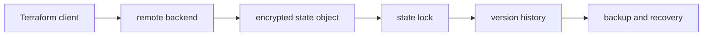

# Terraform State and Backends

## 30-Second Answer

Terraform State and Backends is the path from **Terraform client** to **backup and recovery**. The essential handoffs are remote backend, encrypted state object, state lock, version history. In production, I verify each handoff independently, keep its identity and state boundary visible, and operate it against availability, latency, security, and recovery objectives.

## Mental Model

Read this diagram as a concrete sequence, not a generic maturity loop: a failure after **version history** has different evidence and ownership from a failure at **remote backend**.

## Why It Exists

Without terraform state and backends, teams must manually coordinate terraform client, state lock, and backup and recovery. The technology standardizes those interfaces so changes are repeatable, reviewable, and diagnosable. It is justified when the repeated operational risk exceeds the cost of owning the abstraction.

## How It Works

**Terraform client** owns stage 1; **remote backend** owns stage 2; **encrypted state object** owns stage 3; **state lock** owns stage 4; **version history** owns stage 5; **backup and recovery** owns stage 6. Follow resource IDs, revisions, events, and timestamps across these stages; an acknowledgement at one stage never proves completion at the next.

## Mechanisms

* **Terraform client:** Inspect its native state, events, latency, permissions, and capacity before moving to the next component.
* **remote backend:** Inspect its native state, events, latency, permissions, and capacity before moving to the next component.
* **encrypted state object:** Inspect its native state, events, latency, permissions, and capacity before moving to the next component.
* **state lock:** Inspect its native state, events, latency, permissions, and capacity before moving to the next component.
* **version history:** Inspect its native state, events, latency, permissions, and capacity before moving to the next component.
* **backup and recovery:** Inspect its native state, events, latency, permissions, and capacity before moving to the next component.

## Production Architecture

Deploy terraform client with least privilege and an auditable change path. Isolate state lock by environment and failure domain, make backup and recovery observable, and test loss of each dependency. Version the interface between stages so producers and consumers can roll independently.

## Failure Modes

| Failure | Evidence | Response |
|---|---|---|
| concurrent or out-of-band mutation creates state drift | Compare stage latency and revision at remote backend | Stop promotion and restore the last verified input |
| a broad state file enlarges blast radius | Inspect saturation, quotas, events, and pending work at state lock | Add valid capacity or shed load; do not retry without a bound |
| partial provider failure requires a new plan | Compare the user result with backup and recovery and upstream state | Mitigate first, preserve evidence, then repair the faulty contract |

## Trade-offs

More automation across terraform client and backup and recovery improves consistency but can propagate an error faster. Strong isolation narrows blast radius but increases cost and upgrades. Managed implementations reduce component toil; self-managed implementations offer control but require availability, backup, security patching, and on-call expertise.

## Lead-Level Follow-ups

* Which team owns **state lock**, and what user-facing SLO proves it works?
* What remains available when **remote backend** is down?
* Where is state durable, and how are restore and upgrade tested?

## My Experience Prompt

Describe a change to state lock: state the constraint, the exact signal that selected the design, the rollback boundary, and the durable guardrail you added.

## Recall Check

1. What does **Terraform client** send to **remote backend**?
2. Which component stores or reports authoritative state?
3. How does **version history** affect **backup and recovery**?
4. Which capacity limit fails first at production scale?
5. When is a simpler managed alternative preferable?

## Related Notes

* [Category index](index.md)
* [Interview dashboard](../00-interview-dashboard.md)
