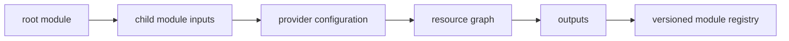

# Modules, Providers, and Reuse

## 30-Second Answer

Modules, Providers, and Reuse is the path from **root module** to **versioned module registry**. The essential handoffs are child module inputs, provider configuration, resource graph, outputs. In production, I verify each handoff independently, keep its identity and state boundary visible, and operate it against availability, latency, security, and recovery objectives.

## Mental Model

Read this diagram as a concrete sequence, not a generic maturity loop: a failure after **outputs** has different evidence and ownership from a failure at **child module inputs**.

## Why It Exists

Without modules, providers, and reuse, teams must manually coordinate root module, resource graph, and versioned module registry. The technology standardizes those interfaces so changes are repeatable, reviewable, and diagnosable. It is justified when the repeated operational risk exceeds the cost of owning the abstraction.

## How It Works

**root module** owns stage 1; **child module inputs** owns stage 2; **provider configuration** owns stage 3; **resource graph** owns stage 4; **outputs** owns stage 5; **versioned module registry** owns stage 6. Follow resource IDs, revisions, events, and timestamps across these stages; an acknowledgement at one stage never proves completion at the next.

## Mechanisms

* **root module:** Inspect its native state, events, latency, permissions, and capacity before moving to the next component.
* **child module inputs:** Inspect its native state, events, latency, permissions, and capacity before moving to the next component.
* **provider configuration:** Inspect its native state, events, latency, permissions, and capacity before moving to the next component.
* **resource graph:** Inspect its native state, events, latency, permissions, and capacity before moving to the next component.
* **outputs:** Inspect its native state, events, latency, permissions, and capacity before moving to the next component.
* **versioned module registry:** Inspect its native state, events, latency, permissions, and capacity before moving to the next component.

## Production Architecture

Deploy root module with least privilege and an auditable change path. Isolate resource graph by environment and failure domain, make versioned module registry observable, and test loss of each dependency. Version the interface between stages so producers and consumers can roll independently.

## Failure Modes

| Failure | Evidence | Response |
|---|---|---|
| concurrent or out-of-band mutation creates state drift | Compare stage latency and revision at child module inputs | Stop promotion and restore the last verified input |
| a broad state file enlarges blast radius | Inspect saturation, quotas, events, and pending work at resource graph | Add valid capacity or shed load; do not retry without a bound |
| partial provider failure requires a new plan | Compare the user result with versioned module registry and upstream state | Mitigate first, preserve evidence, then repair the faulty contract |

## Trade-offs

More automation across root module and versioned module registry improves consistency but can propagate an error faster. Strong isolation narrows blast radius but increases cost and upgrades. Managed implementations reduce component toil; self-managed implementations offer control but require availability, backup, security patching, and on-call expertise.

## Lead-Level Follow-ups

* Which team owns **resource graph**, and what user-facing SLO proves it works?
* What remains available when **child module inputs** is down?
* Where is state durable, and how are restore and upgrade tested?

## My Experience Prompt

Describe a change to resource graph: state the constraint, the exact signal that selected the design, the rollback boundary, and the durable guardrail you added.

## Recall Check

1. What does **root module** send to **child module inputs**?
2. Which component stores or reports authoritative state?
3. How does **outputs** affect **versioned module registry**?
4. Which capacity limit fails first at production scale?
5. When is a simpler managed alternative preferable?

## Related Notes

* [Category index](index.md)
* [Interview dashboard](../00-interview-dashboard.md)
