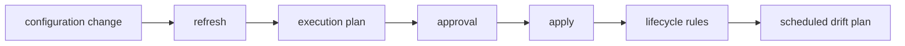

# Plan, Apply, Drift, and Lifecycle

## 30-Second Answer

Plan, Apply, Drift, and Lifecycle is the path from **configuration change** to **scheduled drift plan**. The essential handoffs are refresh, execution plan, approval, apply, lifecycle rules. In production, I verify each handoff independently, keep its identity and state boundary visible, and operate it against availability, latency, security, and recovery objectives.

## Mental Model

Read this diagram as a concrete sequence, not a generic maturity loop: a failure after **lifecycle rules** has different evidence and ownership from a failure at **refresh**.

## Why It Exists

Without plan, apply, drift, and lifecycle, teams must manually coordinate configuration change, approval, and scheduled drift plan. The technology standardizes those interfaces so changes are repeatable, reviewable, and diagnosable. It is justified when the repeated operational risk exceeds the cost of owning the abstraction.

## How It Works

**configuration change** owns stage 1; **refresh** owns stage 2; **execution plan** owns stage 3; **approval** owns stage 4; **apply** owns stage 5; **lifecycle rules** owns stage 6; **scheduled drift plan** owns stage 7. Follow resource IDs, revisions, events, and timestamps across these stages; an acknowledgement at one stage never proves completion at the next.

## Mechanisms

* **configuration change:** Inspect its native state, events, latency, permissions, and capacity before moving to the next component.
* **refresh:** Inspect its native state, events, latency, permissions, and capacity before moving to the next component.
* **execution plan:** Inspect its native state, events, latency, permissions, and capacity before moving to the next component.
* **approval:** Inspect its native state, events, latency, permissions, and capacity before moving to the next component.
* **apply:** Inspect its native state, events, latency, permissions, and capacity before moving to the next component.
* **lifecycle rules:** Inspect its native state, events, latency, permissions, and capacity before moving to the next component.
* **scheduled drift plan:** Inspect its native state, events, latency, permissions, and capacity before moving to the next component.

## Production Architecture

Deploy configuration change with least privilege and an auditable change path. Isolate approval by environment and failure domain, make scheduled drift plan observable, and test loss of each dependency. Version the interface between stages so producers and consumers can roll independently.

## Failure Modes

| Failure | Evidence | Response |
|---|---|---|
| concurrent or out-of-band mutation creates state drift | Compare stage latency and revision at refresh | Stop promotion and restore the last verified input |
| a broad state file enlarges blast radius | Inspect saturation, quotas, events, and pending work at approval | Add valid capacity or shed load; do not retry without a bound |
| partial provider failure requires a new plan | Compare the user result with scheduled drift plan and upstream state | Mitigate first, preserve evidence, then repair the faulty contract |

## Trade-offs

More automation across configuration change and scheduled drift plan improves consistency but can propagate an error faster. Strong isolation narrows blast radius but increases cost and upgrades. Managed implementations reduce component toil; self-managed implementations offer control but require availability, backup, security patching, and on-call expertise.

## Lead-Level Follow-ups

* Which team owns **approval**, and what user-facing SLO proves it works?
* What remains available when **refresh** is down?
* Where is state durable, and how are restore and upgrade tested?

## My Experience Prompt

Describe a change to approval: state the constraint, the exact signal that selected the design, the rollback boundary, and the durable guardrail you added.

## Recall Check

1. What does **configuration change** send to **refresh**?
2. Which component stores or reports authoritative state?
3. How does **lifecycle rules** affect **scheduled drift plan**?
4. Which capacity limit fails first at production scale?
5. When is a simpler managed alternative preferable?

## Related Notes

* [Category index](index.md)
* [Interview dashboard](../00-interview-dashboard.md)
