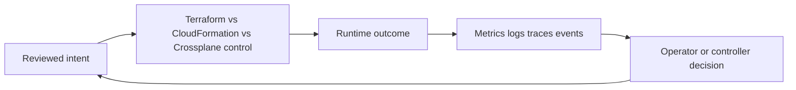
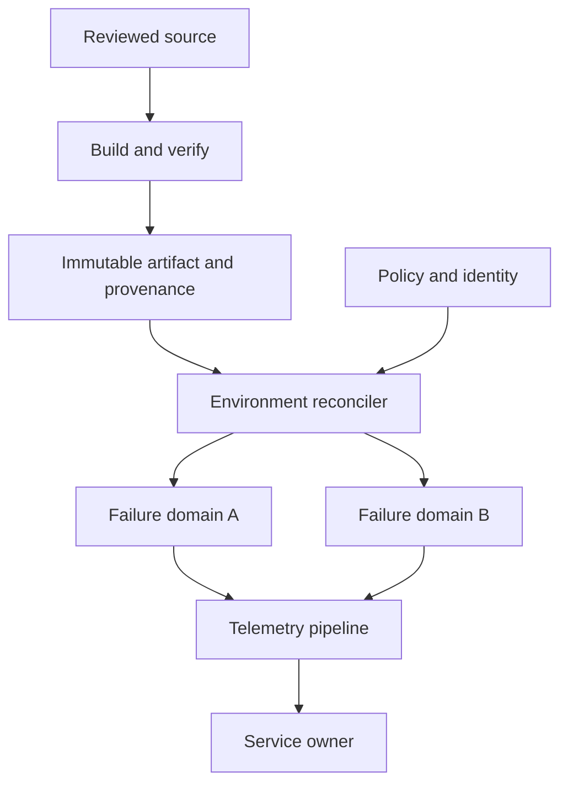

# Terraform vs CloudFormation vs Crossplane

## 30-Second Answer

For **Terraform vs CloudFormation vs Crossplane**, start from the contract visible to its consumer, then trace ownership through control-plane state, runtime execution, and telemetry. The design is only complete when degraded behavior and recovery are explicit. In production I define an SLO, an owner, a safe rollout path, and evidence that distinguishes desired-state failure from runtime or dependency failure.

## Mental Model

Treat the topic as a feedback system: intent enters a durable control surface, reconcilers or workers act, and signals report whether the user-visible outcome matches intent.

The arrows matter more than the boxes. A successful API response proves acceptance, not completion. Status and telemetry must expose asynchronous progress.

## Why It Exists

Cloud resources otherwise accumulate undocumented settings, unsafe ordering, configuration drift, and unclear ownership. Terraform vs CloudFormation vs Crossplane provides a repeatable boundary for that problem. Standardization enables policy and automation, but the abstraction must retain escape hatches and debuggable underlying resources.

A senior design begins with workload characteristics: availability target, latency, recovery point and time objectives, data sensitivity, expected scale, tenant isolation, and the team that carries the pager. Those constraints determine whether the mechanism is justified.

## How It Works

A provider translates a dependency graph into API operations. State maps resource addresses to remote identities; planning refreshes observations, computes a diff, and orders changes by graph edges.

For this topic, separate four states:

1. **Source intent** — reviewed configuration, code, or policy.
2. **Accepted state** — the control plane validated and persisted the request.
3. **Observed state** — controllers or workers report what currently exists.
4. **Serving state** — users receive correct results within the objective.

Never collapse those states into “deployed.” Correlate stable identifiers such as commit SHA, artifact digest, resource UID, deployment revision, account, region, and trace ID. Make mutations idempotent, bound retries with backoff and jitter, and send irrecoverable work to an explicit failure path rather than retrying forever.

## Production Architecture

A realistic deployment uses separate production and non-production boundaries, least-privilege workload identity, immutable artifacts, policy at admission or deployment time, and centralized telemetry. Changes move through automated checks and progressive exposure; rollback changes declarative intent to a previously verified version.

Ownership is split deliberately: the platform team owns the contract and shared control plane; service teams own workload configuration, SLOs, and response; security owns control objectives while implementation remains automated and testable.

## Failure Modes

| Failure | Symptom | Diagnosis | Mitigation |
| ------- | ------- | --------- | ---------- |
| Invalid intent | Request rejected or reconciliation stalled | Inspect validation output, conditions, and recent diff | Correct source; do not patch production around review |
| Control-plane lag | Accepted change never converges | Check queue depth, leader, API errors, and rate limits | Restore controller capacity; replay idempotently |
| Capacity exhaustion | Pending work and rising latency | Compare demand with quotas, requests, and saturation | Shed load, scale a valid pool, then tune forecasts |
| Dependency failure | Healthy process but failed requests | Follow traces and dependency error budgets | Fail closed/open deliberately; use bounded fallback |
| Silent drift | Runtime differs from reviewed intent | Diff source, accepted, and live state with audit events | Revert unauthorized mutation and remove its path |

## Trade-offs

Automation increases consistency but can amplify a bad decision quickly. Strong isolation reduces blast radius but adds cost and operational surfaces. Rich abstractions speed common work but obscure internals during unusual failures. Adopt Terraform vs CloudFormation vs Crossplane when repeated demand and risk justify a supported product; avoid adding another control plane for a one-off workload that a simpler managed service can satisfy.

Prefer boring, observable defaults. Document unsupported cases, version contracts, test upgrades against representative workloads, and measure whether users actually succeed without tickets. “More features” is not a platform outcome.

## Lead-Level Follow-ups

* Where is durable state, and what are its backup and restore semantics?
* Which action crosses a trust boundary, and how is workload identity issued?
* How does the system behave when its controller or telemetry backend is unavailable?
* Which metric proves the abstraction improves delivery rather than moving toil?

## My Experience Prompt

Describe a production change involving Terraform vs CloudFormation vs Crossplane. What constraint selected the design? Name the first signal, the misleading signal, the rollback decision, and one durable improvement. Quantify blast radius or recovery time without inventing business results.

## Recall Check

1. What is the consumer-facing contract for Terraform vs CloudFormation vs Crossplane?
2. How do accepted, observed, and serving state differ?
3. Which component owns retries and idempotency?
4. What capacity signal should page before user impact?
5. When would a simpler design be safer?

## Related Notes

* [Next focused note](06-ansible-and-configuration-management.md)
* [Deeper handbook chapter](../../architecture/terraform-aws-platform.md)
* [Interview dashboard](../00-interview-dashboard.md)

## Further Reading

* [Kubernetes documentation](https://kubernetes.io/docs/)
* [AWS Well-Architected Framework](https://docs.aws.amazon.com/wellarchitected/latest/framework/welcome.html)
* [OpenTelemetry documentation](https://opentelemetry.io/docs/)
