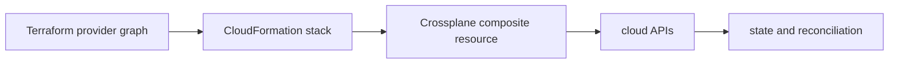

# Terraform vs CloudFormation vs Crossplane

## 30-Second Answer

Terraform vs CloudFormation vs Crossplane is the path from **Terraform provider graph** to **state and reconciliation**. The essential handoffs are CloudFormation stack, Crossplane composite resource, cloud APIs. In production, I verify each handoff independently, keep its identity and state boundary visible, and operate it against availability, latency, security, and recovery objectives.

## Mental Model

Read this diagram as a concrete sequence, not a generic maturity loop: a failure after **cloud APIs** has different evidence and ownership from a failure at **CloudFormation stack**.

## Why It Exists

Without terraform vs cloudformation vs crossplane, teams must manually coordinate terraform provider graph, crossplane composite resource, and state and reconciliation. The technology standardizes those interfaces so changes are repeatable, reviewable, and diagnosable. It is justified when the repeated operational risk exceeds the cost of owning the abstraction.

## How It Works

**Terraform provider graph** owns stage 1; **CloudFormation stack** owns stage 2; **Crossplane composite resource** owns stage 3; **cloud APIs** owns stage 4; **state and reconciliation** owns stage 5. Follow resource IDs, revisions, events, and timestamps across these stages; an acknowledgement at one stage never proves completion at the next.

## Mechanisms

* **Terraform provider graph:** Inspect its native state, events, latency, permissions, and capacity before moving to the next component.
* **CloudFormation stack:** Inspect its native state, events, latency, permissions, and capacity before moving to the next component.
* **Crossplane composite resource:** Inspect its native state, events, latency, permissions, and capacity before moving to the next component.
* **cloud APIs:** Inspect its native state, events, latency, permissions, and capacity before moving to the next component.
* **state and reconciliation:** Inspect its native state, events, latency, permissions, and capacity before moving to the next component.

## Production Architecture

Deploy terraform provider graph with least privilege and an auditable change path. Isolate crossplane composite resource by environment and failure domain, make state and reconciliation observable, and test loss of each dependency. Version the interface between stages so producers and consumers can roll independently.

## Failure Modes

| Failure | Evidence | Response |
|---|---|---|
| concurrent or out-of-band mutation creates state drift | Compare stage latency and revision at CloudFormation stack | Stop promotion and restore the last verified input |
| a broad state file enlarges blast radius | Inspect saturation, quotas, events, and pending work at Crossplane composite resource | Add valid capacity or shed load; do not retry without a bound |
| partial provider failure requires a new plan | Compare the user result with state and reconciliation and upstream state | Mitigate first, preserve evidence, then repair the faulty contract |

## Trade-offs

More automation across terraform provider graph and state and reconciliation improves consistency but can propagate an error faster. Strong isolation narrows blast radius but increases cost and upgrades. Managed implementations reduce component toil; self-managed implementations offer control but require availability, backup, security patching, and on-call expertise.

## Lead-Level Follow-ups

* Which team owns **Crossplane composite resource**, and what user-facing SLO proves it works?
* What remains available when **CloudFormation stack** is down?
* Where is state durable, and how are restore and upgrade tested?

## My Experience Prompt

Describe a change to crossplane composite resource: state the constraint, the exact signal that selected the design, the rollback boundary, and the durable guardrail you added.

## Recall Check

1. What does **Terraform provider graph** send to **CloudFormation stack**?
2. Which component stores or reports authoritative state?
3. How does **cloud APIs** affect **state and reconciliation**?
4. Which capacity limit fails first at production scale?
5. When is a simpler managed alternative preferable?

## Related Notes

* [Category index](index.md)
* [Interview dashboard](../00-interview-dashboard.md)
