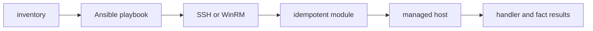

# Ansible and Configuration Management

## 30-Second Answer

Ansible and Configuration Management is the path from **inventory** to **handler and fact results**. The essential handoffs are Ansible playbook, SSH or WinRM, idempotent module, managed host. In production, I verify each handoff independently, keep its identity and state boundary visible, and operate it against availability, latency, security, and recovery objectives.

## Mental Model

Read this diagram as a concrete sequence, not a generic maturity loop: a failure after **managed host** has different evidence and ownership from a failure at **Ansible playbook**.

## Why It Exists

Without ansible and configuration management, teams must manually coordinate inventory, idempotent module, and handler and fact results. The technology standardizes those interfaces so changes are repeatable, reviewable, and diagnosable. It is justified when the repeated operational risk exceeds the cost of owning the abstraction.

## How It Works

**inventory** owns stage 1; **Ansible playbook** owns stage 2; **SSH or WinRM** owns stage 3; **idempotent module** owns stage 4; **managed host** owns stage 5; **handler and fact results** owns stage 6. Follow resource IDs, revisions, events, and timestamps across these stages; an acknowledgement at one stage never proves completion at the next.

## Mechanisms

* **inventory:** Inspect its native state, events, latency, permissions, and capacity before moving to the next component.
* **Ansible playbook:** Inspect its native state, events, latency, permissions, and capacity before moving to the next component.
* **SSH or WinRM:** Inspect its native state, events, latency, permissions, and capacity before moving to the next component.
* **idempotent module:** Inspect its native state, events, latency, permissions, and capacity before moving to the next component.
* **managed host:** Inspect its native state, events, latency, permissions, and capacity before moving to the next component.
* **handler and fact results:** Inspect its native state, events, latency, permissions, and capacity before moving to the next component.

## Production Architecture

Deploy inventory with least privilege and an auditable change path. Isolate idempotent module by environment and failure domain, make handler and fact results observable, and test loss of each dependency. Version the interface between stages so producers and consumers can roll independently.

## Failure Modes

| Failure | Evidence | Response |
|---|---|---|
| concurrent or out-of-band mutation creates state drift | Compare stage latency and revision at Ansible playbook | Stop promotion and restore the last verified input |
| a broad state file enlarges blast radius | Inspect saturation, quotas, events, and pending work at idempotent module | Add valid capacity or shed load; do not retry without a bound |
| partial provider failure requires a new plan | Compare the user result with handler and fact results and upstream state | Mitigate first, preserve evidence, then repair the faulty contract |

## Trade-offs

More automation across inventory and handler and fact results improves consistency but can propagate an error faster. Strong isolation narrows blast radius but increases cost and upgrades. Managed implementations reduce component toil; self-managed implementations offer control but require availability, backup, security patching, and on-call expertise.

## Lead-Level Follow-ups

* Which team owns **idempotent module**, and what user-facing SLO proves it works?
* What remains available when **Ansible playbook** is down?
* Where is state durable, and how are restore and upgrade tested?

## My Experience Prompt

Describe a change to idempotent module: state the constraint, the exact signal that selected the design, the rollback boundary, and the durable guardrail you added.

## Recall Check

1. What does **inventory** send to **Ansible playbook**?
2. Which component stores or reports authoritative state?
3. How does **managed host** affect **handler and fact results**?
4. Which capacity limit fails first at production scale?
5. When is a simpler managed alternative preferable?

## Related Notes

* [Category index](index.md)
* [Interview dashboard](../00-interview-dashboard.md)
