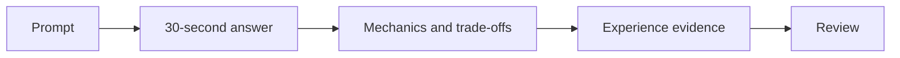

# AWS Questions

Use these prompts for closed-book rehearsal. Answer in 30 seconds, expand mechanism and trade-offs for three minutes, then connect one honest experience. Full answer frameworks are in the [Interview Companion](../../interview/index.md).

* How would you upgrade EKS without creating a major outage?
* Design a multi-account landing zone for regulated workloads.
* How does a packet travel from an ALB to an EKS Pod?
* How would you connect overlapping VPC address spaces?
* How do IRSA or EKS Pod Identity reduce credential risk?
* How do you debug an IAM AccessDenied result?
* When do you choose NAT Gateway, VPC endpoints, or an egress proxy?
* How would you design Route 53 failover without creating split brain?
* What failure boundaries should an RDS design address?
* How do CloudTrail, Config, and GuardDuty serve different purposes?
* How would you control ECR access and image lifecycle?
* How do you constrain blast radius during an AWS organization change?

## Practice Loop

Avoid memorized scripts: state assumptions and test them.
