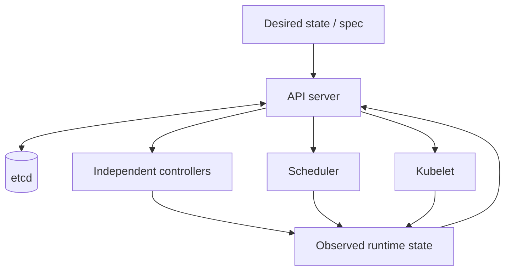
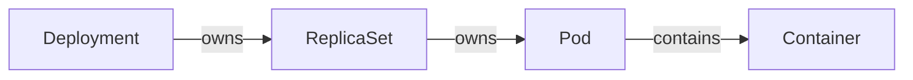
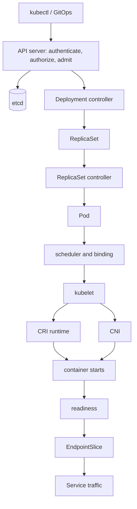
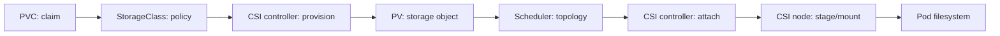

# Kubernetes Interview Memory Refresh

## How to Use This Page

This is a reconstruction map, not a substitute for the deeper notes. Read one section, hide it, redraw its chain, and explain the failure boundary aloud. Use the pattern **memory anchor → small example → mechanism → common confusion → interview implication → deep dive**. An experienced engineer should finish a first pass in 60–90 minutes; on later passes, jump only to weak areas.

Do not memorize commands without a question. Start with an object, follow ownership and state transitions, then collect evidence at the boundary where reality stopped matching intent. In an interview, state the principle, name the responsible component, describe evidence, and acknowledge a trade-off.

**Deep dives:** [Kubernetes in One Page](01-kubernetes-in-one-page.md) · [Study path](index.md)

## The Kubernetes Mental Model



The primary memory anchor is: **API server accepts and stores intent. Controllers converge intent. Scheduler chooses location. Kubelet makes the Pod run on that node. Readiness determines whether the workload should receive traffic.** Kubernetes is not one synchronous linear workflow. Independent reconcilers watch API objects, act eventually, and may observe different moments of reality.

`spec` expresses desired state; `status` reports observed state. `metadata.generation` increases for meaningful desired-state changes, while `status.observedGeneration` tells whether a controller's status reflects that generation. `conditions` are structured, timestamped claims such as Available or Progressing; inspect reason and message rather than treating them as one boolean. `resourceVersion` identifies a stored revision for watches and optimistic concurrency, not an application version or chronological counter you should interpret.

Example: the API may accept replicas `3` immediately, while status still reports two ready replicas. That is normal convergence. A stuck `observedGeneration`, repeated conflict, or condition reason locates a broken loop. The common mistake is saying “Kubernetes deploys the application” as if one actor performs every step. In an interview, narrate asynchronous boundaries and the evidence each leaves.

**Deep dives:** [Control Plane](02-control-plane.md) · [Control-plane architecture](../../architecture/kubernetes-control-plane.md) · [Reconciliation](03-reconciliation-and-controllers.md)

## Core Components

| Component | Responsibility | Not responsible for | Failure symptom and evidence |
|---|---|---|---|
| kube-apiserver | API validation, authn/authz/admission, API discovery, storage gateway | Running containers or choosing nodes | Writes time out or fail; API audit logs, request metrics, client errors |
| etcd | Durable, consistent control-plane state | Pod data or container execution | API writes/reads fail or slow; etcd health, latency, space, alarms |
| kube-scheduler | Selects a feasible/preferred node and records a binding | Starting containers or creating nodes | Pods remain Pending; `FailedScheduling` events and scheduler metrics |
| kube-controller-manager | Runs core controllers such as Deployment, ReplicaSet, Node, Job | Scheduling and node-local execution | Desired objects/status stop converging; controller logs, events, generation |
| cloud-controller-manager | Reconciles cloud nodes, routes, and load balancers where configured | General workload lifecycle | cloud-backed Services or node metadata stall; events and cloud API errors |
| kubelet | Reconciles assigned Pod sandboxes, containers, volumes, probes, status | Choosing its Pods or implementing Service VIPs | node-local Pods fail; kubelet journal, Pod events, node conditions |
| CRI and containerd/CRI-O | CRI is the kubelet/runtime contract; runtimes pull images and manage sandboxes/containers | Scheduling or CNI routing policy | pull/start/sandbox errors; runtime and kubelet logs, `crictl` evidence |
| CNI | Configures Pod network interfaces, IPs, and routes; some CNIs enforce policy | DNS records or workload authorization | sandbox creation or node-specific reachability fails; CNI logs/IP pools |
| CSI | Standard interface for provisioning, attaching, staging, and mounting storage | Application consistency or backups by itself | PVC/attach/mount stalls; PVC events, VolumeAttachment, CSI logs |
| CoreDNS | Answers cluster service discovery and forwards external DNS | Service packet forwarding | lookup timeout/NXDOMAIN; resolver config, CoreDNS logs/metrics |
| kube-proxy or eBPF dataplane | Programs Service-to-endpoint forwarding | Selecting Pods or deciding readiness | ClusterIP fails despite ready endpoints; rules/maps, agent health, conntrack |

“Scheduler starts the Pod” is a classic weak answer: it only selects a node. Likewise, the CNI is a plugin contract plus an implementation, not a universal network architecture. Ask which managed-service responsibilities and which installed add-ons apply before diagnosing.

**Deep dives:** [Control Plane](02-control-plane.md) · [Networking](05-networking-cni-services-ingress.md) · [Storage](06-storage-and-csi.md)

## Kubernetes Workload Objects



**Pod** → smallest scheduled unit, sharing network and volume context. It is usually disposable. **ReplicaSet** → maintains a count of matching Pods. **Deployment** → manages ReplicaSets to provide declarative rollout and rollback for a stateless API. Users manage Deployments because editing a ReplicaSet bypasses rollout history and the Deployment controller may replace that intent.

**StatefulSet** → ordered identities such as `db-0`, stable network identity, and per-Pod PVC templates. It fits software that needs stable Pod/PVC identity, but does **not** automatically provide database replication, backup, application consistency, or high availability. The application or operator still owns those semantics.

**DaemonSet** → one eligible Pod per node, useful for node-exporter, a log agent, or a CNI component. **Job** → finite completion, such as a migration or one-off task. **CronJob** → creates Jobs on a schedule, such as maintenance or a backup trigger; concurrency policy, missed schedules, and idempotency matter.

Tiny Deployment intent:

```yaml
apiVersion: apps/v1
kind: Deployment
metadata: {name: api}
spec:
  replicas: 3
  selector: {matchLabels: {app: api}}
  template:
    metadata: {labels: {app: api}}
    spec:
      containers:
        - {name: api, image: registry.example/api@sha256:abc}
```

The interview implication is to choose an object from lifecycle semantics, not merely “stateful versus stateless.” Explain ownership, identity, rollout, completion, and failure recovery.

**Deep dives:** [Kubernetes in One Page](01-kubernetes-in-one-page.md) · [Deep internals](../../chapters/kubernetes.md)

## What Happens When a Deployment Is Created?



The client submits an object, commonly through `kubectl` or a GitOps controller. The API server authenticates identity, authorizes the verb on the resource, runs mutating then validating admission, validates the schema, and persists accepted intent through etcd. Evidence: client response, audit event, admission error, or the stored Deployment with generation and resourceVersion.

The Deployment controller sees intent and creates or scales a ReplicaSet with an owner reference and Pod template hash. The ReplicaSet controller creates Pods until desired count is represented. Evidence: Deployment conditions, rollout status, ownership shown by `kubectl get deploy,rs,pod`, controller events, and ReplicaSet/Pod objects. These actions are separate reconciliations, so creation can be delayed without the original API request remaining open.

A new Pod has no node. The scheduler filters infeasible nodes using requests, selectors, affinity, taints, topology, volumes, and plugins; it scores feasible nodes and records a binding. Evidence: `spec.nodeName`, scheduling events, and especially `FailedScheduling` reasons. It does not create capacity or start a container.

The kubelet on the selected node observes the assignment. It asks the CRI runtime to create a sandbox and pull/start containers, invokes CNI to configure the Pod network, and coordinates CSI volume mount operations. Evidence: Pod events and container states first, then kubelet, runtime, CNI, and CSI logs at the failing node boundary.

After startup, kubelet executes probes and reports status. A passing readiness result makes the Pod eligible for ordinary traffic when its labels match a Service. The EndpointSlice controller reflects ready backend addresses; the Service dataplane forwards to those endpoints. Evidence: Pod conditions, Service selector, EndpointSlices, dataplane state, and a request from a suitable source.

> Walk me through what happens after a Deployment is submitted.

**30-second answer:** “The API server authenticates, authorizes, admits, and stores the Deployment. The Deployment and ReplicaSet controllers independently create a ReplicaSet and Pods. The scheduler binds each feasible Pod to a node. That node's kubelet uses CRI, CNI, and CSI to construct it. Once readiness passes, EndpointSlices make matching Pods eligible for Service traffic. I verify each asynchronous boundary with objects, conditions, events, logs, and endpoint state.”

**Two-minute expansion:** add generation versus observedGeneration, ownership, scheduling predicates, image/network/volume setup, and distinguish Running from Ready. Walk the evidence in order rather than listing components. State that retries and watches make this eventual, not a transaction, and identify where an admission rejection, Pending Pod, image pull, or readiness failure appears.

**Common weak answer:** “kubectl sends it to the master, the scheduler deploys it, and the Service exposes it.” This collapses authentication, admission, controllers, kubelet, and endpoint eligibility, and incorrectly makes the scheduler an executor.

**Deep dives:** [Request lifecycle](../../architecture/kubernetes-request-lifecycle.md) · [Control Plane](02-control-plane.md) · [Reconciliation](03-reconciliation-and-controllers.md)

## Pod Lifecycle and Container States

Pod **phase** is a coarse summary. `Pending` means accepted but one or more containers are not running, including unscheduled or setup time. `Running` means assigned and at least one container running, starting, or restarting. `Succeeded` means every container terminated successfully and will not restart; `Failed` means all terminated and at least one failed or was terminated. `Unknown` means the control plane cannot reliably obtain status, often a node communication issue.

Container state is separate: `Waiting`, `Running`, or `Terminated`, with reason, exit code, timestamps, and previous state. `ContainerCreating` is a displayed Waiting reason during sandbox/image/network/volume setup. `ErrImagePull` is an immediate pull failure; `ImagePullBackOff` is the retry backoff. `CrashLoopBackOff` is repeated start/fail backoff, not a Pod phase. `OOMKilled` is a Terminated reason usually tied to a memory boundary. `Completed` commonly represents successful termination.

**Running != Ready.** An API container can be Running while warming a model, failing its readiness probe, or waiting for a dependency; it should receive no ordinary Service traffic. Inspect `.status.containerStatuses`, previous termination, conditions, events, and logs rather than treating the STATUS column as a state machine.

**Deep dives:** [Production Troubleshooting](10-production-troubleshooting.md) · [Interview answers](../../interview/kubernetes.md)

## Startup, Readiness, and Liveness

```text
startup   → have you finished starting?
readiness → should I send you traffic?
liveness  → should I restart you?
```

A startup probe gates liveness and readiness until startup succeeds; failure beyond its threshold causes kubelet to restart the container. A readiness failure normally removes endpoint eligibility and does not restart it. A liveness failure causes kubelet to restart the container under its restart policy. Probe execution and restarts are node-local kubelet behavior; EndpointSlice readiness propagates traffic eligibility.

```yaml
startupProbe:
  httpGet: {path: /started, port: 8080}
  periodSeconds: 5
  failureThreshold: 60
readinessProbe:
  httpGet: {path: /ready, port: 8080}
  periodSeconds: 5
livenessProbe:
  httpGet: {path: /live, port: 8080}
  periodSeconds: 10
  failureThreshold: 3
```

Do not make liveness depend on a downstream database: an outage could restart every healthy process and amplify load. Avoid shallow readiness that says green before routes, essential local state, or model warmup are ready. Conversely, avoid a readiness test so broad that a noncritical dependency removes all capacity. A startup probe protects slow initialization from premature liveness kills. Tune timeout, period, and threshold against observed startup and recovery behavior, and keep probe endpoints cheap.

Interview implication: name the action caused by each probe and explain why a process can be alive yet temporarily unable to serve.

**Deep dives:** [Production Troubleshooting](10-production-troubleshooting.md) · [Deep internals](../../chapters/kubernetes.md)

## Requests, Limits, QoS, and Node Pressure

```yaml
resources:
  requests:
    cpu: 500m
    memory: 512Mi
  limits:
    cpu: "1"
    memory: 1Gi
```

**Request → scheduler capacity commitment. Limit → runtime enforcement boundary.** Normal scheduling accounts for requests, not limits, against node allocatable capacity. CPU above a limit is throttled through cgroups; sustained work slows but memory is not reclaimed. Memory beyond the effective cgroup limit can trigger an OOM kill because memory cannot be safely paused in the same way. Inspect throttling counters, working set, exit reason, node pressure, and application latency.

`Guaranteed` Pods have equal CPU and memory requests/limits for every container. `BestEffort` has neither. Everything between is `Burstable`. QoS influences eviction and OOM treatment, but priority, actual usage, and pressure also matter; it is not a performance guarantee.

Kubelet reports memory, disk, and PID pressure and may evict Pods to protect the node. Ephemeral-storage requests/limits and image/container filesystem usage matter under disk pressure. A Pod can be under its limit yet be evicted during node pressure, and an OOM can be container-local or node-wide. Requests and limits are inputs, not proof of good sizing: bad requests waste capacity or create contention, and a high limit does not reserve it.

**Deep dives:** [Scheduling and Capacity](04-scheduling-and-capacity.md) · [Kubernetes rightsizing](../cost-performance/02-kubernetes-rightsizing.md)

## Scheduling and Placement

```text
taint                  → node repels Pods
toleration             → Pod may enter
selector/required affinity → Pod requires matching node
preferred affinity     → scheduler preference
pod anti-affinity      → avoid co-location
topology spread        → distribute replicas across topology domains
```

`nodeSelector` is a simple exact label requirement. Required node affinity expresses richer hard node rules; preferred affinity changes scoring but permits alternatives. Pod affinity/anti-affinity relates placement to other Pods, often using topology keys. `topologySpreadConstraints` distributes matching replicas across zones or hosts with an explicit skew policy and is often clearer than hard anti-affinity.

A taint applies an effect such as `NoSchedule`; a matching toleration removes that rejection only. **A toleration does not force placement.** `PriorityClass` influences scheduling order and, when configured, preemption can remove lower-priority Pods so a higher-priority Pod fits. Priority is not capacity and careless preemption can destabilize tenants.

GPU node labels and isolation:

```yaml
nodeSelector:
  accelerator: a10g
tolerations:
  - key: workload
    operator: Equal
    value: gpu
    effect: NoSchedule
resources:
  limits:
    nvidia.com/gpu: 1
```

The node might have label `accelerator=a10g` and taint `workload=gpu:NoSchedule`. The selector requires that class; the toleration permits entry; the extended-resource request requires an advertised GPU. All constraints must intersect.

When a Pod is Pending, read the `FailedScheduling` event literally. Causes include CPU/memory requests, selectors, affinity, taints, topology spread, PVC zone topology, GPU availability, node-group limits, cloud quota, and subnet/IP exhaustion. Some prevent scheduler feasibility; others prevent a node provisioner from satisfying an unschedulable Pod. Separate “no current node fits” from “new infrastructure cannot be created.”

**Deep dives:** [Scheduling and Capacity](04-scheduling-and-capacity.md) · [GPU nodes](../ai-platform/02-gpu-nodes-and-scheduling.md)

## Services, EndpointSlices, and Cluster Networking

**Service → stable discovery and virtual routing abstraction. EndpointSlice → current backend addresses plus readiness-related information.** A selector-bearing Service finds matching Pods; controllers publish their addresses into one or more scalable EndpointSlices; the dataplane uses eligible endpoints.

```text
Service selector → matching Pods → EndpointSlices → ready backend IPs
```

A Pod may have `Running = true` and `Ready = false`, so it remains absent or marked unready and does not receive ordinary Service traffic. Debug labels, selectors, Pod readiness, EndpointSlices, then forwarding—not the Service definition alone.

`ClusterIP` provides an internal virtual IP. `NodePort` exposes a port on nodes and is often an implementation building block. `LoadBalancer` requests external load-balancer integration, typically still targeting node ports or Pod IPs depending on controller and traffic mode. `ExternalName` returns a DNS CNAME and provides no proxy. A headless Service (`clusterIP: None`) publishes endpoint DNS directly, useful for client-side discovery and StatefulSets.

Tiny Service:

```yaml
apiVersion: v1
kind: Service
metadata: {name: api}
spec:
  selector: {app: api}
  ports:
    - {port: 80, targetPort: 8080}
```

**Deep dives:** [Networking](05-networking-cni-services-ingress.md) · [Networking architecture](../../architecture/kubernetes-networking.md)

## DNS, Ingress, Gateway, and External Traffic

The data path worth redrawing is:

```text
Internet → DNS → Load Balancer → Ingress/Gateway → Service → EndpointSlice → Pod
```

Inside the cluster, a Pod resolver follows `/etc/resolv.conf` search and `ndots` behavior to the CoreDNS Service. CoreDNS Pods answer Kubernetes service records or forward an external name upstream. DNS discovery is distinct from Service packet forwarding.

Ingress is an older HTTP routing API; an Ingress controller supplies its behavior. Gateway API separates infrastructure, listener, and route roles with richer typed routing, but still requires a controller. An external cloud load balancer reaches controller or backend targets; a Service and EndpointSlices connect routes to ready Pods.

Evidence-led examples: if DNS works but HTTPS fails, inspect TCP reachability, TLS/SNI, certificate, listener, and route. If the Service works but an external LB returns 502, inspect LB target health, controller logs, route backend/port, and readiness interpretation. If HTTPS works externally but a direct Service test fails, ensure the tests use comparable protocol, hostname, network policy, and source. If only large packets fail, test path MTU and fragmentation. If one node fails while others work, compare its CNI agent, routes/eBPF maps, conntrack, kube-proxy, and IP allocation.

**Deep dives:** [Networking](05-networking-cni-services-ingress.md) · [Production Troubleshooting](10-production-troubleshooting.md)

## Storage, PVCs, PVs, StorageClasses, and CSI



A PVC requests capacity and access modes. A StorageClass names provisioning parameters, topology/binding mode, and reclaim behavior. The CSI controller plugin provisions backend storage; Kubernetes represents the result as a PV. The scheduler considers volume topology, then the CSI controller side attaches an attachable volume and the CSI node plugin stages and mounts it. `VolumeAttachment` records controller-managed attachment intent for attachable volumes; `VolumeSnapshot` represents snapshot intent through a snapshot-capable CSI driver.

`Immediate` provisioning occurs when the claim appears and can select a zone before Pod placement. `WaitForFirstConsumer` delays provisioning until scheduling context is known, avoiding a volume in a zone where the Pod cannot run. Once a zonal volume exists, its node affinity can force the Pod into that AZ; available compute and every other constraint must also fit there.

```yaml
apiVersion: v1
kind: PersistentVolumeClaim
metadata: {name: data}
spec:
  accessModes: [ReadWriteOnce]
  storageClassName: gp3-wffc
  resources:
    requests: {storage: 100Gi}
```

PVC != backup, PV != backup, and StatefulSet != backup. A VolumeSnapshot is not automatically an application-consistent backup; coordinate database flush/quiescence, retention, encryption, copy/off-site policy, and restore testing. `Delete` reclaim policy removes backend storage after released claim/PV lifecycle; `Retain` preserves it for deliberate recovery and cleanup, potentially accumulating cost.

**Deep dives:** [Storage and CSI](06-storage-and-csi.md) · [Production Troubleshooting](10-production-troubleshooting.md)

## Horizontal Scaling and Node Scaling

```text
metric rises → HPA → desired replicas increase → Deployment creates Pods → scheduler tries placement
Pods unschedulable → Cluster Autoscaler/Karpenter → infrastructure capacity
```

**HPA scales Pods. Cluster Autoscaler or Karpenter scales/provisions nodes.** These are independent feedback loops. HPA can use CPU, memory, custom request-rate/queue metrics, or external metrics. KEDA translates event sources such as queue depth into scaling demand. Percentage-based CPU utilization compares measured consumption with container CPU requests, so missing or badly sized requests distort the signal.

If new Pods remain Pending, a node autoscaler may add matching capacity, but only if constraints and provider limits are satisfiable. It cannot repair bad readiness, images, or application behavior. Cluster Autoscaler typically changes configured node-group size; Karpenter selects/provisions instance capacity directly from constraints. Both encounter quota, subnet, maximum-size, and cloud-capacity boundaries.

CPU HPA can completely miss a GPU or queue bottleneck: CPU can remain normal while GPU memory is full, a request queue grows, or batching regresses. Choose a signal near user pressure and guard against delayed node/model startup. VPA recommends or adjusts Pod resource sizing; coordinate it with HPA so both do not fight over the same CPU/memory signal, and understand whether applying recommendations restarts Pods.

**Deep dives:** [Scheduling and Capacity](04-scheduling-and-capacity.md) · [AI model serving](../ai-platform/04-model-serving-kserve-vllm-triton.md)

## Disruptions, PDBs, Draining, and Graceful Termination

For replicas `3` and `minAvailable: 2`, a PDB means planned voluntary disruption should not reduce the workload below two available replicas.

```yaml
apiVersion: policy/v1
kind: PodDisruptionBudget
metadata: {name: api}
spec:
  minAvailable: 2
  selector: {matchLabels: {app: api}}
```

PDB protects voluntary disruptions such as eviction during node drain. It does not prevent hardware failure, AZ failure, kernel crash, OOM, or application crash, and it does not create replicas. A PDB that is impossible or too strict can block node drain and therefore an upgrade; inspect desired/allowed disruptions and workload readiness before overriding it.

Graceful deletion follows this mental sequence: deletion requested → `deletionTimestamp` → endpoint termination/draining begins → `preStop` if configured → SIGTERM → `terminationGracePeriodSeconds` → SIGKILL if the deadline is exceeded. Exact endpoint and signal timing overlaps, so applications must stop accepting new work, handle SIGTERM, drain or finish bounded work, and exit within the budget. `preStop` consumes grace time; it is not an unlimited sleep.

Coordinate load-balancer deregistration, readiness changes, long-lived connections, rolling-update surge/unavailability, node drains, and the PDB. Otherwise old Pods may be killed while upstream still routes to them, or termination may exceed rollout deadlines. Evidence includes deletion timestamp, endpoint terminating/ready state, application shutdown logs, eviction response, and rollout conditions.

**Deep dives:** [Production Troubleshooting](10-production-troubleshooting.md) · [EKS architecture](../../architecture/eks-production-platform.md)

## Kubernetes Identity, RBAC, and Workload Security

**Identity → who? Role/ClusterRole → what actions exist? Binding → who receives those permissions?** Users and groups normally originate from an external authenticator. A ServiceAccount is a namespaced workload identity. A Role contains namespaced permissions; ClusterRole is cluster-scoped in definition and can hold cluster or reusable namespaced rules. RoleBinding grants a Role or ClusterRole within one namespace; ClusterRoleBinding grants cluster-wide.

```yaml
apiVersion: rbac.authorization.k8s.io/v1
kind: Role
metadata: {name: config-reader, namespace: app}
rules:
  - apiGroups: [""]
    resources: [configmaps]
    verbs: [get, list]
---
apiVersion: rbac.authorization.k8s.io/v1
kind: RoleBinding
metadata: {name: api-reads-config, namespace: app}
subjects:
  - {kind: ServiceAccount, name: api, namespace: app}
roleRef: {apiGroup: rbac.authorization.k8s.io, kind: Role, name: config-reader}
```

Kubernetes RBAC authorizes Kubernetes API calls. AWS IAM authorizes AWS actions. Application authorization controls business operations. NetworkPolicy controls allowed network flows. None substitutes for another.

Workload identity chain: Kubernetes ServiceAccount → projected, short-lived token → federation → cloud IAM role/service account → cloud API or secret store. On AWS, IRSA associates an IAM role through the cluster OIDC provider; EKS Pod Identity uses the EKS identity mechanism/agent to deliver role credentials. Both avoid long-lived static cloud keys in Kubernetes Secrets, Git, images, or environment files, reduce blast radius, and improve rotation/audit. Scope trust and IAM policy to the precise ServiceAccount and workload need.

**Deep dives:** [AWS IAM and workload identity](../aws/03-iam-and-workload-identity.md) · [Workload hardening](../container-security/04-kubernetes-workload-hardening.md)

## NetworkPolicy and Runtime Security

RBAC controls Kubernetes API authorization; NetworkPolicy controls workload network communication. A useful policy shape is frontend → backend → postgres, while random workload **X** postgres. Ingress rules describe allowed incoming peers/ports; egress rules describe outgoing destinations. Selecting a Pod for a direction isolates it in that direction, so deliberate default-deny policies establish a baseline. `podSelector` selects Pods in a namespace; `namespaceSelector` selects namespaces by labels, and combined selectors must be read carefully.

```yaml
apiVersion: networking.k8s.io/v1
kind: NetworkPolicy
metadata: {name: postgres-from-backend}
spec:
  podSelector: {matchLabels: {app: postgres}}
  policyTypes: [Ingress]
  ingress:
    - from:
        - podSelector: {matchLabels: {app: backend}}
      ports: [{protocol: TCP, port: 5432}]
```

**NetworkPolicy requires a CNI/dataplane that actually enforces it.** Test from allowed and denied identities, account for DNS egress, and inspect implementation policy state.

At runtime, reduce kernel and host exposure:

```yaml
securityContext:
  runAsNonRoot: true
  runAsUser: 10001
  allowPrivilegeEscalation: false
  readOnlyRootFilesystem: true
  capabilities:
    drop: [ALL]
  seccompProfile: {type: RuntimeDefault}
```

Capabilities grant narrow kernel privileges; drop them by default. Seccomp filters syscalls. Privileged containers, `hostNetwork`, `hostPID`, and writable `hostPath` greatly weaken isolation and need exceptional review. `runAsNonRoot` prevents UID 0 while `runAsUser` chooses an identity; read-only root filesystems require explicit writable mounts. Pod Security Standards offer Privileged, Baseline, and Restricted policy profiles: use them as practical guardrails, not trivia, and pair admission prevention with runtime detection.

**Deep dives:** [Workload hardening](../container-security/04-kubernetes-workload-hardening.md) · [Container runtime security](../container-security/02-runtime-security.md)

## Admission, Policy, and API Safety

```text
request → authentication → authorization → mutating admission → validation → persist
```

Mutating admission webhooks default or alter requests; validating webhooks accept/reject without mutation. Built-in validation and validating admission run after mutation. `ValidatingAdmissionPolicy` expresses in-process CEL-based validation and can avoid an external webhook for suitable policies. Webhook timeout, `failurePolicy`, namespace/object selectors, match rules, and side effects determine both scope and availability impact.

An unavailable webhook plus `failurePolicy: Fail` can block matching API writes. `Ignore` favors availability but may admit noncompliant objects. Choose per risk: keep webhooks highly available, fast, narrowly scoped, observable, and excluded from dependencies that create bootstrap deadlock. Plan emergency recovery and test certificate rotation. A mutation can also surprise GitOps diffing, so understand ownership/defaulting.

`ResourceQuota`, `LimitRange`, and policy checks run on this write path. A quota violation normally rejects creation before a Pod object exists, so troubleshoot the API/admission response rather than `FailedScheduling`.

Interview implication: admission is on the write path; distinguish security policy correctness from the reliability of its enforcement service.

**Deep dives:** [CRDs, Operators, and Admission](07-crds-operators-and-admission.md) · [Policy, secrets, certificates](../platform-engineering/04-policy-secrets-certificates.md)

## Controllers, Reconciliation, CRDs, and Operators

```text
LIST → WATCH → informer → cache → event handler → rate-limited work queue
→ reconcile → API/external action → status
```

An event says “something may have changed.” Reconcile asks “given current reality, what should the state be now?” Informers maintain a local cache from list/watch and handlers enqueue keys. Workers process the queue, read desired/current state, make minimal idempotent changes, update status, and retry with rate limiting. Resync and retries mean events may duplicate or collapse; correctness must not depend on handling each event once.

Controllers are eventually consistent. Caches can be stale, so writes use resourceVersion/optimistic concurrency and retry conflicts. Leader election prevents multiple active replicas where needed, though reconciliation should remain idempotent. Rate-limited retry prevents hot failure loops; a poison object/key needs bounded backoff, clear status/events, and observability so it cannot starve all work.

`ownerReference` connects dependents to Kubernetes garbage collection. A `finalizer` delays physical deletion after deletionTimestamp until a controller performs cleanup and removes its key. Finalizers must be retry-safe and observable or objects remain Terminating.

**CRD → adds a new noun to the Kubernetes API. Controller → adds behavior. Operator → controller plus domain-specific operational knowledge.** A CRD alone does nothing beyond API storage/schema.

```yaml
apiVersion: platform.example.io/v1alpha1
kind: ModelService
metadata:
  name: fraud-v12
spec:
  modelURI: s3://models/fraud-v12
  runtime: vllm
  gpuClass: a10g
  minReplicas: 2
  maxReplicas: 10
```

Its controller might reconcile a ServiceAccount/workload identity, Deployment or KServe object, Service, HPA/KEDA, GPU placement, status conditions, and a cleanup finalizer. Build this only if a durable declarative lifecycle and repeated domain reconciliation justify API/versioning/operations cost. A simple request/response service with no declarative lifecycle or reconciliation need should remain a normal application API.

**Deep dives:** [Reconciliation](03-reconciliation-and-controllers.md) · [CRDs, Operators, and Admission](07-crds-operators-and-admission.md)

## GitOps and Kubernetes Delivery

```text
developer → source change → CI → immutable image digest → registry
→ reviewed GitOps intent → Argo CD/Flux → Kubernetes
```

**CI builds and proves the artifact. CD/GitOps controls where and when it runs.** CI tests, scans, signs, and publishes an immutable digest and evidence. A reviewed environment change selects that digest. Argo CD or Flux reconciles Git intent, reports sync and resource health, and detects drift. Rollback normally reverts declarative intent to a known digest; progressive delivery shifts exposure with measured gates rather than replacing every replica at once.

“Synced” means live desired resources match Git under the tool's comparison. “Healthy” means configured Kubernetes health assessment passes. **Argo CD Synced + Healthy != application business correctness.** Verify request success, SLOs, dependencies, data correctness, and business signals. Avoid mutable tags and imperative hot fixes that Git immediately reverses; when emergency action is required, capture it back into reviewed intent.

**Deep dives:** [GitOps: Argo CD and Flux](08-gitops-argo-cd-and-flux.md) · [Core Path recall answer](../core-path/recall-answers.md) · [GitOps delivery](../cicd/05-gitops-continuous-delivery.md)

## Kubernetes Upgrades

Safe chain: read version skew and deprecations → verify APIs → verify add-ons/webhooks/controllers → upgrade control plane → canary node group → cordon/drain → respect PDB → validate workloads and SLOs → expand rollout.

Inventory manifests and stored objects for removed APIs, plus compatibility matrices for CNI, CSI, CoreDNS, kube-proxy, ingress, cert-manager, Argo, operators, admission webhooks, observability agents, and client tooling. Test admission and controller behavior because an API server that is healthy can still reject or mis-reconcile workloads. Back up appropriate state and configuration, but do not pretend every managed control plane supports a simple version downgrade.

Prefer node replacement: create an updated immutable node group/image, canary representative workloads, then cordon and drain old nodes within disruption and capacity budgets. In-place modification accumulates drift and makes rollback less deterministic. Control-plane rollback may not be offered or realistic after data/API transitions; recovery is forward correction, compatible nodes/add-ons, and workload rollback. Validate API latency/errors, DNS/network/storage, scheduling, ingress, and service SLOs at each wave.

**Deep dives:** [EKS production design](../aws/04-eks-production-design.md) · [EKS architecture](../../architecture/eks-production-platform.md)

## EKS Mental Model

```text
AWS account → VPC → managed EKS control plane → managed node groups/Karpenter → Pods
Integrations: ECR, IAM, IRSA/Pod Identity, Secrets Manager, ALB/NLB,
RDS, Redis, CloudWatch, Prometheus
```

AWS manages much of the control-plane infrastructure, HA/patching of its components, and etcd operation within the service boundary. The customer/platform team still owns Kubernetes access and RBAC, workload design, node strategy, add-ons, NetworkPolicy, resource sizing, rollouts, application reliability, security configuration, and observability. “Managed Kubernetes” is not managed workloads.

Managed node groups provide lifecycle integration for defined groups. Cluster Autoscaler adjusts those groups; Karpenter provisions suitable instances from broader constraints. ALB integration commonly serves HTTP routes through the AWS Load Balancer Controller; NLB supports layer-four patterns and source/target trade-offs. IRSA and EKS Pod Identity connect ServiceAccounts to least-privilege AWS roles.

Choose private/public API endpoints from operator connectivity and exposure requirements, with restrictive access either way. Spread workers across AZs while recognizing zonal volumes and failure domains. Ensure subnet IP capacity for nodes and, with VPC CNI modes, Pods. Observe control plane, add-ons, nodes, and cloud controllers at their shared-responsibility seams.

**Deep dives:** [EKS production platform](../../architecture/eks-production-platform.md) · [AWS Platform Foundation](../aws/01-aws-platform-foundation.md)

## GPU and AI Workloads on Kubernetes

Memory chain: GPU node → NVIDIA driver → container toolkit → device plugin/GPU Operator → advertised `nvidia.com/gpu` resource → scheduler → inference Pod. The driver talks to hardware, toolkit enables containers, and device plugin advertises/allocates extended resources. GPU Operator can reconcile much of this stack but does not remove version compatibility and health responsibilities.

```yaml
nodeSelector:
  accelerator: a10g
tolerations:
  - {key: workload, operator: Equal, value: gpu, effect: NoSchedule}
containers:
  - name: inference
    image: registry.example/model@sha256:def
    resources:
      limits:
        nvidia.com/gpu: 1
```

Observe GPU memory and utilization, model load time, batch size, queue depth, tokens/sec, time-to-first-token, inference p95/p99, GPU OOM, cold-start duration, and model revision. **CPU healthy does not mean GPU workload healthy.** CPU-based HPA misses GPU memory saturation, queue saturation, model inefficiency, and batching regressions; scale on queue or serving signals when they represent demand, with guardrails against oscillation.

Scheduling needs an advertised free GPU of the requested type plus matching labels/tolerations and other resources. Node provisioning can fail at a node-group maximum, GPU quota, regional/AZ cloud capacity, subnet capacity, or incompatible instance constraints. Even successful provisioning includes driver/node startup and model-loading delay, so reactive scaling may arrive too late. Prewarming or minimum replicas trades cost for latency.

Adding GPUs is a mitigation, not automatically corrective action. A bad model revision, memory leak, inefficient batching, dependency bottleneck, or queue policy can consume every new GPU. Compare revisions and per-request efficiency, roll back when evidence supports it, then correct capacity and software causes separately.

**Deep dives:** [GPU Nodes and Scheduling](../ai-platform/02-gpu-nodes-and-scheduling.md) · [Model Serving](../ai-platform/04-model-serving-kserve-vllm-triton.md)

## Production Troubleshooting Decision Tree

Start with the user symptom and timestamp, then narrow object → controller → scheduling → node setup → readiness → discovery → data path. Do not restart before preserving events, previous logs, status, and scope.

| Branch | First evidence and 1–3 commands |
|---|---|
| Object not created? | API/authentication/RBAC/admission: `kubectl auth can-i create deployments -n NS`; repeat a server-side dry run; inspect API audit/admission response |
| Deployment exists but Pod absent? | controller/ReplicaSet: `kubectl get deploy,rs,pod -n NS`; `kubectl describe deploy APP`; compare generation and conditions |
| Pod Pending? | scheduler/placement/capacity/PVC: `kubectl describe pod POD`; `kubectl get events --sort-by=.lastTimestamp`; inspect nodes/PVC |
| Pod ContainerCreating? | image/runtime/CNI/CSI: `kubectl describe pod POD`; inspect its node and relevant node agents; check volume events |
| ImagePullBackOff? | registry/image/auth/network: describe Pod, verify image digest and imagePullSecret, test node-to-registry path |
| CrashLoopBackOff? | previous logs/config/app/dependency/probe: `kubectl logs POD --previous`; describe Pod; inspect exit code and events |
| OOMKilled? | limit/leak/working set: previous container state, memory graphs, `kubectl top pod`; distinguish node eviction |
| Running but not Ready? | readiness/startup/dependency/model warmup: describe Pod, current logs, probe endpoint from Pod context |
| Ready but Service unavailable? | selector/EndpointSlice/Service/NetworkPolicy: `kubectl get svc,endpointslice`; compare labels/ports; test permitted source |
| Internal Service works, external fails? | ingress/Gateway/LB/DNS/TLS: inspect routes/controller/LB health, certificate and SNI, external DNS |
| Intermittent network failure? | DNS/MTU/conntrack/node/CNI: segment by node/source/packet size; inspect CoreDNS and CNI; compare conntrack/MTU |
| PVC Pending? | StorageClass/topology/provisioner/quota: `kubectl describe pvc CLAIM`; get StorageClass; inspect CSI controller events |
| Volume will not attach? | zone/stale attachment/CSI/node: `kubectl get volumeattachment`; compare PV node affinity and node zone; CSI logs |
| Latency rises with normal CPU? | dependency/queue/throttling/DB/storage/network/GPU: correlate traces and queues; CPU throttling/GPU metrics; compare model/release |

For every branch, state scope: one Pod, node, zone, version, namespace, or all traffic. Compare a healthy peer, follow timestamps across layers, and form a falsifiable hypothesis. Capacity changes may stabilize service but do not prove root cause.

**Deep dives:** [Production Troubleshooting](10-production-troubleshooting.md) · [Production simulator](../../simulator/index.md)

## High-Value kubectl Commands

**What exists, where, and who owns it?**

```bash
kubectl get pods -A -o wide
kubectl get deploy,rs,pod -n NS
kubectl get pod POD -n NS -o yaml
kubectl describe pod POD -n NS
kubectl get events -n NS --sort-by=.lastTimestamp
```

**What happened in the process or rollout?**

```bash
kubectl logs POD -n NS
kubectl logs POD -n NS --previous
kubectl logs POD -n NS -c CONTAINER --since=15m
kubectl rollout status deployment/APP -n NS
kubectl rollout history deployment/APP -n NS
```

**Is discovery and routing populated?**

```bash
kubectl get svc,endpointslice -n NS -o wide
kubectl describe svc APP -n NS
kubectl get networkpolicy -A
kubectl run netcheck --rm -it --image=curlimages/curl -- sh
```

**Can it fit, scale, and survive disruption?**

```bash
kubectl describe node NODE
kubectl top pod -A
kubectl top node
kubectl get hpa -A
kubectl get pdb -A
kubectl get priorityclass
```

**Is storage or authorization the boundary?**

```bash
kubectl get pvc,pv -A
kubectl get storageclass
kubectl get volumeattachment
kubectl describe pvc CLAIM -n NS
kubectl auth can-i VERB RESOURCE -n NS --as=IDENTITY
kubectl get serviceaccount,role,rolebinding -n NS
kubectl get lease -A
```

These 26 commands answer a question; they are not a ritual. `top` requires metrics-server and is a recent sample, events expire, and `exec`/debug access may be restricted. Preserve exact output and timestamps when incident evidence matters.

**Deep dives:** [Production Troubleshooting](10-production-troubleshooting.md) · [Interview companion](../../interview/kubernetes.md)

## Interview Questions You Must Be Able to Answer

Answer each with component, mechanism, evidence, failure, and trade-off. Compact anchors are included for the highest-value questions; use the closed-book page before comparing deeper answers.

1. **Walk me through what happens when a Deployment is submitted.** API accept/store → controllers create → scheduler binds → kubelet/CRI/CNI/CSI run → readiness → EndpointSlice traffic.
2. **Why can a Pod be Running but not Ready?** Phase reports container activity; readiness independently reports traffic eligibility, perhaps during dependency failure or model warmup.
3. **Why can a Running Pod be absent from Service endpoints?** It may be unready, not match the selector, be terminating, or have no valid address/port representation.
4. **How do requests and limits differ?** Requests drive normal scheduling commitment; limits are runtime enforcement boundaries.
5. **Why does CPU throttling behave differently from memory limits?** CPU time can be delayed; excess memory may require an OOM kill.
6. **How does the scheduler decide where a Pod runs?** Filter hard constraints, score feasible nodes, then bind; it does not start the Pod.
7. **Taint versus toleration versus affinity?** A taint repels, toleration permits, affinity requires or prefers placement; permission is not attraction.
8. **What does topology spread solve?** It limits replica skew across failure or capacity domains without necessarily requiring one-per-domain.
9. **How do HPA and node autoscaling interact?** HPA creates replica demand; unschedulable demand may trigger a separate infrastructure loop.
10. **Why might HPA scale Pods that remain Pending?** No node satisfies resources/topology/volume/GPU constraints, or provisioning hits quota/capacity/limits.
11. **What is an EndpointSlice?** A scalable API representation of Service backend addresses and conditions such as readiness.
12. **How does Service traffic reach a Pod?** DNS resolves the Service VIP; kube-proxy/eBPF/IPVS dataplane selects an eligible EndpointSlice backend.
13. **How would you debug intermittent CoreDNS failures?** Segment by node/name/type, inspect Pod resolver and CoreDNS health/logs/latency, then upstream and network loss/conntrack.
14. **What happens when a readiness probe fails?** Kubelet reports not ready and ordinary endpoint eligibility is removed; the container is not restarted merely for readiness.
15. **What does a PDB protect?** Availability during voluntary eviction, not involuntary failure.
16. **Why can a PDB block an upgrade?** Evicting another Pod would violate minimum available or maximum unavailable.
17. **What happens during graceful Pod termination?** deletion timestamp and endpoint draining, preStop/SIGTERM, grace countdown, then SIGKILL if needed.
18. **PVC versus PV versus StorageClass?** Claim, bound storage API object, and dynamic provisioning policy.
19. **Why can a PVC force scheduling into one AZ?** A bound zonal PV has node topology affinity.
20. **Role versus ClusterRole?** Namespaced rules versus cluster-scoped/reusable rules; binding scope determines grant scope.
21. **RBAC versus NetworkPolicy?** API authorization versus workload network flow authorization.
22. **Why use workload identity instead of cloud keys?** Short-lived federated least privilege avoids copied long-lived credentials and improves rotation/audit.
23. **Mutating versus validating admission?** Mutation changes/defaults an allowed request; validation accepts or rejects the resulting object.
24. **What happens if an admission webhook is unavailable?** Matching writes fail or bypass it according to timeout and failurePolicy, creating an availability/security trade-off.
25. **ownerReference versus finalizer?** Garbage-collection ownership versus deletion delay for cleanup.
26. **CRD versus normal application API?** Use a CRD for declarative state that Kubernetes controllers reconcile, not every request/response domain.
27. **How do informers and work queues help controllers?** Cached list/watch makes observation efficient; keyed rate-limited queues decouple events from idempotent reconciliation.
28. **How would you upgrade an EKS cluster safely?** Compatibility/deprecation audit, control plane, canary replacement nodes, bounded drains, SLO validation, phased expansion.
29. **How do GPU resources affect Kubernetes scheduling?** Device plugins advertise integer extended resources; requests plus labels, taints, topology, and capacity determine fit.
30. **Why can CPU look healthy while an AI workload is failing?** GPU memory, queue, model loading, batching, or dependency latency can saturate independently.

**Deep dives:** [Closed-book Kubernetes questions](../interview/02-kubernetes-questions.md) · [Interview companion](../../interview/kubernetes.md)

## One-Page Recall Exercise

Close this page. Redraw these seven chains on one sheet:

```text
API server / etcd / controllers / scheduler / kubelet
Deployment → ReplicaSet → Pod
external traffic → ingress → Service → EndpointSlice → Pod
PVC → StorageClass → CSI → PV → mount
HPA → more Pods → scheduler → node autoscaler → more nodes
ServiceAccount → workload identity → cloud IAM → secret/API
GPU Pod → GPU resource → GPU node → device plugin/operator
```

Then answer without looking:

1. Which actor stores intent, chooses a node, and starts containers?
2. What does Running omit that Ready tells you?
3. Which probe failure removes traffic, and which restarts?
4. Why does a toleration not select a GPU node?
5. Where do you look when a Service has no eligible backends?
6. Why might a WFFC claim fix a zonal scheduling deadlock?
7. What can block a voluntary drain but not an AZ failure?
8. How can a fail-closed webhook affect unrelated releases?
9. Why must controller reconciliation be idempotent?
10. Which signals expose an AI bottleneck hidden by normal CPU?

Compare only after speaking: [Kubernetes Interview Companion](../../interview/kubernetes.md), [Core Path recall answers](../core-path/recall-answers.md), and the relevant deep dive below.

**Deep dives:** [Kubernetes Study Path](index.md) · [Closed-book questions](../interview/02-kubernetes-questions.md)

## Related Deep Dives

* [Kubernetes in One Page](01-kubernetes-in-one-page.md)
* [Control Plane](02-control-plane.md) and [control-plane architecture](../../architecture/kubernetes-control-plane.md)
* [Reconciliation and Controllers](03-reconciliation-and-controllers.md)
* [Scheduling and Capacity](04-scheduling-and-capacity.md)
* [Networking: CNI, Services, and Ingress](05-networking-cni-services-ingress.md)
* [Storage and CSI](06-storage-and-csi.md)
* [CRDs, Operators, and Admission](07-crds-operators-and-admission.md)
* [GitOps: Argo CD and Flux](08-gitops-argo-cd-and-flux.md)
* [Production Troubleshooting](10-production-troubleshooting.md)
* [Deep Kubernetes internals](../../chapters/kubernetes.md)
* [Kubernetes Interview Companion](../../interview/kubernetes.md)

