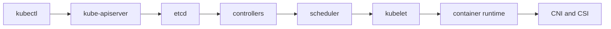

# Kubernetes in One Page

## 30-Second Answer

Kubernetes in One Page is the path from **kubectl** to **CNI and CSI**. The essential handoffs are kube-apiserver, etcd, controllers, scheduler, kubelet, container runtime. In production, I verify each handoff independently, keep its identity and state boundary visible, and operate it against availability, latency, security, and recovery objectives.

## Mental Model

Read this diagram as a concrete sequence, not a generic maturity loop: a failure after **container runtime** has different evidence and ownership from a failure at **kube-apiserver**.

## Why It Exists

Without kubernetes in one page, teams must manually coordinate kubectl, scheduler, and cni and csi. The technology standardizes those interfaces so changes are repeatable, reviewable, and diagnosable. It is justified when the repeated operational risk exceeds the cost of owning the abstraction.

## How It Works

**kubectl** owns stage 1; **kube-apiserver** owns stage 2; **etcd** owns stage 3; **controllers** owns stage 4; **scheduler** owns stage 5; **kubelet** owns stage 6; **container runtime** owns stage 7; **CNI and CSI** owns stage 8. Follow resource IDs, revisions, events, and timestamps across these stages; an acknowledgement at one stage never proves completion at the next.

## Mechanisms

* **kubectl:** Inspect its native state, events, latency, permissions, and capacity before moving to the next component.
* **kube-apiserver:** Inspect its native state, events, latency, permissions, and capacity before moving to the next component.
* **etcd:** Inspect its native state, events, latency, permissions, and capacity before moving to the next component.
* **controllers:** Inspect its native state, events, latency, permissions, and capacity before moving to the next component.
* **scheduler:** Inspect its native state, events, latency, permissions, and capacity before moving to the next component.
* **kubelet:** Inspect its native state, events, latency, permissions, and capacity before moving to the next component.
* **container runtime:** Inspect its native state, events, latency, permissions, and capacity before moving to the next component.
* **CNI and CSI:** Inspect its native state, events, latency, permissions, and capacity before moving to the next component.

## Production Architecture

Deploy kubectl with least privilege and an auditable change path. Isolate scheduler by environment and failure domain, make cni and csi observable, and test loss of each dependency. Version the interface between stages so producers and consumers can roll independently.

## Failure Modes

| Failure | Evidence | Response |
|---|---|---|
| API or watch lag hides progress | Compare stage latency and revision at kube-apiserver | Stop promotion and restore the last verified input |
| resource, IP, or storage capacity blocks convergence | Inspect saturation, quotas, events, and pending work at scheduler | Add valid capacity or shed load; do not retry without a bound |
| a probe or policy reports a misleading serving state | Compare the user result with CNI and CSI and upstream state | Mitigate first, preserve evidence, then repair the faulty contract |

## Trade-offs

More automation across kubectl and cni and csi improves consistency but can propagate an error faster. Strong isolation narrows blast radius but increases cost and upgrades. Managed implementations reduce component toil; self-managed implementations offer control but require availability, backup, security patching, and on-call expertise.

## Lead-Level Follow-ups

* Which team owns **scheduler**, and what user-facing SLO proves it works?
* What remains available when **kube-apiserver** is down?
* Where is state durable, and how are restore and upgrade tested?

## My Experience Prompt

Describe a change to scheduler: state the constraint, the exact signal that selected the design, the rollback boundary, and the durable guardrail you added.

## Recall Check

1. What does **kubectl** send to **kube-apiserver**?
2. Which component stores or reports authoritative state?
3. How does **container runtime** affect **CNI and CSI**?
4. Which capacity limit fails first at production scale?
5. When is a simpler managed alternative preferable?

## Related Notes

* [Category index](index.md)
* [Interview dashboard](../00-interview-dashboard.md)
