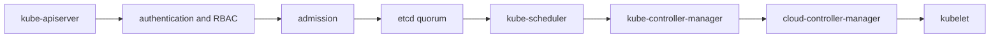

# Control Plane

## 30-Second Answer

Control Plane is the path from **kube-apiserver** to **kubelet**. The essential handoffs are authentication and RBAC, admission, etcd quorum, kube-scheduler, kube-controller-manager, cloud-controller-manager. In production, I verify each handoff independently, keep its identity and state boundary visible, and operate it against availability, latency, security, and recovery objectives.

## Mental Model

Read this diagram as a concrete sequence, not a generic maturity loop: a failure after **cloud-controller-manager** has different evidence and ownership from a failure at **authentication and RBAC**.

## Why It Exists

Without control plane, teams must manually coordinate kube-apiserver, kube-scheduler, and kubelet. The technology standardizes those interfaces so changes are repeatable, reviewable, and diagnosable. It is justified when the repeated operational risk exceeds the cost of owning the abstraction.

## How It Works

**kube-apiserver** owns stage 1; **authentication and RBAC** owns stage 2; **admission** owns stage 3; **etcd quorum** owns stage 4; **kube-scheduler** owns stage 5; **kube-controller-manager** owns stage 6; **cloud-controller-manager** owns stage 7; **kubelet** owns stage 8. Follow resource IDs, revisions, events, and timestamps across these stages; an acknowledgement at one stage never proves completion at the next.

## Mechanisms

* **kube-apiserver:** Inspect its native state, events, latency, permissions, and capacity before moving to the next component.
* **authentication and RBAC:** Inspect its native state, events, latency, permissions, and capacity before moving to the next component.
* **admission:** Inspect its native state, events, latency, permissions, and capacity before moving to the next component.
* **etcd quorum:** Inspect its native state, events, latency, permissions, and capacity before moving to the next component.
* **kube-scheduler:** Inspect its native state, events, latency, permissions, and capacity before moving to the next component.
* **kube-controller-manager:** Inspect its native state, events, latency, permissions, and capacity before moving to the next component.
* **cloud-controller-manager:** Inspect its native state, events, latency, permissions, and capacity before moving to the next component.
* **kubelet:** Inspect its native state, events, latency, permissions, and capacity before moving to the next component.

## Availability and Production Architecture

Run kube-apiserver replicas behind a load balancer and an odd etcd quorum across failure domains. Scheduler, controller manager, and cloud controller manager use leases for leader election; their standby replicas take over reconciliation, whereas API servers serve concurrently. Alert on API latency and errors, etcd fsync latency, database size and quorum health. Bound admission webhook timeouts and choose fail-open only where its security consequence is accepted. A managed control plane transfers etcd backup, patching, and component availability to the provider; self-management provides configuration access but makes the team responsible for quorum recovery and upgrades.

## Production Architecture

Deploy kube-apiserver with least privilege and an auditable change path. Isolate kube-scheduler by environment and failure domain, make kubelet observable, and test loss of each dependency. Version the interface between stages so producers and consumers can roll independently.

## Failure Modes

| Failure | Evidence | Response |
|---|---|---|
| API or watch lag hides progress | Compare stage latency and revision at authentication and RBAC | Stop promotion and restore the last verified input |
| resource, IP, or storage capacity blocks convergence | Inspect saturation, quotas, events, and pending work at kube-scheduler | Add valid capacity or shed load; do not retry without a bound |
| a probe or policy reports a misleading serving state | Compare the user result with kubelet and upstream state | Mitigate first, preserve evidence, then repair the faulty contract |

## Trade-offs

More automation across kube-apiserver and kubelet improves consistency but can propagate an error faster. Strong isolation narrows blast radius but increases cost and upgrades. Managed implementations reduce component toil; self-managed implementations offer control but require availability, backup, security patching, and on-call expertise.

## Lead-Level Follow-ups

* Which team owns **kube-scheduler**, and what user-facing SLO proves it works?
* What remains available when **authentication and RBAC** is down?
* Where is state durable, and how are restore and upgrade tested?

## My Experience Prompt

Describe a change to kube-scheduler: state the constraint, the exact signal that selected the design, the rollback boundary, and the durable guardrail you added.

## Recall Check

1. What does **kube-apiserver** send to **authentication and RBAC**?
2. Which component stores or reports authoritative state?
3. How does **cloud-controller-manager** affect **kubelet**?
4. Which capacity limit fails first at production scale?
5. When is a simpler managed alternative preferable?

## Related Notes

* [Category index](index.md)
* [Interview dashboard](../00-interview-dashboard.md)
