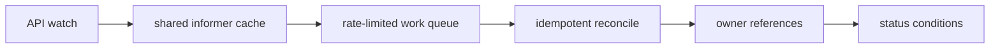

# Reconciliation and Controllers

## 30-Second Answer

Reconciliation and Controllers is the path from **API watch** to **status conditions**. The essential handoffs are shared informer cache, rate-limited work queue, idempotent reconcile, owner references. In production, I verify each handoff independently, keep its identity and state boundary visible, and operate it against availability, latency, security, and recovery objectives.

## Mental Model

Read this diagram as a concrete sequence, not a generic maturity loop: a failure after **owner references** has different evidence and ownership from a failure at **shared informer cache**.

## Why It Exists

Without reconciliation and controllers, teams must manually coordinate api watch, idempotent reconcile, and status conditions. The technology standardizes those interfaces so changes are repeatable, reviewable, and diagnosable. It is justified when the repeated operational risk exceeds the cost of owning the abstraction.

## How It Works

**API watch** owns stage 1; **shared informer cache** owns stage 2; **rate-limited work queue** owns stage 3; **idempotent reconcile** owns stage 4; **owner references** owns stage 5; **status conditions** owns stage 6. Follow resource IDs, revisions, events, and timestamps across these stages; an acknowledgement at one stage never proves completion at the next.

## Mechanisms

* **API watch:** Inspect its native state, events, latency, permissions, and capacity before moving to the next component.
* **shared informer cache:** Inspect its native state, events, latency, permissions, and capacity before moving to the next component.
* **rate-limited work queue:** Inspect its native state, events, latency, permissions, and capacity before moving to the next component.
* **idempotent reconcile:** Inspect its native state, events, latency, permissions, and capacity before moving to the next component.
* **owner references:** Inspect its native state, events, latency, permissions, and capacity before moving to the next component.
* **status conditions:** Inspect its native state, events, latency, permissions, and capacity before moving to the next component.

## Production Architecture

Deploy api watch with least privilege and an auditable change path. Isolate idempotent reconcile by environment and failure domain, make status conditions observable, and test loss of each dependency. Version the interface between stages so producers and consumers can roll independently.

## Failure Modes

| Failure | Evidence | Response |
|---|---|---|
| API or watch lag hides progress | Compare stage latency and revision at shared informer cache | Stop promotion and restore the last verified input |
| resource, IP, or storage capacity blocks convergence | Inspect saturation, quotas, events, and pending work at idempotent reconcile | Add valid capacity or shed load; do not retry without a bound |
| a probe or policy reports a misleading serving state | Compare the user result with status conditions and upstream state | Mitigate first, preserve evidence, then repair the faulty contract |

## Trade-offs

More automation across api watch and status conditions improves consistency but can propagate an error faster. Strong isolation narrows blast radius but increases cost and upgrades. Managed implementations reduce component toil; self-managed implementations offer control but require availability, backup, security patching, and on-call expertise.

## Lead-Level Follow-ups

* Which team owns **idempotent reconcile**, and what user-facing SLO proves it works?
* What remains available when **shared informer cache** is down?
* Where is state durable, and how are restore and upgrade tested?

## My Experience Prompt

Describe a change to idempotent reconcile: state the constraint, the exact signal that selected the design, the rollback boundary, and the durable guardrail you added.

## Recall Check

1. What does **API watch** send to **shared informer cache**?
2. Which component stores or reports authoritative state?
3. How does **owner references** affect **status conditions**?
4. Which capacity limit fails first at production scale?
5. When is a simpler managed alternative preferable?

## Related Notes

* [Category index](index.md)
* [Interview dashboard](../00-interview-dashboard.md)
