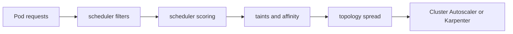

# Scheduling and Capacity

## 30-Second Answer

Scheduling and Capacity is the path from **Pod requests** to **Cluster Autoscaler or Karpenter**. The essential handoffs are scheduler filters, scheduler scoring, taints and affinity, topology spread. In production, I verify each handoff independently, keep its identity and state boundary visible, and operate it against availability, latency, security, and recovery objectives.

## Mental Model

Read this diagram as a concrete sequence, not a generic maturity loop: a failure after **topology spread** has different evidence and ownership from a failure at **scheduler filters**.

## Why It Exists

Without scheduling and capacity, teams must manually coordinate pod requests, taints and affinity, and cluster autoscaler or karpenter. The technology standardizes those interfaces so changes are repeatable, reviewable, and diagnosable. It is justified when the repeated operational risk exceeds the cost of owning the abstraction.

## How It Works

**Pod requests** owns stage 1; **scheduler filters** owns stage 2; **scheduler scoring** owns stage 3; **taints and affinity** owns stage 4; **topology spread** owns stage 5; **Cluster Autoscaler or Karpenter** owns stage 6. Follow resource IDs, revisions, events, and timestamps across these stages; an acknowledgement at one stage never proves completion at the next.

## Mechanisms

* **Pod requests:** Inspect its native state, events, latency, permissions, and capacity before moving to the next component.
* **scheduler filters:** Inspect its native state, events, latency, permissions, and capacity before moving to the next component.
* **scheduler scoring:** Inspect its native state, events, latency, permissions, and capacity before moving to the next component.
* **taints and affinity:** Inspect its native state, events, latency, permissions, and capacity before moving to the next component.
* **topology spread:** Inspect its native state, events, latency, permissions, and capacity before moving to the next component.
* **Cluster Autoscaler or Karpenter:** Inspect its native state, events, latency, permissions, and capacity before moving to the next component.

## Production Architecture

Deploy pod requests with least privilege and an auditable change path. Isolate taints and affinity by environment and failure domain, make cluster autoscaler or karpenter observable, and test loss of each dependency. Version the interface between stages so producers and consumers can roll independently.

## Failure Modes

| Failure | Evidence | Response |
|---|---|---|
| API or watch lag hides progress | Compare stage latency and revision at scheduler filters | Stop promotion and restore the last verified input |
| resource, IP, or storage capacity blocks convergence | Inspect saturation, quotas, events, and pending work at taints and affinity | Add valid capacity or shed load; do not retry without a bound |
| a probe or policy reports a misleading serving state | Compare the user result with Cluster Autoscaler or Karpenter and upstream state | Mitigate first, preserve evidence, then repair the faulty contract |

## Trade-offs

More automation across pod requests and cluster autoscaler or karpenter improves consistency but can propagate an error faster. Strong isolation narrows blast radius but increases cost and upgrades. Managed implementations reduce component toil; self-managed implementations offer control but require availability, backup, security patching, and on-call expertise.

## Lead-Level Follow-ups

* Which team owns **taints and affinity**, and what user-facing SLO proves it works?
* What remains available when **scheduler filters** is down?
* Where is state durable, and how are restore and upgrade tested?

## My Experience Prompt

Describe a change to taints and affinity: state the constraint, the exact signal that selected the design, the rollback boundary, and the durable guardrail you added.

## Recall Check

1. What does **Pod requests** send to **scheduler filters**?
2. Which component stores or reports authoritative state?
3. How does **topology spread** affect **Cluster Autoscaler or Karpenter**?
4. Which capacity limit fails first at production scale?
5. When is a simpler managed alternative preferable?

## Related Notes

* [Category index](index.md)
* [Interview dashboard](../00-interview-dashboard.md)
