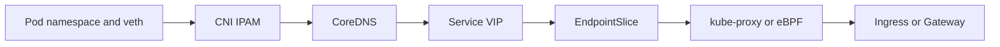

# Networking: CNI, Services, and Ingress

## 30-Second Answer

Networking: CNI, Services, and Ingress is the path from **Pod namespace and veth** to **Ingress or Gateway**. The essential handoffs are CNI IPAM, CoreDNS, Service VIP, EndpointSlice, kube-proxy or eBPF. In production, I verify each handoff independently, keep its identity and state boundary visible, and operate it against availability, latency, security, and recovery objectives.

## Mental Model

Read this diagram as a concrete sequence, not a generic maturity loop: a failure after **kube-proxy or eBPF** has different evidence and ownership from a failure at **CNI IPAM**.

## Why It Exists

Without networking: cni, services, and ingress, teams must manually coordinate pod namespace and veth, service vip, and ingress or gateway. The technology standardizes those interfaces so changes are repeatable, reviewable, and diagnosable. It is justified when the repeated operational risk exceeds the cost of owning the abstraction.

## How It Works

**Pod namespace and veth** owns stage 1; **CNI IPAM** owns stage 2; **CoreDNS** owns stage 3; **Service VIP** owns stage 4; **EndpointSlice** owns stage 5; **kube-proxy or eBPF** owns stage 6; **Ingress or Gateway** owns stage 7. Follow resource IDs, revisions, events, and timestamps across these stages; an acknowledgement at one stage never proves completion at the next.

## Mechanisms

* **Pod namespace and veth:** Inspect its native state, events, latency, permissions, and capacity before moving to the next component.
* **CNI IPAM:** Inspect its native state, events, latency, permissions, and capacity before moving to the next component.
* **CoreDNS:** Inspect its native state, events, latency, permissions, and capacity before moving to the next component.
* **Service VIP:** Inspect its native state, events, latency, permissions, and capacity before moving to the next component.
* **EndpointSlice:** Inspect its native state, events, latency, permissions, and capacity before moving to the next component.
* **kube-proxy or eBPF:** Inspect its native state, events, latency, permissions, and capacity before moving to the next component.
* **Ingress or Gateway:** Inspect its native state, events, latency, permissions, and capacity before moving to the next component.

## Production Architecture

Deploy pod namespace and veth with least privilege and an auditable change path. Isolate service vip by environment and failure domain, make ingress or gateway observable, and test loss of each dependency. Version the interface between stages so producers and consumers can roll independently.

## Failure Modes

| Failure | Evidence | Response |
|---|---|---|
| API or watch lag hides progress | Compare stage latency and revision at CNI IPAM | Stop promotion and restore the last verified input |
| resource, IP, or storage capacity blocks convergence | Inspect saturation, quotas, events, and pending work at Service VIP | Add valid capacity or shed load; do not retry without a bound |
| a probe or policy reports a misleading serving state | Compare the user result with Ingress or Gateway and upstream state | Mitigate first, preserve evidence, then repair the faulty contract |

## Trade-offs

More automation across pod namespace and veth and ingress or gateway improves consistency but can propagate an error faster. Strong isolation narrows blast radius but increases cost and upgrades. Managed implementations reduce component toil; self-managed implementations offer control but require availability, backup, security patching, and on-call expertise.

## Lead-Level Follow-ups

* Which team owns **Service VIP**, and what user-facing SLO proves it works?
* What remains available when **CNI IPAM** is down?
* Where is state durable, and how are restore and upgrade tested?

## My Experience Prompt

Describe a change to service vip: state the constraint, the exact signal that selected the design, the rollback boundary, and the durable guardrail you added.

## Recall Check

1. What does **Pod namespace and veth** send to **CNI IPAM**?
2. Which component stores or reports authoritative state?
3. How does **kube-proxy or eBPF** affect **Ingress or Gateway**?
4. Which capacity limit fails first at production scale?
5. When is a simpler managed alternative preferable?

## Related Notes

* [Category index](index.md)
* [Interview dashboard](../00-interview-dashboard.md)
