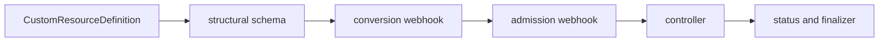

# CRDs, Operators, and Admission

## 30-Second Answer

CRDs, Operators, and Admission is the path from **CustomResourceDefinition** to **status and finalizer**. The essential handoffs are structural schema, conversion webhook, admission webhook, controller. In production, I verify each handoff independently, keep its identity and state boundary visible, and operate it against availability, latency, security, and recovery objectives.

## Mental Model

Read this diagram as a concrete sequence, not a generic maturity loop: a failure after **controller** has different evidence and ownership from a failure at **structural schema**.

## Why It Exists

Without crds, operators, and admission, teams must manually coordinate customresourcedefinition, admission webhook, and status and finalizer. The technology standardizes those interfaces so changes are repeatable, reviewable, and diagnosable. It is justified when the repeated operational risk exceeds the cost of owning the abstraction.

## How It Works

**CustomResourceDefinition** owns stage 1; **structural schema** owns stage 2; **conversion webhook** owns stage 3; **admission webhook** owns stage 4; **controller** owns stage 5; **status and finalizer** owns stage 6. Follow resource IDs, revisions, events, and timestamps across these stages; an acknowledgement at one stage never proves completion at the next.

## Mechanisms

* **CustomResourceDefinition:** Inspect its native state, events, latency, permissions, and capacity before moving to the next component.
* **structural schema:** Inspect its native state, events, latency, permissions, and capacity before moving to the next component.
* **conversion webhook:** Inspect its native state, events, latency, permissions, and capacity before moving to the next component.
* **admission webhook:** Inspect its native state, events, latency, permissions, and capacity before moving to the next component.
* **controller:** Inspect its native state, events, latency, permissions, and capacity before moving to the next component.
* **status and finalizer:** Inspect its native state, events, latency, permissions, and capacity before moving to the next component.

## Production Architecture

Deploy customresourcedefinition with least privilege and an auditable change path. Isolate admission webhook by environment and failure domain, make status and finalizer observable, and test loss of each dependency. Version the interface between stages so producers and consumers can roll independently.

## Failure Modes

| Failure | Evidence | Response |
|---|---|---|
| API or watch lag hides progress | Compare stage latency and revision at structural schema | Stop promotion and restore the last verified input |
| resource, IP, or storage capacity blocks convergence | Inspect saturation, quotas, events, and pending work at admission webhook | Add valid capacity or shed load; do not retry without a bound |
| a probe or policy reports a misleading serving state | Compare the user result with status and finalizer and upstream state | Mitigate first, preserve evidence, then repair the faulty contract |

## Trade-offs

More automation across customresourcedefinition and status and finalizer improves consistency but can propagate an error faster. Strong isolation narrows blast radius but increases cost and upgrades. Managed implementations reduce component toil; self-managed implementations offer control but require availability, backup, security patching, and on-call expertise.

## Lead-Level Follow-ups

* Which team owns **admission webhook**, and what user-facing SLO proves it works?
* What remains available when **structural schema** is down?
* Where is state durable, and how are restore and upgrade tested?

## My Experience Prompt

Describe a change to admission webhook: state the constraint, the exact signal that selected the design, the rollback boundary, and the durable guardrail you added.

## Recall Check

1. What does **CustomResourceDefinition** send to **structural schema**?
2. Which component stores or reports authoritative state?
3. How does **controller** affect **status and finalizer**?
4. Which capacity limit fails first at production scale?
5. When is a simpler managed alternative preferable?

## Related Notes

* [Category index](index.md)
* [Interview dashboard](../00-interview-dashboard.md)
