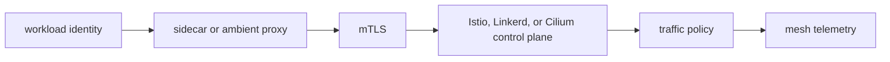

# Service Mesh: Istio, Linkerd, and Cilium

## 30-Second Answer

Service Mesh: Istio, Linkerd, and Cilium is the path from **workload identity** to **mesh telemetry**. The essential handoffs are sidecar or ambient proxy, mTLS, Istio, Linkerd, or Cilium control plane, traffic policy. In production, I verify each handoff independently, keep its identity and state boundary visible, and operate it against availability, latency, security, and recovery objectives.

## Mental Model

Read this diagram as a concrete sequence, not a generic maturity loop: a failure after **traffic policy** has different evidence and ownership from a failure at **sidecar or ambient proxy**.

## Why It Exists

Without service mesh: istio, linkerd, and cilium, teams must manually coordinate workload identity, istio, linkerd, or cilium control plane, and mesh telemetry. The technology standardizes those interfaces so changes are repeatable, reviewable, and diagnosable. It is justified when the repeated operational risk exceeds the cost of owning the abstraction.

## How It Works

**workload identity** owns stage 1; **sidecar or ambient proxy** owns stage 2; **mTLS** owns stage 3; **Istio, Linkerd, or Cilium control plane** owns stage 4; **traffic policy** owns stage 5; **mesh telemetry** owns stage 6. Follow resource IDs, revisions, events, and timestamps across these stages; an acknowledgement at one stage never proves completion at the next.

## Mechanisms

* **workload identity:** Inspect its native state, events, latency, permissions, and capacity before moving to the next component.
* **sidecar or ambient proxy:** Inspect its native state, events, latency, permissions, and capacity before moving to the next component.
* **mTLS:** Inspect its native state, events, latency, permissions, and capacity before moving to the next component.
* **Istio, Linkerd, or Cilium control plane:** Inspect its native state, events, latency, permissions, and capacity before moving to the next component.
* **traffic policy:** Inspect its native state, events, latency, permissions, and capacity before moving to the next component.
* **mesh telemetry:** Inspect its native state, events, latency, permissions, and capacity before moving to the next component.

## Production Architecture

Deploy workload identity with least privilege and an auditable change path. Isolate istio, linkerd, or cilium control plane by environment and failure domain, make mesh telemetry observable, and test loss of each dependency. Version the interface between stages so producers and consumers can roll independently.

## Failure Modes

| Failure | Evidence | Response |
|---|---|---|
| API or watch lag hides progress | Compare stage latency and revision at sidecar or ambient proxy | Stop promotion and restore the last verified input |
| resource, IP, or storage capacity blocks convergence | Inspect saturation, quotas, events, and pending work at Istio, Linkerd, or Cilium control plane | Add valid capacity or shed load; do not retry without a bound |
| a probe or policy reports a misleading serving state | Compare the user result with mesh telemetry and upstream state | Mitigate first, preserve evidence, then repair the faulty contract |

## Trade-offs

More automation across workload identity and mesh telemetry improves consistency but can propagate an error faster. Strong isolation narrows blast radius but increases cost and upgrades. Managed implementations reduce component toil; self-managed implementations offer control but require availability, backup, security patching, and on-call expertise.

## Lead-Level Follow-ups

* Which team owns **Istio, Linkerd, or Cilium control plane**, and what user-facing SLO proves it works?
* What remains available when **sidecar or ambient proxy** is down?
* Where is state durable, and how are restore and upgrade tested?

## My Experience Prompt

Describe a change to istio, linkerd, or cilium control plane: state the constraint, the exact signal that selected the design, the rollback boundary, and the durable guardrail you added.

## Recall Check

1. What does **workload identity** send to **sidecar or ambient proxy**?
2. Which component stores or reports authoritative state?
3. How does **traffic policy** affect **mesh telemetry**?
4. Which capacity limit fails first at production scale?
5. When is a simpler managed alternative preferable?

## Related Notes

* [Category index](index.md)
* [Interview dashboard](../00-interview-dashboard.md)
