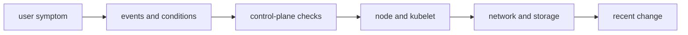

# Production Troubleshooting

## 30-Second Answer

Production Troubleshooting is the path from **user symptom** to **recent change**. The essential handoffs are events and conditions, control-plane checks, node and kubelet, network and storage. In production, I verify each handoff independently, keep its identity and state boundary visible, and operate it against availability, latency, security, and recovery objectives.

## Mental Model

Read this diagram as a concrete sequence, not a generic maturity loop: a failure after **network and storage** has different evidence and ownership from a failure at **events and conditions**.

## Why It Exists

Without production troubleshooting, teams must manually coordinate user symptom, node and kubelet, and recent change. The technology standardizes those interfaces so changes are repeatable, reviewable, and diagnosable. It is justified when the repeated operational risk exceeds the cost of owning the abstraction.

## How It Works

**user symptom** owns stage 1; **events and conditions** owns stage 2; **control-plane checks** owns stage 3; **node and kubelet** owns stage 4; **network and storage** owns stage 5; **recent change** owns stage 6. Follow resource IDs, revisions, events, and timestamps across these stages; an acknowledgement at one stage never proves completion at the next.

## Mechanisms

* **user symptom:** Inspect its native state, events, latency, permissions, and capacity before moving to the next component.
* **events and conditions:** Inspect its native state, events, latency, permissions, and capacity before moving to the next component.
* **control-plane checks:** Inspect its native state, events, latency, permissions, and capacity before moving to the next component.
* **node and kubelet:** Inspect its native state, events, latency, permissions, and capacity before moving to the next component.
* **network and storage:** Inspect its native state, events, latency, permissions, and capacity before moving to the next component.
* **recent change:** Inspect its native state, events, latency, permissions, and capacity before moving to the next component.

## Production Architecture

Deploy user symptom with least privilege and an auditable change path. Isolate node and kubelet by environment and failure domain, make recent change observable, and test loss of each dependency. Version the interface between stages so producers and consumers can roll independently.

## Failure Modes

| Failure | Evidence | Response |
|---|---|---|
| API or watch lag hides progress | Compare stage latency and revision at events and conditions | Stop promotion and restore the last verified input |
| resource, IP, or storage capacity blocks convergence | Inspect saturation, quotas, events, and pending work at node and kubelet | Add valid capacity or shed load; do not retry without a bound |
| a probe or policy reports a misleading serving state | Compare the user result with recent change and upstream state | Mitigate first, preserve evidence, then repair the faulty contract |

## Trade-offs

More automation across user symptom and recent change improves consistency but can propagate an error faster. Strong isolation narrows blast radius but increases cost and upgrades. Managed implementations reduce component toil; self-managed implementations offer control but require availability, backup, security patching, and on-call expertise.

## Lead-Level Follow-ups

* Which team owns **node and kubelet**, and what user-facing SLO proves it works?
* What remains available when **events and conditions** is down?
* Where is state durable, and how are restore and upgrade tested?

## My Experience Prompt

Describe a change to node and kubelet: state the constraint, the exact signal that selected the design, the rollback boundary, and the durable guardrail you added.

## Recall Check

1. What does **user symptom** send to **events and conditions**?
2. Which component stores or reports authoritative state?
3. How does **network and storage** affect **recent change**?
4. Which capacity limit fails first at production scale?
5. When is a simpler managed alternative preferable?

## Related Notes

* [Category index](index.md)
* [Interview dashboard](../00-interview-dashboard.md)
