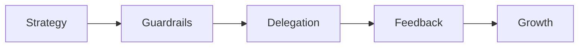

# Mentoring and Technical Direction

## 30-Second Answer

Set direction through principles and guardrails, then grow others through scoped ownership, timely feedback and visible decision opportunities.

## Mental Model

Treat the observable boundary as part of the design. Resolve conflict by restating shared outcomes, surfacing assumptions and running reversible experiments; do not substitute authority for evidence.

## Architecture Diagram



## Core Components

The named components in the diagram have different state, saturation signals and owners. Establish which component accepted work, which one made durable progress, and which one produced the user-visible result.

## How It Actually Works

Set direction through principles and guardrails, then grow others through scoped ownership, timely feedback and visible decision opportunities. Resolve conflict by restating shared outcomes, surfacing assumptions and running reversible experiments; do not substitute authority for evidence.

## Production Design

Define an availability objective, bounded resource consumption, an upgrade path and a reversible operational change. Keep authoritative state separate from caches and derived status.

## Failure Modes

| Failure | Discriminating evidence | Safe first action |
|---|---|---|
| Interface or configuration mismatch | rejection/error at the named boundary | stop the change and compare the last known-good contract |
| Resource saturation | queue or pressure rises before latency/errors | bound admission and relieve the specific bottleneck |
| Dependency unavailable | local health remains good while downstream calls fail | preserve evidence and enter the documented degraded mode |

## Troubleshooting Procedure

```bash
Track decision latency, bus factor, review bottlenecks and ownership health—not story points alone.
```

Capture a timestamp and failing example, compare it with a healthy peer, and change one hypothesis at a time.

## Security Considerations

Use least privilege, short-lived credentials, encrypted transport, safe secret handling and auditable changes. Validate untrusted inputs before they cross a privileged boundary.

## Scaling and Cost

Measure demand, concurrency, saturation and unit cost. Scale the constrained resource rather than copying every component; account for redundancy, data transfer and observability retention.

## Trade-offs

Resolve conflict by restating shared outcomes, surfacing assumptions and running reversible experiments; do not substitute authority for evidence.

## Lead-Level Follow-ups

* What is authoritative, and who owns recovery?
* Which signal triggers rollback rather than continued diagnosis?
* Which simplification would you choose at one tenth of the scale?

## My Experience Prompt

Describe one production decision involving **Mentoring and Technical Direction**: quantify impact, show the evidence that changed your mind, and name the durable guardrail.

## Recall Check

1. What is the first discriminating signal?
2. Which state survives restart?
3. What is the safest reversible mitigation?

## Related Notes

* [Study Vault](../index.md)
* [Interview dashboard](../00-interview-dashboard.md)

## Further Reading

* [CNCF documentation index](https://www.cncf.io/projects/)
* [Linux manual pages](https://man7.org/linux/man-pages/)
