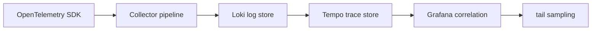

# Loki, Tempo, and OpenTelemetry

## 30-Second Answer

Loki, Tempo, and OpenTelemetry is the path from **OpenTelemetry SDK** to **tail sampling**. The essential handoffs are Collector pipeline, Loki log store, Tempo trace store, Grafana correlation. In production, I verify each handoff independently, keep its identity and state boundary visible, and operate it against availability, latency, security, and recovery objectives.

## Mental Model

Read this diagram as a concrete sequence, not a generic maturity loop: a failure after **Grafana correlation** has different evidence and ownership from a failure at **Collector pipeline**.

## Why It Exists

Without loki, tempo, and opentelemetry, teams must manually coordinate opentelemetry sdk, tempo trace store, and tail sampling. The technology standardizes those interfaces so changes are repeatable, reviewable, and diagnosable. It is justified when the repeated operational risk exceeds the cost of owning the abstraction.

## How It Works

**OpenTelemetry SDK** owns stage 1; **Collector pipeline** owns stage 2; **Loki log store** owns stage 3; **Tempo trace store** owns stage 4; **Grafana correlation** owns stage 5; **tail sampling** owns stage 6. Follow resource IDs, revisions, events, and timestamps across these stages; an acknowledgement at one stage never proves completion at the next.

## Mechanisms

* **OpenTelemetry SDK:** Inspect its native state, events, latency, permissions, and capacity before moving to the next component.
* **Collector pipeline:** Inspect its native state, events, latency, permissions, and capacity before moving to the next component.
* **Loki log store:** Inspect its native state, events, latency, permissions, and capacity before moving to the next component.
* **Tempo trace store:** Inspect its native state, events, latency, permissions, and capacity before moving to the next component.
* **Grafana correlation:** Inspect its native state, events, latency, permissions, and capacity before moving to the next component.
* **tail sampling:** Inspect its native state, events, latency, permissions, and capacity before moving to the next component.

## Production Architecture

Deploy opentelemetry sdk with least privilege and an auditable change path. Isolate tempo trace store by environment and failure domain, make tail sampling observable, and test loss of each dependency. Version the interface between stages so producers and consumers can roll independently.

## Failure Modes

| Failure | Evidence | Response |
|---|---|---|
| cardinality or volume overloads ingestion | Compare stage latency and revision at Collector pipeline | Stop promotion and restore the last verified input |
| sampling removes the only evidence for a rare failure | Inspect saturation, quotas, events, and pending work at Tempo trace store | Add valid capacity or shed load; do not retry without a bound |
| an unactionable alert pages without user impact | Compare the user result with tail sampling and upstream state | Mitigate first, preserve evidence, then repair the faulty contract |

## Trade-offs

More automation across opentelemetry sdk and tail sampling improves consistency but can propagate an error faster. Strong isolation narrows blast radius but increases cost and upgrades. Managed implementations reduce component toil; self-managed implementations offer control but require availability, backup, security patching, and on-call expertise.

## Lead-Level Follow-ups

* Which team owns **Tempo trace store**, and what user-facing SLO proves it works?
* What remains available when **Collector pipeline** is down?
* Where is state durable, and how are restore and upgrade tested?

## My Experience Prompt

Describe a change to tempo trace store: state the constraint, the exact signal that selected the design, the rollback boundary, and the durable guardrail you added.

## Recall Check

1. What does **OpenTelemetry SDK** send to **Collector pipeline**?
2. Which component stores or reports authoritative state?
3. How does **Grafana correlation** affect **tail sampling**?
4. Which capacity limit fails first at production scale?
5. When is a simpler managed alternative preferable?

## Related Notes

* [Category index](index.md)
* [Interview dashboard](../00-interview-dashboard.md)
