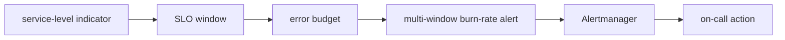

# Alerting, SLOs, and Error Budgets

## 30-Second Answer

Alerting, SLOs, and Error Budgets is the path from **service-level indicator** to **on-call action**. The essential handoffs are SLO window, error budget, multi-window burn-rate alert, Alertmanager. In production, I verify each handoff independently, keep its identity and state boundary visible, and operate it against availability, latency, security, and recovery objectives.

## Mental Model

Read this diagram as a concrete sequence, not a generic maturity loop: a failure after **Alertmanager** has different evidence and ownership from a failure at **SLO window**.

## Why It Exists

Without alerting, slos, and error budgets, teams must manually coordinate service-level indicator, multi-window burn-rate alert, and on-call action. The technology standardizes those interfaces so changes are repeatable, reviewable, and diagnosable. It is justified when the repeated operational risk exceeds the cost of owning the abstraction.

## How It Works

**service-level indicator** owns stage 1; **SLO window** owns stage 2; **error budget** owns stage 3; **multi-window burn-rate alert** owns stage 4; **Alertmanager** owns stage 5; **on-call action** owns stage 6. Follow resource IDs, revisions, events, and timestamps across these stages; an acknowledgement at one stage never proves completion at the next.

## Mechanisms

* **service-level indicator:** Inspect its native state, events, latency, permissions, and capacity before moving to the next component.
* **SLO window:** Inspect its native state, events, latency, permissions, and capacity before moving to the next component.
* **error budget:** Inspect its native state, events, latency, permissions, and capacity before moving to the next component.
* **multi-window burn-rate alert:** Inspect its native state, events, latency, permissions, and capacity before moving to the next component.
* **Alertmanager:** Inspect its native state, events, latency, permissions, and capacity before moving to the next component.
* **on-call action:** Inspect its native state, events, latency, permissions, and capacity before moving to the next component.

## Production Architecture

Deploy service-level indicator with least privilege and an auditable change path. Isolate multi-window burn-rate alert by environment and failure domain, make on-call action observable, and test loss of each dependency. Version the interface between stages so producers and consumers can roll independently.

## Failure Modes

| Failure | Evidence | Response |
|---|---|---|
| cardinality or volume overloads ingestion | Compare stage latency and revision at SLO window | Stop promotion and restore the last verified input |
| sampling removes the only evidence for a rare failure | Inspect saturation, quotas, events, and pending work at multi-window burn-rate alert | Add valid capacity or shed load; do not retry without a bound |
| an unactionable alert pages without user impact | Compare the user result with on-call action and upstream state | Mitigate first, preserve evidence, then repair the faulty contract |

## Trade-offs

More automation across service-level indicator and on-call action improves consistency but can propagate an error faster. Strong isolation narrows blast radius but increases cost and upgrades. Managed implementations reduce component toil; self-managed implementations offer control but require availability, backup, security patching, and on-call expertise.

## Lead-Level Follow-ups

* Which team owns **multi-window burn-rate alert**, and what user-facing SLO proves it works?
* What remains available when **SLO window** is down?
* Where is state durable, and how are restore and upgrade tested?

## My Experience Prompt

Describe a change to multi-window burn-rate alert: state the constraint, the exact signal that selected the design, the rollback boundary, and the durable guardrail you added.

## Recall Check

1. What does **service-level indicator** send to **SLO window**?
2. Which component stores or reports authoritative state?
3. How does **Alertmanager** affect **on-call action**?
4. Which capacity limit fails first at production scale?
5. When is a simpler managed alternative preferable?

## Related Notes

* [Category index](index.md)
* [Interview dashboard](../00-interview-dashboard.md)
