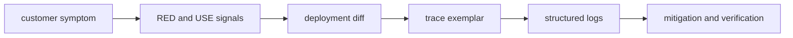

# Production Debugging Method

## 30-Second Answer

Production Debugging Method is the path from **customer symptom** to **mitigation and verification**. The essential handoffs are RED and USE signals, deployment diff, trace exemplar, structured logs. In production, I verify each handoff independently, keep its identity and state boundary visible, and operate it against availability, latency, security, and recovery objectives.

## Mental Model

Read this diagram as a concrete sequence, not a generic maturity loop: a failure after **structured logs** has different evidence and ownership from a failure at **RED and USE signals**.

## Why It Exists

Without production debugging method, teams must manually coordinate customer symptom, trace exemplar, and mitigation and verification. The technology standardizes those interfaces so changes are repeatable, reviewable, and diagnosable. It is justified when the repeated operational risk exceeds the cost of owning the abstraction.

## How It Works

**customer symptom** owns stage 1; **RED and USE signals** owns stage 2; **deployment diff** owns stage 3; **trace exemplar** owns stage 4; **structured logs** owns stage 5; **mitigation and verification** owns stage 6. Follow resource IDs, revisions, events, and timestamps across these stages; an acknowledgement at one stage never proves completion at the next.

## Mechanisms

* **customer symptom:** Inspect its native state, events, latency, permissions, and capacity before moving to the next component.
* **RED and USE signals:** Inspect its native state, events, latency, permissions, and capacity before moving to the next component.
* **deployment diff:** Inspect its native state, events, latency, permissions, and capacity before moving to the next component.
* **trace exemplar:** Inspect its native state, events, latency, permissions, and capacity before moving to the next component.
* **structured logs:** Inspect its native state, events, latency, permissions, and capacity before moving to the next component.
* **mitigation and verification:** Inspect its native state, events, latency, permissions, and capacity before moving to the next component.

## Production Architecture

Deploy customer symptom with least privilege and an auditable change path. Isolate trace exemplar by environment and failure domain, make mitigation and verification observable, and test loss of each dependency. Version the interface between stages so producers and consumers can roll independently.

## Failure Modes

| Failure | Evidence | Response |
|---|---|---|
| cardinality or volume overloads ingestion | Compare stage latency and revision at RED and USE signals | Stop promotion and restore the last verified input |
| sampling removes the only evidence for a rare failure | Inspect saturation, quotas, events, and pending work at trace exemplar | Add valid capacity or shed load; do not retry without a bound |
| an unactionable alert pages without user impact | Compare the user result with mitigation and verification and upstream state | Mitigate first, preserve evidence, then repair the faulty contract |

## Trade-offs

More automation across customer symptom and mitigation and verification improves consistency but can propagate an error faster. Strong isolation narrows blast radius but increases cost and upgrades. Managed implementations reduce component toil; self-managed implementations offer control but require availability, backup, security patching, and on-call expertise.

## Lead-Level Follow-ups

* Which team owns **trace exemplar**, and what user-facing SLO proves it works?
* What remains available when **RED and USE signals** is down?
* Where is state durable, and how are restore and upgrade tested?

## My Experience Prompt

Describe a change to trace exemplar: state the constraint, the exact signal that selected the design, the rollback boundary, and the durable guardrail you added.

## Recall Check

1. What does **customer symptom** send to **RED and USE signals**?
2. Which component stores or reports authoritative state?
3. How does **structured logs** affect **mitigation and verification**?
4. Which capacity limit fails first at production scale?
5. When is a simpler managed alternative preferable?

## Related Notes

* [Category index](index.md)
* [Interview dashboard](../00-interview-dashboard.md)
