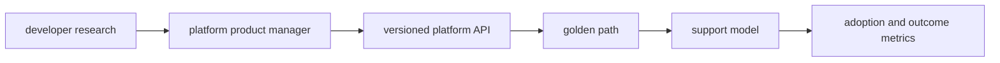

# Platform as a Product

## 30-Second Answer

Platform as a Product is the path from **developer research** to **adoption and outcome metrics**. The essential handoffs are platform product manager, versioned platform API, golden path, support model. In production, I verify each handoff independently, keep its identity and state boundary visible, and operate it against availability, latency, security, and recovery objectives.

## Mental Model

Read this diagram as a concrete sequence, not a generic maturity loop: a failure after **support model** has different evidence and ownership from a failure at **platform product manager**.

## Why It Exists

Without platform as a product, teams must manually coordinate developer research, golden path, and adoption and outcome metrics. The technology standardizes those interfaces so changes are repeatable, reviewable, and diagnosable. It is justified when the repeated operational risk exceeds the cost of owning the abstraction.

## How It Works

**developer research** owns stage 1; **platform product manager** owns stage 2; **versioned platform API** owns stage 3; **golden path** owns stage 4; **support model** owns stage 5; **adoption and outcome metrics** owns stage 6. Follow resource IDs, revisions, events, and timestamps across these stages; an acknowledgement at one stage never proves completion at the next.

## Mechanisms

* **developer research:** Inspect its native state, events, latency, permissions, and capacity before moving to the next component.
* **platform product manager:** Inspect its native state, events, latency, permissions, and capacity before moving to the next component.
* **versioned platform API:** Inspect its native state, events, latency, permissions, and capacity before moving to the next component.
* **golden path:** Inspect its native state, events, latency, permissions, and capacity before moving to the next component.
* **support model:** Inspect its native state, events, latency, permissions, and capacity before moving to the next component.
* **adoption and outcome metrics:** Inspect its native state, events, latency, permissions, and capacity before moving to the next component.

## Production Architecture

Deploy developer research with least privilege and an auditable change path. Isolate golden path by environment and failure domain, make adoption and outcome metrics observable, and test loss of each dependency. Version the interface between stages so producers and consumers can roll independently.

## Failure Modes

| Failure | Evidence | Response |
|---|---|---|
| the abstraction hides a failure users must debug | Compare stage latency and revision at platform product manager | Stop promotion and restore the last verified input |
| a mandatory path lacks an escape hatch or migration | Inspect saturation, quotas, events, and pending work at golden path | Add valid capacity or shed load; do not retry without a bound |
| adoption metrics count activity rather than developer outcomes | Compare the user result with adoption and outcome metrics and upstream state | Mitigate first, preserve evidence, then repair the faulty contract |

## Trade-offs

More automation across developer research and adoption and outcome metrics improves consistency but can propagate an error faster. Strong isolation narrows blast radius but increases cost and upgrades. Managed implementations reduce component toil; self-managed implementations offer control but require availability, backup, security patching, and on-call expertise.

## Lead-Level Follow-ups

* Which team owns **golden path**, and what user-facing SLO proves it works?
* What remains available when **platform product manager** is down?
* Where is state durable, and how are restore and upgrade tested?

## My Experience Prompt

Describe a change to golden path: state the constraint, the exact signal that selected the design, the rollback boundary, and the durable guardrail you added.

## Recall Check

1. What does **developer research** send to **platform product manager**?
2. Which component stores or reports authoritative state?
3. How does **support model** affect **adoption and outcome metrics**?
4. Which capacity limit fails first at production scale?
5. When is a simpler managed alternative preferable?

## Related Notes

* [Category index](index.md)
* [Interview dashboard](../00-interview-dashboard.md)
