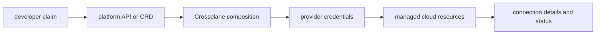

# Platform APIs and Crossplane

## 30-Second Answer

Platform APIs and Crossplane is the path from **developer claim** to **connection details and status**. The essential handoffs are platform API or CRD, Crossplane composition, provider credentials, managed cloud resources. In production, I verify each handoff independently, keep its identity and state boundary visible, and operate it against availability, latency, security, and recovery objectives.

## Mental Model

Read this diagram as a concrete sequence, not a generic maturity loop: a failure after **managed cloud resources** has different evidence and ownership from a failure at **platform API or CRD**.

## Why It Exists

Without platform apis and crossplane, teams must manually coordinate developer claim, provider credentials, and connection details and status. The technology standardizes those interfaces so changes are repeatable, reviewable, and diagnosable. It is justified when the repeated operational risk exceeds the cost of owning the abstraction.

## How It Works

**developer claim** owns stage 1; **platform API or CRD** owns stage 2; **Crossplane composition** owns stage 3; **provider credentials** owns stage 4; **managed cloud resources** owns stage 5; **connection details and status** owns stage 6. Follow resource IDs, revisions, events, and timestamps across these stages; an acknowledgement at one stage never proves completion at the next.

## Mechanisms

* **developer claim:** Inspect its native state, events, latency, permissions, and capacity before moving to the next component.
* **platform API or CRD:** Inspect its native state, events, latency, permissions, and capacity before moving to the next component.
* **Crossplane composition:** Inspect its native state, events, latency, permissions, and capacity before moving to the next component.
* **provider credentials:** Inspect its native state, events, latency, permissions, and capacity before moving to the next component.
* **managed cloud resources:** Inspect its native state, events, latency, permissions, and capacity before moving to the next component.
* **connection details and status:** Inspect its native state, events, latency, permissions, and capacity before moving to the next component.

## Production Architecture

Deploy developer claim with least privilege and an auditable change path. Isolate provider credentials by environment and failure domain, make connection details and status observable, and test loss of each dependency. Version the interface between stages so producers and consumers can roll independently.

## Failure Modes

| Failure | Evidence | Response |
|---|---|---|
| the abstraction hides a failure users must debug | Compare stage latency and revision at platform API or CRD | Stop promotion and restore the last verified input |
| a mandatory path lacks an escape hatch or migration | Inspect saturation, quotas, events, and pending work at provider credentials | Add valid capacity or shed load; do not retry without a bound |
| adoption metrics count activity rather than developer outcomes | Compare the user result with connection details and status and upstream state | Mitigate first, preserve evidence, then repair the faulty contract |

## Trade-offs

More automation across developer claim and connection details and status improves consistency but can propagate an error faster. Strong isolation narrows blast radius but increases cost and upgrades. Managed implementations reduce component toil; self-managed implementations offer control but require availability, backup, security patching, and on-call expertise.

## Lead-Level Follow-ups

* Which team owns **provider credentials**, and what user-facing SLO proves it works?
* What remains available when **platform API or CRD** is down?
* Where is state durable, and how are restore and upgrade tested?

## My Experience Prompt

Describe a change to provider credentials: state the constraint, the exact signal that selected the design, the rollback boundary, and the durable guardrail you added.

## Recall Check

1. What does **developer claim** send to **platform API or CRD**?
2. Which component stores or reports authoritative state?
3. How does **managed cloud resources** affect **connection details and status**?
4. Which capacity limit fails first at production scale?
5. When is a simpler managed alternative preferable?

## Related Notes

* [Category index](index.md)
* [Interview dashboard](../00-interview-dashboard.md)
