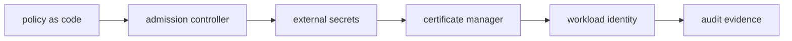

# Policy, Secrets, and Certificates

## 30-Second Answer

Policy, Secrets, and Certificates is the path from **policy as code** to **audit evidence**. The essential handoffs are admission controller, external secrets, certificate manager, workload identity. In production, I verify each handoff independently, keep its identity and state boundary visible, and operate it against availability, latency, security, and recovery objectives.

## Mental Model

Read this diagram as a concrete sequence, not a generic maturity loop: a failure after **workload identity** has different evidence and ownership from a failure at **admission controller**.

## Why It Exists

Without policy, secrets, and certificates, teams must manually coordinate policy as code, certificate manager, and audit evidence. The technology standardizes those interfaces so changes are repeatable, reviewable, and diagnosable. It is justified when the repeated operational risk exceeds the cost of owning the abstraction.

## How It Works

**policy as code** owns stage 1; **admission controller** owns stage 2; **external secrets** owns stage 3; **certificate manager** owns stage 4; **workload identity** owns stage 5; **audit evidence** owns stage 6. Follow resource IDs, revisions, events, and timestamps across these stages; an acknowledgement at one stage never proves completion at the next.

## Mechanisms

* **policy as code:** Inspect its native state, events, latency, permissions, and capacity before moving to the next component.
* **admission controller:** Inspect its native state, events, latency, permissions, and capacity before moving to the next component.
* **external secrets:** Inspect its native state, events, latency, permissions, and capacity before moving to the next component.
* **certificate manager:** Inspect its native state, events, latency, permissions, and capacity before moving to the next component.
* **workload identity:** Inspect its native state, events, latency, permissions, and capacity before moving to the next component.
* **audit evidence:** Inspect its native state, events, latency, permissions, and capacity before moving to the next component.

## Production Architecture

Deploy policy as code with least privilege and an auditable change path. Isolate certificate manager by environment and failure domain, make audit evidence observable, and test loss of each dependency. Version the interface between stages so producers and consumers can roll independently.

## Failure Modes

| Failure | Evidence | Response |
|---|---|---|
| the abstraction hides a failure users must debug | Compare stage latency and revision at admission controller | Stop promotion and restore the last verified input |
| a mandatory path lacks an escape hatch or migration | Inspect saturation, quotas, events, and pending work at certificate manager | Add valid capacity or shed load; do not retry without a bound |
| adoption metrics count activity rather than developer outcomes | Compare the user result with audit evidence and upstream state | Mitigate first, preserve evidence, then repair the faulty contract |

## Trade-offs

More automation across policy as code and audit evidence improves consistency but can propagate an error faster. Strong isolation narrows blast radius but increases cost and upgrades. Managed implementations reduce component toil; self-managed implementations offer control but require availability, backup, security patching, and on-call expertise.

## Lead-Level Follow-ups

* Which team owns **certificate manager**, and what user-facing SLO proves it works?
* What remains available when **admission controller** is down?
* Where is state durable, and how are restore and upgrade tested?

## My Experience Prompt

Describe a change to certificate manager: state the constraint, the exact signal that selected the design, the rollback boundary, and the durable guardrail you added.

## Recall Check

1. What does **policy as code** send to **admission controller**?
2. Which component stores or reports authoritative state?
3. How does **workload identity** affect **audit evidence**?
4. Which capacity limit fails first at production scale?
5. When is a simpler managed alternative preferable?

## Related Notes

* [Category index](index.md)
* [Interview dashboard](../00-interview-dashboard.md)
