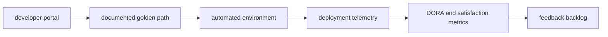

# Developer Experience and Metrics

## 30-Second Answer

Developer Experience and Metrics is the path from **developer portal** to **feedback backlog**. The essential handoffs are documented golden path, automated environment, deployment telemetry, DORA and satisfaction metrics. In production, I verify each handoff independently, keep its identity and state boundary visible, and operate it against availability, latency, security, and recovery objectives.

## Mental Model

Read this diagram as a concrete sequence, not a generic maturity loop: a failure after **DORA and satisfaction metrics** has different evidence and ownership from a failure at **documented golden path**.

## Why It Exists

Without developer experience and metrics, teams must manually coordinate developer portal, deployment telemetry, and feedback backlog. The technology standardizes those interfaces so changes are repeatable, reviewable, and diagnosable. It is justified when the repeated operational risk exceeds the cost of owning the abstraction.

## How It Works

**developer portal** owns stage 1; **documented golden path** owns stage 2; **automated environment** owns stage 3; **deployment telemetry** owns stage 4; **DORA and satisfaction metrics** owns stage 5; **feedback backlog** owns stage 6. Follow resource IDs, revisions, events, and timestamps across these stages; an acknowledgement at one stage never proves completion at the next.

## Mechanisms

* **developer portal:** Inspect its native state, events, latency, permissions, and capacity before moving to the next component.
* **documented golden path:** Inspect its native state, events, latency, permissions, and capacity before moving to the next component.
* **automated environment:** Inspect its native state, events, latency, permissions, and capacity before moving to the next component.
* **deployment telemetry:** Inspect its native state, events, latency, permissions, and capacity before moving to the next component.
* **DORA and satisfaction metrics:** Inspect its native state, events, latency, permissions, and capacity before moving to the next component.
* **feedback backlog:** Inspect its native state, events, latency, permissions, and capacity before moving to the next component.

## Production Architecture

Deploy developer portal with least privilege and an auditable change path. Isolate deployment telemetry by environment and failure domain, make feedback backlog observable, and test loss of each dependency. Version the interface between stages so producers and consumers can roll independently.

## Failure Modes

| Failure | Evidence | Response |
|---|---|---|
| the abstraction hides a failure users must debug | Compare stage latency and revision at documented golden path | Stop promotion and restore the last verified input |
| a mandatory path lacks an escape hatch or migration | Inspect saturation, quotas, events, and pending work at deployment telemetry | Add valid capacity or shed load; do not retry without a bound |
| adoption metrics count activity rather than developer outcomes | Compare the user result with feedback backlog and upstream state | Mitigate first, preserve evidence, then repair the faulty contract |

## Trade-offs

More automation across developer portal and feedback backlog improves consistency but can propagate an error faster. Strong isolation narrows blast radius but increases cost and upgrades. Managed implementations reduce component toil; self-managed implementations offer control but require availability, backup, security patching, and on-call expertise.

## Lead-Level Follow-ups

* Which team owns **deployment telemetry**, and what user-facing SLO proves it works?
* What remains available when **documented golden path** is down?
* Where is state durable, and how are restore and upgrade tested?

## My Experience Prompt

Describe a change to deployment telemetry: state the constraint, the exact signal that selected the design, the rollback boundary, and the durable guardrail you added.

## Recall Check

1. What does **developer portal** send to **documented golden path**?
2. Which component stores or reports authoritative state?
3. How does **DORA and satisfaction metrics** affect **feedback backlog**?
4. Which capacity limit fails first at production scale?
5. When is a simpler managed alternative preferable?

## Related Notes

* [Category index](index.md)
* [Interview dashboard](../00-interview-dashboard.md)
